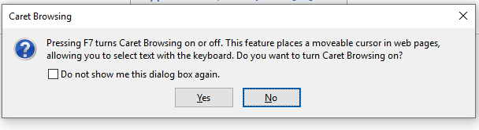

# Proposal: Native Caret browsing

## Motivation:
Caret browsing enables users to navigate web content using the keyboard keys and common shortcuts for character, word and line level navigation. Caret browsing enables full range of text navigation and selection functionality within web content without additional pointing devices like mice, trackpads and touchpads. 

Sample caret browsing experience in Microsoft Edge on Wikipedia:

### Current problems:
Today Chromium users can download Caret Browsing extension from the Chrome Web Store. The are two problems with this approach:

* Extensions might be blocked in a work environment due to enterprise policies. See [Issue 611798] (https://crbug.com/611798);
* Extensions might not be available in "Incognito" tabs, or when Guest profile is used;
* There are additional barriers for users of all abilities, since they need to find and install an extension and the functionality is not readily available when it might be needed;
* Applications that use Chromium don't have the platform capability to enable native caret browsing. 

## Proposal:
This proposal targets the following use cases:

* Enable native caret browsing in all contexts including enterprises, "Incognito" tabs and Guest profile;
* Make caret browsing available to users all the time out of the box in the browser;
* Add a platform capability, so that Chromium applications can enable caret browsing for their users with small amount of work in the application.

### Non-Goals
Native caret browsing doesn't aim to replace extensions, they would continue to work as they do today having the first opportunity to handle default F7 activation shortcut.

## Solution:
The solution proposed in this explainer is to introduce native caret browsing in Chromium, a feature that is available in Mozilla Firefox, Microsoft Edge and Internet Explorer.

In order to do that we suggest to implement a current common activation shortcut: F7 and confirm caret browsing activation with a dialog. 

Caret browsing activation confirmation in Microsoft Edge:

Caret browsing activation confirmation in Mozilla Firefox:

In some cases, function keys may not be available and so alternative shortcuts might be needed.

We welcome your feedback and opinion on ways we can help improve Chromium caret navigation and browsing in the future! 

## Links

* Caret Navigation: https://en.wikipedia.org/wiki/Caret_navigation
* Caret Browsing extension in Chrome Web Store: https://chrome.google.com/webstore/detail/caret-browsing/fklpgenihifpccgiifchnihilipmbffg
* Keyboard shortcuts in Windows (Copy, paste, and other general keyboard shortcuts): https://support.microsoft.com/en-us/help/12445/windows-keyboard-shortcuts
