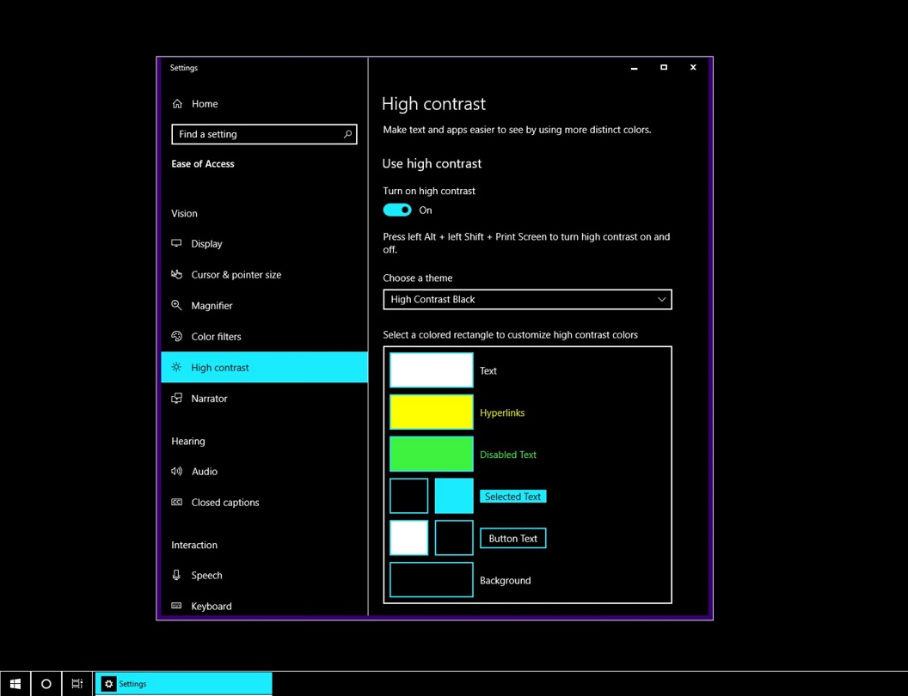
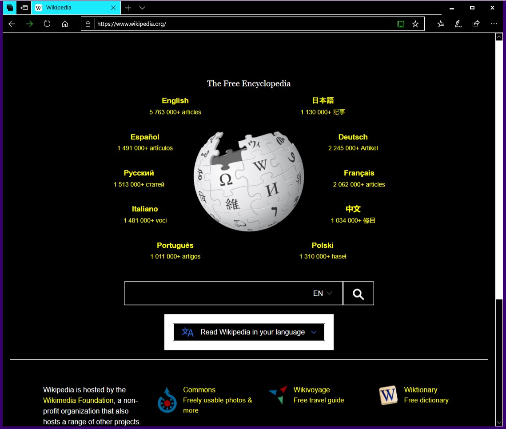
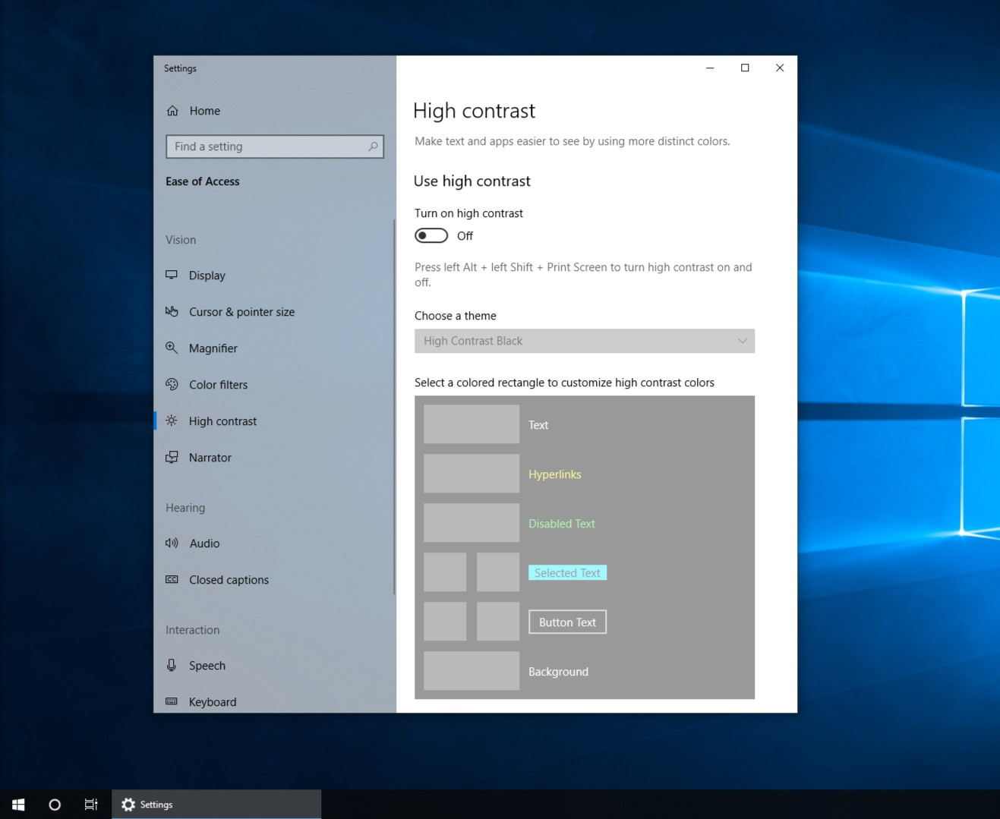
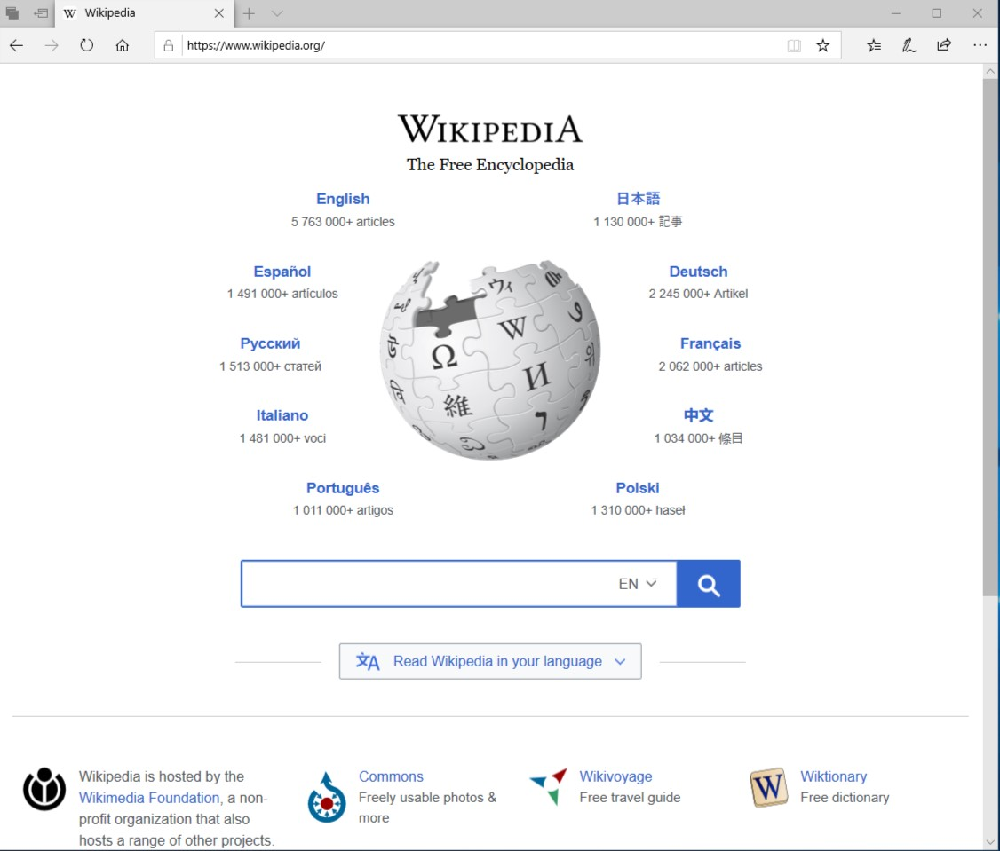
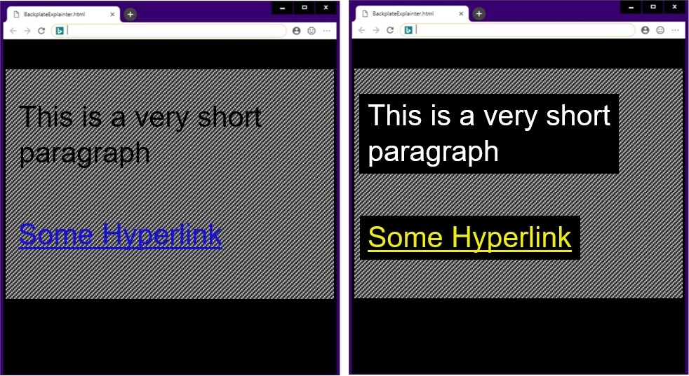
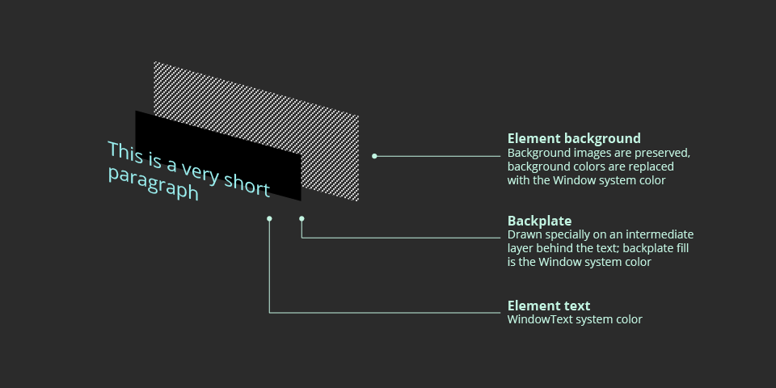

# High Contrast Explainer

Authors: [Rossen Atanassov](https://github.com/atanassov), [Alison Maher](https://github.com/amaher23)

Last Updated: 2019-01-18

## Status of this Document
This document is intended as a starting point for engaging the community and standards bodies in developing collaborative solutions fit for standardization. As the solutions to problems described in this document progress along the standards-track, we will retain this document as an archive and use this section to keep the community up-to-date with the most current standards venue and content location of future work and discussions.
* This document status: **ARCHIVED**
* Current venue: [W3C CSS Working Group](https://www.w3.org/Style/CSS/) | [w3c/csswg-drafts](https://github.com/w3c/csswg-drafts)
* Current version:
    * [System Colors](https://drafts.csswg.org/css-color/#css-system-colors) section of [CSS Color Module Level 4](https://drafts.csswg.org/css-color) | 
    * ['forced-color-adjust'](https://drafts.csswg.org/css-color-adjust-1/#forced) of [CSS Color Adjustment Module Level 1](https://drafts.csswg.org/css-color-adjust-1) | 
    * ['forced-colors'](https://drafts.csswg.org/mediaqueries-5/#forced-colors) of [Media Queries Level 5](https://drafts.csswg.org/mediaqueries-5) | 

## Overview

High contrast is a [Windows accessibility feature](https://docs.microsoft.com/en-us/windows/desktop/w8cookbook/high-contrast-mode) intended to increase the readability of text through color contrast. Individuals with low vision may find it more comfortable to read content when there is a strong contrast between foreground and background colors. High contrast is a useful feature in increasing the readability of screen-based text for such users.

The Windows platform provides built-in [high contrast color themes](https://docs.microsoft.com/en-us/windows/uwp/design/accessibility/high-contrast-themes) such as the more popular "black-on-white" and "white-on-black" themes. Besides the default themes, users can customize the colors and create their own themes. Applications can make use of these color themes and propagate them into their content model. In the case of the web browser, high contrast colors are propagated to website pages as a set of user agent styles, thus increasing readability of the text and allowing a coherent experience across the Windows OS and various applications.

Microsoft Edge and IE are currently the only browsers to support the high contrast feature using Windows high contrast themes. Many of the features described in this document were first shipped in 2012 with IE 10 and continue to use the ```-ms-``` vendor prefix for names and values.

When high contrast is currently enabled in Chrome, a popup is displayed prompting the user to install the [High Contrast extension](https://chrome.google.com/webstore/detail/high-contrast/djcfdncoelnlbldjfhinnjlhdjlikmph). This extension uses CSS/SVG filter effects overlaid on the entire webpage using its own predefined themes. The advantage of enabling high contrast in the core platform, in comparison to the extension-based approach, is that it provides a more seamless experience for users with the rest of the Windows OS. This includes not just the browser-context, but also other Chromium-powered applications.

## User Flow

1. User enables high contrast on their Windows device.

2. User opens the Chrome browser, and the chosen high contrast theme ("white-on-black" in this case) is used throughout their entire browsing experience.

3. User turns high contrast off.

4. The opened browser is dynamically updated to use the original site-defined colors.


## CSS Media Query

In order to allow developer defined high contrast rules for webpages, a [high contrast media query type](https://msdn.microsoft.com/en-us/library/hh771830(v=vs.85).aspx) would be added called ```high-contrast```. This CSS media query type is currently supported by Microsoft Edge and IE. If a ```high-contrast``` media query evaluates to true, any styles defined within that media query *will* be used when in high contrast and will *not* be overridden by the high contrast feature.

#### Possible values

Value | Description
--- | ---
**active** | The subsequent style rules will be applied when high contrast is enabled under any theme, custom or not.
**black-on-white** | The subsequent style rules will be applied when high contrast is enabled under the black-on-white color theme.
**white-on-black** | The subsequent style rules will be applied when high contrast is enabled under the white-on-black color theme.

#### Example usage

```html
<style>
    @media (high-contrast: active) {
        p { color: red; }
    }
    @media (high-contrast: black-on-white) {
        p { color: blue; }
    }
    @media (high-contrast: white-on-black) {
        p { color: green; }
    }
    body {
        color: orange;
    }
</style>
<body>
    <p>Some Text</p>
<body>
```
In the HTML code snippet above, ```"Some Text"``` will appear orange when high contrast is disabled. When high contrast is enabled under the "black-on-white" high contrast color scheme, ```"Some Text"``` will appear blue. ```"Some Text"``` will appear green when high contrast is enabled under the "white-on-black" high contrast color scheme. In any other high contrast color scheme (for example, under a custom high contrast theme), ```"Some Text"``` will appear red.


## CSS Properties

To provide readability between foreground and background colors, high contrast color schemes would override defined webpage styles for the following CSS properties:
* ```background-color```
* ```color```
* ```border-bottom-color```
* ```border-top-color```
* ```border-left-color```
* ```border-right-color```
* ```box-shadow```
* ```column-rule-color```
* ```outline-color```
* ```text-shadow```
* ```-webkit-tap-highlight-color```
* ```background-image``` (***only*** in the case of text/date/file input control types, as well as for ```select```, ```option```, and ```optgroup``` HTML tags)
_____
To allow for further developer customization of the high contrast feature, a [CSS property](https://msdn.microsoft.com/en-us/library/hh771863(v=vs.85).aspx), ```high-contrast-adjust```, would be added. This CSS property type is currently supported by Microsoft Edge and IE. This property can be used to override the effects of high contrast.

#### Possible values

Value | Description
--- | ---
**auto** | Indicates that the applicable CSS styles *will* be overridden when high contrast is enabled.
**none** | Indicates that the applicable CSS styles will *not* be overridden when high contrast is enabled.

#### Example usage

```html
<style>
    body {
        high-contrast-adjust: none;
        color: orange;
    }
</style>
<body>
    <p>Some Text</p>
<body>
```
In the HTML code snippet above, ```"Some Text"``` will appear orange whether or not high contrast is enabled because ```high-contrast-adjust``` is set to ```none```, effectively preventing high contrast from affecting its color.

## Cascade Order
As mentioned previously, high contrast color schemes work by overriding user defined webpage styles for various CSS properties in order to ensure readability. The process model for these high contrast overrides is as follows:

Given an element and a declaration from a CSS rule whose selector matches that element, the application of that declaration will be suppressed if all of the following conditions are met:

1. The declaration is for a CSS property in the set of properties that are adjusted for high contrast (as defined in
[CSS Properties](#css-properties))

2. High contrast mode is enabled in the host environment

3. The computed value of ```high-contrast-adjust``` on the element is ```auto```

4. The rule is **not** contained (directly or indirectly) inside an ```@media``` block matching the ```high-contrast``` media feature

5. The rule is **not** defined in the default UA style sheet

If all of the above conditions are met, the computed color value of the CSS property is overridden by a system color value.  

## System Colors
High contrast relies on system color keywords to fetch the appropriate theme colors, which are deprecated from the CSS Color standard in both [Level 3](https://drafts.csswg.org/css-color-3/#css2-system) and [Level 4](https://drafts.csswg.org/css-color-4/#system-colors). Blink currently does have support for these keywords, but they're currently mapped to hard-coded values instead of being plumbed through to the system color API. There is a derived class ```LayoutThemeWin```, but it currently doesn't add any functionality for this. Functionality can be added here to support the required system color keywords.

In addition to existing CSS system color keywords, a new system color keyword would be added called ```hotlight``` that defines the system color for hyperlinks. It is important to track and store this system color because a developer might choose to unset high contrast styles for an ancestor of a link, but the high contrast link styles for descendent links must be preserved.

This system color keyword is currently supported by Microsoft Edge and IE. On Windows, the value for ```hotlight``` should map to the ```COLOR_HOTLIGHT``` system color. On other platforms, it should map to the default color used for links.

#### Example usage

```html
<style>
    a:link {
        color: hotlight;
    }
</style>
```

## Ensuring Readability
The goal of high contrast is to ensure a certain level of contrast between foreground and background colors. A problem arises with images. If text lies atop an image, altering the color of the text in high contrast will not guarantee its readability. One option would be to override images to allow text readability. This solution, however, is not an ideal one, as it can alter the context of a webpage for users under high contrast.

Instead, a preferred solution is to draw a so-called "readability backplate" behind all text to ensure contrast for text lying above images. As illustrated in the screenshots below, adding a backplate behind text in high contrast can drastically increase its readability. This solution is currently used in Microsoft Edge to ensure the readability of text in high contrast.



This backplate does not replace the background of an element, but rather is drawn on an intermediary layer:



As the diagram demonstrates, an element's text content is rendered using the ```WindowText``` system color and a backplate with a ```Window``` system color fill is drawn behind the text. These are then layered on top of the element's background (with ```background-color``` being filtered out). In the case of links, the text would instead use the appropriate high contrast link color.

## Open questions

Should the high contrast readability backplate be customizable for developers? In other words, should there be a similar ```high-contrast-backplate``` CSS property to allow certain styles of the backplate to be customized?
* CSS Properties that could apply: ```padding```, ```border-radius```, ```opacity```.

In order to support existing content, we will need to add an alias for ```-ms-``` properties and values to our implementation. Is this an acceptable solution?

Is ```hotlight``` an appropriate name for the system color keyword for hyperlinks, or would a more neutral name such as ```link``` be preferred?

---
[Related issues](https://github.com/MicrosoftEdge/MSEdgeExplainers/labels/High%20Contrast) | [Open a new issue](https://github.com/MicrosoftEdge/MSEdgeExplainers/issues/new?title=%5BHigh%20Contrast%5D)
