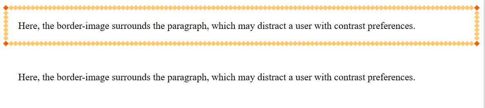

# prefers-contrast Explainer 

The [`prefers-contrast` media query](https://drafts.csswg.org/mediaqueries-5/#prefers-contrast) gives authors a way to determine whether the user has specified a desire for increased or decreased contrast in the underlying OS. 

## Motivation 

Some users may find it difficult to read text when the foreground to background color contrast ratios are too high or too low. Many operating systems have an underlying method to apply a contrast preference across their system. For example, on Windows, High Contrast can be used to enforce a limited color palette across applications. Although the default themes guarantee a high color contrast between the text and background (>10:1), it is possible for users to customize these colors, which may result in a low contrast preference. On macOS and iOS, users have the option to apply an Increased Contrast mode. Additionally, on Linux, users can make use of High Contrast GTK themes. 

It is difficult to produce a universal solution that automatically and effectively reflects these contrast preferences on an arbitrary webpage. For instance, consider the case where text is surrounded by a `border-image`. A user requesting a specific contrast preference may find that the `border-image` distracts from the text. By using the `prefers-contrast` media query, an author can remove the `border-image` entirely and increase readability:


 
```
#borderimg {  
  border: 10px solid transparent; 
  padding: 15px; 
  border-image: url(border.png) 30 round; 
} 

@media(prefers-contrast) { 
  #borderimg { 
    border-image: initial; 
  } 
} 
```

By exposing the system contrast settings to the authors through the `prefers-contrast` media query, authors can adjust the style of their site according to the contrast preference of their users.  

## Current design 

`prefers-contrast` supports four values, as well as its boolean context: 
  - `no-preference`: indicating the user has not specified a contrast preference 
  - `more`: indicating the user has specified a preference for a higher level of contrast 
  - `less`: indicating the user has specified a preference for a lower level of contrast 
  - `custom`: indicating the user has specified a preference for contrast that is neither high nor low 

On MacOS and Linux, we will match `(prefers-contrast: more)` if Increased Contrast Mode or High Contrast Mode is enabled, and `(prefers-contrast: no-preference)` otherwise. 

Similarly, on Windows, if High Contrast is not enabled, we match `(prefers-contrast: no-preference)`. However, with Windows High Contrast Mode, users have the option to choose an arbitrary color palette. In order to determine whether this palette represents a contrast preference of `more`, `less`, or `custom`, we compare the contrast ratio between the foreground and background system colors. The current specification does not indicate what ratios should be used as the cut-offs; [we are experimentally using ratios inspired by WCAG](https://www.w3.org/WAI/WCAG21/Understanding/contrast-enhanced), matching `more` if the ratio is 7:1 or greater, `less` if the ratio is 2.5:1 or less, and `custom` otherwise. 

## Prefers-contrast vs forced-colors 

`prefers-contrast` differs from the existing [`forced-colors` media query](https://drafts.csswg.org/mediaqueries-5/#descdef-media-forced-colors). In particular, the `forced-colors` media query can be used in detecting whether [Forced Colors Mode](https://www.w3.org/TR/css-color-adjust-1/#forced) is enabled. Forced Colors Mode currently can only be triggered by High Contrast on Windows. Thus, no other OS contrast setting will influence the `forced-colors` media query. On the other hand, `prefers-contrast` gives authors a tool for detecting contrast preferences across all related OS settings in order to adjust their styles accordingly. 

## Design considerations 

`prefers-contrast` had initially been designed to support three values: `high`, `low`, and `no-preference`. However, these values [failed to properly capture Increased Contrast Mode](https://github.com/w3c/csswg-drafts/issues/2943) on macOS and iOS. More specifically, Increased Contrast is different from Window’s High Contrast Mode in that the result is not a true “high” contrast, but an intermediary “increased” contrast state. To encompass the varying OS settings, the values of `high` and `low` were updated to a more general `more` and `less`. 

This three-value design, however, was flagged as potentially problematic for Forced Colors Mode users that have a color scheme with contrast ratios which are not considered particularly high or low. More specifically, if an author were to apply styles using the `prefers-contrast` boolean context to, for example, reduce visual complexity for all users with a contrast preference, any user whose Forced Color Scheme did not match `more` or `less` would fail to see these updated styles. 

To address this issue initially, `forced` was added as a value to `prefers-contrast`. This value matched whenever Forced Colors Mode was enabled, no matter what contrast ratio was being used. As a result, any Forced Colors Mode user (including those with a contrast ratio between `more` and `less`) would match in the `prefers-contrast` boolean context.  

However, `forced` has since been removed because `(prefers-contrast: forced)` was a [duplicate of  `(forced-colors: active)` and could lead to author confusion](https://github.com/w3c/csswg-drafts/issues/5433). Instead, `custom` was added as a value to `prefers-contrast`. This value accounts for contrast preferences that are neither `more` nor `less`. As a result, all Forced Colors Mode users will continue to be accounted for in the `prefers-contrast` boolean context without creating redundancies with the existing `forced-colors` media query. 
