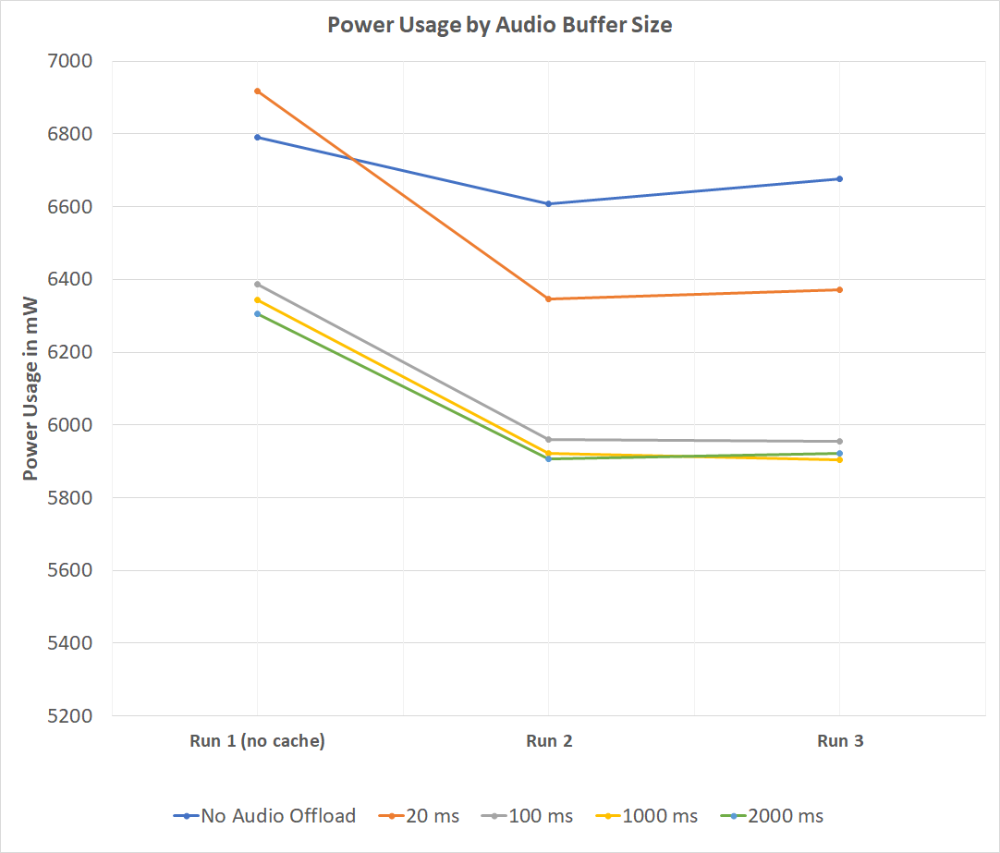

# Enable Hardware-offloaded Audio Processing for Audio Content on Windows
**Author:** William Carr (drawn on work from Isuru Pathirana)

# Summary Description
Hardware Accelerated Audio Processing allows audio processing to be performed on dedicated audio processors. This process is commonly referred to as audio offload (the processing is offloaded from the computer's main CPU to the dedicated audio processor(s)). Because audio processing is a computationally expensive process, the use of specialized hardware can improve power efficiency, resulting in longer battery life. To read more about the general concept of audio offload on Windows, please see: https://docs.microsoft.com/en-us/windows-hardware/drivers/audio/hardware-offloaded-audio-processing

This proposal lays out a path to enable the use of audio offload for the clear audio pipeline in Chromium on Windows when playback is using an audio device that supports hardware audio acceleration.

To see substantial improvements in battery life, the audio offload must be paired with large audio buffers. If large audio buffers are not used, then the computer's main CPU must still wake frequently to feed audio from the application to the hardware; by increasing the buffer size, we space out these wakes allowing longer windows of opportunity for the main CPU to stay in a lower power state.

# Goals
* Improve battery life for media playback scenarios through the HTML Media Elements on Windows devices with supported hardware
* Limit adverse effects on media playback scenarios compared to existing low latency non-offloaded audio pipeline

# Non-goals
* We are explicitly not targeting WebRTC scenarios where low latency is a requirement
* We are explicitly not targeting Web Audio scenarios where low latency may be a requirement
* We are explicitly not targeting non-Windows Platforms
* It is not a goal to disable the audio offload feature when connected to an external power source. Although the audio offload feature's primary goal is to improve battery life, attempting to enable and disable the feature based on whether the machine is currently on battery power introduces additional complexity to the architecture. It would also prevent us from achieving the desired power savings when a media stream is started while the device is on an external power source and then switched over to battery power since, during a mid-stream switch to use offload, an unacceptable gap in playback would occur.

# Use Cases
The primary use case criteria we're looking to improve incorporates all the following elements:
* Windows OS that supports classic application (win32) audio offload: This feature was first added in the 19H2 timeframe but will be serviced back to RS3.
* Device supports hardware audio acceleration for audio offload
* Device on battery power
* Unencrypted media consumption scenarios with audio aspect

A typical user scenario would be a user watching a video on www.youtube.com (*clear content*) on a Surface Laptop (*device that supports audio hardware acceleration*) running Windows 10 19H1 w/ servicing fix to add audio offload (*OS supporting classic audio offload*) while on battery power.

Measurements of a partial implementation of audio offload show potential savings of up to 150mW, ~5% improvement in battery life, for a simple video playback experience.

# Proposal
## High Level Audio Architecture
A high level overview of chromium's audio architecture with a newly proposed WASAPIAudioOffloadOutputStream class. Changes in this explainer are not limited to this new class but span across pieces of the audio stack shown here.


## Audio Process
On Windows OS's that support audio offload for classic (Win32) applications through the Windows Audio Service API (WASAPI), the calling process must meet **one** of the following requirements:
1. The process is running within a Windows Universal Application Package (UAP) 
2. The process is running as a Low Privilege App Container (LPAC)
3. The process is running with an integrity level at or below Low

The Chromium Audio stack currently interacts with WASAPI in the Browser process which is not an ideal candidate for any of the above.

The recommendation for this proposal is to choose option **3**. In order to meet this requirement we propose the following two pieces of work:

1. Move Chromium's Audio Process to its own process utilizing the existing work behind feature flags AudioServiceOutOfProcess and AudioServiceAudioStreams
>[Chromium Bug Tracking enabling Audio Process](https://crbug.com/672469)

>Audio Process was enabled by default on Linux on July 12th, 2019, it is not yet enabled by default on Windows
2. Change the Audio Process's integrity level to Low
```
sandbox::ResultCode SandboxWin::StartSandboxedProcess(base::CommandLine* cmd_line,
    const std::string& process_type,
    const base::HandlesToInheritVector& handles_to_inherit,
    service_manager::SandboxDelegate* delegate,
    base::Process* process) {
  ...
  if (sandbox_type == service_manager::SANDBOX_TYPE_AUDIO) {
    policy->SetIntegrityLevel(sandbox::INTEGRITY_LEVEL_LOW);
  }
  ...
}
```

With these two changes, the WASAPI code in Chromium will be called from a low-integrity level process allowing it to utilize audio offload.

## Low Latency Opt-Out
Audio offload is only intended to be used for media streams since the use of a larger endpoint buffer size introduces increased latency from when the audio source renders a frame to when that frame is played back by the audio device.

In order to allow audio scenarios like WebRTC or Web Audio to continue to use the existing low latency options, we'll introduce a new AudioParameters::Format::AUDIO_PCM_16_HIGH_LATENCY specifically for audio offload.
```
  enum Format {
    AUDIO_PCM_LINEAR = 0,            // PCM is 'raw' amplitude samples.
    AUDIO_PCM_LOW_LATENCY,           // Linear PCM, low latency requested.
    AUDIO_PCM_16_HIGH_LATENCY,       // 16 bit PCM, high latency for offload.
    AUDIO_BITSTREAM_AC3,             // Compressed AC3 bitstream.
    AUDIO_BITSTREAM_EAC3,            // Compressed E-AC3 bitstream.
    AUDIO_FAKE,                      // Creates a fake AudioOutputStream object.
    AUDIO_FORMAT_LAST = AUDIO_FAKE,  // Only used for validation of format.
  };
  ```

> OPEN QUESTION: Should a website be able to opt-out? Any stream playing file backed data should be fine opting-in to a higher latency but a stream that is showing a live stream (e.g. sports) may prefer to opt-out to reduce latency.

> OPEN QUESTION: Would using the existing latency hint be a better architecture?

## Setting up the WASAPI Audio Client for Audio Offload
A few high level caveats that influence this proposal:

1.Audio offload introduces enough behavioral changes that instead of modifying the existing WASAPIAudioOutputStream class, we propose creating a separate class: WASAPIAudioOffloadOutputStream.

2.Audio offload provides optimal power advantages when used in conjunction with larger audio buffers, but these larger audio buffers introduce a trade off by having higher latency. For this reason scenarios like WebRTC are better suited to continue using a non-offload stream.

3.Audio offload is only supported for Share Mode streams, exclusive streams are not supported.

4.Audio offload resources are limited so we cannot guarantee audio acceleration until we initialize our Audio Client. As a result we want to support gracefully falling back to a non-offload stream without having to teardown & rebuild the entire pipeline.

### Audio Offload Format
Audio offload devices typically only support a 16-bit integer pulse code modulation (PCM) format. Since we want to facilitate gracefully falling back to a non-offloaded stream we do not want to alter the default audio output parameters. Instead we create a secondary audio format in the WASAPIAudioOffloadOutputStream class specifically to be used for audio offload clients, this format uses the sub-format KSDATAFORMAT_SUBTYPE_PCM and corresponding values for 16-bit integer samples:

```
 WAVEFORMATEX* format_audio_offload = &format_audio_offload_.Format;
  format_audio_offload->wFormatTag = WAVE_FORMAT_EXTENSIBLE;
  format_audio_offload->nChannels = params.channels();
  format_audio_offload->nSamplesPerSec = params.sample_rate();
  format_audio_offload->wBitsPerSample = 16;
  format_audio_offload->nBlockAlign =
    (format_audio_offload->wBitsPerSample / 8) *
    format_audio_offload->nChannels;
  format_audio_offload->nAvgBytesPerSec =
    format_audio_offload->nSamplesPerSec * format_audio_offload->nBlockAlign;
  format_audio_offload->cbSize =
    sizeof(WAVEFORMATEXTENSIBLE) - sizeof(WAVEFORMATEX);

  format_audio_offload_.Samples.wValidBitsPerSample =
    format_audio_offload->wBitsPerSample;
  format_audio_offload_.dwChannelMask =
    CoreAudioUtil::GetChannelConfig(device_id, eRender);
  format_audio_offload_.SubFormat = KSDATAFORMAT_SUBTYPE_PCM;
  ```

### Determining Audio Offload Device Support

In order to enable audio offload we must first determine if the target audio device supports offload. To do this, we'll query the device via IAudioClient2::IsOffloadCapable:
```
Microsoft::WRL::ComPtr<IAudioClient2> audio_client2;
HRESULT hr = audio_client_offload.As(&audio_client2);

if (SUCCEEDED(hr) && audio_client2.Get()) {
  BOOL offloadCapable;
  hr = audio_client2->IsOffloadCapable(AudioCategory_Media,
                                        &offloadCapable);
```

Next, we'll setup the client to enable audio offload via IAudioClient2::SetClientProperties:
```
AudioClientProperties clientProperties = {0};
clientProperties.cbSize = sizeof(AudioClientProperties);
clientProperties.bIsOffload = true;
clientProperties.eCategory = AudioCategory_Media;

hr = audio_client2->SetClientProperties(&clientProperties);
```

Finally we'll check to make sure this device supports our offload format using the CoreAudioUtil::IsFormatSupported helper:
```
if (CoreAudioUtil::IsFormatSupported(audio_client_offload.Get(),
      share_mode_, &format_audio_offload_)) {
  use_audio_offload = true;
}
```
At this point we've determined whether audio offload & our audio format are supported by the current audio client. However we have not yet successfully initialized the audio client and obtained an audio offload resource.

### Late Binding 
An audio client utilizing audio offload requires binding to one of the limited hardware resources - once bound that resource will be unavailable to other clients until it is released. The act of binding to this resource occurs as part of calling IAudioClient::Initialize. To responsibly use these resources we don't want to bind to them unless they are actively being used, so we delay initializing our audio client until absolutely necessary - this is called Late Binding.

In order to facilitate Late Binding, we won't initialize our IAudioClient when WASAPIAudioOffloadOutputStream::Open is called (compare this behavior with WASAPIAudioOutputStream which does call IAudioClient::Initialize during Open).

Instead binding will be performed by calling IAudioClient::Initialize when WASAPIAudioOffloadOutputStream::Start is called - as this is our first indication that the stream wants to transition to a playing state.

### Fallback
Since initialization for audio offload may fail if all of the hardware offload resources are in use, we want to seamlessly fallback to using a non-offloaded audio client. To support this a new initialization helper function will be introduced, CoreAudioUtil::SharedModeInitializeForOffload. This function will behave similar to CoreAudioUtil::SharedModeInitialize:

```
HRESULT SharedModeInitializeForOffload(IAudioClient* client,
                                       WaveFormatWrapper format,
                                       HANDLE event_handle,
                                       uint32_t requested_buffer_size,
                                       uint32_t* endpoint_buffer_size,
                                       const GUID* session_guid,
                                       IAudioClient* offload_client,
                                       WaveFormatWrapper format_audio_offload,
                                       bool use_audio_offload,
                                       bool* using_audio_offload) {
  *using_audio_offload = false;

  if (use_audio_offload && offload_client) {
    // Attempt to initialize the audio client for Audio Offload
    hr = offload_client->Initialize(AUDCLNT_SHAREMODE_SHARED, stream_flags,
                            DesiredAudioOffloadBufferDuration, 0,
                            format_audio_offload, session_guid);

    if(hr == AUDCLNT_E_BUFFER_SIZE_NOT_ALIGNED)
    {
      // Align buffer size
      ...
      hr = offload_client->Initialize(AUDCLNT_SHAREMODE_SHARED,
                                stream_flags,
                                m_hnsRenderBuffer,
                                0,
                                format,
                                session_guid);
    }

    if (SUCCEEDED(hr)) {
      *using_audio_offload = true;
    }
  }

  if (!*using_audio_offload) {
    // Fallback to SharedModeInitialization logic to initialize client
    ...
  }

  IAudioClient* client_chosen = *using_audio_offload ? offload_client : client;
  ...
```

### Early Release
Similar to Late Binding - the idea behind Early Release is that an IAudioClient bound to an offload resource shouldn't be held longer than is needed as this may prevent other clients from being able to use the resource. As a result when a stream is paused or stopped we want to ensure the client releases the resource.

We actually end up getting Early Release for free, due to how we handle mixing, from the existing Chromium audio architecture. Here's how that currently works:

1. When a stream is paused AudioRendererMixer::RemoveMixerInput is called to remove the stream
2. For audio offload the mixer will have only a single input (see Mixing below for more details)
3. When AudioRendererMixer::Render is called when there are no inputs to master_converter_ the last_play_time_ is not updated
4. When AudioRendererMixer::Render is called and last_play_time_ hasn't been updated for greater than pause_delay_ (currently 10 seconds) then it will issue a pause command to the audio sink
5. The Chromium audio pipeline currently treats pauses & stops as synonymous at the audio output stream layer and on a  WASAPIAudioOffloadOutputStream::Stop call we will reset the IAudioClient causing the audio offload resource to be released

As a result of this we do not currently need to introduce logic into the WASAPIAudioOffloadOutputStream class to explicitly early release the IAudioClient

### Pre-Roll (Audio Output Stream)
Typically when AudioOutputStream::Start is called the output stream would fill the initial audio output buffer with silence, this allows us to exercise & prepare the audio client and since we're utilizing small buffers (20ms) there is little complication. When using audio offload however two things complicate this:
1. For audio offload a typical audio output buffer will be ~2s worth of audio frames (*output device dependent*)
2. An IAudioRendererClient for audio offload must always provide an entire buffer of this ~2s length (you cannot request a smaller buffer through IAudioRendererClient::GetBuffer)

As a result of these constrained factors preparing the initial buffer with silence would mean introducing a noticeable two second gap before stream playback could begin as this ~2s of silence was rendered.

Instead when using audio offload we must pre-roll actual audio data from the stream source, we can achieve this by calling WASAPIAudioOffloadOutputStream::RenderAudioFromSource in WASAPIAudioOffloadOutputStream::Start before calling IAudioClient::Start:

```

bool WASAPIAudioOffloadOutputStream::PreRollAudio() {
  last_position_ = 0;
  last_qpc_position_ = 0;

  if (using_audio_offload_) {
    UINT64 device_frequency = 0;
    num_written_frames_ = 0;

    HRESULT hr = audio_clock_->GetFrequency(&device_frequency);
    if (FAILED(hr)) {
      return false;
    }
    if (!RenderAudioFromSource(device_frequency)) {
      return false;
    }
  } else {
    if (!CoreAudioUtil::FillRenderEndpointBufferWithSilence(
            audio_client_.Get(), audio_render_client_.Get())) {
      // retry once
      opened_ = false;
      audio_client_.Reset();
      audio_render_client_.Reset();
      if (!Open() || !PerformBinding() || !CoreAudioUtil::FillRenderEndpointBufferWithSilence(
                        audio_client_.Get(), audio_render_client_.Get())) {
        return false;
      }
    }

    num_written_frames_ = endpoint_buffer_size_frames_;
  }

  return true;
}
```

### Render Audio From Source
In a case where we've failed to setup or initialize our IAudioClient for audio offload, we're able to render audio from the source in the same manner that the existing WASAPIAudioOffloadStream::RenderAudioFromSource works since we've kept the same AudioParameters for our AudioSourceCallback.

When we are rendering to an IAudioClient setup for audio offload, the process changes a bit:
1. When using audio offload IAudioRendererClient::GetBuffer must always request a buffer the size of the endpoint buffer (in our case this means we'll normally be getting ~2s buffer in frames)
```
hr = audio_render_client_->GetBuffer(endpoint_buffer_size_frames_,
                                        &audio_data);
```
2. Our input packet size is still ~20ms worth of frames so we need to build up our output buffer from multiple audio buses before we can call IAudioRendererClient::ReleaseBuffer. We'll build up this buffer by making multiple calls to AudioSourceCallback::OnMoreData and appending them to our output buffer.
```
audio_bus_->ToInterleaved<SignedInt16SampleTypeTraits>(
          frames_filled,
          reinterpret_cast<int16_t*>(audio_data +
            (n * packet_size_frames_ *
            format_audio_offload_.Format.nBlockAlign)));
```
3. The samples coming from our calls to AudioSourceCallback::OnMoreData are in the IEEE Float format but our IAudioClient device expects 16-bit integer PCM formatted samples. We'll utilize the sample type traits argument on our AudioBus::ToInterleaved call to perform this conversion
```
audio_bus_->ToInterleaved<SignedInt16SampleTypeTraits>(
```

All together it looks something like this:
```
if (using_audio_offload_) {
    // Grab all available space in the rendering endpoint buffer
    // into which the client can write a data packet.
    hr = audio_render_client_->GetBuffer(endpoint_buffer_size_frames_,
                                        &audio_data);
    if (FAILED(hr)) {
        DLOG(ERROR) << "Audio Offload: Failed to use rendering audio buffer: "
                  << std::hex << hr;
        return false;
    }

    for (size_t n = 0; n < num_packets; ++n) {
     ... derive delay & delay_timestamp ...

      int frames_filled =
          source_->OnMoreData(delay, delay_timestamp, 0, audio_bus_.get());
      uint32_t num_filled_bytes = frames_filled *
        format_audio_offload_.Format.nBlockAlign;
      DCHECK_LE(num_filled_bytes, packet_size_bytes_);

      audio_bus_->Scale(volume_);

      audio_bus_->ToInterleaved<SignedInt16SampleTypeTraits>(
          frames_filled,
          reinterpret_cast<int16_t*>(audio_data +
            (n * packet_size_frames_ *
            format_audio_offload_.Format.nBlockAlign)));

      num_written_frames_ += packet_size_frames_;
    }

    hr = audio_render_client_->ReleaseBuffer(num_available_frames, 0);
```
## Pausing
The current Chromium architecture facilitates a pause by removing the paused source as a mixer input (see AudioRendererMixer::RemoveMixerInput); any queued output buffers are allowed to finish rendering. This works well when the queued output is on the order of tens of milliseconds, but will break down for audio offload where the queued output can be on the order of seconds. 

In order to respond to Pause events with limited delay when using audio offload, we'll issue a Pause command in conjunction with removing the mixer input.

```
void AudioRendererMixer::RemoveMixerInput(
    const AudioParameters& input_params,
    AudioConverter::InputCallback* input) {
  ...

  if (input_params.format() == AudioParameters::AUDIO_PCM_16_HIGH_LATENCY ||
        output_params_.format() == AudioParameters::AUDIO_PCM_16_HIGH_LATENCY) {
    // For high latency streams we need to tell the audio device to explicitly
    // pause otherwise it will play queued audio for a perceivable amount of time
    // after having it's input removed
    audio_sink_->Pause();
    playing_ = false;
  }
}
```

>OPEN ISSUE: Should a pause concept be introduced (and plumbed through) to the Audio Output Stream layer? Today Pause & Stop are conflated by the time we get to the Audio Output Stream (there is no AudioOutputStream::Pause), by issuing a Pause event when RemoveMixerInput is called we cause an AudioOutputStream::Stop which causes the output stream to tear down or reset the audio client. Since we're being more aggressive about issuing this Pause this means in the case of a quick pause/unpause sequence for audio offload we'll have to recreate our IAudioClient & perform a refeed or reseek action.

## Mixing
Basic audio mixing will introduce a latency equal to the duration of the mixed buffers - which for audio offload isn't a big problem since at the point of mixing our buffers are still small (20ms). However, because we combine these buffers into a larger (~2s) buffer before sending them to the audio device, mixing multiple streams will create a latency equal to our output buffer duration even though the input buffers are all the same duration.

When a new stream is added to a mix, a stream transitions its play state (pause<->play), or a stream is removed from the mix that change will not take effect until all the audio buffers currently queued to the audio device have finished rendering and the first audio buffer is rendered with the changed mixer input.

When we're talking about 20ms input & output buffers, that typically introduces a reasonable delay of 20-40ms. When we're dealing with 2s output buffers, that typical delay becomes a very noticeable 2-4s.

There are two options to handle this:
1. Whenever mixer input is altered we could attempt to mix the new set of inputs backtracking based on the number of queued frames currently in the audio device and then purge the audio device buffer and add this new mixed buffer. This could be very fragile however as we attempt to purge & transition - introducing gaps in playback. The current architecture also isn't very well set up to handle this backtracking efficiently (we haven't cached this unrendered data close to the mixer)
2. When using audio offloadable streams, opt-out of mixing entirely by only having a single stream be mixer

For this proposal we suggest option #2 given the ease of execution and reduced risk.

For option #2 the changes may look something like the following.

Introduce a unique identifier when using an audio offload stream:
```
AudioRendererMixerManager::MixerKey::MixerKey(
    int source_render_frame_id,
    const media::AudioParameters& params,
    media::AudioLatency::LatencyType latency,
    const std::string& device_id)
    : source_render_frame_id(source_render_frame_id),
      params(params),
      latency(latency),
      device_id(device_id) {
  if (params.format() == media::AudioParameters::AUDIO_PCM_16_HIGH_LATENCY) {
    audio_offload_guid = base::GenerateGUID();
  }
}
```

Check the audio offload key in MixerKeyCompare:
```
struct MixerKeyCompare {
  bool operator()(const MixerKey& a, const MixerKey& b) const {
    if (a.source_render_frame_id != b.source_render_frame_id)
      return a.source_render_frame_id < b.source_render_frame_id;
    if (a.params.channels() != b.params.channels())
      return a.params.channels() < b.params.channels();

    if (a.latency != b.latency)
      return a.latency < b.latency;

    // Ignore format(), and frames_per_buffer(), these parameters do not
    // affect mixer reuse.  All AudioRendererMixer units disable FIFO, so
    // frames_per_buffer() can be safely ignored.
    if (a.params.channel_layout() != b.params.channel_layout())
      return a.params.channel_layout() < b.params.channel_layout();
    if (a.params.effects() != b.params.effects())
      return a.params.effects() < b.params.effects();

    // If a or b has the AUDIO_PCM_16_INTEGER_HIGH_LATENCY format then we
    // need to ensure it is not mixed
    if ((a.params.format() ==
          media::AudioParameters::AUDIO_PCM_16_HIGH_LATENCY ||
          b.params.format() ==
          media::AudioParameters::AUDIO_PCM_16_HIGH_LATENCY) &&
        (a.params.format() != b.params.format() ||
          a.audio_offload_guid != b.audio_offload_guid)) {
      return a.audio_offload_guid < b.audio_offload_guid;
    }

    if (media::AudioDeviceDescription::IsDefaultDevice(a.device_id) &&
        media::AudioDeviceDescription::IsDefaultDevice(b.device_id)) {
      // Both device IDs represent the same default device => do not compare
      // them.
      return false;
    }

    return a.device_id < b.device_id;
  }
};
```

# Metrics
These are preliminary measurements from a partial implementation of the audio offload feature running on a Surface Pro 4 device on RS5.

For this test a ~12 minute run of the Tears of Steel MP4 video was run 3x with audio offload feature enabled & 3x without with EMI tracing enabled.

The audio offload runs showed an average savings of ~150mW improvement.

**Audio Offload Runs**

Audio Offload Average Power: **5993.3	mW**
* Run 1: 6068.9 mW
* Run 2: 5975.6 mW
* Run 3: 5935.4 mW
<pre>
|    Line #    |    Channel Name    |    Start Time (ns)    |    End Time (ns)    |    Energy (mJ)    |    Power (mW)    |
|--------------|--------------------|-----------------------|---------------------|-------------------|------------------|
|    1         |    EMI_BATTERY     |                       |                     |    32705362       |    60689         |
|    2         |    EMI_3VSB        |                       |                     |    1321727        |    2452          |
|    3         |    EMI_BACKLT      |                       |                     |    1068008        |    1981          |
|    4         |    EMI_5VSB        |                       |                     |    311834         |    578           |
|    5         |    EMI_CORE        |                       |                     |    233385         |    433           |
|    6         |    EMI_1P2V_DUA    |                       |                     |    195375         |    362           |
|    7         |    EMI_1VSB        |                       |                     |    95357          |    176           |
|    8         |    EMI_GPU         |                       |                     |    72902          |    135           |
|    9         |    EMI_3P3VSSD     |                       |                     |    71592          |    132           |
|    10        |    EMI_1P8_VSB     |                       |                     |    49081          |    91            |
|    11        |    EMI_WLAN        |                       |                     |    24382          |    45            |
|              |                    |                       |                     |                   |                  |
|    Line #    |    Channel Name    |    Start Time (ns)    |    End Time (ns)    |    Energy (mJ)    |    Power (mW)    |
|    1         |    EMI_BATTERY     |                       |                     |    32268340       |    59756         |
|    2         |    EMI_3VSB        |                       |                     |    1310437        |    2426          |
|    3         |    EMI_BACKLT      |                       |                     |    1058634        |    1960          |
|    4         |    EMI_5VSB        |                       |                     |    309271         |    572           |
|    5         |    EMI_CORE        |                       |                     |    225163         |    416           |
|    6         |    EMI_1P2V_DUA    |                       |                     |    190624         |    353           |
|    7         |    EMI_1VSB        |                       |                     |    92898          |    172           |
|    8         |    EMI_GPU         |                       |                     |    71998          |    133           |
|    9         |    EMI_3P3VSSD     |                       |                     |    69273          |    128           |
|    10        |    EMI_1P8_VSB     |                       |                     |    47449          |    87            |
|    11        |    EMI_WLAN        |                       |                     |    19463          |    36            |
|              |                    |                       |                     |                   |                  |
|    Line #    |    Channel Name    |    Start Time (ns)    |    End Time (ns)    |    Energy (mJ)    |    Power (mW)    |
|    1         |    EMI_BATTERY     |                       |                     |    35611592       |    59354         |
|    2         |    EMI_3VSB        |                       |                     |    1438604        |    2397          |
|    3         |    EMI_BACKLT      |                       |                     |    1183001        |    1971          |
|    4         |    EMI_5VSB        |                       |                     |    347155         |    578           |
|    5         |    EMI_CORE        |                       |                     |    249628         |    416           |
|    6         |    EMI_1P2V_DUA    |                       |                     |    205014         |    341           |
|    7         |    EMI_1VSB        |                       |                     |    99860          |    166           |
|    8         |    EMI_GPU         |                       |                     |    79588          |    132           |
|    9         |    EMI_3P3VSSD     |                       |                     |    63097          |    105           |
|    10        |    EMI_1P8_VSB     |                       |                     |    56161          |    93            |
|    11        |    EMI_WLAN        |                       |                     |    14517          |    24            |
|    10        |    EMI_1P8_VSB     |                       |                     |    47494          |    85            |
|    11        |    EMI_WLAN        |                       |                     |    12160          |    21            |
</pre>

**Non-Audio Offload Runs**

Non-Audio Offload Average Power: **6148.133333	mW**
* Run 1: 6237.4 mW
* Run 2: 6099.0 mW
* Run 3: 6108.0 mW
<pre>
|    Line #    |    Channel Name    |    Start Time (ns)    |    End Time (ns)    |    Energy (mJ)    |    Power (mW)    |
|--------------|--------------------|-----------------------|---------------------|-------------------|------------------|
|    1         |    EMI_BATTERY     |                       |                     |    32093284       |    62374         |
|    2         |    EMI_3VSB        |                       |                     |    1258539        |    2446          |
|    3         |    EMI_BACKLT      |                       |                     |    1031555        |    2004          |
|    4         |    EMI_5VSB        |                       |                     |    310408         |    603           |
|    5         |    EMI_CORE        |                       |                     |    242490         |    471           |
|    6         |    EMI_1P2V_DUA    |                       |                     |    187028         |    363           |
|    7         |    EMI_1VSB        |                       |                     |    93139          |    181           |
|    8         |    EMI_3P3VSSD     |                       |                     |    83937          |    163           |
|    9         |    EMI_GPU         |                       |                     |    67777          |    131           |
|    10        |    EMI_1P8_VSB     |                       |                     |    50039          |    97            |
|    11        |    EMI_WLAN        |                       |                     |    30514          |    59            |
|              |                    |                       |                     |                   |                  |
|    Line #    |    Channel Name    |    Start Time (ns)    |    End Time (ns)    |    Energy (mJ)    |    Power (mW)    |
|    1         |    EMI_BATTERY     |                       |                     |    36593131       |    60990         |
|    2         |    EMI_3VSB        |                       |                     |    1437721        |    2396          |
|    3         |    EMI_BACKLT      |                       |                     |    1207011        |    2011          |
|    4         |    EMI_5VSB        |                       |                     |    357909         |    596           |
|    5         |    EMI_CORE        |                       |                     |    272882         |    454           |
|    6         |    EMI_1P2V_DUA    |                       |                     |    212324         |    353           |
|    7         |    EMI_1VSB        |                       |                     |    104181         |    173           |
|    8         |    EMI_3P3VSSD     |                       |                     |    83722          |    139           |
|    9         |    EMI_GPU         |                       |                     |    79145          |    131           |
|    10        |    EMI_1P8_VSB     |                       |                     |    51662          |    86            |
|    11        |    EMI_WLAN        |                       |                     |    13793          |    23            |
|              |                    |                       |                     |                   |                  |
|    Line #    |    Channel Name    |    Start Time (ns)    |    End Time (ns)    |    Energy (mJ)    |    Power (mW)    |
|    1         |    EMI_BATTERY     |                       |                     |    33990240       |    61080         |
|    2         |    EMI_3VSB        |                       |                     |    1336069        |    2400          |
|    3         |    EMI_BACKLT      |                       |                     |    1110473        |    1995          |
|    4         |    EMI_5VSB        |                       |                     |    333166         |    598           |
|    5         |    EMI_CORE        |                       |                     |    255979         |    460           |
|    6         |    EMI_1P2V_DUA    |                       |                     |    196598         |    353           |
|    7         |    EMI_1VSB        |                       |                     |    97019          |    174           |
|    8         |    EMI_3P3VSSD     |                       |                     |    82081          |    147           |
|    9         |    EMI_GPU         |                       |                     |    73457          |    131           |
|    10        |    EMI_1P8_VSB     |                       |                     |    47494          |    85            |
|    11        |    EMI_WLAN        |                       |                     |    12160          |    21            |
</pre>

This is a second set of tests run on a chromium build using different sized Audio Offload buffers
The test device
* Surface Pro 4
* Windows RS5

Audio buffer cases run
* No Audio Offload
* 20 ms
* 100 ms
* 1000 ms
* 2000 ms

For each case I took 3 power traces. Each power trace measured one full playback of the ToS video (~12 minutes), from: http://rundown.azureedge.net/videos/tears-of-steel-1080p-yt-stream.mp4

The first run for each case was from a fresh install (so no cached data), and the second & third runs had cached data - helps illustrate that the benefit of audio offload for each case. Between runs the browser was closed and re-launched and between buffer sizes the browser was uninstalled and a fresh instance installed.

Each trace was pared down to the 100 second - 700 second time window to reflect steady state data.

High level metrics
<pre>
| Buffer           | Average Power Utilization (mW)   |
|------------------|----------------------------------|
| No Audio Offload | 6691.7                           | 
| 20 ms            | 6545.7                           |
| 100 ms           | 6100.7                           |
| 1000 ms          | 6056.6                           |
| 2000 ms          | 6044.7                           |
</pre>



(It is worth noting in the non-cached case the 1000ms -> 2000 ms gap was actually much wider at 6343.9 mW vs 6305.1 mW respectively. It may be worth taking further traces of the non-cached case to see if this is consistently in the ~40mW range; since non-cached may be a better representation of a typical user)

Note: The Power column is 10x the actual value due to HW reporting.

Full data set:

<pre>
|    No Audio Offload                        |                    |                   |                  |             |                    |                   |                  |             |                    |                   |                  |    AVERAGE   |                |
|--------------------------------------------|--------------------|-------------------|------------------|-------------|--------------------|-------------------|------------------|-------------|--------------------|-------------------|------------------|--------------|----------------|
|    Run 1                                   |    Channel Name    |    Energy (mJ)    |    Power (mW)    |    Run 2    |    Channel Name    |    Energy (mJ)    |    Power (mW)    |    Run 3    |    Channel Name    |    Energy (mJ)    |    Power (mW)    |              |                |
|    1                                       |    EMI_BATTERY     |    44814248       |    67901         |             |    EMI_BATTERY     |    42593021       |    66074         |             |    EMI_BATTERY     |    44070669       |    66776         |    NAO       |    6691.7      |
|    2                                       |    EMI_BACKLT      |    1708736        |    2589          |             |    EMI_BACKLT      |    1662030        |    2578          |             |    EMI_BACKLT      |    1692029        |    2563          |              |                |
|    3                                       |    EMI_3VSB        |    1618233        |    2451          |             |    EMI_3VSB        |    1527382        |    2369          |             |    EMI_3VSB        |    1577493        |    2390          |              |                |
|    4                                       |    EMI_5VSB        |    395468         |    599           |             |    EMI_5VSB        |    384806         |    596           |             |    EMI_5VSB        |    394867         |    598           |              |                |
|    5                                       |    EMI_CORE        |    301204         |    456           |             |    EMI_CORE        |    269807         |    418           |             |    EMI_CORE        |    286514         |    434           |              |                |
|    6                                       |    EMI_1P2V_DUA    |    236878         |    359           |             |    EMI_1P2V_DUA    |    238476         |    370           |             |    EMI_1P2V_DUA    |    259413         |    393           |              |                |
|    7                                       |    EMI_GPU         |    194855         |    295           |             |    EMI_GPU         |    178680         |    277           |             |    EMI_GPU         |    190931         |    289           |              |                |
|    8                                       |    EMI_1VSB        |    116014         |    175           |             |    EMI_1VSB        |    104343         |    161           |             |    EMI_1VSB        |    108395         |    164           |              |                |
|    9                                       |    EMI_3P3VSSD     |    99151          |    150           |             |    EMI_3P3VSSD     |    65421          |    101           |             |    EMI_3P3VSSD     |    72624          |    110           |              |                |
|    10                                      |    EMI_1P8_VSB     |    54357          |    82            |             |    EMI_1P8_VSB     |    55064          |    85            |             |    EMI_1P8_VSB     |    61169          |    92            |              |                |
|    11                                      |    EMI_WLAN        |    50507          |    76            |             |    EMI_WLAN        |    26562          |    41            |             |    EMI_WLAN        |    22015          |    33            |              |                |
|                                            |                    |                   |                  |             |                    |                   |                  |             |                    |                   |                  |              |                |
|    Audio Offload - 20 ms audio buffer      |                    |                   |                  |             |                    |                   |                  |             |                    |                   |                  |              |                |
|    Run 1                                   |    Channel Name    |    Energy (mJ)    |    Power (mW)    |    Run 2    |    Channel Name    |    Energy (mJ)    |    Power (mW)    |    Run 3    |    Channel Name    |    Energy (mJ)    |    Power (mW)    |              |                |
|    1                                       |    EMI_BATTERY     |    44971205       |    69190         |             |    EMI_BATTERY     |    39843778       |    63468         |             |    EMI_BATTERY     |    42053025       |    63714         |    AO20      |    6545.733    |
|    2                                       |    EMI_3VSB        |    1764520        |    2714          |             |    EMI_3VSB        |    1518035        |    2418          |             |    EMI_3VSB        |    1627861        |    2466          |              |                |
|    3                                       |    EMI_BACKLT      |    1304695        |    2007          |             |    EMI_BACKLT      |    1251637        |    1993          |             |    EMI_BACKLT      |    1317121        |    1995          |              |                |
|    4                                       |    EMI_5VSB        |    374062         |    575           |             |    EMI_5VSB        |    353454         |    563           |             |    EMI_5VSB        |    370182         |    560           |              |                |
|    5                                       |    EMI_CORE        |    321371         |    494           |             |    EMI_CORE        |    265045         |    422           |             |    EMI_CORE        |    284011         |    430           |              |                |
|    6                                       |    EMI_3P3VSSD     |    206248         |    317           |             |    EMI_1P2V_DUA    |    183285         |    292           |             |    EMI_1P2V_DUA    |    194387         |    294           |              |                |
|    7                                       |    EMI_1P2V_DUA    |    198394         |    305           |             |    EMI_WLAN        |    119743         |    190           |             |    EMI_WLAN        |    123563         |    187           |              |                |
|    8                                       |    EMI_WLAN        |    152184         |    234           |             |    EMI_1VSB        |    111348         |    177           |             |    EMI_1VSB        |    118213         |    179           |              |                |
|    9                                       |    EMI_1VSB        |    145415         |    223           |             |    EMI_GPU         |    87136          |    138           |             |    EMI_GPU         |    92896          |    140           |              |                |
|    10                                      |    EMI_GPU         |    97050          |    149           |             |    EMI_3P3VSSD     |    65118          |    103           |             |    EMI_3P3VSSD     |    77869          |    117           |              |                |
|    11                                      |    EMI_1P8_VSB     |    51648          |    79            |             |    EMI_1P8_VSB     |    49447          |    78            |             |    EMI_1P8_VSB     |    54217          |    82            |              |                |
|                                            |                    |                   |                  |             |                    |                   |                  |             |                    |                   |                  |              |                |
|    Audio Offload - 100 ms audio buffer     |                    |                   |                  |             |                    |                   |                  |             |                    |                   |                  |              |                |
|    Run 1                                   |    Channel Name    |    Energy (mJ)    |    Power (mW)    |    Run 2    |    Channel Name    |    Energy (mJ)    |    Power (mW)    |    Run 3    |    Channel Name    |    Energy (mJ)    |    Power (mW)    |              |                |
|    1                                       |    EMI_BATTERY     |    42153046       |    63867         |             |    EMI_BATTERY     |    36277033       |    59600         |             |    EMI_BATTERY     |    39304940       |    59553         |    AO100     |    6100.667    |
|    2                                       |    EMI_3VSB        |    1787692        |    2708          |             |    EMI_3VSB        |    1495413        |    2456          |             |    EMI_3VSB        |    1617294        |    2450          |              |                |
|    3                                       |    EMI_BACKLT      |    1323515        |    2005          |             |    EMI_BACKLT      |    1210933        |    1989          |             |    EMI_BACKLT      |    1318176        |    1997          |              |                |
|    4                                       |    EMI_5VSB        |    386191         |    585           |             |    EMI_5VSB        |    344931         |    566           |             |    EMI_5VSB        |    378101         |    572           |              |                |
|    5                                       |    EMI_CORE        |    267935         |    405           |             |    EMI_CORE        |    216001         |    354           |             |    EMI_CORE        |    230322         |    349           |              |                |
|    6                                       |    EMI_1P2V_DUA    |    202800         |    307           |             |    EMI_1P2V_DUA    |    180512         |    296           |             |    EMI_1P2V_DUA    |    196713         |    298           |              |                |
|    7                                       |    EMI_3P3VSSD     |    188407         |    285           |             |    EMI_WLAN        |    111870         |    183           |             |    EMI_WLAN        |    125305         |    189           |              |                |
|    8                                       |    EMI_WLAN        |    174201         |    263           |             |    EMI_1VSB        |    106970         |    175           |             |    EMI_1VSB        |    116143         |    176           |              |                |
|    9                                       |    EMI_1VSB        |    142248         |    215           |             |    EMI_GPU         |    85158          |    140           |             |    EMI_GPU         |    91018          |    138           |              |                |
|    10                                      |    EMI_GPU         |    95724          |    145           |             |    EMI_3P3VSSD     |    71703          |    117           |             |    EMI_3P3VSSD     |    76565          |    115           |              |                |
|    11                                      |    EMI_1P8_VSB     |    52426          |    79            |             |    EMI_1P8_VSB     |    48544          |    79            |             |    EMI_1P8_VSB     |    51916          |    78            |              |                |
|                                            |                    |                   |                  |             |                    |                   |                  |             |                    |                   |                  |              |                |
|    Audio Offload - 1000 ms audio buffer    |                    |                   |                  |             |                    |                   |                  |             |                    |                   |                  |              |                |
|    Run 1                                   |    Channel Name    |    Energy (mJ)    |    Power (mW)    |    Run 2    |    Channel Name    |    Energy (mJ)    |    Power (mW)    |    Run 3    |    Channel Name    |    Energy (mJ)    |    Power (mW)    |              |                |
|    1                                       |    EMI_BATTERY     |    41869354       |    63439         |             |    EMI_BATTERY     |    39078562       |    59211         |             |    EMI_BATTERY     |    38287629       |    59048         |    AO1000    |    6056.6      |
|    2                                       |    EMI_3VSB        |    1763425        |    2671          |             |    EMI_3VSB        |    1603688        |    2429          |             |    EMI_3VSB        |    1572502        |    2425          |              |                |
|    3                                       |    EMI_BACKLT      |    1307644        |    1981          |             |    EMI_BACKLT      |    1305178        |    1977          |             |    EMI_BACKLT      |    1277530        |    1970          |              |                |
|    4                                       |    EMI_5VSB        |    381656         |    578           |             |    EMI_5VSB        |    376611         |    570           |             |    EMI_5VSB        |    366443         |    565           |              |                |
|    5                                       |    EMI_CORE        |    268288         |    406           |             |    EMI_CORE        |    226795         |    343           |             |    EMI_CORE        |    223992         |    345           |              |                |
|    6                                       |    EMI_1P2V_DUA    |    203146         |    307           |             |    EMI_1P2V_DUA    |    195566         |    296           |             |    EMI_1P2V_DUA    |    192514         |    296           |              |                |
|    7                                       |    EMI_3P3VSSD     |    175309         |    265           |             |    EMI_WLAN        |    123096         |    186           |             |    EMI_WLAN        |    120873         |    186           |              |                |
|    8                                       |    EMI_WLAN        |    157150         |    238           |             |    EMI_1VSB        |    113753         |    172           |             |    EMI_1VSB        |    111232         |    171           |              |                |
|    9                                       |    EMI_1VSB        |    138309         |    209           |             |    EMI_GPU         |    93464          |    141           |             |    EMI_GPU         |    92421          |    142           |              |                |
|    10                                      |    EMI_GPU         |    97803          |    148           |             |    EMI_3P3VSSD     |    66416          |    100           |             |    EMI_3P3VSSD     |    63081          |    97            |              |                |
|    11                                      |    EMI_1P8_VSB     |    59212          |    89            |             |    EMI_1P8_VSB     |    58351          |    88            |             |    EMI_1P8_VSB     |    51928          |    80            |              |                |
|                                            |                    |                   |                  |             |                    |                   |                  |             |                    |                   |                  |              |                |
|    Audio Offload - 2000 ms audio buffer    |                    |                   |                  |             |                    |                   |                  |             |                    |                   |                  |              |                |
|    Run 1                                   |    Channel Name    |    Energy (mJ)    |    Power (mW)    |    Run 2    |    Channel Name    |    Energy (mJ)    |    Power (mW)    |    Run 3    |    Channel Name    |    Energy (mJ)    |    Power (mW)    |              |                |
|    1                                       |    EMI_BATTERY     |    41613092       |    63051         |             |    EMI_BATTERY     |    37417867       |    59077         |             |    EMI_BATTERY     |    39080059       |    59213         |    AO2000    |    6044.7      |
|    2                                       |    EMI_3VSB        |    1751014        |    2653          |             |    EMI_3VSB        |    1526648        |    2410          |             |    EMI_3VSB        |    1600920        |    2425          |              |                |
|    3                                       |    EMI_BACKLT      |    1305670        |    1978          |             |    EMI_BACKLT      |    1249835        |    1973          |             |    EMI_BACKLT      |    1311269        |    1986          |              |                |
|    4                                       |    EMI_5VSB        |    380640         |    576           |             |    EMI_5VSB        |    360819         |    569           |             |    EMI_5VSB        |    372227         |    563           |              |                |
|    5                                       |    EMI_CORE        |    261956         |    396           |             |    EMI_CORE        |    216556         |    341           |             |    EMI_CORE        |    224375         |    340           |              |                |
|    6                                       |    EMI_1P2V_DUA    |    206243         |    312           |             |    EMI_1P2V_DUA    |    189608         |    299           |             |    EMI_1P2V_DUA    |    196531         |    297           |              |                |
|    7                                       |    EMI_WLAN        |    165177         |    250           |             |    EMI_WLAN        |    117519         |    185           |             |    EMI_WLAN        |    122464         |    185           |              |                |
|    8                                       |    EMI_3P3VSSD     |    163436         |    247           |             |    EMI_1VSB        |    108400         |    171           |             |    EMI_1VSB        |    112678         |    170           |              |                |
|    9                                       |    EMI_1VSB        |    136134         |    206           |             |    EMI_GPU         |    87891          |    138           |             |    EMI_GPU         |    92290          |    139           |              |                |
|    10                                      |    EMI_GPU         |    94089          |    142           |             |    EMI_3P3VSSD     |    58539          |    92            |             |    EMI_1P8_VSB     |    60689          |    91            |              |                |
|    11                                      |    EMI_1P8_VSB     |    53591          |    81            |             |    EMI_1P8_VSB     |    49755          |    78            |             |    EMI_3P3VSSD     |    59131          |    89            |              |                |
</pre>

# Phase II
This explainer covers the initial work to get audio offload enabled - but the feature is not complete with just this work. There are some additional pieces of work that will be required to make audio offload work well enough to be enabled by default.

## Refeeding vs Reseeking
>OPEN ISSUE: Whether to use Refeeding or Reseeking is still under discussion.

In the current Chromium audio architecture, when a stream is paused or a device change occurs, any audio buffers currently queued to the audio device is played out, because there are typically only a couple of these buffers and they are only 20ms there's little perceived lag in the user experience between the queued audio playing out and entering the paused state or having audio begin playing out on the new device.

In the case of audio offload, where we're utilizing larger audio buffers, the user experience has a very perceivable lag time (typically 2 to 4 seconds) between the user performing the action and the audio device reacting to it.

As discussed in the Pause section above we can mitigate the time between when a Pause command is issued and when the audio device stops playing out the queued buffers (and this behavior holds true for a Device Change since a Device Change will also issue a Pause command).

The problem is that any data currently queued to the audio device will currently be lost.

To address this problem there are two potential approaches.

1. Reseeking: The entire media pipeline is rewound to the timestamp correlating with the last frame that the audio client rendered. When IAudioClient::Stop is called the number of queued frames is used to calculate the appropriate timestamp to seek media playback to. When media playback is resumed (either on the new device or when a Play command is issued) it will re-render the previously queued data.
2. Refeeding - Unrendered audio buffers are cached as they are sent through the audio pipeline. When IAudioClient::Stop is called the number of queued frames is used to calculate the appropriate number of frames to refed from the cached data back to the IAudioRendererClient. Since the audio endpoint may change - meaning that we may need to move from an offloaded stream to a non-offloaded stream - we'd likely want to cache the audio bus data in the Audio Output Controller before it has been altered by the the Audio Converter & Audio Pull FIFO or by any processing in WASAPIAudioOffloadOutputStream::RenderAudioFromSource.

>OPEN ISSUE: Reseeking: What would an architecture for this look like?

>OPEN ISSUE: Refeeding: How do we keep Audio & Video in sync with this approach? What accounts for the Video playback position & how do we make it aware of the refed audio portion?

>OPEN ISSUE: Refeeding: If we're partway through a single audio bus how do we handle that? Since we're required to completely fill the audio output buffer we need to land on a audio bus boundary. We could pre-fill the first audio bus with silence accounting for the previously rendered portion, we could skip the rest of the partially rendered audio bus (these buses are only 20ms input buses), or we could go into the business of combining buses but we'd have to do this indefinitely (performance implications?) for the rest of the audio playback or plumb through a partial read of an audio bus through the Audio Sync Reader.

## Underflow and Audio Renderer Pre-Rolling
Underflow is a starvation of the audio pipeline due to the audio source not being able to render enough data to keep up with the requests from the audio client. The result is that the audio device will run out of audio buffer data to render before it's received the next buffer to render.

When Chromium detects this case, it takes action by increasing the amount of data that the audio renderer algorithm is buffering - taking a stepped approach in an aim to minimize the amount of buffered data to what is necessary.

This works pretty well for the non-audio offload case where we have a pretty even cadence of requesting a single audio bus of data every 20ms.

However - due to audio offload having to build up 2 second buffers it ends up with a burstier behavior where it will request 1000 audio buses every 2 seconds - the amount of data requested remains the same. Due to this bursty nature the audio offload stream tends to be more likely to end up in the underflow state at the beginning of the stream. In response to an underflow, the audio pipeline will temporarily pause the stream while it awaits more data from the audio renderer. This can result in stuttered playback when the audio offload stream is first starting up.

We have a couple of options to address this (which may be used in conjunction)
1. Increase the initial & max buffer sizes used by the audio renderer algorithm for the audio offload scenario:
```
void AudioRendererAlgorithm::Initialize(const AudioParameters& params,
                                        bool is_encrypted) {
  CHECK(params.IsValid());

  channels_ = params.channels();
  samples_per_second_ = params.sample_rate();
  is_bitstream_format_ = params.IsBitstreamFormat();

  if (params.format() == AudioParameters::AUDIO_PCM_16_HIGH_LATENCY) {
    initial_capacity_ = capacity_ = std::max(
      static_cast<int64_t>(params.frames_per_buffer()) * 2,
      AudioTimestampHelper::TimeToFrames(
        is_encrypted
        ? audio_renderer_algorithm_params_.starting_capacity_for_encrypted_large_buffers
        : audio_renderer_algorithm_params_.starting_capacity_large_buffers,
        samples_per_second_));
    max_capacity_ = std::max(
      initial_capacity_,
      AudioTimestampHelper::TimeToFrames(
        audio_renderer_algorithm_params_.max_capacity, samples_per_second_));
  }
  ...
```

2. Introduce the concept of pre-rolling into the Chromium audio pipeline. Similar to how we have introduced pre-rolling to the WASAPIAudioOffloadOutputStream where we ensure that IAudioRendererClient has sufficient initial data before calling IAudioClient::Start, we could similarly ensure that our audio renderer has buffered sufficient data before initializing playback
> OPEN QUESTION: What would the architecture for Audio Renderer Pre-Rolling look like? How does it differ from changing the Audio Renderer Algorithm starting capacity?
