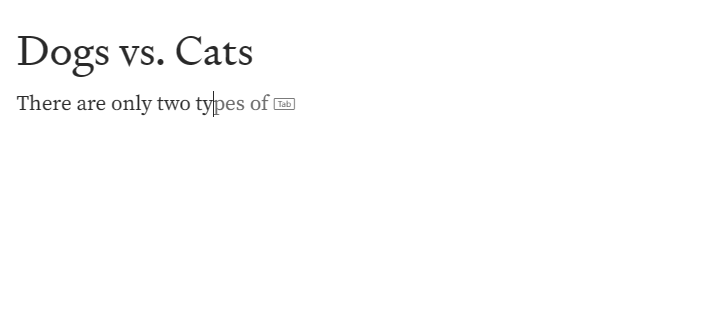

# Extending the Autocomplete Attribute to Editing Host Elements

Consider all sections required unless otherwise noted.

Authors: [Ben Mathwig](https://github.com/bmathwig)

## Status of this Document

This document is a starting point for engaging the community and standards bodies in developing collaborative solutions fit for standardization. As the solutions to problems described in this document progress along the standards-track, we will retain this document as an archive and use this section to keep the community up-to-date with the most current standards venue and content location of future work and discussions.

* This document status: **Active**
* Expected venue: [WHATWG](https://whatwg.org/)
* Current version: [Link](#)

## Introduction
The current specification for `autocomplete` allows for the attribute to exist on elements of type `<input>`, `<textarea>`, and `<select>`. With the rise in popularity of rich text controls using an [editing host](https://html.spec.whatwg.org/multipage/interaction.html#editing-host), we should consider allowing [editing host](https://html.spec.whatwg.org/multipage/interaction.html#editing-host) elements to also utilize the autocomplete attribute. While not a common scenario within the scope of form fields, there are applications for text hinting and autofill within [editing host](https://html.spec.whatwg.org/multipage/interaction.html#editing-host) elements.


## Goals

1. Expand the definition of the `autocomplete` attribute to be inclusive of [editing host](https://html.spec.whatwg.org/multipage/interaction.html#editing-host) elements by adding [editing host](https://html.spec.whatwg.org/multipage/interaction.html#editing-host) elements to the Text and Multiline control groups. [4.10.18.7.1 Autofill](https://html.spec.whatwg.org/multipage/form-control-infrastructure.html#autofilling-form-controls:-the-autocomplete-attribute)

## Featured Use Case
A developer may use `autocomplete` to advantage of browser-provided writing assistance features like text prediction on `contenteditable` or `textarea` elements.

### Facebook.com: Writing a post


### Medium.com: Drafting an article


### Youtube.com: Commenting on a video


The `autocomplete` attribute will also allow developers to take advantage of any additional browser-provided writing assistance features in the future. See a hypothetical example below.


A developer may also wish to turn off `autocomplete` for [editing hosts](https://html.spec.whatwg.org/multipage/interaction.html#editing-host). For example, the site may wish to provide their own custom writing assistance features. The developer would be able to achieve this with `autocomplete=off`.

```html
<div id="rich-text-editor" contenteditable="true" autocomplete="on">
    <!-- Editor Content Here -->
</div>

<div id="comment-edit-box" contenteditable="true" autocomplete="off">
    <span>Insert your comments...</span>
</div>
```

## Out of Scope
1. Defining expected user agent behavior or user interface design.
1. Adding additional field names to the table for autofill values.

## Proposed Solution
We propose updating the group definitions in [4.10.18.7.1 Autofill](https://html.spec.whatwg.org/multipage/form-control-infrastructure.html#autofilling-form-controls:-the-autocomplete-attribute) to include [editing host](https://html.spec.whatwg.org/multipage/interaction.html#editing-host) elements in the *Text* and *Multiline* sections.

**Before**
```
Text
    input elements with a type attribute in the Hidden state
    input elements with a type attribute in the Text state
    input elements with a type attribute in the Search state
    textarea elements
    select elements
Multiline
    input elements with a type attribute in the Hidden state
    textarea elements
    select elements
```

**After**
```
Text
    input elements with a type attribute in the Hidden state
    input elements with a type attribute in the Text state
    input elements with a type attribute in the Search state
    textarea elements
    select elements
    editing host elements
Multiline
    input elements with a type attribute in the Hidden state
    textarea elements
    select elements
    editing host elements
```

## Privacy and Security Considerations
### Privacy
The following section enumerates the potential security and privacy concerns identified during the development of this proposal and summarizes proposed solutions for each.

| Concern | Description | Proposed Solution |
| :- | :- | :- |
| Autofill Data Storage Leak | Increasing the scope of applicable elements for autofill will increase the risk that autofill populates [editing host](https://html.spec.whatwg.org/multipage/interaction.html#editing-host) elements with sensitive information without user consent. | Form field elements like `<input>` already have autofill mechanisms in user agents where sensitive information such as address or phone number. We don't believe there are additional actions to take here and the existing mitigations for other elements still apply |

## Potential Extensions
Autofill is becoming more popular with the rise of advanced text prediction in user agents. One potential extension is to add new field name values to the table to allow for more dynamic autofill population of content.

## Alternative Solutions
### Spellcheck Attribute
The `spellcheck` attribute could also be used to signal autofill capability for rich text edit elements, but `spellcheck` is already being used to turn off integrated browser features that offer grammar and spelling to use a custom implementation. To avoid compatability issues, this is not a good alternative.

### Text Prediction Attribute
Edge has a `textprediction` attribute implementation that is used to disable Edge's text prediction feature. The presence of this attribute signals to Edge whether an element is eligible for text prediction. While this seems like a natural alternative for this type of autofill, it is non-standard and is currently not on any track for standardization. For this reason, we believe using the existing `autocomplete` attribute will be sufficient.