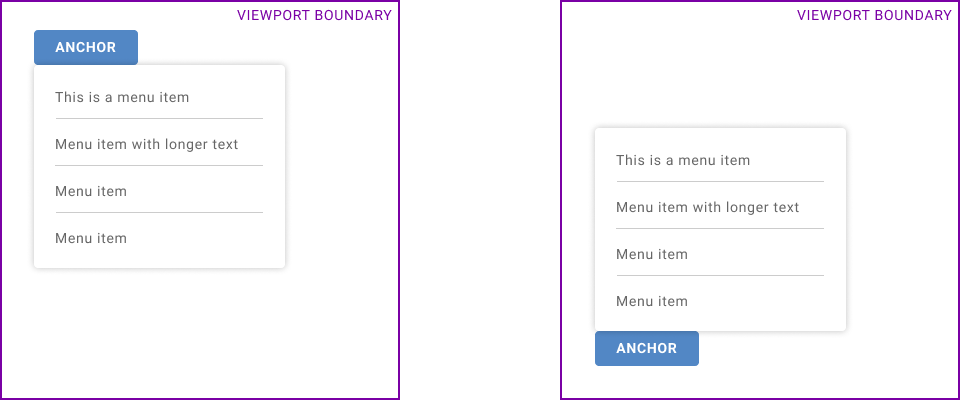
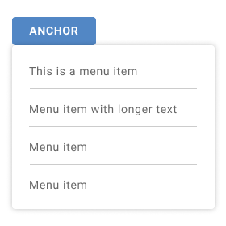
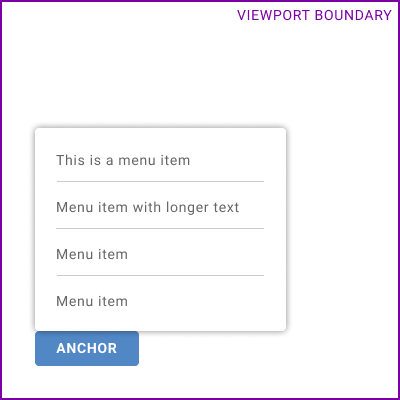
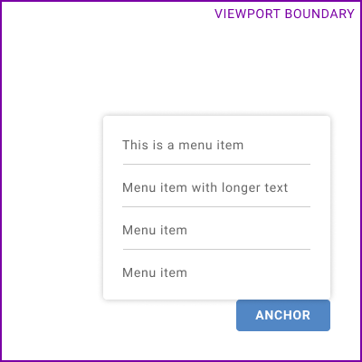
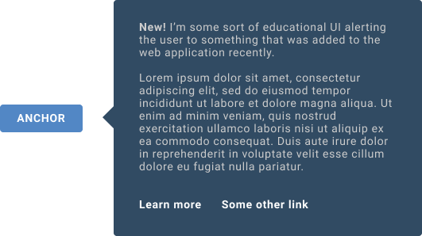
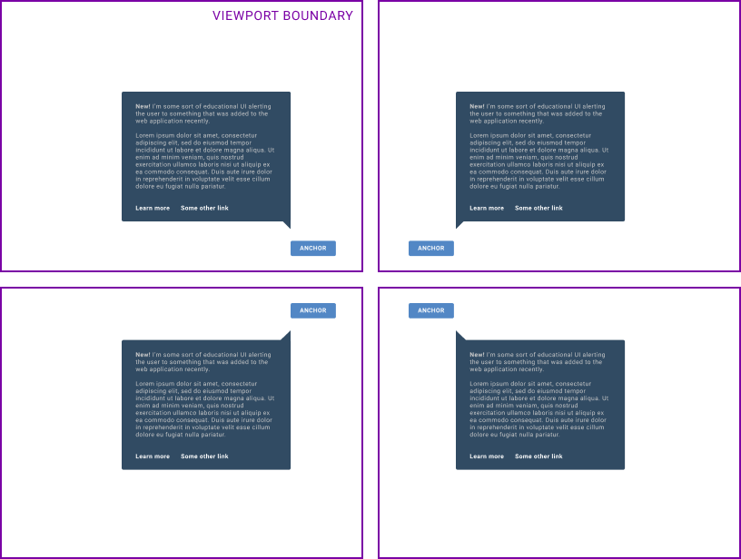
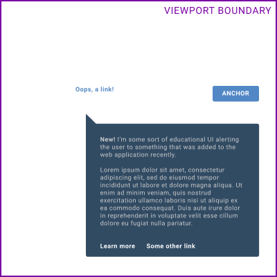
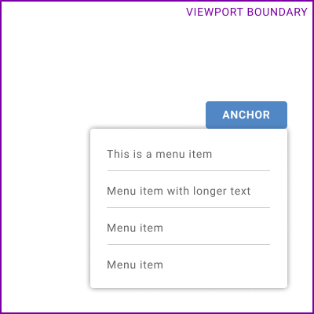
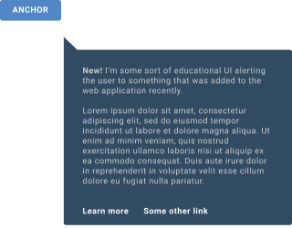
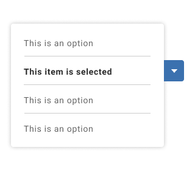

# CSS Anchored Positioning

Authors:

* [Bo Cupp](https://github.com/BoCupp) (Microsoft)
* [Melanie Richards](https://github.com/melanierichards) (Microsoft)
* [Dan Clark](https://github.com/dandclark) (Microsoft)
* [Ionel Popescu](https://github.com/ipopescu93) (Microsoft)

Acknowledgements:

The anchored positioning scheme proposed here is influenced by Ian Kilpatrick and Tab Atkin's ideas on [extending position: absolute/fixed](https://gist.github.com/bfgeek/60d4f57092eadcda0d4f32a8eb23b4c8). Thank you Ian and Tab!

## Status of this Document
This document is a starting point for engaging the community and standards bodies in developing collaborative solutions fit for standardization. As the solutions to problems described in this document progress along the standards-track, we will retain this document as an archive and use this section to keep the community up-to-date with the most current standards venue and content location of future work and discussions.

* This document status: **Active**
* Expected venue: [Open UI Community Group](https://www.w3.org/community/open-ui/) and [CSS Working Group](https://www.w3.org/Style/CSS/)
* **Current version: this document**

## Introduction

When building interactive components or applications, authors frequently want to leverage UI elements that can render in a "top-layer". Examples of such UI elements include content pickers, teaching UI, tooltips, and menus. ["Enabling Popups"](https://github.com/MicrosoftEdge/MSEdgeExplainers/blob/main/Popup/explainer.md) introduced a new `popup` element to make many of these top-layer elements easier to author.

Authors frequently wish to "pin" or "anchor" such top-layer UI to a point on another element, referred to here as an "anchor element". How the top-layer UI is positioned with respect to its anchor element is further influenced or constrained by the edges of the layout viewport.

Take, for example, a menu whose top-left point is anchored to the bottom-left point on a menu button. When there is insufficient space in the viewport below the button, the popup menu should be rendered above the menu button instead:



This document proposes a mechanism to achieve that positioning in CSS.

### Note on top-layer

For the sake of this proposal, consider "top-layer" elements to be those whose positioning is specially managed by the browser. These elements are rendered in a new stacking layer closest to the user, or "above" all other UI in the web document. Refer to the [full-screen specification](https://fullscreen.spec.whatwg.org/#top-layer) for a working definition of "top layer".

## Goals

Enable authors to:

* Anchor the position of browser-managed, top-layer elements (such as the proposed `popup`) to any other element, while accounting for the bounds of the layout viewport.
* Maintain a logical content order that matches the visual order, if the visual order has been impacted by anchored positioning.*
* Declaratively express a repositioning scheme for the anchored element in cases where there is not sufficient space in the layout viewport.
* Respond to repositioning events in order to make adjustments to directionally-aware styles on the anchored element.

*Wherever possible, authors should ensure that the DOM and visual order match without requiring special handling. As this may prove difficult for some anchoring use cases, an anchored positioning scheme should provide a way to heal this mismatch and ensure accessible content traversal.

## Use cases

Example use cases include:

* Temporal "teaching" elements that are applied to arbitrary pieces of UI in order to instruct the user about changes in the web application, provide introductory instruction on how to use the application, etc.
* Popups, such as menus invoked by a button.
* Indicator decorations, such as a "new!" bubble.

## Proposed API

### Declaring an anchor element

First, the author must provide an anchor element, using the `anchor` HTML attribute proposed in ["Enabling Popups"](https://github.com/MicrosoftEdge/MSEdgeExplainers/blob/main/Popup/explainer.md):

```HTML
<button id="myButton" popup="myPopup">Anchor</button>
<popup id="myPopup" anchor="myButton">Anchored element</popup>
```

This could alternatively be expressed in script:

```JS
document.getElementById('myPopup').anchor = document.getElementById('myButton');
```

Authors must not anchor an element to one of its descendents.

### Declaring preferred anchored position, with fallbacks

In CSS, the author positions the element by:

* Using a `fixed` positioning scheme
* Declaring sets of preferred and fallback positions using the `position-sets` property and associated at-rules.
* Leveraging a new `anchor` CSS function. `anchor()` enables authors to reference edges of the anchor element where CSS lengths are used.

Suppose that an author would like to anchor a menu to a button. They would prefer that the popup's top-left corner is anchored to the bottom-left corner of a button:



However, if there were insufficient space in the block direction to render the popup menu, it would be acceptable to anchor the bottom edge of the popup to the top edge of the button:



If there is insufficient space in the inline direction, it would be acceptable to anchor the popup's right-hand edge to the right-hand edge of the button. If there is not enough space in both directions the popup could be positioned as follows:



Here is how the author would express this in CSS:

```html
<button id="myButton" popup="myPopup">Anchor</button>
<popup id="myPopup" anchor="myButton" role="menu">…</popup>
<style>
    #myPopup {
        position: fixed;
        position-sets: buttonMenuPos;
        overflow: auto;

        /* The popup is at least as wide as the button */
        min-width: calc(anchor(right) - anchor(left));

        /* The popup is at least as tall as 2 menu items */
        min-height: 6em;
    }

    /* This example intentionally left verbose */
    @position-sets buttonMenuPos {
        /* First try to align the top, left edge of the popup
        with the bottom, left edge of the button. */
        1 {
            top: anchor(bottom);
            left: anchor(left);

            /* The popup is no wider than the distance from the 
            left button edge to the right edge of the viewport */
            max-width: calc(100vw - anchor(left));

            /* clamp the height of the popup to be no taller than
            the distance between the bottom of the button and the 
            bottom of the layout viewport. */
            max-height: calc(100vh - anchor(bottom));
        }

        /* Next try to align the bottom, left edge of the popup
        with the top, left edge of the button. */
        2 {
            bottom: anchor(top);
            left: anchor(left);

            max-width: calc(100vw - anchor(left));

            /* clamp the height of the popup to be no taller than
            the distance between the top of the button and the 
            bottom of the layout viewport. */
            max-height: anchor(top);
        }

        /* Next try to align the top, right edge of the popup
        with the bottom, right edge of the button. */
        3 {
            top: anchor(bottom);
            right: anchor(right);
            
            /* The popup is no wider than the distance from the 
            right button edge to left edge of the viewport. */
            max-width: anchor(right);

            max-height: calc(100vh - anchor(bottom));
        }

        /* Finally, try to align the bottom, right edge of the popup
        with the top, right edge of the button. Other positions are possible,
        but this is the final option the author would like the rendering 
        engine to try. */
        4 {
            bottom: anchor(top);
            right: anchor(right);
            
            /* The popup is no wider than the distance from the 
            right button edge to left edge of the viewport. */
            max-width: anchor(right);

            max-height: anchor(top);
        }
    }
</style>
```

_Sets are 1-based for consistency with other CSS features._

Breaking this apart:

* The author uses the `@position-sets` at-rule to create a custom-named set of candidate positions. 1-based integers are used as selectors for sets of positioning rules.
* These custom set name is then referenced as the value of the `position-sets` property declared on the popup to be anchored.
* The `anchor(edge)` CSS function resolves to a length which is the distance between the opposing starting edge of the layout viewport and the named border-box edge of the anchoring element. The named edge can be physical (`top`, `left`, `bottom`, `right`) or logical (`block-start`, `inline-start`, `block-end`, `inline-end`).

How the user agent will process these rules:

* The user agent will begin at the position set at the lowest non-zero integer (e.g. position set `1`).
* The layout process will determine if the popup overflows the layout viewport when using the rules at the given selector. Rules influencing inline direction will be processed, then block direction.
* If there is overflow of the layout viewport, layout will try the position set at the next integer-selector (e.g. `2`).
* If all position sets in a given direction would cause overflow, the user agent will use the preferred position (at selector `1`).

### Position set functions

This scheme could be further extended by allowing functions in the `position-set` property. For example, `largestWidth(buttonMenuPos)` could use the first position set which causes the largest possible width without causing viewport overflow. `minOverflow(buttonMenuPos)` would choose the position set which causes the _least_ amount of overflow, if all options would cause overflow.

In the previous example, the author declared a `min-height` to ensure that their viewport-aware `max-height` values didn't shrink to too small of a value. Instead of setting a static `min-height`, that author could instead use a `largestHeight` function:

```html
<button id="myButton" popup="myPopup">Anchor</button>
<popup id="myPopup" anchor="myButton" role="menu">…</popup>
<style>
    #myPopup {
        position: fixed;
        position-sets: largestHeight(buttonMenuPos);
        overflow: auto;

        /* The popup is at least as wide as the button */
        min-width: calc(anchor(right) - anchor(left));
    }

    @position-sets buttonMenuPos {
        …
    }
```

The user agent will now favor the position set that results in the largest height. Suppose that position set `1` would not cause overflow of the layout viewport, but would cause overflow of the popup's contents, introducing a subscroller. Position set `2` provides enough space to render the popup such that all 4 menu items are visible without overflow. The user agent would use position set `2`.

**Note:** if these functions are not introduced to `position-sets` values, user agent processing rules for calculating layout viewport overflow would need to be changed to ignore `max-width` and `max-height`. That way, positioning logic can optimize for the anchored element's natural dimensions. This is necessary for cases where position set `1` would never cause viewport overflow (due to a viewport-aware `max-*` value and a missing or very small `min-*` value), but position set `2` would result in no content overflow.

### DRY-ing up declared position sets

In the first example, the author declared four separate position sets that the user agent should attempt in positioning the popup. Many of these styles are shared between the position sets, and could become cumbersome if the author adds more candidate positions. An author that wants to "DRY" up their code can instead use comma-separated position set selectors for shared styles. Here is the same example using comma-separated selectors:

```html
<button id="myButton" popup="myPopup">Anchor</button>
<popup id="myPopup" anchor="myButton" role="menu">…</popup>
<style>
    #myPopup {
        position: fixed;
        position-sets: buttonMenuPos;
        min-width: calc(anchor(right) - anchor(left));
        min-height: 6em;
    }

    @position-sets buttonMenuPos {
        /* INLINE DIRECTION: first try to align the left edge of the popup
        with the top, left edge of the button. */
        1, 2 {
            left: anchor(left);
            max-width: calc(100vw - anchor(left));
        }
        
        /* INLINE DIRECTION: then try to align the right edge of the popup
        with the right edge of the button. */
        3, 4 {
            right: anchor(right);
            max-width: anchor(right);
        }

        /* BLOCK DIRECTION: first try to align the top edge of the popup
        with the bottom edge of the button. */
        1, 3 {
            top: anchor(bottom);
            max-height: calc(100vh - anchor(bottom));
        }

        /* BLOCK DIRECTION: then try to align the bottom edge of the popup
        with the top edge of the button. */
        2, 4 {
            bottom: anchor(top);
            max-height: anchor(top);
        }
    }
</style>
```

To the user agent, there is no logical difference between this example and the previous syntax. Rules at the `1,2` selector and `1,3` selector will be processed together for position set `1`. If a property is declared more than once for a given position set, normal document order resolution applies.

### Vertically center an element of unknown height next to its anchor

Some authors may wish to center an element of unknown dimension with the midpoint of its anchor element. For example, this "teaching UI" is vertically centered next to the button it describes:



This is achievable using the `anchor()` function in `calc()` expressions, along with a `transform`:

```html
<button id="myButton" popup="myPopup">Anchor</button>
<popup id="myPopup" anchor="myButton">…</popup>
<style>
    #myPopup {
        position: fixed;
        position-sets: verticallyCenteredPopup;

        /* The width will be fixed and the callout
           will be as tall as it needs to be to fit
           its contents. */
        width: 400px;
    }

    @position-sets verticallyCenteredPopup {
        1, 2 {
            --anchorMidpoint: calc(anchor(top) + ((anchor(bottom) - anchor(top)) / 2));

            /* align the top edge of the popup
               with the middle of the anchor. */
            top: var(--anchorMidpoint);
            /* clamp the height of the popup to be no taller than
               double the minimum of a) the distance between the anchor
               midpoint and the top of the layout viewport, or 
               b) the distance between the anchor midpoint and the
               bottom of the layout viewport. */
            max-height: calc(min(var(--anchorMidpoint), calc(100vh - var(--anchorMidpoint))) * 2);

            /* vertically center the popup. */
            transform: translateY(-50%);
        }

        1 {
            /* try to align the left edge of the popup
               with the right edge of the anchor. */
            left: anchor(right);
        }

        2 {
            /* try to align the right edge of the popup
               with the left edge of the anchor. */
            right: anchor(left);
        }
    }
</style>
```

**Open question:** should `transform` participate in the user agent's calculations as to whether the position set will cause overflow? The `max-height` in this example ensures there will be no vertical overflow of the layout viewport, regardless of whether or not `transform` participates.

### Applicability of the anchor positioning scheme

This proposal currently restricts the applicability of the `anchor(edge)` CSS function to anchorable elements which have their display managed by the user agent (`popup` is the first example of such an element). This is because using both the edges of an anchor element and the edges of the layout viewport in layout calculations would require layout to be updated when the user scrolls, which would break independent scrolling.

### Additional details

* Similarly to `@keyframes`, properties included within `@position-sets` will take precedence over other cascade values of those same properties.
* Authors may declare any CSS properties in the position sets, not just those impacting position or box dimensions. For example, perhaps a popup should have a light blue background only if is displayed to the right of its anchor.

### Using JavaScript for position-aware operations

When top-layer UI elements are shown, a `beforeshow` event will be dispatched prior to the display of those elements. The events are dispatched for each newly-shown element from bottom to top in the top-layer stack. This event is fired after input processing, and before (but as close as possible to) frame lifecycle methods: i.e. pre-cascade, pre-layout, pre-paint. Authors may use these events to handle adjustments to top-layer UI elements based on their position.

For example, an author may want to adjust which "pointer" arrow is used for teaching UI:



If the teaching UI uses a fallback position set but the arrow decoration is not updated to match, it may appear to reference the wrong element:



An author could provide this directionally-aware decoration using the `beforeshow` event, like so:

```html
<button id="myButton" popup="myPopup">Anchor</button>
<popup id="myPopup" anchor="myButton">
    
    
    
    
    <p>
        Lorem ipsum dolor sit amet, consectetur adipiscing elit...
    </p>
</popup>
<style>
    /* Position each arrow in its proper corner. 
       Note that top, right refers to when the popup
       is positioned to the top, right of the anchor,
       not when the arrow is in the top, right 
       position. */
    .arrow {
        position: absolute;
        width: 20px;
        height: 20px;
    }
    .arrow.top {
        bottom: -20px;
    }
    .arrow.bottom {
        top: -20px;
    }
    .arrow.right {
        left: 0;
    }
    .arrow.left {
        right: 0;
    }

    #myPopup {
        position: fixed;
        position-sets: teachingUIPos;

        /* The width will be fixed and the callout
           will be as tall as it needs to be to fit
           its contents. */
        width: 400px;
    }

    @position-sets teachingUIPos {
        1, 2 {
            left: anchor(right);  
        }

        3, 4 {
            right: anchor(left);
        }

        1, 3 {
            bottom: anchor(top);
        }

        2, 4 {
            top: anchor(bottom);
        }
    }
</style>
<script type="module">
    const popup = document.querySelector("#myPopup")
    const tr_arrow = document.querySelector("#trArrow")
    const tl_arrow = document.querySelector("#tlArrow")
    const br_arrow = document.querySelector("#brArrow")
    const bl_arrow = document.querySelector("#blArrow")

    popup.addEventListener("beforeshow", () => {
        const pr = popup.getBoundingClientRect()
        const ar = popup.anchor.getBoundingClientRect()

        tr_arrow.style.display = "none";
        tl_arrow.style.display = "none";
        br_arrow.style.display = "none";
        bl_arrow.style.display = "none";

        if (pr.bottom >= ar.top) {
            if (pr.left >= ar.right) {
                // top, right display
                tr_arrow.style.display = "block";
            } else {
                // top, left display
                tl_arrow.style.display = "block";
            }
        }
        else {
            if (pr.left >= ar.right) {
                // bottom, right display
                br_arrow.style.display = "block";
            } else {
                // bottom, left display
                bl_arrow.style.display = "block";
            }
        }
    })
</script>
```

## Privacy and security considerations

### Privacy

No considerable privacy concerns are expected, but we welcome community feedback.

### Security

To avoid attackers using top-layer elements to spoof trusted UI (browser, operating system, or top-level document), `popup`s are [not permitted to break out of their parent document](https://open-ui.org/components/popup.research.explainer#privacy-and-security-considerations). Similarly, elements cannot be anchored to each other across document boundaries.

No other security concerns are expected.

## Alternative solutions

### Alternate A: Extending existing properties with comma-separated values

One drawback of the proposed @-rules-based solution is that it creates a dependency on layout when determining the computed value of various CSS properties. This is relevant not only to `element.computedStyleMap()` and `window.getComputedStyle()` methods, but features like CSS transitions which need to detect changes at the computed-value level.

As an alternative to the proposed @-rules syntax, existing properties could be extended to take a `position-set()` function as their value, with a set of comma-separated options representing preferred and fallback positions. This alternative could help ease some of the dependencies on layout, and is a viable option for consideration. We welcome author feedback on an @-rules- vs function-based approach.

Consider the scenario where a menu should be positioned above its anchor button if there is insufficient space to display the menu below the button:



The author would use comma-separated values to express a preferred position, then provide fallback positions:

```html
<button id="myButton" popup="myPopup">Anchor</button>
<popup id="myPopup" anchor="myButton" role="menu">…</popup>
<style>
    #myPopup {
        /* First try to align the top, left edge of the popup
        with the bottom, left edge of the button. */
        top: anchor(bottom), auto;
        left: anchor(left), auto;
        
        /* Next try to align the bottom, right edge of the popup
        with the top, right edge of the button. */
        bottom: auto, anchor(top);
        right: auto, anchor(right);

        /* the popup is at least as wide as the button */
        min-width: calc(anchor(right) - anchor(left));

        /* but is no wider than the distance from the 
           left button edge to the right edge of the viewport,
           OR 
           the right button edge to left edge of the viewport. */
        max-width: calc(100vw - anchor(left)), anchor(right);

        /* clamp the height of the the popup to be no taller than
           the distance between the bottom of the button and the 
           bottom of the layout viewport. */
        max-height: calc(100vh - anchor(bottom));
    }
</style>
```

Repositioning requires that properties affecting the size of the margin box of the anchored element take multiple values. The values would be tried by the user agent's layout engine in succession until a set is found that doesn't result in overflow of the anchored element's preferred margin box size.

First, properties affecting the inline direction of the margin box would be adjusted:

* `left`, `right`
* `margin-left`, `margin-right`, `margin-inline-start`, `margin-inline-end`
* `width`, `min-width`, `max-width`, `min-inline-size`, `max-inline-size`
* `padding-left`, `padding-right`, `padding-inline-start`, `padding-inline-end`
* `border-left`, `border-right`, `border-inline-start`, `border-inline-end`

In the example above, the first set of author-specified properties having an affect on the inline margin box size would be:

```css
    #my-popup {
        left: anchor(left);
        right: auto;
        min-width: calc(anchor(right) - anchor(left));
        max-width: calc(100vw - anchor(left));
    }
```

Ignoring max-width, the layout process of the user agent would determine if the popup overflows the layout viewport. If it does, the next set of properties to be tried would be:

```css
    #my-popup {
        left: auto;
        right: anchor(right);
        min-width: calc(anchor(right) - anchor(left));
        max-width: anchor(right);
    }
```

The properties `left`, `right`, and `max-width` had a second value supplied which was used in the second attempt by the layout engine to find a non-overflowing result for the popup. `min-width` did not have a second value, so its first and only value was used. More generally, the number of layout attempts (assuming all results overflow) is equal to the maximum number of values supplied across the properties affecting the inline margin box size. When one of those properties has fewer values, the value used for a particular layout iteration is the iteration number modulo the length of that property's list.

After the properties affecting the inline margin box size are resolved, the block size of the anchored element's margin box would go through a similar process using the resolved inline margin box property values as an input.

Here is the example markup further modified to account for repositioning in the block direction:


```html
<button id="myButton" popup="myPopup">Anchor</button>
<popup id="myPopup" anchor="myButton" role="menu">…</popup>
<style>
    #myPopup {
        /* First try to align the top, left edge of the popup
        with the bottom, left edge of the button. */
        top: anchor(bottom), auto;
        left: anchor(left), auto;
        
        /* Next try to align the bottom, right edge of the popup
        with the top, right edge of the button. */
        bottom: auto, anchor(top);
        right: auto, anchor(right);

        /* the popup is at least as wide as the button */
        min-width: calc(anchor(right) - anchor(left));

        /* but is no wider than the distance from the 
           left button edge to the right edge of the viewport,
           OR 
           the right button edge to left edge of the viewport. */
        max-width: calc(100vw - anchor(left)), anchor(right);

        /* clamp the height of the the popup to be no taller than:
            1. the distance between the bottom of the button 
               and the bottom of the layout viewport
            OR
            2. the distance between the top of the button 
               and the top of the layout viewport */
        max-height: calc(100vh - anchor(bottom)), anchor(top);
    }
</style>
```

If there is not enough space in both block and inline directions the resulting popup position would be positioned as follows:


### Alternate B: A set of properties specific to anchored positioning

**We opted not to go with this approach as it introduces many new primitives that are somewhat redundant to existing CSS features.**

A previous (internal) version of this CSS anchored positioning scheme used the `anchor` HTML attribute as described previously, and introduced a batch of new CSS properties and values:

* `position: anchor`, to specify the anchored positioning scheme
* `anchor-point`, to specify the point on the anchor to which the anchored element should be pinned.
* `anchored-origin`, to specify the point on the anchored element which should be pinned to the anchor.
* `anchor-point-inline-adjust`, `anchor-point-block-adjust`, `anchored-origin-inline-adjust`, and `anchored-origin-block-adjust` (along with `anchor-point-adjust` and `anchored-origin-adjust` shorthands), to specify how an anchored element should be positioned.
* `anchored-origin` supported a new keyword called `delegate`, which would delegate some anchoring responsibilities to a descendent of the anchored element (refer to "How do we support MacOS-style select anchoring?").
* A new keyword `push` enabled authors to express to the user agent, "instead of snapping to a specific point on the anchor, push this anchored element an arbitrary number of pixels to ensure that it aligns with the viewport edge".

## Open questions

### How should maintenance of logical order work?

One of the goals for this proposal states: "Maintain a logical content order that matches the visual order, if the visual order has been impacted by anchored positioning."

Most likely, the `anchor` attribute should be the hook that hoists an anchored element somewhere else in the logical order. There are some interesting [interactions with the `popup` attribute](https://github.com/MicrosoftEdge/MSEdgeExplainers/blob/main/Popup/explainer.md#open-questions) to consider, as well as where exactly the anchored element gets hoisted to. Open questions under this umbrella:

* Should the anchored element be treated as a sibling of the anchor element, immediately succeeding it in tab cycles / accessibility tree structures?
* What happens if the context to which the anchored element is hoisted has a restrictive content model where said anchored element is not valid?
* In many cases, the visual order of anchored elements should already follow the DOM order, and no fixup is required. As a performance consideration: should anchored element hoisting be opt-in by the author, so that this complexity/logic can be skipped unless it is actually needed?

A conceivable alternative is to impose restrictions on which elements can serve as an anchor, based on DOM structure. However, this may prove overly restrictive without actually solving the issue. For example:

* **Supposing a sibling relationship is preferred:** either the anchor or anchored element may live inside non-semantic, non-interactive wrapper elements, which would break the sibling relationship even if focus/logical order is still valid. Alternately, sibling relationships do not guarantee a next-previous sibling relationship (i.e. there may be other semantically "interesting" and/or focusable siblings between the anchor and anchored element siblings).
* **Supposing we pick a number of ancestors to traverse through:** such a number will always be arbitrary, likely to confuse authors, and brittle to minor dynamic DOM structure changes.

### Should the user agent provide a default repositioning scheme?

Such an algorithm would need to be predictible, straightforward to implement for interoperability, and simple to understand in lay terms. As an example, UAs could mirror edge positions (e.g. a popup's top-left corner pinned to the anchor's bottom-left => top-right corner pinned to bottom-right) and nudge center positions (e.g. a popup with its top-center pinned will be nudged just enough pixels horizontally in order to stay in the viewport). Should authors need to a lightweight opt-in for default repositioning logic?

### How could we better support directionally-aware styles?

In this proposal's examples, we demonstrate how JavaScript could be used to update directionally-aware decorations, such as an arrow pointing to the anchor element:



It is likely that some authors would prefer to handle this in CSS only. The concern with providing a CSS-based solution is that layout computation needs to be completed in order to determine whether the anchored element should be repositioned. And yet, authors likely want to influence layout/rendering based on repositioning. Perhaps a solution could force an additional cycle.

There is an opportunity to explore CSS-based solutions for styling descendents (including generated content) based on which position set was chosen. Perhaps nested selectors could be an interesting pathway to explore.

### How might we support MacOS-style select anchoring?

There are some cases where an author may want to delegate positioning to a descendent of the anchored element. For example, the author may want to mimic MacOS-style `<select>`s, where the selected `option` is centered over the `select`'s button part:



With this logic, the vertical positioning of the entire listbox is determined by the selected `option`. Selecting a different `option` will change the listbox's position over the `<select`> button in the block direction.

How might we support delegation of anchored positioning to a descendent? Alternatively, if this particular positioning logic is unique enough, it may be best handled by script (instead of complicating CSS API surface to absorb this use case).