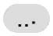
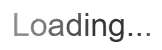
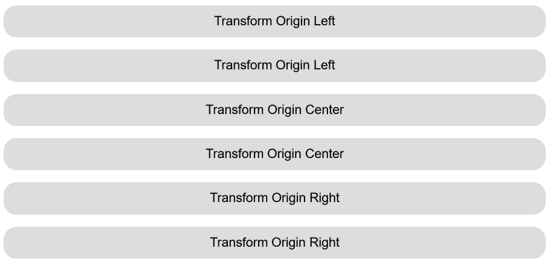

# CSS Text Transitions & Animations

## Author

- [Kevin Babbitt](https://github.com/kbabbitt) (Microsoft)

## Participate

- [Issue tracker](https://github.com/MicrosoftEdge/MSEdgeExplainers/labels/CSSTextTransitions)
- [Open a new issue](https://github.com/MicrosoftEdge/MSEdgeExplainers/issues/new?labels=CSSTextTransitions&title=%5BCSSTextTransitions%5D+)

## Table of Contents

<!-- START doctoc generated TOC please keep comment here to allow auto update -->
<!-- DON'T EDIT THIS SECTION, INSTEAD RE-RUN doctoc TO UPDATE -->

- [Introduction](#introduction)
- [User-Facing Problem](#user-facing-problem)
  - [Goals](#goals)
- [Proposed Approach](#proposed-approach)
  - [Scenario 1: Flowing in text](#scenario-1-flowing-in-text)
  - [Scenario 2: Typing indicator](#scenario-2-typing-indicator)
  - [Scenario 3: Loading shimmer](#scenario-3-loading-shimmer)
  - [Details and open questions](#details-and-open-questions)
    - [Animation application](#animation-application)
    - [Nested elements](#nested-elements)
    - [Adding text content to an element](#adding-text-content-to-an-element)
    - [Generated content](#generated-content)
    - [Animation and transition events](#animation-and-transition-events)
- [Prior Art](#prior-art)
- [Accessibility, Internationalization, Privacy, and Security Considerations](#accessibility-internationalization-privacy-and-security-considerations)
  - [Accessibility](#accessibility)
  - [Internationalization](#internationalization)
  - [Privacy and Security](#privacy-and-security)
- [References & acknowledgements](#references--acknowledgements)

<!-- END doctoc generated TOC please keep comment here to allow auto update -->

## Introduction

This explainer proposes new CSS properties to allow for transitions and
animations to be applied progressively to units of text (such as words) within a
given element.

## User-Facing Problem

Many Web experiences animate text at sub-element granularity. Examples include:

- AI chat interfaces that apply staggered fade-ins to each successive word, so
  that response text flows in smoothly at a steady rate.
- Typing indicators that display "..." with each dot animating in sequence.
- Loading or placeholder text that shimmers across words or characters to
  indicate progress.

One challenge with such effects is that the unit of currency for animations on
the Web is the element. Effects such as those described above require authors to
split each word (or character) into its own element, such as a `<span>`, and
apply effects individually to each such element. Doing so introduces several
problems:

- **Performance**: Each additional element adds cost to the DOM, style
  calculation, and layout, compared to having simple paragraphs of text.
- **Accessibility**: Screen readers may not correctly announce text that has
  been fragmented into many `<span>` elements, potentially reading individual
  fragments rather than flowing sentences.
- **Editing interaction**: Text selection and copy-and-paste behavior can be
  adversely affected.

Additionally, it puts the requirement on Web authors to perform the text
splitting. JavaScript `string.split()` can work when the desired unit is the
word, and packages such as
[GSAP SplitText](https://gsap.com/docs/v3/Plugins/SplitText/) do exist to
stagger animations on character, word, or line units. But the browser engine
needs to do these things anyway to perform layout, so there's an opportunity to
reuse that logic for animation purposes.

### Goals

- Provide a means of animating text at sub-element units.

<!--
### Non-goals

[If there are "adjacent" goals which may appear to be in scope but aren't,
enumerate them here. This section may be fleshed out as your design progresses and you encounter necessary technical and other trade-offs.]

[[None yet.]]
-->

<!--
## User research

[If any user research has been conducted to inform the design choices presented,
discuss the process and findings.
We strongly encourage that API designers consider conducting user research to
verify that their designs meet user needs and iterate on them,
though we understand this is not always feasible.]

[[TBD; we need to validate this approach with interested partners.]]
-->

## Proposed Approach

We introduce four new CSS properties:

```
transition-text-interval: <time [0s,∞]>#
transition-text-unit: [ none | character | word | line ]#
animation-text-interval: <time [0s,∞]>#
animation-text-unit: [ none | character | word | line ]#
```

**`*-text-unit`** specifies the unit of text that the transition or animation is
applied to progressively. When set to a value other than `none`, each successive
unit within the element starts its transition or animation after a staggered
delay.

- `none`: The transition or animation applies to the element as a whole, as in
  current behavior. (This value is provided so that, when an element has
  multiple properties listed in `transition-property`, the author can choose to
  have some of them act as text transitions and others act as whole-element
  transitions.)
- `character`: Each character is treated as a unit.
- `word` (initial value): Each word (as determined by the UA's word breaking
  algorithm) is treated as a unit.
- `line`: Each line box is treated as a unit.

**`*-text-interval`** specifies the delay between successive text units
beginning their transition or animation. For example, if
`transition-text-interval` is `6ms`, `transition-text-unit` is `word`, and
`transition-duration` is `100ms`, the first word starts immediately, the second
word starts at 6 ms, the third at 12 ms, and so on. The first word subsequently
finishes at 100 ms, the second at 106 ms, and so on.

- Initial value: `0s`

These properties take lists of values to integrate with existing support for
animating multiple properties in CSS Transitions and Animations. They follow the
same list behaviors as `transition-duration`, `transition-delay`,
`transition-timing-function`, etc.

Shorthands are also provided to set each pair of properties together:

```css
transition-text: 60ms word;
animation-text: 150ms character;
```

<!--
### Dependencies on non-stable features

[If your proposed solution depends on any other features that haven't been either implemented by
multiple browser engines or adopted by a standards working group (that is, not just a W3C community
group), list them here.]

[[No such dependencies.]]
-->

### Scenario 1: Flowing in text

Authors could achieve a flow-in animation as follows:

```html
<style>
  .fade-in-text {
    opacity: 1;
    transition: opacity 600ms;
    transition-text-unit: word;
    transition-text-interval: 6ms;
  }
  @starting-style {
    .fade-in-text {
      opacity: 0;
    }
  }
</style>
```


### Scenario 2: Typing indicator

Authors could animate "..." dots bouncing up and down in sequence:

```html
<style>
  @keyframes dot-bounce {
    0%,
    50%,
    100% {
      transform: translateY(0);
    }
    25% {
      transform: translateY(-0.3em);
    }
  }
  .typing-dots {
    animation: dot-bounce 1s ease-in-out infinite;
    animation-text-unit: character;
    animation-text-interval: 150ms;
  }
</style>
<!-- ... -->
<div class="typing-dots">...</div>
```



### Scenario 3: Loading shimmer

Authors could apply a looping shimmer effect that fades across characters:

```html
<style>
  @keyframes shimmer {
    0%,
    100% {
      color: #999;
    }
    50% {
      color: #333;
    }
  }
  .loading-text {
    animation: shimmer 1.5s ease-in-out infinite;
    animation-text-unit: character;
    animation-text-interval: 100ms;
  }
</style>
<!-- ... -->
<p class="loading-text">Loading...</p>
```



### Details and open questions

#### Animation application

The end state of any text transition or animation should be the same as if the
changed property were applied to the element as a whole. In many cases, but not
all, the overall effect will be equivalent to what would result if the author
had enclosed each text unit in its own `<span>` and applied the transition or
animation to each of them individually, with appropriate delays to each unit.
(Details to be fleshed out in the specification.)

This does create complications for properties that affect size and position of
elements. For example, scale transforms applied to individual words produce a
very different effect from a single scale transform applied to a group of words:



Implementations will need to adjust the individual transforms so that the
word-by-word animations produce the same final results as the whole-element
animations.

#### Nested elements

When `*-text-unit` is set on an element, the animation sequences through all
text content within that element, including text in descendant elements. For
example:

```html
<div class="fade-in-text">
  <p>First piece of text</p>
  <p>Second piece of text</p>
</div>
```

Here, the words in the first `<p>` animate in sequence, followed by the words in
the second `<p>`, as a single continuous timeline owned by the `<div>`.

However, if a text-interval animation also cascades to a descendant element,
that element establishes its own independent timeline:

```html
<div class="fade-in-text">
  <p>First piece of text</p>
  <p class="fade-in-text">Second piece of text</p>
</div>
```

In this case, the second `<p>` would animate its text on its own timeline rather
than waiting for the `<div>` to sequence through the first `<p>`'s text.

Inline non-text child elements should also participate in the text animation
flow. For example, given the following:

```html
<div class="fade-in-text">
  <span>some preceding content</span>
  
  <span>trailing</span>
</div>
```

The descendant image should participate in the animation as if it were a word
between "content" and "trailing".

#### Adding text content to an element

When text content is appended to an element that has already started animating
(e.g., in a streaming response scenario), the newly added text picks up where
the previous text would leave off.

```js
// Animates 'Hello'
element.appendChild(document.createTextNode("Hello"));

// Appends ' world' to the tail end of any running animation, or starts a new
// animation for just ' world' if the previous animation has already finished
element.appendChild(document.createTextNode(" world"));
```

When text is fully replaced (not an append), the animation restarts for all
content:

```js
// Animates 'Hello'
element.innerText = "Hello";

// Full replacement; restarts animation from the beginning
element.innerText = "Abcde fghij hijkl";
```

This includes operations that are semantically a replacement even if a leading
substring is shared:

```js
// Animates 'Hello'
element.innerText = "Hello";

// Restarts and animates 'Hello world'
element.innerText = "Hello world";
```

#### Generated content

How these properties interact with CSS generated content (via `::before`,
`::after`, and the `content` property) is an open question. Generated text
content could potentially participate in the same animation sequence as the
element's other text content.

#### Animation and transition events

The `animationend` or `transitionend` event fires on the element once the last
text unit completes its animation. This means the event fires later than it
would without text intervals. For example, if `transition-duration` is `600ms`,
`transition-text-unit` is `word`, and `transition-text-interval` is `6ms`, a
paragraph containing three words would fire `transitionend` at 612 ms (the last
word starts at 12 ms and finishes 600 ms later) rather than at 600 ms.

<!--
## Alternatives considered

[This should include as many alternatives as you can,
from high level architectural decisions down to alternative naming choices.]

### [Alternative 1]

[Describe an alternative which was considered,
and why you decided against it.
This alternative may have been part of a prior proposal in the same area,
or it may be new.
If you did any research in making this decision, discuss it here.]

### [Alternative 2]

[You may not have decided about some alternatives.
Describe them as open questions here, and adjust the description once you make a decision.]

### [Alternative 3]

[etc.]

[[TBD.]]
-->

## Prior Art

SVG has long supported rich text animation capabilities, including the ability
to animate individual characters along paths and apply per-glyph transformations
(see [SVG 2 Text](https://svgwg.org/svg2-draft/text.html)). Notably, SVG can
rotate individual characters but cannot fade them independently. While SVG's
text capabilities serve as useful precedent, they do not directly address the
needs of HTML/CSS content. Extending support to SVG text elements could be
explored in the future but is out of scope for this initial proposal.

## Accessibility, Internationalization, Privacy, and Security Considerations

### Accessibility

This feature can improve accessibility over current practice. Today, authors who
want to animate text at sub-element granularity must split text into many
`<span>` elements, which can interfere with screen reader announcement and
copy-paste behavior. By allowing the browser to handle per-unit animation
natively, the DOM remains clean and semantically meaningful.

On some platforms, users may express preferences for reduced animation effects.
In CSS, this preference may be exposed via the `prefers-reduced-motion` media
feature. Authors can use this media feature to adjust their animation effects
accordingly.

### Internationalization

The order in which text units animate should follow the writing mode. In a
left-to-right context, units animate left-to-right; in a right-to-left context,
they animate right-to-left. For vertical writing modes, the order follows the
block and inline flow direction accordingly.

### Privacy and Security

No privacy or security implications have been reported against this feature.

<!--
## Stakeholder Feedback / Opposition

[Implementors and other stakeholders may already have publicly stated positions on this work. If you can, list them here with links to evidence as appropriate.]

- [Implementor A] : Positive
- [Stakeholder B] : No signals
- [Implementor C] : Negative

[If appropriate, explain the reasons given by other implementors for their concerns.]

[[TBD.]]
-->

## References & acknowledgements

Many thanks for valuable feedback and advice from:

- Daniel Clark
- Hoch Hochkeppel
- Kurt Catti-Schmidt
- Mike Jackson
- Sushanth Rajasankar

Thanks to the following proposals, projects, libraries, frameworks, and
languages for their work on similar problems that influenced this proposal.

- [GSAP SplitText](https://gsap.com/docs/v3/Plugins/SplitText/)
- [SVG 2 Text](https://svgwg.org/svg2-draft/text.html)
