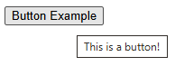

# Customization and accessibility improvements for built-in tooltips

## Authors

- [Alison Maher](https://github.com/alisonmaher)
- [Patrick Brosset](https://github.com/captainbrosset)
- [Lea Verou](https://github.com/LeaVerou) (author of the [original
proposal](https://github.com/w3c/csswg-drafts/issues/8930))

## Participate

- [Issue tracker](https://github.com/MicrosoftEdge/MSEdgeExplainers/labels/TooltipPseudo)
- [CSSWG Github Proposal](https://github.com/w3c/csswg-drafts/issues/8930)

## Status of this Document

This document is intended as a starting point for engaging the community and
standards bodies in developing collaborative solutions fit for standardization.
As the solutions to problems described in this document progress along the
standards-track, we will retain this document as an archive and use this section
to keep the community up-to-date with the most current standards venue and
content location of future work and discussions.

* This document status: **Active**
* Expected venue: [CSS Working Group](https://www.w3.org/Style/CSS/)
* Current version: this document

## Table of Contents

<!-- START doctoc generated TOC please keep comment here to allow auto update -->
<!-- DON'T EDIT THIS SECTION, INSTEAD RE-RUN doctoc TO UPDATE -->
**Table of Contents**  *generated with [DocToc](https://github.com/thlorenz/doctoc)*

- [Introduction](#introduction)
- [Goals](#goals)
- [Non-goals](#non-goals)
- [User research](#user-research)
  - [Current `title` attribute usage](#current-title-attribute-usage)
  - [Use cases for custom tooltips](#use-cases-for-custom-tooltips)
- [Existing and upcoming tools available for custom tooltips](#existing-and-upcoming-tools-available-for-custom-tooltips)
  - [Use an existing library or component](#use-an-existing-library-or-component)
  - [Create a fully custom tooltip](#create-a-fully-custom-tooltip)
    - [Utilize `popover`, CSS anchor positioning, and/or `interestfor`](#utilize-popover-css-anchor-positioning-andor-interestfor)
- [Current landscape of built-in tooltips](#current-landscape-of-built-in-tooltips)
  - [Simple tooltips across browsers](#simple-tooltips-across-browsers)
    - [Chromium](#chromium)
    - [Gecko](#gecko)
    - [Webkit](#webkit)
  - [Longer tooltips across browsers](#longer-tooltips-across-browsers)
    - [Chromium](#chromium-1)
    - [Gecko](#gecko-1)
    - [Webkit](#webkit-1)
- [Proposed solution](#proposed-solution)
- [Elements the tooltip can be applied to](#elements-the-tooltip-can-be-applied-to)
- [Opt-in mechanism](#opt-in-mechanism)
  - [Opt-in mechanism A - The new `tooltip` HTML attribute](#opt-in-mechanism-a---the-new-tooltip-html-attribute)
  - [Opt-in mechanism B - The `appearance:base` CSS declaration](#opt-in-mechanism-b---the-appearancebase-css-declaration)
- [Styling mechanism: the `::tooltip` pseudo element](#styling-mechanism-the-tooltip-pseudo-element)
  - [Positioning for `::tooltip`](#positioning-for-tooltip)
  - [Sizing the `::tooltip`](#sizing-the-tooltip)
  - [Default styles for `::tooltip`](#default-styles-for-tooltip)
  - [What styles can be applied to `::tooltip`?](#what-styles-can-be-applied-to-tooltip)
  - [Customizing the delay](#customizing-the-delay)
  - [`::tooltip` style inheritance](#tooltip-style-inheritance)
  - [What user interaction triggers the built-in tooltip?](#what-user-interaction-triggers-the-built-in-tooltip)
- [Dependencies on non-stable features](#dependencies-on-non-stable-features)
- [Key scenarios](#key-scenarios)
  - [Scenario 1: Get a consistent and accessible tooltip](#scenario-1-get-a-consistent-and-accessible-tooltip)
  - [Scenario 2: Adjusting the look and feel of built-in tooltips](#scenario-2-adjusting-the-look-and-feel-of-built-in-tooltips)
  - [Scenario 3: Adjusting tooltip timing](#scenario-3-adjusting-tooltip-timing)
  - [Scenario 4: Providing custom positioning to a tooltip](#scenario-4-providing-custom-positioning-to-a-tooltip)
- [Accessibility Considerations](#accessibility-considerations)
  - [What is the current accessibility experience of tooltips across browsers?](#what-is-the-current-accessibility-experience-of-tooltips-across-browsers)
  - [Proposed improvements](#proposed-improvements)
  - [Zoom](#zoom)
- [Security Considerations](#security-considerations)
- [Privacy Considerations](#privacy-considerations)
- [Open questions](#open-questions)
- [Future ideas](#future-ideas)
  - [Tooltip pointer/arrow](#tooltip-pointerarrow)
  - [Customizing `::tooltip` user interactions](#customizing-tooltip-user-interactions)
  - [CSS Anchor Positioning tooltip defaults](#css-anchor-positioning-tooltip-defaults)
- [Considered alternatives](#considered-alternatives)
  - [Alternative 1: The `interestfor` attribute](#alternative-1-the-interestfor-attribute)
- [References & acknowledgements](#references--acknowledgements)

<!-- END doctoc generated TOC please keep comment here to allow auto update -->


## Introduction

Tooltips are used by authors to provide additional contextul information to users
for a given interactive element on the screen. Tooltips are often presented as
a textbox that appears on hover (or potentially some other user interaction, like
keyboard focus, or long-press on a touchscreen device) on the element the
tooltip is associated with.



Authors can utilize the browser's built-in tooltips by setting the
[`title`](https://html.spec.whatwg.org/multipage/dom.html#attr-title)
attribute on an element of interest, or via the [`<title>`](
https://html.spec.whatwg.org/multipage/semantics.html#the-title-element)
element in SVG.

However, the tooltip that appears as a result is not customizable in any way by
the author. In particular, authors cannot:

* Change the visual aspect of the tooltip box (e.g., colors, fonts, borders).
* Change the positioning of the tooltip.
* Change the timing of when the tooltip appears or disappears.

This lack of customizability has been a source of common frustration for authors
who want to keep a consistent look and feel across all of their UI.

In addition, the `title` attribute is strongly discouraged by many developer
resources, as it can lead to accessibility issues. For example:

* [The Trials and Tribulations of the Title Attribute](https://www.24a11y.com/2017/the-trials-and-tribulations-of-the-title-attribute/).
* [Accessibility concerns in _title HTML global attribute_](https://developer.mozilla.org/en-US/docs/Web/HTML/Reference/Global_attributes/title#accessibility_concerns), at MDN.
* [Note in The title attribute section of the HTML specification](https://html.spec.whatwg.org/multipage/dom.html#the-title-attribute)

This document explores a new opt-in tooltip mechanism that aims to provide authors
with a low effort way to adjust styles for browser built-in tooltips without
having to create a fully custom solution, leaving positioning, input handling, and
accessibility for their tooltips up to the browser.

## Goals

* Provide a low effort way for authors to style core properties on browser
built-in tooltips (for example, color properties, font properties, etc.)
* This mechanism should handle accessibility, positioning, and input handling for
the author by default.
* Allow authors to override the default positioning behavior of the built-in
tooltips.
* Allow authors to change the timing of built-in tooltips.
* Guarantee security best practices, given that tooltips today can extend past
the bounds of the browser window.
* Styling built-in tooltips should produce consistent results across all browsers
on the same OS, ensuring an interoperable experience for authors.
* Allow authors to reuse their built-in tooltip styles for richer custom
tooltips, for example those built by using the Popover API.

## Non-goals

* This proposal is not meant to support tooltips with arbitrary HTML content, which
can be covered by existing solutions, like `popover`, CSS Anchor positioning, and
the `interestfor` attribute.
* Provide a means to set a [pointer](#tooltip-pointerarrow) on the tooltip. The
solution should be specified to allow for this functionality in the future, though.
* Provide a means to set the content of the tooltip in CSS.

## User research

Use cases in this explainer were collected from:

* The discussion in CSSWG issue [#8930: Standardize tooltip styling and expose as ::tooltip](https://github.com/w3c/csswg-drafts/issues/8930).
* Discussions in CSSWG issue [#9447: Which properties should be available to ::tooltip?](https://github.com/w3c/csswg-drafts/issues/9447).
* OpenUI issue [#730: Consider providing a way for authors to style the title attribute's tooltip](https://github.com/openui/open-ui/issues/730).
* [Title Attribute Usage — Findings Report](https://github.com/captainbrosset/title-attribute-research/blob/main/REPORT.md).
* Discussions on two social media threads: [on Bluesky](https://bsky.app/profile/did:plc:vcrxgrk7qttaunjut34oe5oq/post/3mwlodpeuoc2b) and [on Mastodon](https://mas.to/@patrickbrosset/117349471742171926).

There are also many articles on the web that walk authors through various
options for creating custom tooltips using tools available to them today.
One such [article](https://blog.replaybird.com/css-tooltip-examples/)
walks through different options, along with various examples and use cases
for tooltips on the web.

### Current `title` attribute usage

Our [research](https://github.com/captainbrosset/title-attribute-research/blob/main/README.md), based on Tranco's top sites list, showed that:

* Current usage of the `title` attribute in top sites is dominated by `<a>` and `` elements.
* For both elements, most `title` attribute values are redundant. They carry no meaningfully new information beyond what's already available via the link text or image `alt` attribute.

We are attributing this redundancy to:
* Search engine optimization patterns.
* Accidental redundancy due to CMS tools.
* Developer oversight or lack of awareness about accessibility best practices.

In the same research, cases where the `title` attribute was genuinely different included:
* Disclosure of click/interaction behavior.
* Attribution/credit.
* Restating a truncated or iconic label in full.

When it comes to link and image elements, there are more accessible native alternatives to the above: `aria-label`, `aria-describedby`, a visible caption, or just fuller `alt` attribute or link text.

### Use cases for custom tooltips

As the previous section showed, the `title` attribute is mostly used redundantly or incorrectly. However, the [large demand for custom tooltip libraries](#use-an-existing-library-or-component) shows that there are legitimate use cases for custom tooltips.

According to [Tooltips & Toggletips](https://inclusive-components.design/tooltips-toggletips/):

* Labeling icon-only controls:

  A button represented only by an icon. The tooltip provides the missing label, such as "Notifications" or "Settings".

* Providing extra clarification about a control:

  The control already has a label, but some additional explanation may help. For example when the label says "Notifications", the tooltip could say "View notifications and manage settings".

* Dense toolbars where visible text truly won't fit:

  For example, WYSIWYG editor toolbar with many controls.

## Existing and upcoming tools available for custom tooltips

If an author wants to display a custom style tooltip today, they must resort to
one of the following alternative approaches to the built-in tooltip that they
get with the `title` attribute.

### Use an existing library or component

Authors can use an existing library or component for a fully customizable tooltip.
Some example libraries include:

* [Fluent 2 Tooltip component](https://fluent2.microsoft.design/components/web/react/core/tooltip/usage)
* [opentip library](https://www.opentip.org/)
* [Floating UI library](https://floating-ui.com/)
* [Radix UI React tooltip component](https://www.radix-ui.com/primitives/docs/components/tooltip)
* [Many tooltip NPM packages](https://www.npmjs.com/search?ranking=popularity&q=tooltip)
* Many more

It is clear that there are many libraries and components for creating custom tooltips
that authors can use to solve their need for more customization.

If the library chosen is well architected to properly handle accessibility, this can
also be a convenient way to get such functionality "for free". However, relying on an
external library to get accessibility right can be risky, which may limit the usability
if not done correctly.

The other downside of this approach is that it requires heavy use of scripting,
which can be slower, and shouldn't be necessary if the author simply wants to
adjust some basic styles.

### Create a fully custom tooltip

Authors can also choose to create their own custom tooltip or component, which
requires their own input management, proper accessibility support and proper
handling of the tooltip positioning, which can be complex.

This does allow authors to achieve their goal of full customizability, but it
often requires heavy use of scripting, or use of `::before` or `::after`
pseudos, which can make getting accessibility correct quite difficult.

As such, this solution requires a lot of work to get right, especially if all they
want to do is adjust a few simple styles on the built-in tooltip.

#### Utilize `popover`, CSS anchor positioning, and/or `interestfor`

Although creating a custom tooltip can be cumbersome for an author who is looking
to just adjust a few simple styles, they do have new and upcoming web APIs which
can help them in accomplishing a fully customizable tooltip more easily:

* The [`popover`](
  https://html.spec.whatwg.org/multipage/popover.html#dom-popover) attribute,
  which is [Baseline](https://web-platform-dx.github.io/baseline/) as of
  [January 2025](https://web-platform-dx.github.io/web-features-explorer/features/popover/).
* [CSS Anchor Positioning](https://drafts.csswg.org/css-anchor-position-1/),
  which is not yet Baseline, but was part of the [Interop 2025 and 2026 projects](
  https://wpt.fyi/results/css/css-anchor-position?aligned&view=interop&q=label%3Ainterop-2025-anchor-positioning).
* The [`interestfor`](
  https://open-ui.org/components/interest-invokers.explainer/#keyboard) attribute,
  which is currently implemented in Chromium.

One benefit that authors get with `interestfor` over the other existing solutions
is that it creates a more accessible experience out-of-the-box and handles input
handling for the author, creating a more seamless approach than is available with
the `popover` attribute on its own. It is also a great solution if an author wants
custom HTML within their tooltip, as opposed to simple textual content.

However, `interestfor` is only allowed on buttons and links, which is more limited
than the `title` attribute.

---

All of these options allow authors to create more custom tooltip experiences than
what is currently available through the browser's built-in option using the `title`
attribute, but these options often require more work than should be necessary for
a simple style adjustment.

## Current landscape of built-in tooltips

The rendering of tooltips via the `title` attribute is up to each UA. Below
is a brief survey of how some of the top browser engines render built-in
tooltips today, in no particular order.

### Simple tooltips across browsers

This section compares tooltip rendering across browser engines using the following
code sample:

```html
<button title="This is a button!">Button Example</button>
```

#### Chromium

In Chromium, the tooltip is rendered above all web content, and the position
of the tooltip is dependent on the position of the mouse and the element it
is anchored to.

The style of the tooltip that is rendered is very simple: a white or black
background with black or white text and a matching border.

On Windows the simple test case above renders as follows:


On Linux, the style of the tooltip defaults to a darker color scheme:


On MacOS, Chromium leaves the rendering up to the OS itself, producing the
following result:


On mobile, tooltips are not activatable in Chromium, with the
exception of tooltips on an image, which do appear in the context
menu upon long press on Android.

#### Gecko

In Gecko, the tooltip is similarly rendered above all web content, and the
position of the tooltip is dependent on the position of the mouse and the
element it is anchored to.

The style of the tooltip that is rendered is arguably more modern in
style than Chromium and has more of an offset from the anchored element.

On Windows the simple test case above renders as follows:


On Linux, the style of the tooltip defaults to a darker color scheme,
with no border, and slightly more padding:


On MacOS, Gecko matches the OS tooltip styles, producing the following
result:


On mobile, tooltips are not activatable in Gecko, with the
exception of tooltips on an image, which do appear in the context
menu upon long press.

#### Webkit

In Webkit, the tooltip is similarly rendered above all web content, and the
position of the tooltip is dependent on the position of the mouse and the
element it is anchored to.

The style of the tooltip that is rendered is in accordance with the platform,
similarly to Chromium and Firefox on MacOS.


On mobile, tooltips are not activatable in Webkit, with the
exception of tooltips on an image, which do appear in the context
menu upon long press.

### Longer tooltips across browsers

Below is an overview of how each major browser engine handles longer
tooltip text, in no particular order.

#### Chromium

In Chromium, built-in tooltips add ellipses to the tooltip text if the
text is greater than or equal to 1025 characters. The tooltip is also
allowed to escape the bounds of the window. For example:


#### Gecko

In Gecko, I was *not* able to find a limit for built-in tooltip length for
which an ellipses was added, like it does in Chromium. However, tooltips
are also able to escape the bounds of the window in Gecko, but the tooltip
width stays more constrained than in Chromium. For example:


#### Webkit

In Webkit, I was *not* able to find a limit for built-in tooltip length for
which an ellipses was added, like it does in Chromium. However, tooltips
are also able to escape the bounds of the window in Webkit. In this case,
the tooltip appears to have uneven padding. For example:


---

It is clear that the tooltips provided by the top browser engines are
inconsistent in styling between each other and across OS, and there are
divergences in positioning and some behaviors with longer tooltip text.

This inconsistency and lack of customizability leads authors to find
alternatives that often require more work and maintenance.

## Proposed solution

The sections below describe the proposed solution for an stylable and
accessible built-in tooltip.

## Elements the tooltip can be applied to

The `title` attribute is global and can therefore be applied to any element.

Our proposal for a new customizable built-in tooltip is restricted to the
following focusable elements only:

* `<button>`
* `<a>`
* `<input>`
* `<textarea>`
* `<select>`

One of the main accessibility issues with built-in `title` attribute-based
tooltips is that they are not accessible to keyboard and screen reader users
because they're applied to elements that can't be focused.

As the [user research section](#use-cases-for-custom-tooltips) shows,
legitimate use cases for custom tooltips include icon buttons, UI controls,
and toolbar buttons, all of which are focusable.

## Opt-in mechanism

We are proposing to make the new customizable tooltip an opt-in feature,
which allows us to meaningfully depart from how the current `title` attribute
works.

We are considering two ways to opt-in:

### Opt-in mechanism A - The new `tooltip` HTML attribute

A new HTML attribute called `tooltip`, made specifically for display a custom
tooltip on one of the focusable elements listed above. Example:

```html
<button tooltip="This is a tooltip">Hover me</button>
```

* Pros:
  * Simple to use.
* Cons:
  * TODO

### Opt-in mechanism B - The `appearance:base` CSS declaration

Use the [`appearance: base`](
https://www.w3.org/TR/css-forms-1/#valdef-appearance-base) CSS declaration
within the `::tooltip` pseudo element (described below) to opt-in to the new
customizable tooltip.

```html
<style>
  ::tooltip {
    appearance: base;
  }
</style>
<button title="This is a tooltip">Hover me</button>
```

Without this opt-in mechanism, always applying the default `::tooltip` styles
by default may be a breaking change for some browsers. The UA should be able to
style tooltips in their own chosen way, unless the new tooltip mode is
triggered.

Authors may also want to trigger this path without triggering any styles beyond
those that are default. As such, there requires some mechanism for authors to
trigger the new `::tooltip`-based default.

This is similar to what was done for [customizable select elements](
https://developer.mozilla.org/en-US/docs/Learn_web_development/Extensions/Forms/Customizable_select).

* Pros:
  * No new attribute to discover and learn.
* Cons:
  * Requires all browsers to fix their implementation of the `title` attribute
  when the `appearance: base` declaration is used.
  * Requires convincing authors that the `title` attribute is now OK to use for
  tooltips in certain cases.
  * Requires an explicit opt-in from authors to use the new tooltip styles.

## Styling mechanism: the `::tooltip` pseudo element

Many have proposed a pseudo for styling browser tooltips over the years,
with the [first proposal](
https://lists.w3.org/Archives/Public/www-style/2000Apr/0014.html)
originating around April 2000, and the most [recent proposal](
https://github.com/w3c/csswg-drafts/issues/8930)
from Lea Verou in 2023.

Our proposal takes close inspiration from these, by introducing a new pseudo
element, called `::tooltip`, that can be used by authors to style the new
built-in customizable tooltip.

The `::tooltip` pseudo element will have default UA styles that will
be required to be applied when an author adjusts tooltip styles
within a `::tooltip` pseudo element selector.

Authors can then adjust the styles of color properties, shadowing, border
properties, font properties, etc. to better match the look and feel of their
site, leaving positioning, input handling, and accessibility up to the browser.

### Positioning for `::tooltip`

There has been discussion in the CSSWG around whether the positioning
of `::tooltip` should be UA magic, or if the author should be able to
customize this. The main concern being around security, given that
tooltips can escape the bounds of the browser window today (see
[Security Considerations](#security-considerations) for more details).

Given the proposal to not allow tooltips styled through the
`::tooltip` pseudo element to escape the bounds of the windows (see
[Security Considerations](#security-considerations) for more details),
this proposal also includes the ability for authors to customize the
tooltip positioning.

As such, this proposal will utilize [CSS Anchor Positioning](
https://drafts.csswg.org/css-anchor-position-1/) to define the default
position of the `::tooltip` pseudo element, which will allow authors
to override this in the way that they see fit.

As a result, this means that the element associated with the tooltip
is an implied anchor for the rendered tooltip.

### Sizing the `::tooltip`

This proposal sizes the default `::tooltip`-based tooltip according to
default sizing definitions (where the size of the tooltip is based on
the size of its content.) This also means that the tooltip will be
constrained by the viewport in the inline direction, but may overflow
the viewport in the block direction, if too large, as depicted in
the image, below.


We could instead consider whether the default tooltip in this case should
have a non-default sizing definition. For example, the width of the
tooltip could be constrained to be no larger than some percentage of
the viewport width using the `max-width` property.

This, and whether authors should be allowed to adjust the sizing
properties within a `::tooltip` pseudo element, remain open
questions for further discussion.

### Default styles for `::tooltip`

When the new default `::tooltip` styles are triggered, a set of default
styles is applied by the UA.

These styles were mostly pulled directly from Lea Verou's initial
[proposal](
https://github.com/w3c/csswg-drafts/issues/8930) with a minor edit
based on the new proposal to define the position via CSS Anchor
Positioning (which was included as an option in Lea's original proposal,
as well).

```css
/* UA styles */
::tooltip {
  color: InfoText;
  background: InfoBackground;
  font-size: .8rem;
  box-shadow: .1rem .1rem .2rem rgb(0 0 0 / .2);
  position: absolute;
  position-area: top right;
  position-try-fallbacks: top left, top center, bottom right, bottom left, bottom center, center right, center left;
  transition: 0s 3s visibility;

  @starting-style {
    visibility: hidden;
  }
}
```

These proposed set of initial UA styles is a starting point and is
open to further discussion.

To see some of these styles in action, check out the [CodePen demo](
https://codepen.io/alisonmaher/pen/MYYxpJZ) utilizing `interestfor`
to render the tooltip. You'll note that this requires some changes
to the styles above (notably, this doesn't include the defined
`transition` and sets `margin` to `0` to account for the default
`popover` styles). Since this is based on `interestfor`, at the
time of writing, this demo is required to be tested in a Chromium-based
browser.

### What styles can be applied to `::tooltip`?

Not all styles should or need to be applied within the context
of a simple text-based tooltip. For example, we likely don't
want tooltips with images, lists, scrollbars, or non-default
`display` types or `z-index`. As such, there should be a limited list
of styles that are valid within a `::tooltip` pseudo element; that
list can be expanded on in the future.

There is an open [CSSWG issue](
https://github.com/w3c/csswg-drafts/issues/9447) to discuss what
properties should be styleable within a `::tooltip` pseudo element.
As such, the complete list of properties is up for discussion, but
as the proposal notes, the core set of properties should include:

* `appearance` as a means to trigger new default tooltip styles (only
  for opt-in mechanism B)
* All font properties, `text-transform`, `letter-spacing`,
`word-spacing`, and the i18n text properties
* `background`, `color`, `box-shadow`, `text-shadow`,
`border-radius`, `corner-shape`, `border-shape`, `border`,
`padding`, `opacity` (including their longhands)
* `color-scheme` and `forced-color-adjust` (these two were not
included in the initial [CSSWG proposal](
https://github.com/w3c/csswg-drafts/issues/9447), but would likely
be helpful for authors to guarantee consistent theming capabilites
with the rest of their page.)
* Transitions
* `transform`, `transform-origin`, `rotate`, `scale`, `translate`
* Custom properties
* Given that the proposal suggests using anchor positioning for
default styling of the position of `::tooltip`, we should also
include [CSS Anchor Positioning](
https://drafts.csswg.org/css-anchor-position-1/) properties
for author customization

The list above should handle the majority of styling use cases
for authors, however the [current proposal](
https://github.com/w3c/csswg-drafts/issues/9447) also notes that
the following properties would be nice to have, as well:
* `clip-path`
* Filters and `backdrop-filter`
* `animation`
* `mix-blend-mode`
* `border-image`
* `outline`
* `text-decoration`
* `fill` and `stroke`

As noted, the first list of valid properties is still up for
debate, so any thoughts or input are welcome as we continue to
explore the [open issue](
https://github.com/w3c/csswg-drafts/issues/9447).

### Customizing the delay

A common requirement from authors when using custom tooltips is the
ability to define the delay before the tooltip is shown, and the
delay after which it disappears as well.

In [Default styles for `::tooltip`](#default-styles-for-tooltip), we
proposed adding `transition: 0s 3s visibility;` in the default styles,
to control the delay.

Another option is to make the element which the tooltip is attached to
an invoker element, per the [Interest Invoker API](
https://developer.mozilla.org/en-US/docs/Web/API/Popover_API/Using_interest_invokers),
and let authors customize the delay by using the `interest-delay` CSS
property instead.

### `::tooltip` style inheritance

To allow `::tooltip` to inherit styles from the rest of the page,
it should be grouped within the list of [Tree-Abiding
Pseudo-elements](https://drafts.csswg.org/css-pseudo/#treelike).

This would allow `::tooltip` to inherit properties, like `font-family`,
from the rest of the page, making it easier for authors to create
a consistent look and feel across all their UI.

### What user interaction triggers the built-in tooltip?

Currently, browsers show `title`-based tooltips when a user hovers
over the element associated with the tooltip.

No major browser engine appears to currently support touch interactions
for these built-in tooltips, except for tooltips on images. However, this should
be something for browser vendors to consider along with support for
`::tooltip`, similar to what is [proposed with `interestfor`](
https://open-ui.org/components/interest-invokers.explainer/#hids-and-interest).

All browsers, except Microsoft Edge, also do not invoke the `title`-based
tooltips on keyboard focus. See [Accessibility Considerations](
#accessibility-considerations) for more details.

Authors may also want to be able to customize the interaction(s) that
trigger built-in tooltips using the `::tooltip` pseudo element. This
functionality is being considered as a [future addition](#future-ideas)
to this proposal.

## Dependencies on non-stable features

This proposal makes use of [CSS Anchor Positioning](
https://drafts.csswg.org/css-anchor-position-1/), to define the default
positioning of the base `::tooltip` styles. This feature is not yet
baseline, but it was part of [Interop 2025](
https://github.com/web-platform-tests/interop/blob/main/2025/README.md#css-anchor-positioning)
and [Interop 2026](
https://github.com/web-platform-tests/interop/blob/main/2026/README.md#css-anchor-positioning).

There is also a thought on whether `::tooltip` should be defined to be
based on `interestfor`, given there is an overlap between the two
features. However, this is something that should likely be left up to the
UA on the technology involved in rendering their tooltips, as long as
the base set of styles and specified interactions are met.

## Key scenarios

### Scenario 1: Get a consistent and accessible tooltip

An author could simply opt-into the new tooltip without adjusting any of its
styles, in order to get a consistent tooltip appearance across browsers, which
respects the user's and page's font settings, and is accessible by default.

With opt-in mechanism option A:

```html
<button tooltip="This is a button!">
  The tooltip shown will follow the UA base styles across all browsers.
</button>
```

With opt-in mechanism option B:

```html
<style>
  ::tooltip {
    appearance: base;
  }
</style>
<button title="This is a button!">
  The tooltip shown will follow the UA base styles across all browsers.
</button>
```

### Scenario 2: Adjusting the look and feel of built-in tooltips

If an author doesn't like the base `::tooltip` style, they can adjust the
styles as follows:

With opt-in mechanism option A:

```html
<style>
  ::tooltip {
    background: orange;
    color: blue;
  }
</style>
<button tooltip="This is a button!">
  The tooltip shown will have a blue background and orange text.
</button>
```

With opt-in mechanism option B:

```html
<style>
  ::tooltip {
    appearance: base;
    background: orange;
    color: blue;
  }
</style>
<button title="This is a button!">
  The tooltip shown will have a blue background and orange text.
</button>
```

### Scenario 3: Adjusting tooltip timing

Authors can change the default delay used for showing and hiding the tooltip.

This can be done either by adjusting the `transition` property:

```html
<style>
  ::tooltip {
    transition: 0s 1s visibility;
  }
</style>
```

One may find it is strange that an author could adjust the `transition`
of the `visibility` property, without being able to update the `visibility`
property itself. This is because the UA owns the user interaction, and as such,
the UA owns the resulting visibility of the tooltip.

Disallowing author control of `visibility` itself allows UAs to lazily calculate
tooltip styles under the `::tooltip` pseudo element until it is determined by
the UA to display the tooltip itself. If an author were able to adjust
`visibility`, we would need to calculate `::tooltip` styles for all elements
to determine if the tooltip would be shown or not, which would be less
performant.

Although we don't allow author adjustment of `visibility`, authors may still
find it useful to adjust the timing the tooltip is shown, which we are proposing
can be accomplished via adjustment to the `transition` defined in the UA default
styles for `::tooltip`.

As proposed in [Customizing the delay](#customizing-the-delay), another approach
would be to use  the `interest-delay` property:

```html
<style>
  ::tooltip {
    interest-delay: 1s 0.5s;
  }
</style>
```

### Scenario 4: Providing custom positioning to a tooltip

Given that this proposal uses CSS Anchor Positioning to define the base
positions of the `::tooltip` pseudo element, this would open up an
opportunity for authors to adjust these styles, similar to the example
below:

```css
::tooltip {
  position-area: start span-all;
}
```

## Accessibility Considerations

According to the [WCAG](
https://www.w3.org/WAI/WCAG21/Understanding/content-on-hover-or-focus.html),
“Content which can be triggered via pointer hover should also be able to be
triggered by keyboard focus.” As such, tooltips should also be keyboard
accessible, and per guidance should also be dismissible.

### What is the current accessibility experience of tooltips across browsers?

Unlike [`interestfor`](
https://open-ui.org/components/interest-invokers.explainer/#why-is-interestfor-not-unlimited-like-title-is),
the `title` attribute is allowed on any element, even if that element
isn't interactable. This can pose problems for accessiblity, because
if the element isn't focusable, it means that the associated tooltip
is not keyboard accessible.

On top of this, no browser, outside of Microsoft Edge, exposes the
built-in tooltip on focus, even if the associated element is focusable.
This means that browser built-in tooltips are not accessible
out-of-the-box, which is one of the goals of this proposal.

### Proposed improvements

To improve the current situation, the `::tooltip` element cannot be
triggered or styled if the element associated with the tooltip is
not focusable.

As part of this effort, browser vendors should also work on triggering
their built-in tooltips on focus when the element associated with the
tooltip is focusable, and utilize the escape key to trigger tooltip
dismissal.

One consideration for improving this further is to force existing
elements with an associated `title`-based tooltips to have a
`tabindex` of `0` if it is not already focusable. However, this is
not ideal, as it could lead a container to become focusable that was
not before, leading to undesirable focus changes if a user incorrectly
applies focus just outside of a target element within that container.

An alternative for browser vendors to consider is including a user
setting that forces a `tabindex` of `0` in such cases, allowing the
user more control over the resulting behavior as they see fit. This
is also not ideal as it still forces a change in focus behavior from
what the site author intended.

This is why our proposal restricts the `::tooltip` pseudo element (and
the `tooltip` attribute, if this approach is chosen) to only a few
focusable elements which are commonly used today in tooltip scenarios.
See the list in [Elements the tooltip can be applied to](
#elements-the-tooltip-can-be-applied-to).

Creating a more accessible tooltip experience for users is one of
the key goals of this proposal, so additional ideas from the
community that should be considered to help in further improving
the current situation are very much welcome.

### Zoom

Built-in tooltips today do not adhere to user preferred zoom levels,
making them less accessible than the content they are associated with.

Making these tooltips stylable through the new `::tooltip` pseudo
element should allow for a more accessible experience in such
scenarios.

## Security Considerations

As noted in the section on the [current landscape of built-in
tooltips](#current-landscape-of-built-in-tooltips), browser built-in
tooltips are currently allowed to escpape the bounds of the browser
window.

For tooltips styled via the `::tooltip` pseudo element, UAs **must** instead
stay within the bounds of the web page. This would avoid [security concerns](
https://textslashplain.com/2017/01/14/the-line-of-death/) when rendering
outside the bounds of the browser window, which becomes exacerbated when
styleability is involved, because this can more easily trick users into
clicking on a spot on the screen that could lead to a security vulnerability.

This behavior would be limiting for Iframes in particular, as this would mean
that tooltips in such scenarios would also not be allowed to escape the bounds
of the Iframe window. This, however, would be consistent with the behavior
authors get with custom JS tooltips already, so applying the same restriction
here likely wouldn’t be a major downgrade for authors.

With styled tooltips being constrained to the browser window bounds, depending
on the UA choice for rendering technology, UAs will need to ensure that the
tooltip remains isolated from the rest of the document and the resulting
layout, as to ensure that styled tooltips do not cause unexpected side
effects on page content, which is guarenteed of tooltips across browsers
today.

## Privacy Considerations

There are no known privacy considerations to take into account as part of
this proposal.

## Open questions

- [What styles should be allowed within the `::tooltip` pseudo
element?](https://github.com/w3c/csswg-drafts/issues/9447)
- Should `::tooltip` be based on `interestfor` or should that
detail be left up to the UA?
- Should we consider another method for triggering `::tooltip` and its
base styles than the `appearance` property?
- Is `content` the best mechanism for setting the tooltip text from
`title` within the `::tooltip` psuedo element?
- Should authors be allowed to change the `content` of the `::tooltip`?
- Should authors be able to change the positioning of a `::tooltip` or
should this be magic left up to the UA?
- Should authors be able to customize the size of the `::tooltip` through
sizing properties?
- What are the right default UA styles for `::tooltip`?
- Does it make sense for `::tooltip` to be a [Tree-Abiding
Pseudo-element](https://drafts.csswg.org/css-pseudo/#treelike)?
- How should `::tooltip` interact with `interestfor` and any other
`popover` on the same element?
- Are there other ways we improve the current accessibility landscape
of the `title` attribute?
- Should the text within `::tooltip` be selectable?
- How should `::tooltip` be represented in the DOM tree?
- Should we use `visibility` for showing the `::tooltip` transition,
or [`position-visibility`](
https://drafts.csswg.org/css-anchor-position-1/#position-visibility)?
If `position-visibility`, we may want to consider adding a new value
for "always hidden".
- Should tooltips generate their own events?

## Future ideas

### Tooltip pointer/arrow

Many authors like to add a pointer, nub or arrow with their tooltip, to
create a clearer tie between the tooltip and its associated content, as
illustrated by the below screenshot from [Wikipedia](
https://en.wikipedia.org/wiki/Tooltip):


A future consideration for `::tooltip` is to add a way for authors to include
a pointer/arrow with their tooltip that is associated with their `::tooltip`
psuedo.

This addition would require allowing sub-psuedo elements within `::tooltip`.
There would also need to be a way to know the position of the tooltip itself
to position the arrow against, which can be accomplished with CSS Anchor
Positioning, along with the proposed [`::tether` pseudo element](
https://github.com/w3c/csswg-drafts/issues/9271).

### Customizing `::tooltip` user interactions

For now, the UA will control the user interactions that trigger a built-in
tooltip, but authors may wish to change the interaction behavior. Exploring
options to allow more author control of these interactions will be considered
in future versions of the feature.

### CSS Anchor Positioning tooltip defaults

If an author would like to produce consistent positioning that is acheived
with `::tooltip` when creating fully custom tooltips via `interestfor` or other
methods, we may want to consider adding new keywords to CSS Anchor Positioning
properties for the default behavior defined for `::tooltip` in the UA stylesheet.

This would allow authors to more easily create a consistent postitioning behavior
as built-in tooltips.

## Considered alternatives

### Alternative 1: The `interestfor` attribute

`interestfor` is a great solution for authors when creating custom tooltips.
However, if an author is only adjusting a few simple styles, `interestfor` may
be a bit more cumbersome than utilizing the browser built-in tooltips and adjusting
such styles in CSS.

`interestfor` is also limited to links and buttons, although this restriction
could be expanded in the future.

## References & acknowledgements

Many thanks for valuable feedback and advice from:

- [@bleper](https://github.com/bleper)
- Andy Luhrs
- Benjamin Beaudry
- Daniel Clark
- Dominik Röttsches
- Hoch Hochkeppel
- Kevin Babbitt
- Kurt Catti-Schmidt
- Lea Verou
- Mason Freed
- Scott O'Hara

Thanks to the following proposals, projects, libraries, frameworks, and languages for their work on similar problems that influenced this proposal.
- A special thank you to Lea Verou for her [detailed proposal of
`::tooltip`](
https://github.com/w3c/csswg-drafts/issues/8930)
and for reviving the idea in the CSSWG, which was a valuable source of
inspiration for this document.
- Thank you to Tantek Çelik, whose [original proposal](
https://lists.w3.org/Archives/Public/www-style/2000Apr/0014.html) kicked
off discussion for `::tooltip` back in April of 2000.
- Thank you to Scott O'Hara, who also recently brought a similar proposal to the
[OpenUI](https://github.com/openui/open-ui/issues/730) group.
