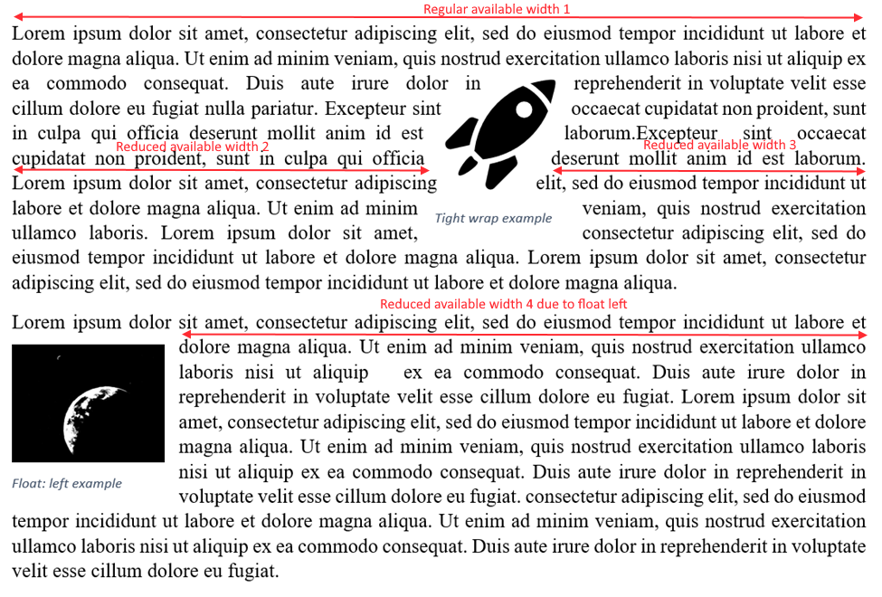

Formatted Text
=============
**Status**: explainer.

Formatted text API enables multi-line text rendering in canvas.

Canvas text rendering APIs fillText and strokeText are limited in that they do 
not support text wrapping also known as line breaking.

The complexity in breaking text into lines arises from several key things line 
breaking algorithms must do
* Identify grapheme clusters - Graphemes are character combinations (Diacritics,
  Ligatures) that result in a single glyph and hence should not be broken up.
  Eg: g (latin small letter G 0067) + ◌̈  (Combining diaeresis 0308) = g̈
* Identify break oppertunities based primarily on the Unicode Spec but also uses
  dictonaries for languages like Thai and French that dictate additional line 
  breaking rules.
* Handle Bidi text. For proper Bidi rendering the bidi level context needs to be 
  considered across lines.
* Text Shaping and Kerning that can affect measured pixel length of a line.

While Javascript libraries could perform line breaking this is an arduous task.
The browser already has a powerful line breaking, text shaping component used 
for regular HTML layout. Formatted text API surfaces this capability to the web 
platform for use in Canvas. 

Usage
-----

Consider a use case where the developer wants to render the text “the quick 
**brown** fox jumps over the lazy dog” into lines 350px wide. Inorder to enable 
this scenario we introduce two new objects TextRun, TextSequence and extend the 
canvas fillText/strokeText API to work with TextSequence.

The first problem here is in representing the bold formatting style.
Regular HTML uses markup elements to style parts of text. 
For a javascript API we split the text into TextRun segments that can be styled.

```js
const textSequence = new TextSequence([
    new TextRun("the quick"),
    new TextRun("brown", "bold"),
    new TextRun("fox jumps over the lazy dog")
]);
```

The TextSequence object now represents the text together with styling information.
Next in order to render the text into multiple lines, the canvas fillText API
takes a max width to wrap text at.

```js
var c = document.getElementById("myCanvas");
var ctx = c.getContext("2d");
ctx.fillText(textSequence, 0, 0, 350); 
```


Proposal
--------
```webidl
[Exposed=Window]
interface TextRun {
  constructor(DOMString text);
  constructor(DOMString text, DOMString font);
  constructor(DOMString text, DOMString font, DOMString fontColor);
  attribute DOMString text;
  attribute DOMString font;
  attribute DOMString fontColor;
  
  // Every run belongs to a text sequence, initially null and is set
  // when the run is added to a text sequence
  readonly attribute TextSequence? textSequence;
}

enum FormattedTextLineBreakOptions {
  "default",
  "ignoreTrailingSpaces"
};

interface TextSequence {
  constructor();  
  constructor(sequence<TextRun> runs);

  iterable<TextRun>;
  getter TextRun? (unsigned long index);
  setter void (unsigned long index, TextRun run);
  void append(TextRun run);
  void remove(unsigned long index);
  void removeAll();

  readonly attribute unsigned long length;
  attribute FormattedTextLineBreakOptions lineBreakOptions;
}

partial interface CanvasText {
    // Render entire TextSequence with line wrapping.
    void fillText(TextSequence text, double x, double y, double maxWidth, optional double lineSpacing);
    void strokeText(TextSequence text, double x, double y, , double maxWidth, optional double lineSpacing);
}
```

### Text Run
The TextRun object represents text content along with the text style overrides 
for the text. Developers would provide contiguous text with identical style as a
single run. The font, fontColor values when specified override the default values that would
be used normally from the canvas context [Text Styles](https://www.w3.org/TR/2dcontext/#text-styles).

The proposal avoids using indices to indicate styling ranges, as 
these indices change with text run insertion and deletion. 

CanvasTextDrawingStyles for a run does not depend on or apply on top of the
previous run. This is because in such a design removing a run from a text sequence
would have an undesirable ripple effect of changing styles on all subsequent runs.

### TextSequence
The TextSequence object represents a collection of text runs. Implementations can
use the TextSequence object to cache bidi level analysis results or the level stack
at the end of the last line.

The other text styles textAlign, textBaseline on the canvas context control 
justification and baseline alignment of the multiline text.

Advanced Usage
--------------

While the above proposal gets us a long way in adding multiline text support, it
is also concievable that developers will want fine grained positioning of lines 
and the available width used to break each line. 



Despite bidi rules, lines always contain contiguous range of characters, this allows
representing the text break position at the end of a line as single position within
the TextSequence.

Additional draw API overloads with a TextSequencePosition object allows for them
to return a continuation position for use in subsequent fillText, strokeText calls.

```webidl
partial interface TextSequence {
  TextSequencePosition BeginPosition();
}

interface TextSequencePosition {
  attribute TextRun textRun;
  attribute unsigned long length textRunOffset;
}

interface LineBreakResult {
  attribute TextSequencePosition? nextPosition;
  readonly attribute double actualBoundingBoxLeft;
  readonly attribute double actualBoundingBoxRight;
  readonly attribute double actualBoundingBoxAscent;
  readonly attribute double actualBoundingBoxDescent;
}

partial interface CanvasText {
    // Render a single line and return the start position to use for the next Line.
    LineBreakResult fillText(TextSequencePosition beginPosition, double x, double y, double maxWidth);
    LineBreakResult strokeText(TextSequencePosition beginPosition, double x, double y, double maxWidth);
}
```

The previous example can be modified as follows to exercise the new APIs

```js
var c = document.getElementById("myCanvas");
var ctx = c.getContext("2d");
var startPosition = textSequence.BeginPosition();
var y = 0;
while (startPosition) {
  var result = ctx.fillText(startPosition, 0, y, 350); 
  startPosition = result.nextPosition;
  y += (result.actualBoundingBoxAscent + result.actualBoundingBoxDescent);
} 
```

MeasureText
-----------

Measuring is a counter part to the drawing APIs that allow web developers to reason
about where lines would render before rendering them.

Current measure text APIs work for single line text as follows

```webidl
interface TextMetrics {
    // x-direction
    readonly attribute double width; // advance width
    readonly attribute FrozenArray<double> advances;
    readonly attribute double actualBoundingBoxLeft;
    readonly attribute double actualBoundingBoxRight;

    // y-direction
    readonly attribute double fontBoundingBoxAscent;
    readonly attribute double fontBoundingBoxDescent;
    readonly attribute double actualBoundingBoxAscent;
    readonly attribute double actualBoundingBoxDescent;
    readonly attribute double emHeightAscent;
    readonly attribute double emHeightDescent;
    Baselines getBaselines();
};

partial interface CanvasText {
  TextMetrics measureText(DOMString text);
};
```

In order to support multiline text metrics we add a variant of measure text

```webidl
interface MultilineTextMetrics {
  attribute TextSequencePosition? nextPosition;
}
MultilineTextMetrics includes TextMetrics;

partial interface CanvasText {
  MultilineTextMetrics measureText(TextSequencePosition beginPosition, double maxWidth);
};
```

### Open issues and questions

- Vertical Writing Modes - text drawing needs to be aware of vertical writing mode
in order to rotate glyphs in some fonts / languages while rendering a line. 
Topic needs further investigation.
- Measure API may require a way to identify grapheme clusters and thier position
within a line box, so that Caret and Selection can be rendered accurately.

Privacy Considerations
----------------------
HTML5 Canvas is a browser finger printing vector - [canvas fingerprinting](https://en.wikipedia.org/wiki/>Canvas_fingerprinting),
the fingerprinting happens through APIs (getImageData, toDataURL) that allow 
readback of renderer content exposing machine specific rendering artifacts. 
This proposal adds the ability to render multiple lines of text, potential 
differences in text wrapping across browsers could contribute to additional 
fingerprinting. The existing implementer mitigations in some user agents that 
prompt users on canvas readback continues to work here. 

We are currently evaluating whether this API would increase fingerprinting surface
area and will update this section with our findings. We welcome any community feedback.

References
----------

* https://docs.microsoft.com/en-us/dotnet/api/system.windows.media.formattedtext?view=netframework-4.8
* https://en.wikipedia.org/wiki/Grapheme
* https://en.wikipedia.org/wiki/Diacritic

