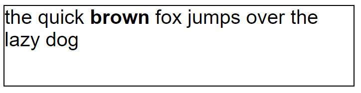
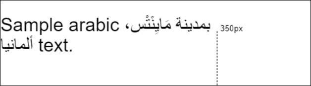

Formatted Text
=============

Authors:
 [sushraja-msft](https://github.com/sushraja-msft),
 [travisleithead](https://github.com/travisleithead)

## Status of this Document
This document is intended as a starting point for engaging the community and standards
bodies in developing collaborative solutions fit for standardization. As the solutions
to problems described in this document progress along the standards-track, we will
retain this document as an archive and use this section to keep the community up-to-date
with the most current standards venue and content location of future work and discussions.
* This document status: **Active**
* Expected venue: [W3C Web Incubator Community Group](https://wicg.io/)
* Current version: this document

## Introduction

Applications like word processors, spreadsheets, PDF viewers, etc., face a
choice when moving their legacy presentation algorithms to the web. The view layer of
these applications can be designed to output HTML, SVG or use Canvas. Canvas
is an expedient choice for some view models since it can easily present data models
where the view model and the data model are not tightly coupled. Additionally, the
Canvas APIs map well to the imperative APIs the legacy algorithms used for rendering
content.

In gaming and mixed reality (VR and AR) scenarios today, Canvas is the only logical
choice for presenting a rapidly-changing view.

In these scenarios, it is often necessary to present text to the user. The 2D Canvas
API currently provides a relatively simplistic text rendering capability: A single run
of text can be
[measured](https://developer.mozilla.org/en-US/docs/Web/API/CanvasRenderingContext2D/measureText)
and [rendered](https://developer.mozilla.org/en-US/docs/Web/API/CanvasRenderingContext2D/fillText)
**as a single line**, optionally compressed to fit
within a certain width. If the developer needs to present more than just a few words
(e.g., a paragraph of text) then things get very complicated very quickly. Some options
might include trying a hybrid approach of overlaying HTML elements with the Canvas to
leverage HTML's native text rendering and wrapping capabilities, or attempting to
write your own line breaking logic in JavaScript using the primitive Canvas text measuring
and rendering APIs as a starting point. Neither of these options are very desirable,
and the HTML hybrid approach may not be available depending on the scenario (e.g., in
VR headsets).

Why would a JavaScript implementation of line-breaking and wrapping be hard? While this
may seem trivial at first glance, there are a number of challenges especially for
applications that must be designed to handle rendering of text in multiple languages.
Consider the complexity involved in the following requirements for a robust line
breaking algorithm:

* Identify break opportunities between words or
  [Graphemes](https://en.wikipedia.org/wiki/Grapheme). Break opportunities are
  based primarily on the Unicode Spec but also use dictionaries for languages
  like Thai and French that dictate additional line breaking rules.
* Identify grapheme clusters. Graphemes are character combinations (such as
  [Diacritics](https://en.wikipedia.org/wiki/Diacritic) and
  [Ligatures](https://en.wikipedia.org/wiki/Orthographic_ligature)) that result
  in a single glyph and hence should not be broken up.
  E.g.: `g` (Latin small letter G 0067) + `◌̈ ` (Combining dieresis 0308) = `g̈`
* Handle Bidi text. For proper Bidi rendering the bidi level context needs to be
  considered across lines.
* Text Shaping and Kerning. These features can affect the measured pixel length
  of a line.

Javascript libraries could perform line breaking, but as noted above, this is
an arduous task. This gets more complicated if text with different formatting
characteristics (e.g., size, bold, italic) are needed. The browser already has
a powerful line breaking, text shaping component used for regular HTML layout.
Why not allow the Canvas API to leverage it? This is the feedback we've heard
from web developers who have struggled with implementing JavaScript-based
multiline text rendering APIs for Canvas. Adding this native capability to
Canvas would both dramatically simplify and improve the correctness and
performance of their code.

This proposal aims to make it easy for web developers to get correct and fast
multiline formatted text rendering functionality in Canvas, while preserving
the low-level flexibility for positioning text that is already present in the
existing Canvas API. It takes inspiration from
[related APIs](https://docs.microsoft.com/en-us/dotnet/framework/wpf/advanced/drawing-formatted-text)
as a starting point.

The proposal below introduces a Canvas formatted text API and shows how it can
be used for both simple and advanced use cases. During the design we considered
a number of [alternatives](#alternatives-considered) before landing on the current
proposal. We welcome your comments and suggestions; specifically note the
[list of open issues and questions](#open-issues-and-questions) below.

## Usage

Consider a use case where a web developer wants to render the text “the quick
**brown** fox jumps over the lazy dog” into a horizontal space 250px wide and have
the text wrap instead of compress-to-fit. In order to enable
this scenario, we introduce a new object `CanvasFormattedText` which will keep track
of all the formatted text. We also introduce two new formatted text drawing APIs onto
the canvas context: `strokeFormattedText` and `fillFormattedText`.

First we will consider how to represent the bolded text in the example above?
Regular HTML uses markup elements to style parts of text. For the 2d Canvas API
we split the text into "runs" and allow each run to have its own optional formatting:

```js
const c = document.getElementById( "myCanvas" );
const context = c.getContext( "2d" );

// Collect text into a CanvasFormattedText object
let formattedText = new CanvasFormattedText();
formattedText.appendRun( { text: "the quick " } );
formattedText.appendRun( { text: "brown", font: `bold ${ context.font }` } );
formattedText.appendRun( { text: " fox jumps over the lazy dog" } );
```

### CanvasFormattedText object

The `CanvasFormattedText` object represents a collection of text runs together with formatting
information.

The `appendRun` function takes an object with the following properties:
* `text` - required string - the text run itself
* `font` - optional string - unique font settings for this run (accepts the same values
    as the 2D context's `font` property).
* `color` - optional string - unique color values for this run (the string is parsed as
    a CSS `<color>` value).

The object provided to `appendRun` is a `CanvasFormattedTextRun` dictionary and represents text
content along with the fill/stroke style overrides for the text. Developers provide contiguous
text with identical style as a single run. The font and color values when specified override the
default values that would be used from the canvas context
[Text Styles](https://www.w3.org/TR/2dcontext/#text-styles).

The styles for a run do not depend on or apply on top of the previous run. If this were not the
case, removing or adding a text run would have an undesirable ripple effect of changing styles on
all subsequent runs.

Note: The proposal avoids using indices to indicate styling ranges, as these indices change with
text run insertion and deletion.

Next, to render the text into multiple lines, we use the new `fillFormattedText` API
which takes a max width to wrap the text at.

```js
context.font = "18pt Arial";
context.fillFormattedText( formattedText, /*x*/0, /*y*/50, /*wrapWidth*/250 );
```

This would produce the following output on the canvas:



### Bidi Text

No additional work is needed from web developers to support bidi text.
Implementations will perform bidi analysis on the `CanvasFormattedText`'s text runs
and create internal bidi runs if necessary. An example demonstrating bidi text follows:

```js
const context = document.getElementById( "myCanvas" ).getContext( "2d" );
context.font = "30px Arial";
let canvasFormattedText = new CanvasFormattedText();
canvasFormattedText.appendRun( { text: "Sample arabic بمدينة مَايِنْتْس، ألمانيا text." } );
context.fillFormattedText( canvasFormattedText, /*x*/0, /*y*/30, /*wrapWidth*/350 );
```

produces the following output on the canvas:



### Pre-existing text controls

The other text styles `textAlign`, `textBaseline` on the canvas context control justification
and baseline alignment of the multiline text relative to provided x/y coordinates.

CSS styles on the canvas element affect text rendering. These CSS properties are

- `line-height` - Specifies height of a line.
- `direction` - Sets the initial direction for bidi analysis.
- `word-break` / `word-wrap` - Controls break opportunities for text wrapping.


## Advanced Usage

While the single shot `fillFormattedText` and `strokeFormattedText` APIs gets us a
long way in adding text wrapping support, it is also conceivable that developers will
want to render text one line at a time. This offers advanced control over both position
and available width used for each line. Additionally, rendering text one line at a time
also provides developers the flexibility to render only the content visible onscreen or
content that changed.

To render one line at a time, we need to introduce a few additional objects and concepts.
First of all, we need to be able to indicate what portion of the aggregate `CanvasFormattedText`
text runs we need to render on each separate line, and we need to be able to specify a maxium
width to render them into (which can change from line to line). The API is designed to allow
an iterative approach to line rendering, but is also flexible enough to allow for many other
scenarios.

### Position objects

In both bidi and regular text scenarios lines always contain a contiguous range
of characters from the source text. The position at which to start the next line
can be represented with an offset in that text.

To indicate a position to begin rendering a text run, we define a position object that has three
components:
1. `formattedText` - required `CanvasFormattedText` reference - the container to which this
    position object belongs.
2. `textRunIndex` - required number - the index of a text run object contained by the
    `CanvasFormattedText` (e.g., the object associated with the text run "the quick " in
    the example above.
3. `textRunOffset` - required number - the offset into the text run value itself. For example:
    a `2` would indicate a position starting at the "e" in the string "the quick".

For convenience, one of these objects (a `CanvasFormattedTextPosition` dictionary) can be obtained
from the `CanvasFormattedText` using the `beginPosition()` function.

We use the position object to indicate the starting position within the `CanvasFormattedText`
object from which we'd like to start rendering a line. But, where should the ending position be?
Rather than try to guess or iteratively test, we can have the API figure this out for us. All it
needs to know is how much space we'd like to allocate for the line.

### CanvasFormattedTextLine object

The desired width of the line and the starting position is provided to the `measureFormattedText`
function, a new formatted text measurement API on the canvas context. It returns a
`CanvasFormattedTextLine` object that is ready for rendering and contains some other helpful
information packed into it. To render the line to the canvas we introduce `fillFormattedTextLine`
and `strokeFormattedTextLine` which conveniently take a `CanvasFormattedTextLine` object and an x/y
coordinate where the text should be rendered to the canvas. The `CanvasFormattedTextLine` keeps the
line state (such as the desired width) so that only the location where the line should be rendered
is needed when it comes time to draw.

Each `CanvasFormattedTextLine` provides a `nextPosition()` function that returns a position object
for where the next line should start from in the case that there is more text to render from the
`CanvasFormattedText` object. If the line represents the last line of text to render, then
`nextPosition` returns `null`.

Here's an example that shows how these objects relate to each other, illustrating the use of
`fillFormattedTextLine` to render each line of our first example.

```js
const context = document.getElementById("myCanvas").getContext("2d");

// Collect text into a CanvasFormattedText object
let formattedText = new CanvasFormattedText();
formattedText.appendRun( { text: "the quick " } );
formattedText.appendRun( { text: "brown", font: `bold ${context.font}` } );
formattedText.appendRun( { text: " fox jumps over the lazy dog" } );

let startPosition = formattedText.beginPosition();
while ( startPosition ) {
  let currentLineObject = context.measureFormattedText( startPosition, /*wrapWidth*/250 );
  context.fillFormattedTextLine( currentLineObject, /*x*/0, y );
  startPosition = currentLineObject.nextPosition();
  y += (currentLineObject.height);
}
```

We can use this additional flexibility to adjust each line's width and position to accomodate
any other objects being presented to the canvas. In this example, we adjust the lines to wrap
around an image.

```js
const context = document.getElementById("target").getContext("2d");
// Grab a previously loaded  element to render on the canvas.
const image = document.getElementById("myImg");

let sampleString = "Lorem ipsum dolor sit amet, consectetur adipiscing elit, sed do eiusmod tempor incididunt ut labore et dolore magna aliqua. Mi proin sed libero enim sed faucibus turpis. Sed augue lacus viverra vitae. Adipiscing tristique risus nec feugiat. Odio facilisis mauris sit amet massa. Non arcu risus quis varius quam quisque id diam vel. Scelerisque varius morbi enim nunc faucibus a pellentesque sit amet. Lectus proin nibh nisl condimentum. Eget mauris pharetra et ultrices neque ornare aenean euismod elementum. Eget magna fermentum iaculis eu non. Id aliquet risus feugiat in ante. Gravida in fermentum et sollicitudin ac. ";

// Draw the image on the top left of the canvas.
let x = 0, y = 0;
// Define margins around the image.
let topLeftMargin = 10, bottomRightMargin = 10;
context.drawImage( image, topLeftMargin + x, topLeftMargin + y );

// Setup the formatted text object.
let formattedText = new CanvasFormattedText();
formattedText.appendRun( { text: sampleString } );

const fontHeight = 20;
context.font = `${ fontHeight }px Arial`;

// Draw each line adjusting available width if there is an image on the
// left that reduces the available width.
const maxWidth = context.canvas.width - bottomRightMargin;
y += fontHeight;
let lineStartPosition = formattedText.beginPosition();
do {
  // Determine x position.
  if ( y <= ( topLeftMargin + image.height + bottomRightMargin ) ) {
    x = topLeftMargin + image.width + bottomRightMargin;
  }
  else {
    x = topLeftMargin;
  }
  let line = context.measureFormattedText( lineStartPosition, maxWidth - x );
  context.fillFormattedTextLine( line, x, y );
  y += line.height;
  lineStartPosition = line.nextPosition();
} while ( lineStartPosition );

```

This would produce the following output on the canvas


The separation of measuring to obtain a `CanvasFormattedTextLine` object and the request to
draw the line using `fillFormattedTextLine` or `strokeFormattedTextLine` allows for a
useful scenario in adjusting line separation; `CanvasFormattedTextLine` objects can be collected
and used to sum the total height needed to render all the lines allowing the developer to
distribute the line-spacing as desired.

Additional `TextMetrics` info can be obtained from each `CanvasFormattedTextLine` object by iterating
over the `lineSegments` array. A "line segment" is either:
1. The same as the developer-provided text run, or;
2. Part of the developer-provided text run which can happen when the line wrapped in the middle
   of a text run, or when text with different bidi characteristics are encountered
   (e.g., RTL inside of LTR text).

Line segment objects have 4 properties:
* `beginPosition` - a reference to the text run and offset where this segment starts
* `endPosition` - a reference to the text run and offset where this segment ends
* `isRTL` - a boolean indicating if the segment's text is right-to-left rendered
* `textMetrics` - a reference to the existing canvas `TextMetrics` object for this segment.

Segment information can be helpful when desiring to simulate cursor movement over a line or to
draw backgrounds, underlines, borders, etc., with the combination of the `isRTL` value and
proposed `TextMetrics`'s `advances` (see related issues
[3994](https://github.com/whatwg/html/issues/3994),
[4030](https://github.com/whatwg/html/issues/4030), and
[4034](https://github.com/whatwg/html/issues/4034))

## WebIDL details

```webidl

// Extends the existing CanvasText mixin interface, which is included in:
// * CanvasRenderingContext2D
// * OffscreenCanvasRenderingContext2D
// (notably not included in PaintRenderingContext2D;
//  see :https://drafts.css-houdini.org/css-paint-api-1/#2d-rendering-context)
partial interface CanvasText {
    // Render entire CanvasFormattedText with line wrapping (one-shot)
    void fillFormattedText(CanvasFormattedText formattedText,
                          double x,
                          double y,
                          double wrapWidth);
    void strokeFormattedText(CanvasFormattedText formattedText,
                            double x,
                            double y,
                            double wrapWidth);

    // Line-at-a-time text measurement
    CanvasFormattedTextLine measureFormattedText(CanvasFormattedTextPosition textPosition,
                                                double wrapWidth);

    // Line-at-a-time text rendering (given a previously measured line).
    void fillFormattedTextLine(CanvasFormattedTextLine line,
                              double x,
                              double y);
    void strokeFormattedTextLine(CanvasFormattedTextLine line,
                                double x,
                                double y);
};


[Exposed=Window,Worker]
interface CanvasFormattedText {
  constructor();

  CanvasFormattedTextPosition beginPosition();
  getter CanvasFormattedTextRun getRun(unsigned long index);
  CanvasFormattedTextRun appendRun(CanvasFormattedTextRun newRun);

  readonly attribute unsigned long length;
};


dictionary CanvasFormattedTextRun {
  required DOMString text;
  DOMString font;
  DOMString color;
};


dictionary CanvasFormattedTextPosition {
  required CanvasFormattedText formattedText;
  required unsigned long textRunIndex;
  required unsigned long textRunOffset;
};


// Returned exclusively from measureFormattedText()
[Exposed=Window,Worker]
interface CanvasFormattedTextLine {
  readonly attribute double height;
  readonly attribute double width;
  CanvasFormattedTextPosition? nextPosition();
  readonly attribute FrozenArray<CanvasFormattedTextLineSegment> lineSegments;
};


dictionary CanvasFormattedTextLineSegment {
  required CanvasFormattedTextPosition beginPosition;
  required CanvasFormattedTextPosition endPosition;
  required boolean isRTL;
  required TextMetrics textMetrics;
};
```

## Open issues and questions

* Vertical Writing Modes - text drawing needs to be aware of vertical writing mode
  to rotate glyphs in some fonts / languages while rendering a line. The topic needs
  further investigation.
* Should `fillFormattedText` (the single shot API) return the total height consumed
  after drawing lines?
* Additional investigation needed to understand white space collapsing behavior like
  collapsing trailing or leading whitespaces around a line break. If there is no
  standard behavior, options for controlling it may need to be exposed on the
  `CanvasFormattedText` object.
* Should the word break positions be exposed in the `CanvasFormattedTextLineSegment`
  in order to help with accessibility?
* A variety of additional text justification and hyphenation features are available in
  HTML. Are there important use-cases for including these features?
* WebIDL-specific ideas:
   * Recommend adding a constructor overload of `CanvasFormattedText` that takes a list
     of `CanvasFormattedTextRun` objects, e.g.,
     `constructor( sequence<CanvasFormattedTextRun> formattedRunsInit );`
   * Recommend renaming 'appendRun' to 'addRun' to match Path2D:addPath() nomenclature;
   * Recommend returning CanvasFormattedText object [this] from 'appendRun' to allow
      chaining calls together...
   * Recommend making `CanvasFormattedText` object an iterable, e.g.,
      `iterable<CanvasFormattedTextRun>;`
   * Recommend dropping the 'getRun' function name (getter is probably good enough)
   * `CanvasFormattedTextRun`:`color` could be named "style" to more closely match
      related stroke/fillStyle. Will patterns and gradients work here too?
   * `CanvasFormattedTextLine` has `width` and `height`, might also benefit from
      additional TextMetrics interface methods: `actualBoundingBoxLeft` (and Right,
      Ascent, Descent) properties.

## Alternatives Considered

### Imperative model
The proposal here addresses two separate problems. One of styling ranges of text
and having an object model and two of auto wrapping text.

An alternative design considered was to support auto wrapping without requiring
that the developer provides all the text upfront. Similar to canvas path, the
developer would call `setTextWrapWidth( availableWidth )` and follow through with
multiple calls to `fillText` on the canvas context that renders text and advances
a cursor forward.

Such an imperative style API was not pursued for two reasons. With bidi text, the
entire width of a right-to-left segment needs to be determined before any of the
`fillText` calls can be rendered. This issue can be addressed by adding a finalization
step say `finalizeFillText()`. However still, such an imperative API adds a performance
cost in terms of recreating the formatted text when the developer is simply trying to
redraw the same text content for a changing available width.

## Accessibility Considerations

Making the Canvas accessible is a persistant challenge for the web today. Several
efforts are underway, including a
[promising solution](https://github.com/WICG/aom/blob/gh-pages/explainer.md#use-case-4-adding-non-dom-nodes-virtual-nodes-to-the-accessibility-tree)
as part of the Accessible Object Model (AOM) family of proposals.

Meanwhile, web developers are encouraged to use the canvas element's fallback content
to provide HTML markup that describes the canvas' current state. For text used as part
of this API proposal, the complete source text of the `CanvasFormattedText` should be
placed in block-styled
[flow content](https://html.spec.whatwg.org/multipage/dom.html#flow-content-2) (such
as a `<p>` element), with formatted sections wrapped in appropriate
[phrasing content](https://html.spec.whatwg.org/multipage/dom.html#phrasing-content-2)
(such as `<span>` and styled to match the `CanvasFormattedTextRun` formatting.) The
markup should make use of
[ARIA Live Regions](https://developer.mozilla.org/en-US/docs/Web/Accessibility/ARIA/ARIA_Live_Regions)
to be sure assistive technologies (ATs) pickup and announce any dynamic changes.

Looking generally at what low-level features are necessary to make text fully accessible
to an AT (which may become future requirements for canvas) we envision the following needs
(partially met by this proposal):

* Word bounds/breaks - used to support "navigate by word" AT features. Break opportunities
  (in HTML) are calculated as part of layout, and as part of the `fillFormattedText`,
  `strokeFormattedText` and `measureFormattedText` APIs to find where line breaks will be
  possible. However, the meta-data about these break opportunities are not exposed to the
  developer (as noted in open issues).
* Character bounds - used by ATs for character-by-character navigation. The
  `CanvasFormattedTextLineSegment` surfaces `TextMetrics` that will include an `advances`
  array of positions used to describe character bounds.
* Format boundaries - provide opportunities for the AT to optionally add emphasis or
  pass over certain runs of text. The developer has already separated ranges of
  similarly-formatted runs of text into `CanvasFormattedTextRun`s which can be iterated at
  any time to calculate the offset positions to meet this requirement.

We are interested in hearing about additional community feedback related to accessibility
and thoughts on the related open issues.

## Privacy Considerations

HTML5 canvas is a browser finger printing vector
(see [canvas fingerprinting](https://en.wikipedia.org/wiki/>Canvas_fingerprinting)).
Fingerprinting happens through APIs `getImageData`, `toDataURL`, etc. that allow
readback of renderer content exposing machine specific rendering artifacts.
This proposal adds the ability to render multiple lines of text, potential
differences in text wrapping across browsers could contribute to additional
fingerprinting. The existing implementer mitigations in some user agents that
prompt users on canvas readback continues to work here.

We are currently evaluating whether this API would increase fingerprinting surface
area and will update this section with our findings. We welcome any community feedback.
