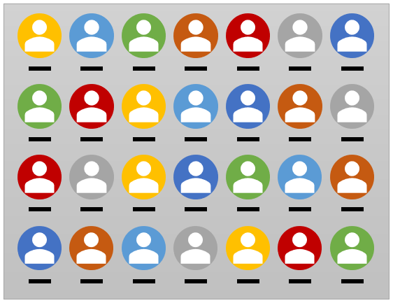

# Set and Reset Clip()

Authors:
 [sushraja-msft](https://github.com/sushraja-msft),
 [travisleithead](https://github.com/travisleithead)
 
## Status of this Document
This document is a starting point for engaging the community and standards
bodies in developing collaborative solutions fit for standardization. As the solutions
to problems described in this document progress along the standards-track, we will
retain this document as an archive and use this section to keep the community up-to-date
with the most current standards venue and content location of future work and discussions.
* This document status: **Active**
* Expected venue: [W3C Web Incubator Community Group](https://wicg.io/)
* Current version: this document

## Background

Canvas 2d contexts support the ability to create clipping regions via the `context.clip()` API. 
Once a clipping region is set on the canvas, subsequent drawing commands only render the 
intersection of the drawing command's region with that of the clipping region. If an existing
clipping region is set, calling `clip()` again will result in a clipping region that is the 
intersection of the last clipping region with the requested region. 
[[see spec](https://html.spec.whatwg.org/multipage/canvas.html#dom-context-2d-clip)]

## Clipping Concerns

Four areas of concern illustrate the use cases and context for our proposal.

### Animation loops

When using `clip()` in an animation loop (e.g., via a `requestAnimationFrame` callback), say
to spotlight a main character, developers will quickly realize that the "current clipping region"
exhibits the somewhat unexpected intersection-with-previous-clip behavior. If the center of
attention is moving, the clip region intersection behavior quickly results in an empty clipping
region in which everything is getting clipped:

```js
let spot = { x: 50, y: 50 };
function animationFrameCallback() {
   context.clearRect( 0, 0, canvas.width, canvas.height );
   let spotlight = new Path2D();
   spotlight.arc( spot.x, spot.y, /*...*/ );
   context.clip( spotlight ); // Create a circle clipping region centered at 'spot'
   
   // Draw main character here...
   
   // Move the spotlight to the right
   spot.x++
   
   requestAnimationFrame( animationFrameCallback );
}
```

At this point, the developer will naturally check the documentation for a way to reset the clipping
region, but won't be able to find such an API because it doesn't exist. Eventually, they may stumble
upon the [unintuitive workaround](https://stackoverflow.com/questions/25282793/how-to-remove-the-clip-of-a-region-in-html-5-canvas) for this limitation.

Note, this use case is another argument for adding a 
[`clear()` API](https://github.com/fserb/canvas2D/blob/master/spec/clear.md) to the Canvas,
where `clear()` would include clearing the current clipping region.

### Multiple clips

In many scenarios, in order to render the desired effect, multiple clipping regions (that do not 
intersect) are needed. For example, imagine rendering a series of contacts, where each contact image 
is clipped to a particular shape.


The desired result is a grid of images.



The natural approach to rendering this grid involves writing a few loops and processing each 
contact image's clip and drawing logic within the nested loop body. However, if done sequentially 
in that way, none of the images beyond the first one would render because of the cumulative 
nature of `clip()`.

Fortunately, since clipping regions are based on paths, and because paths can have independent 
sub-paths (e.g., `path.rect()` and `path.arc()` both create independent sub-paths of `path`), it
is possible to create a single path to use as a clipping region that can address this use case.
Unfortunately, the result leads to a poor design pattern: the forced separation of the logic 
that sets up the clipping region from the logic that performs the drawing after the clipping
region is established:

```js
// draw background and labels
// ...

// setup clipping path (with sub-paths for each contact image)
let comboClipRegion = new Path2D();
for ( let row = 0; row < 4; row++ ) {
   for ( let col = 0; col < 7; col++ ) {
      comboClipRegion.arc( col * WIDTHSPACING, row * HEIGHTSPACING, /*...*/ );
   }
}
// Set the clip region
context.clip( comboClipRegion );
// Draw the contact images into the "holes" provided by the current clipping region
for ( let row = 0; row < 4; row++ ) {
   for ( let col = 0; col < 7; col++ ) {
      context.drawImage( getImg( col, row ), col * WIDTHSPACING, row * HEIGHTSPACING, /*...*/ );
   }
}
```

### Performance

The current clipping region is one of the features managed by the canvas's 
[drawing state](https://html.spec.whatwg.org/multipage/canvas.html#the-canvas-state). This makes 
it possible to workaround the previous two concerns by pushing a "clean" canvas state onto the
stack of drawing states using `context.save()` before setting the clipping region, performing related
drawing instructions, and then popping off the state using `context.restore()` to 
discard or "reset" the clipping region. This is the state-of-the-art in managing
clipping regions, but it has a few potential drawbacks:

1. It may not be clear where in code to place the `save()` and `restore()` points.
2. Managing clipping state with `save()` and `restore()` could interfere with other drawing
    state that is managed by the stack of drawing states, such as the current transform, 
    associated fill or stroke styles, the global alpha, shadows, etc.
3. The current path is not one of the things managed by the stack of drawing state. Care must
    be taken when using `clip()` against the current path and assuming that `restore()` will
    also reset the current path to what it was prior to a `save()`. 
3. Excessive use of `save()` and `restore()` can be a performance bottleneck, since these APIs 
   must store and assign a copy of **all** of the related drawing states-- not just the clipping path.

### API Consistency

The behavior of the clipping region is very similar to how the canvas' transformation matrix works, as both:

* are managed by the drawing state (with `save()` and `restore()`).
* have a way to set their state (e.g., for transformation matrices `transform(a,b,c,d,e,f)`).
* apply cumulative behavior when adjusted sequentially (e.g., `clip()` followed by
   `clip()` again, as described previously. For transformation matrices: `scale()` then `rotate()`, 
   etc.)
   
However, the current transformation matrix enjoys some special benefits, that we would like to
bring to clipping regions.

* `setTransform()` allows the current transformation matrix to be overwritten with a completely
    new transformation matrix-- notably without applying any cumulative effects.
* `resetTransform()` allows the current transformation matrix to be set back to its initial state
    (the identity matrix).
    
Given the previous concerns around clipping regions, and the API disparity between clipping regions
and transformation matrices, it seems prudent to add the obviously-missing clipping region APIs 
proposed below.

## Proposal

Following the established pattern set by the canvas transformation matrix APIs, we propose the
following:

### setClip()

`setClip()` replaces the current clipping region on the canvas context with whatever is the 
current path
(the [current default path](https://html.spec.whatwg.org/multipage/canvas.html#current-default-path)).

```js
context.rect( 0, 0, 100, 50 );
context.clip();
context.beginPath();
context.rect( 50, 0, 100, 50 );
context.setClip(); // The current clip is the last rectangle ('clip()' here would yield a square).
```

`setClip()` supports replacing the current clipping region with an explicitly provided 
path object:

```js
let path = new Path2D();
path.rect( 0, 0, 100, 50 );
context.setClip( path );
```

As with transforms, `restore()` will restore the clipping region to the state it was in at the point 
of calling `save()`.

### resetClip()

`resetClip()` puts the clipping region back in the state it was in when the context was initialized.
From the spec: "set to the largest infinite surface (i.e. by default, no clipping occurs)".

## Examples

Using our proposed APIs, we can re-write the animation example from earlier:

```js
let spot = { x: 50, y: 50 };
function animationFrameCallback() {
   context.clearRect( 0, 0, canvas.width, canvas.height );
   context.resetClip(); // Tada! Perfect.
   let spotlight = new Path2D();
   spotlight.arc( spot.x, spot.y, /*...*/ );
   context.clip( spotlight ); // Create a circle clipping region centered at 'spot'
   
   // Draw main character here...
   
   // Move the spotlight to the right
   spot.x++
   
   requestAnimationFrame( animationFrameCallback );
}
```

We can also make our contact list grid code more efficient by eliminating 
an entire double "for" loop:

```js
// draw background and labels

// Draw the photos with individual clipping regions
for ( let row = 0; row < 4; row++ ) {
   for ( let col = 0; col < 7; col++ ) {
      context.beginPath();
      context.arc( col * WIDTHSPACING, row * HEIGHTSPACING, /*...*/ );
      context.setClip();
      context.drawImage( getImg( col, row ), col * WIDTHSPACING, row * HEIGHTSPACING, /*...*/ );
   }
}
// Reset the clip region for whatever comes next
context.resetClip();
```

In performance-sensitive applications that need to selectively manage a clipping region,
this can be done without the overhead of `save()` and `restore()` pairs.

## Formal Definition

A more formal definition, highlighting that the CanvasFillRule will still be respected in
both usages of `setClip()`:

```webidl
interface mixin CanvasDrawPath {
  void setClip(optional CanvasFillRule fillRule = "nonzero");
  void setClip(Path2D path, optional CanvasFillRule fillRule = "nonzero");
  void resetClip();
};
```

## Alternatives considered

* None

## Privacy Considerations

We do not expect this API to introduce additional fingerprinting capabilities or other privacy
concerns, but we welcome community feedback.
