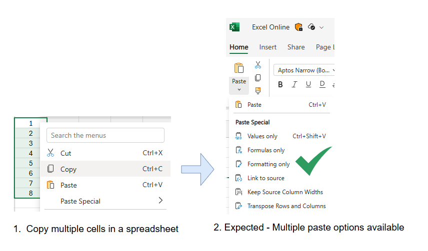
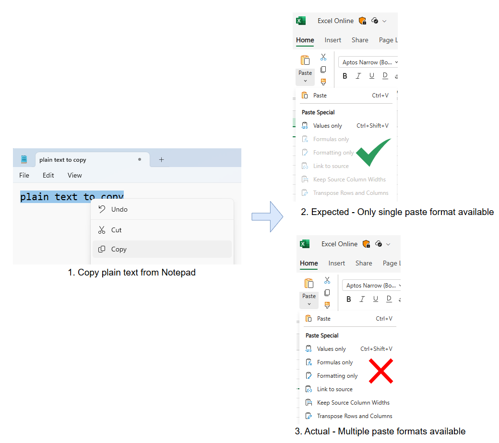
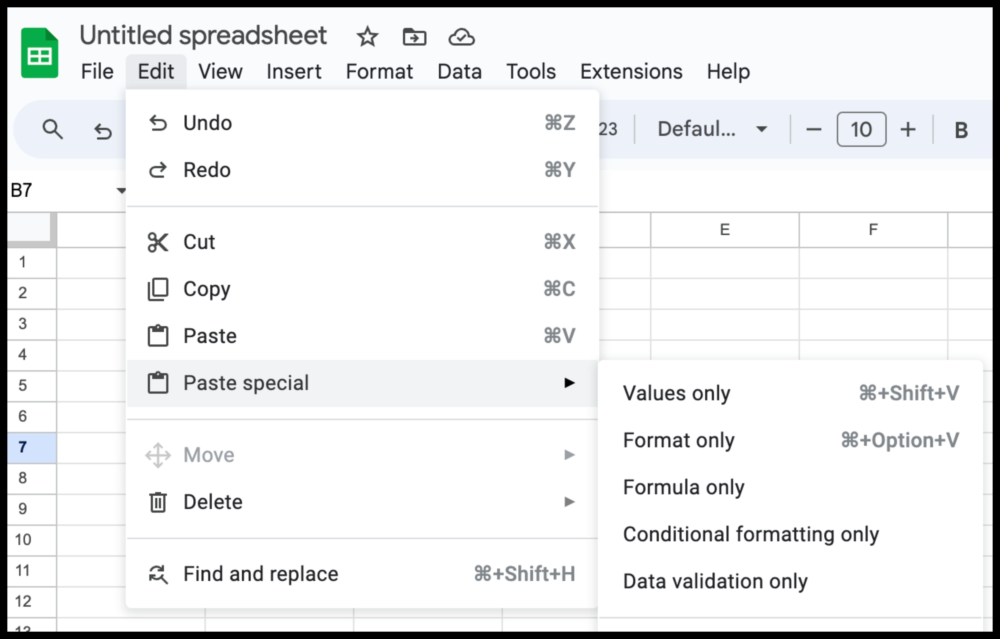
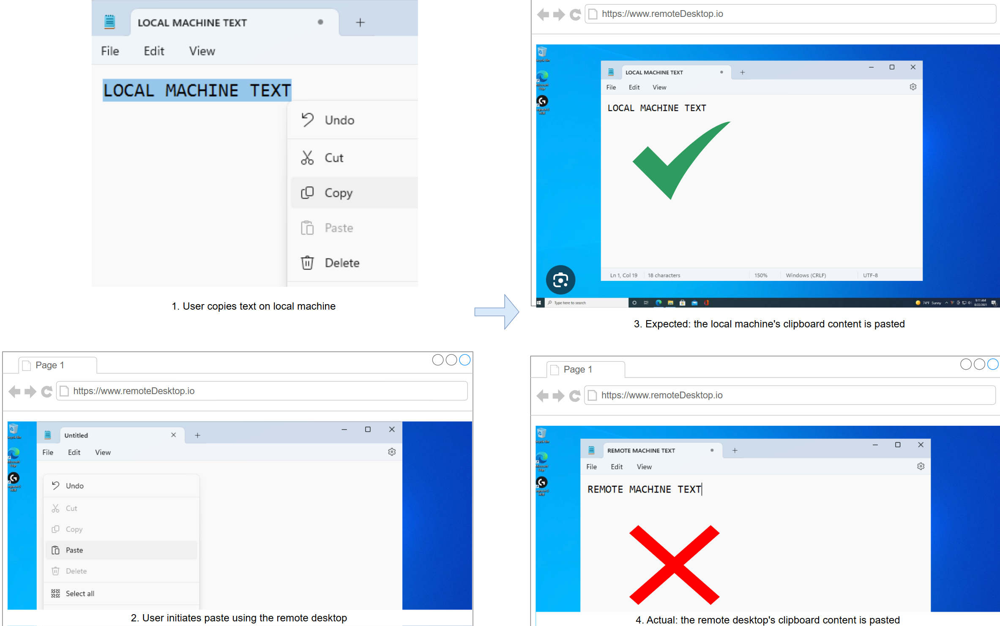
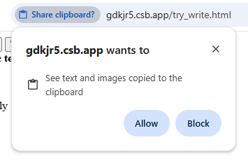
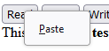

# clipboardchange event API explainer

## Authors:
- Rohan Raja (roraja@microsoft.com)

## Participate
Feature request: [Async Clipboard: Add support for 'clipboardchange' event [41442253] - Chromium](https://issues.chromium.org/issues/41442253)
Spec: [Clipboard API and events (w3.org)](https://www.w3.org/TR/clipboard-apis/#clipboard-event-clipboardchange)
Storage Standard: [Storage Standard (WHATWG)](https://storage.spec.whatwg.org/)

## Table of Contents

<!-- START doctoc generated TOC please keep comment here to allow auto update -->
<!-- DON'T EDIT THIS SECTION, INSTEAD RE-RUN doctoc TO UPDATE -->

- [1. Introduction](#1-introduction)
- [2. User scenarios](#2-user-scenarios)
  - [2.1 Scenario: Show available paste formats in web based editors](#21-scenario-show-available-paste-formats-in-web-based-editors)
    - [2.2.1 Copy multiple cells should show multiple paste options in Excel online](#221-copy-multiple-cells-should-show-multiple-paste-options-in-excel-online)
    - [2.2.2 Copy plain text should show only single paste option in Excel online](#222-copy-plain-text-should-show-only-single-paste-option-in-excel-online)
    - [2.2.3 Multiple paste options in Google sheets](#223-multiple-paste-options-in-google-sheets)
  - [2.2 Scenario: Sync clipboard with a remote desktop](#22-scenario-sync-clipboard-with-a-remote-desktop)
- [3. Motivation - Alternative to inefficient polling of clipboard](#3-motivation---alternative-to-inefficient-polling-of-clipboard)
- [4. Proposed Approach](#4-proposed-approach)
  - [4.1 Proposed IDL and example javascript code:](#41-proposed-idl-and-example-javascript-code)
    - [4.1.1 IDL changes](#411-idl-changes)
    - [4.1.2 Sample JS code](#412-sample-js-code)
  - [4.2 Clipboard data types and changeId - Available in event payload](#42-clipboard-data-types-and-changeid---available-in-event-payload)
  - [4.3 Clipboard contents - Not available in event payload](#43-clipboard-contents---not-available-in-event-payload)
  - [4.4 Permissions and Interop - Sticky activation required](#44-permissions-and-interop---sticky-activation-required)
      - [Pros](#pros)
  - [4.5 Page focus requirement](#45-page-focus-requirement)
  - [4.6 Multi-window deduplication with changeId](#46-multi-window-deduplication-with-changeid)
  - [4.7 Event bubble up and cancellation](#47-event-bubble-up-and-cancellation)
- [5 Alternatives considered](#5-alternatives-considered)
  - [5.1 Transient user activation requirement](#51-transient-user-activation-requirement)
      - [Pros:](#pros)
      - [Cons:](#cons)
  - [5.2 API Signature alternate: Use DataTransfer object of ClipboardEvent class](#52-api-signature-alternate-use-datatransfer-object-of-clipboardevent-class)
- [6 Appendix](#6-appendix)
  - [6.1 APIs provided by all OS to listen to clipboardchange event:](#61-apis-provided-by-all-os-to-listen-to-clipboardchange-event)
  - [6.2 Permission prompt mechanism in various browsers](#62-permission-prompt-mechanism-in-various-browsers)
  - [6.3 Reading clipboard contents within the clipboardchange event handler](#63-reading-clipboard-contents-within-the-clipboardchange-event-handler)
  - [6.4 Custom clipboard data types and clipboardchange event](#64-custom-clipboard-data-types-and-clipboardchange-event)
  - [6.5 Storage shelf-based changeId behavior](#65-storage-shelf-based-changeid-behavior)
- [7 Open issues](#7-open-issues)
  - [7.1 Fencedframe](#71-fencedframe)
- [8 References & acknowledgements](#8-references--acknowledgements)

<!-- END doctoc generated TOC please keep comment here to allow auto update -->

## 1. Introduction

The `clipboardchange` event aims to provide an efficient and secure way of notifying web applications about changes to the system clipboard. This allows web applications to provide rich user experiences like dynamic contextual menu options based on available clipboard [MIME types](https://mimesniff.spec.whatwg.org/#mime-type) and ability to efficiently sync clipboard in web based virtual desktop clients.

Today, this can be achieved in Chromium by calling async clipboard read API in a polling approach (assuming clipboard-read permissions are granted) which is obviously inefficient. Also, polling is not feasible on [Firefox](https://developer.mozilla.org/en-US/docs/Web/API/Clipboard_API) and [Safari](https://webkit.org/blog/10855/async-clipboard-api/) as these browsers rely on combination of [user activation](https://html.spec.whatwg.org/multipage/interaction.html#activation) and user gesture for reading clipboard through async API.

Hence `clipboardchange` event is being proposed. This event will be fired, in a secure manner by firing only when document is in focus and requiring that clipboard contents are not part of this event.

## 2. User scenarios

### 2.1 Scenario: Show available paste formats in web based editors
Web-based editors like Word Online, Excel Online, Google Sheets, and similar applications support paste operations in multiple formats, such as CSV, images, HTML, and plain text. These editors may have separate paste functionality depending on the data type which is pasted, hence the web UI might have different paste buttons for each data type. The clipboard change event can be used to detect the change in available formats in clipboard and reflect the same on the UI as soon as it is changed.

**Example scenario with clipboardchange event**: Imagine a user working on a report in Word Online. They copy a table from Excel, which is available in multiple formats: plain text, HTML, and CSV. As soon as the user copies the table, the `clipboardchange` event fires, and Word Online's UI updates to show buttons for "Paste as Text," "Paste as HTML," and "Paste as CSV." The user can then choose the most suitable format for their report with a single click, streamlining their workflow. 

**Scenario without clipboardchange event**: If the user copies plain text then without clipboardchange notification, the web page would continue showing the "Paste as HTML" and "Paste as image" options. Clicking on "Paste as image" would require the web page to show some kind of error message. This unnecessary error scenario can be avoided by monitoring the clipboard and disabling the un-needed data type buttons upon clipboard change, which would prevent user clicking the invalid type button in the first place.

#### 2.2.1 Copy multiple cells should show multiple paste options in Excel online


#### 2.2.2 Copy plain text should show only single paste option in Excel online


#### 2.2.3 Multiple paste options in Google sheets


### 2.2 Scenario: Sync clipboard with a remote desktop
When a user copies text or an image on their local machine, a web-based remote desktop application can detect that clipboard contents have changed by listening for the `clipboardchange` event. Upon detecting the change (which happens when 'clipboardchange' event is triggered on the web app when the page regains focus), the application can re-read the clipboard and send the updated clipboard content to the remote desktop environment.




## 3. Motivation - Alternative to inefficient polling of clipboard
Today, a web-app can monitor the system clipboard by polling and reading the clipboard through [async clipboard API](https://w3c.github.io/clipboard-apis/#async-clipboard-api) at regular intervals. However, polling is not efficient. Moreover, browsers like Firefox and Safari [require user gesture](#63-reading-clipboard-contents-within-the-clipboardchange-event-handler) for reading clipboard which makes polling infeasible in those browsers. This feature aims to introduce an efficient way of notifying web apps when clipboard changes which works in all browsers.
Additionally we must ensure that we monitor the clipboard only when absolutely required, that is, there is at least one document having required permissions and is listening to the clipboard change event. This will be described in design details.

## 4. Proposed Approach

### 4.1 Proposed IDL and example javascript code:

#### 4.1.1 IDL changes
```typescript
dictionary ClipboardChangeEventInit : EventInit {
  sequence<DOMString> types = [];
  bigint changeId;
};

interface ClipboardChangeEvent : Event {
  constructor(DOMString type, optional ClipboardChangeEventInit eventInitDict = {});
  readonly attribute FrozenArray<DOMString> types;
  readonly attribute bigint changeId;
};
```

#### 4.1.2 Sample JS code
```javascript
  // For applications with multiple windows, track processed change IDs to avoid duplication
  const processedChangeIds = new Set();

  // Event handler for clipboardchange event which contains the data types present in clipboard
  function onClipboardChanged(event) {
    // Check if this clipboard change has already been processed by another window
    if (processedChangeIds.has(event.changeId)) {
      console.log('Clipboard change already processed by another window');
      return;
    }
    
    // Mark this change as processed
    processedChangeIds.add(event.changeId);
    
    // Update UI based on available clipboard types
    document.getElementById("text_paste_button").disabled = !(event.types.includes('text/plain'));
    document.getElementById("html_paste_button").disabled = !(event.types.includes('text/html'));
    document.getElementById("png_paste_button").disabled = !(event.types.includes('image/png'));
    
    console.log(`Clipboard changed with ID: ${event.changeId}, available types: ${event.types}`);
  }

  navigator.clipboard.addEventListener("clipboardchange", onClipboardChanged);
```

A sample web application which demonstrates the usage of "clipboardchange" event for showing available paste formats for rich web editors [Scenario 2.2](#21-scenario-show-available-paste-formats-in-web-based-editors) can be found [here](./clipboard-change-event-example-app.html).

### 4.2 Clipboard data types and changeId - Available in event payload

The ClipboardChange event object will have a `types` member that lists all the available native formats available on the clipboard, and a `changeId` member that provides a unique identifier for each clipboard change operation. [Custom formats](#64-custom-clipboard-data-types-and-clipboardchange-event) will not be included in the types list.

```typescript
interface ClipboardChangeEvent{
  types: Array<string>; // MIME types available in the clipboard when the event was fired
  changeId: bigint; // 128-bit unique identifier for this specific clipboard change operation
}
```

The `types` member can be used to detect available data types present on the clipboard and then reflect the same on the UI as per [this scenario](#21-scenario-show-available-paste-formats-in-web-based-editors).

The `changeId` is a cryptographically derived 128-bit integer that provides a unique identifier for each clipboard change operation. The only guarantee is that after something is written to the clipboard, `changeId` will yield a different value than it did before the write operation. For the same clipboard change, all windows and tabs within the same [storage shelf](https://storage.spec.whatwg.org/#storage-shelf) will receive events with identical `changeId` values, enabling applications with multiple windows to deduplicate events and avoid redundant processing.

### 4.3 Clipboard contents - Not available in event payload

This API doesn't intend to provide any user clipboard contents as part of the event payload.

### 4.4 Permissions and Interop - Sticky activation required

The `clipboardchange` event requires [sticky activation](https://html.spec.whatwg.org/multipage/interaction.html#sticky-activation) to fire, ensuring that the user has interacted with the page at some point. This prevents passive monitoring of clipboard changes by malicious sites without any user interaction.

**Exception for persistent permissions**: In user agents that support persistent clipboard permissions, sites with such permissions can receive `clipboardchange` events without sticky activation, as the permission already grants access to more sensitive clipboard data.

When fired, this API indicates that the clipboard has changed and provides the current MIME types present on the clipboard. Since the actual contents of the clipboard are not exposed, user permissions are only needed for the sticky activation requirement (or existing persistent clipboard permissions).

##### Pros
1. Prevents malicious sites from passively monitoring clipboard changes without user interaction.
2. Provides interop with existing permission models - sites with clipboard permissions get enhanced functionality.
3. Simpler user experience for legitimate use cases while maintaining security.

### 4.5 Page focus requirement

The clipboardchange event will not fire if the target document does not have [system focus](https://html.spec.whatwg.org/multipage/interaction.html#system-focus). If clipboard changes occur while the document is not in focus, a single clipboardchange event will be fired when the document regains [system focus](https://html.spec.whatwg.org/multipage/interaction.html#system-focus). Historical clipboard change information will not be available, only the available types when the page gained focus will be included in the types member.

This focus requirement works in conjunction with the sticky activation requirement to ensure clipboard monitoring only occurs for actively engaged users.

### 4.6 Multi-window deduplication with changeId

The `changeId` property enables applications with multiple windows or tabs to avoid processing the same clipboard change multiple times. When a clipboard change occurs, all windows and tabs within the same [storage shelf](https://storage.spec.whatwg.org/#storage-shelf) receive a `clipboardchange` event with an identical `changeId` value.

```javascript
class ClipboardManager {
  constructor() {
    this.processedChangeIds = new Set();
    this.maxCacheSize = 1000; // Prevent memory leaks
  }

  handleClipboardChange(event) {
    // Check if we've already processed this clipboard change
    if (this.processedChangeIds.has(event.changeId)) {
      console.log('Skipping duplicate clipboard change event');
      return;
    }

    // Add to processed set
    this.processedChangeIds.add(event.changeId);
    
    // Prevent memory leaks by limiting cache size
    if (this.processedChangeIds.size > this.maxCacheSize) {
      const firstId = this.processedChangeIds.values().next().value;
      this.processedChangeIds.delete(firstId);
    }

    // Process the clipboard change
    this.updateUI(event.types);
    this.syncWithServer(event.changeId, event.types);
  }

  updateUI(types) {
    // Update paste buttons based on available types
    document.getElementById("paste-text").disabled = !types.includes('text/plain');
    document.getElementById("paste-html").disabled = !types.includes('text/html');
    document.getElementById("paste-image").disabled = !types.includes('image/png');
  }

  syncWithServer(changeId, types) {
    // Sync clipboard metadata with server for multi-device support
    fetch('/api/clipboard-sync', {
      method: 'POST',
      body: JSON.stringify({ changeId: changeId.toString(), types })
    });
  }
}

const clipboardManager = new ClipboardManager();
navigator.clipboard.addEventListener("clipboardchange", 
  event => clipboardManager.handleClipboardChange(event));
```

### 4.7 Event bubble up and cancellation 

Since the clipboardchange event is not triggered by a user action and the event is not associated to any DOM element, hence this event doesn't bubble up and is not cancellable.

## 5 Alternatives considered

### 5.1 Transient user activation requirement
This approach allows the clipboardchange event to be fired for a short duration after the user loses page focus, such as up to 5 seconds. This ensures that clipboard changes occurring immediately after focus loss are still captured, enhancing user experience without compromising security.

##### Pros:
1. Clipboard changes occurring immediately after the user loses focus are still captured, ensuring the web app can respond promptly when the user returns.
Example: A web app can pre-process clipboard data while the user is in another application, reducing wait time when the user comes back.
2. Limits the duration for which clipboard monitoring is allowed after focus loss, reducing the risk of prolonged unauthorized access.

##### Cons:
1. The short duration might not be sufficient for some use cases where clipboard changes occur after the specified time.
2. Still requires monitoring for a brief period after focus loss, which could lead to resource usage if many pages implement this.
Example: Multiple tabs monitoring clipboard changes for 5 seconds could still cause a temporary spike in resource usage.

### 5.2 API Signature alternate: Use DataTransfer object of ClipboardEvent class

The clipboardchange event can be considered a [ClipboardEvent](https://www.w3.org/TR/clipboard-apis/#clipboard-event-interfaces) which includes a [DataTransfer](https://html.spec.whatwg.org/multipage/dnd.html#datatransfer) object as "clipboardData" property. This is similar to other clipboard related events like [cut](https://w3c.github.io/clipboard-apis/#clipboard-event-cut), [copy](https://w3c.github.io/clipboard-apis/#clipboard-event-copy) or [paste](https://w3c.github.io/clipboard-apis/#clipboard-event-paste) events. The clipboard types can be read using "clipboardData.types" property. However, methods to access actual clipboard data like "getData" won't be accessible. Calling these inaccessible methods would return an "undefined" or equivalent null value.  

```javascript
  // Event handler for clipboardchange event which contains the data types present in clipboard
  async function onClipboardChanged(event) {
    const clipboardTypes = event.clipboardData.types;
    document.getElementById("text_paste_button").disabled = !(clipboardTypes.includes('text/plain'));
  }

  navigator.clipboard.addEventListener("clipboardchange", onClipboardChanged);
```
One clear issue with this approach is that we are providing all the methods of DataTransfer API as part of this event even though only "types" property of DataTransfer is needed by this event.

## 6 Appendix

### 6.1 APIs provided by all OS to listen to clipboardchange event:

| OS            | API                                                                                                                                                                                                                                                                                                                         |
|---------------|-----------------------------------------------------------------------------------------------------------------------------------------------------------------------------------------------------------------------------------------------------------------------------------------------------------------------------|
| Windows       | We can use the [AddClipboardFormatListener](https://learn.microsoft.com/en-us/windows/win32/api/winuser/nf-winuser-addclipboardformatlistener) function (winuser.h) which posts a [WM_CLIPBOARDUPDATE](https://learn.microsoft.com/en-us/windows/win32/dataxchg/wm-clipboardupdate) message whenever the clipboard changes. |
| MacOS         | No API provided, need to poll OS clipboard for changes                                                                                                                                                                                                                                                                      |
| Linux         | TBD                                                                                                                                                                                                                                                                                                                         |
| ChromeOS      | TBD                                                                                                                                                                                                                                                                                                                         |
| Android / iOS | TBD                                                                                                                                                                                                                                                                                                                         |

### 6.2 Permission prompt mechanism in various browsers

Today browser engines have different approaches to clipboard API permissions. While Chromium has [this permissions model](https://github.com/w3c/clipboard-apis/blob/main/explainer.adoc#clipboard-permissions) for clipboard, [Firefox](https://developer.mozilla.org/en-US/docs/Web/API/Clipboard_API) and [Safari](https://webkit.org/blog/10855/async-clipboard-api/) rely on combination of [user activation](https://html.spec.whatwg.org/multipage/interaction.html#activation) and user gesture for web pages to access user clipboard contents. This strict requirement is present because a user's clipboard contents are highly sensitive and can contain private data like passwords, security tokens. 
 
**Permission prompt in Chromium**


**Permission prompt in Firefox**


### 6.3 Reading clipboard contents within the clipboardchange event handler

To get the changed clipboard data within the event handler, the [read](https://w3c.github.io/clipboard-apis/#dom-clipboard-read) or [readText](https://w3c.github.io/clipboard-apis/#dom-clipboard-readtext) methods of the [Async clipboard API](https://w3c.github.io/clipboard-apis/#async-clipboard-api) can be used, given the web page has sufficient [permissions](https://w3c.github.io/permissions/). Note that in browsers which don't have permission based access to clipboard (like Firefox), a call to async clipboard read might require user gesture like clicking paste tablet. In those browsers, web authors can instead show a "Sync" button on the UI, which can be enabled upon receiving clipboardchange event and disabled again once user clicks the "Sync" button. 

### 6.4 Custom clipboard data types and clipboardchange event

Custom clipboard data types are not part of this event because if custom MIME types are exposed (without user consent) a web page can know which applications a user is working on providing fingerprinting surface for malicious sites. Moreover, not all browsers support custom clipboard data types.

### 6.5 Storage shelf-based changeId behavior

The `changeId` property is generated to ensure proper isolation between storage contexts:

1. **Same storage shelf consistency**: All documents within the same [storage shelf](https://storage.spec.whatwg.org/#storage-shelf) receive identical `changeId` values for the same clipboard change.
2. **Cross-storage shelf isolation**: Different [storage shelves](https://storage.spec.whatwg.org/#storage-shelf) receive different `changeId` values for the same underlying system clipboard change, preventing correlation across storage boundaries.
3. **Privacy protection**: The [storage shelf](https://storage.spec.whatwg.org/#storage-shelf)-based approach provides strong privacy boundaries, ensuring that clipboard monitoring capabilities cannot be used for cross-site tracking.

This design aligns with modern web platform privacy principles where storage shelves provide the appropriate isolation boundary for features with privacy implications.

## 7 Open issues

### 7.1 Fencedframe

The clipboardchange event could be used as a communication channel between the host and the fencedframe, constituting a privacy threat. Hence the feasibility of this event within a fencedframe needs to be discussed.

## 8 References & acknowledgements

Many thanks for valuable feedback and advice from:

- Luke Klimek (zgroza@chromium.org)
- Mike Jackson (mjackson@microsoft.com)
- Prashant Nevase (pnevase@microsoft.com)
- Rakesh Goulikar (ragoulik@microsoft.com)
- Sanket Joshi (sajos@microsoft.com)
