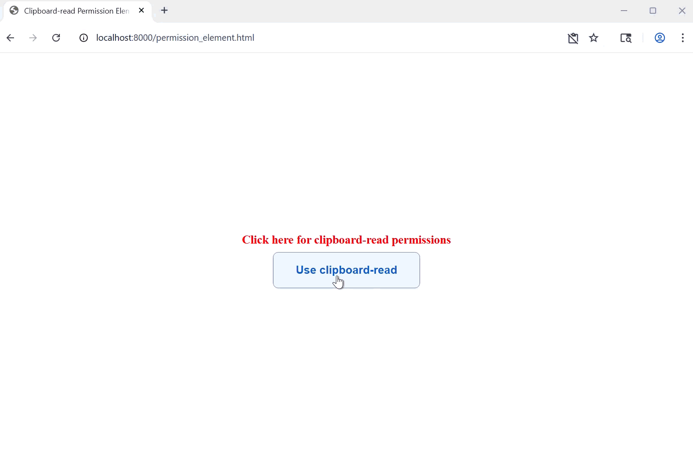
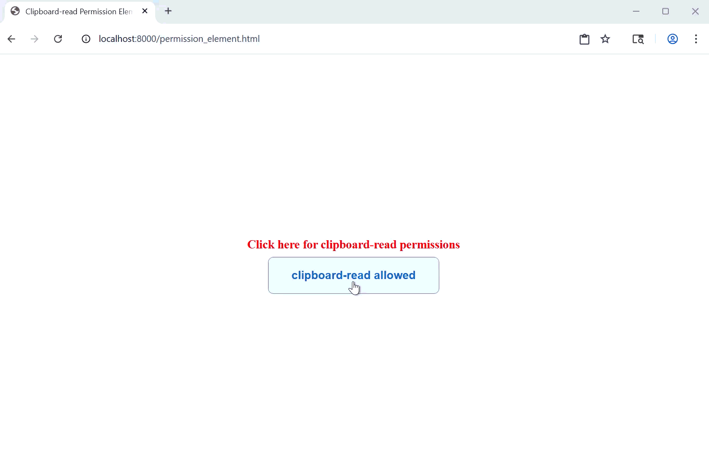
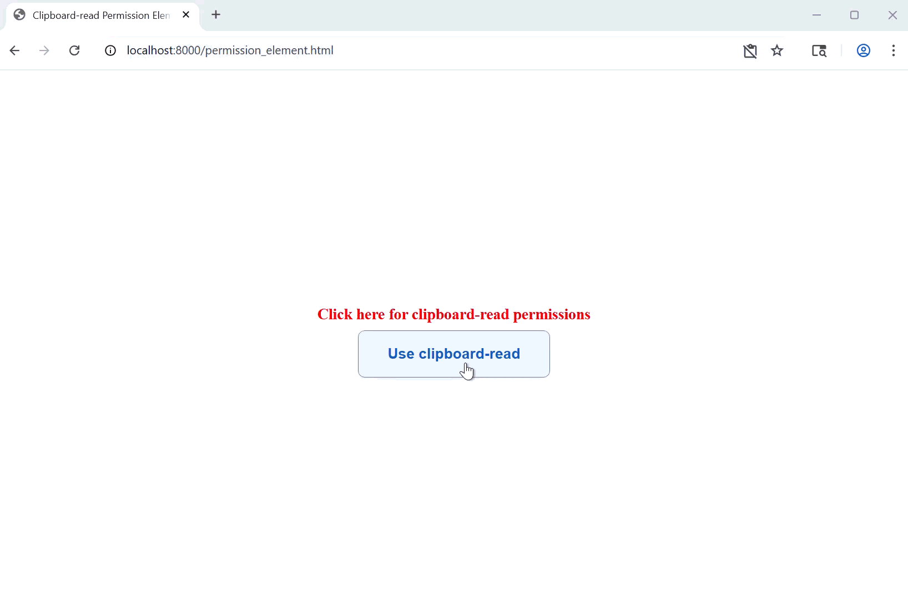

# Page Embedded Clipboard Read Permission Control

## Improving permission control for clipboard reads through permission element

## Authors:
- [Utkarsh Pathak](https://github.com/utpathak)
- [Abhishek Singh](https://github.com/abhishek06020)
- [Tanu Jain](https://github.com/tanu18)
- [Rakesh Goulikar](https://github.com/ragoulik)

## Participate
- [Issue tracker](https://github.com/MicrosoftEdge/MSEdgeExplainers/labels/PepcForClipboardRead)
- [Open a new issue](https://github.com/MicrosoftEdge/MSEdgeExplainers/issues/new?assignees=ragoulik&labels=PepcForClipboardRead&template=pepc-for-clipboard-read.md&title=%5BPEPC+for+clipboard+read%5D+%3CTITLE+HERE%3E)

<!-- START doctoc generated TOC please keep comment here to allow auto update -->
<!-- DON'T EDIT THIS SECTION, INSTEAD RE-RUN doctoc TO UPDATE -->
## Table of Contents

- [Introduction](#introduction)
- [User-Facing Problem](#user-facing-problem)
- [Goals](#goals)
- [Non-Goals](#non-goals)
- [Proposal](#proposal)
  - [PEPC prompts for clipboard-read permission](#pepc-prompts-for-clipboard-read-permission)
- [Alternatives considered](#alternatives-considered)
- [Accessibility, Privacy, and Security Considerations](#accessibility-privacy-and-security-considerations)
- [References and Acknowledgements](#references-and-acknowledgements)

<!-- END doctoc generated TOC please keep comment here to allow auto update -->

## Introduction

This proposal is to support the implementation of a new type ```clipboard-read``` within the [permission element](https://wicg.github.io/PEPC/permission-element.html), leveraging the existing PEPC infrastructure. The goal is to make clipboard access predictable, recoverable, and user-friendly by enabling developers to provide users with contextual, browser-controlled UI for requesting clipboard permissions.

This explainer outlines how the dedicated [permission element](#https://wicg.github.io/PEPC/permission-element.html) model can bring clarity and consistency to clipboard interactions, building upon the same foundation as camera and microphone permissions. 

## User-Facing Problem

Users encounter clipboard permission prompts while performing actions like copy or paste on the web, depending on the current permission state. However, these prompts are frequently misunderstood, dismissed, or denied—sometimes accidentally, sometimes intentionally, and often due to unclear messaging. Once denied, clipboard operations silently fail with no further guidance, leaving users confused about what went wrong. 

The lack of intuitive messaging and the complexity involved in re-enabling permissions results in a frustrating and broken user experience. Users are often unaware that their copy/paste action failed due to permission denial, and even when they realize it, they struggle to locate the settings needed to restore clipboard access. 

This creates a recurring failure loop—where the application’s functionality appears broken, and the user is left without any actionable recovery path. 

**User anecdote:**

“I had a window pop up on a website where I was copying text and pictures to my clipboard. The popup window said something about the clipboard, and I mistakenly clicked block. Now I can no longer copy pictures to my clipboard on this website. How do I un-block the clipboard function on this website?”
Source: [How do I unblock the clipboard for a website - Microsoft Q&A](https://learn.microsoft.com/en-in/answers/questions/766718/how-do-i-unblock-the-clipboard-for-a-website) 

The table below outlines user problems and scenarios, mapped to their intent to use the clipboard and the corresponding permission state at that moment. 

<table border="1">
  <tr>
    <th></th>
    <th>Clipboard working on site</th>
    <th>Clipboard not working on site (site or OS permission missing)</th>
  </tr>
  <tr>
    <td><strong>Intent to use clipboard on site</strong></td>
    <td>✅ True positive: Intent correctly captured.</td>
    <td>❌ False negative: User intended to use clipboard but permission is blocked (Site/OS) or they changed their mind. <strong>Solution:</strong> Clear intent by clicking the <code>&lt;permission&gt;</code> element to show the prompt again.</td>
  </tr>
  <tr>
    <td><strong>No intent to use clipboard on site</strong></td>
    <td>❌ False positive: Permission granted without user intent. <strong>Solution:</strong> <code>&lt;permission&gt;</code> element requires explicit user click on clearly labeled button to show prompt.</td>
    <td>✅ True negative: Intent correctly captured.</td>
  </tr>
</table>

## Goals

- Improve user clarity around clipboard permission prompts:
 Help users better understand why clipboard read access is being requested, so that they can make informed choices when prompted by the browser.

- Enable user recovery paths for denied clipboard permissions: 
 Offer UI affordances or mechanisms that let users easily reverse an accidental "Block" decision, either directly in the browser or through app-driven nudges. 

- Align clipboard permission UX with broader web permissions model:
 Ensure that improvements to clipboard permission flows are consistent with the evolving privacy and permissions architecture of the web platform. 

## Non-Goals

- The proposal does not introduce a way to bypass explicit user permission for clipboard reads, nor does it reduce privacy protections around clipboard access. 

- The scope of this proposal is limited to read access via the Clipboard API; it does not include any modifications to the flow of clipboard write permissions. 

## Proposal

We propose supporting a new permission type for the [```<permission>```](#https://github.com/WICG/PEPC/blob/main/explainer.md) HTML element: 

clipboard-read: Allows reading from the user's clipboard when an [async clipboard read](https://w3c.github.io/clipboard-apis/#dom-clipboard-read) is initiated. 

Similar to microphone or camera permission prompts, this type handles permission requests for retrieving clipboard data asynchronously using clipboard read API [```navigator.clipboard.read()```](https://w3c.github.io/clipboard-apis/#dom-clipboard-read). 

```html
// Example HTML to define clipboard-read type for the permission element
<permission type="clipboard-read"></permission> 
```


### PEPC prompts for clipboard-read permission: 

- Prompt shown at the first clipboard read access on a domain:   


- Prompt shown when clipboard-read permission was already granted but user clicks on permission element:  


- Prompt shown when clipboard-read permission was already denied but user clicks on permission element:   


## Alternatives considered:
As this proposal is only to support new type in PEPC, all the alternatives in the [PEPC explainer](#https://github.com/WICG/PEPC/blob/main/explainer.md) remain applicable.

[PEPC Alternative considerations](https://github.com/WICG/PEPC/blob/main/explainer.md#alternative)

## Accessibility, Privacy, and Security Considerations

This proposal does not introduce new risks or changes to accessibility, privacy, or security for clipboard operations. It maintains the fundamental permission and security requirements of the async Clipboard read API [```navigator.clipboard.read()```](https://w3c.github.io/clipboard-apis/#dom-clipboard-read), including the need for a secure context and a user gesture to access clipboard contents. Apart from the requirements for clipboard-read, all accessibility, privacy, or security concerns and mitigations which were applicable to any PEPC element are also applicable here.

[PEPC Security and Abuse Mitigations](https://github.com/WICG/PEPC/blob/main/explainer.md#security-and-abuse-mitigation)

## References and Acknowledgements 
Reference : [PEPC explainer](https://github.com/WICG/PEPC/blob/main/explainer.md)

Many thanks for valuable feedback and advice from:
- [Rohan Raja](https://github.com/roraja)
