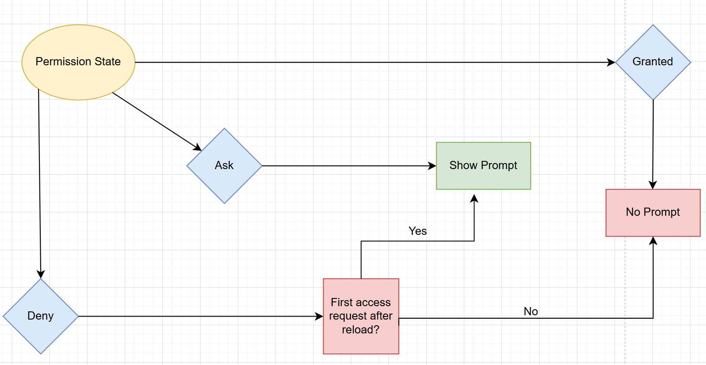

# Clipboard Permissions State Reset on Reload

## Improving Permission Control for Clipboard

## Authors:
- [Utkarsh Pathak](https://github.com/utpathak)
- [Abhishek Singh](https://github.com/abhishek06020)
- [Tanu Jain](https://github.com/tanujain_microsoft)
- [Rakesh Goulikar](https://github.com/ragoulik)

## Participate

<!-- START doctoc generated TOC please keep comment here to allow auto update -->
<!-- DON'T EDIT THIS SECTION, INSTEAD RE-RUN doctoc TO UPDATE -->
## Table of Contents

- [Introduction](#introduction)
- [User-Facing Problem](#user-facing-problem)
- [Goals](#goals)
- [Non-Goals](#non-goals)
- [Proposal](#proposal)
- [Alternatives Considered](#alternatives-considered)
- [Accessibility, Privacy, and Security Considerations](#accessibility-privacy-and-security-considerations)
- [References and Acknowledgements](#references-and-acknowledgements)

<!-- END doctoc generated TOC please keep comment here to allow auto update -->

## Introduction

This proposal aims to improve the clipboard permission experience by allowing users to re-grant clipboard read permissions after previously denying them. The solution is to show the clipboard permission prompt again on a new reload of the website or renderer process, even if the user had previously denied access.

## User-Facing Problem

Users often deny clipboard permission prompts—sometimes accidentally, sometimes intentionally, and often due to unclear messaging. Once denied, clipboard operations silently fail with no further guidance, leaving users confused about what went wrong. 

Currently, after a user denies clipboard access, there is no straightforward way for them to recover or re-enable the permission without navigating browser settings, which is not intuitive for most users. This results in a broken user experience and recurring frustration.

**User anecdote:**

“I had a window pop up on a website where I was copying text and pictures to my clipboard. The popup window said something about the clipboard, and I mistakenly clicked block. Now I can no longer copy pictures to my clipboard on this website. How do I un-block the clipboard function on this website?”
Source: [How do I unblock the clipboard for a website - Microsoft Q&A](https://learn.microsoft.com/en-in/answers/questions/766718/how-do-i-unblock-the-clipboard-for-a-website) 

The table below outlines user problems and scenarios, mapped to their intent to use the clipboard and the corresponding permission state at that moment.

<table border="1">
  <tr>
    <th></th>
    <th>Clipboard working on site</th>
    <th>Clipboard not working on site (site or OS permission missing)</th>
  </tr>
  <tr>
    <td><strong>Intent to use clipboard on site</strong></td>
    <td>✅ True positive: Intent correctly captured.</td>
    <td>❌ False negative: User intended to use clipboard but permission is blocked (Site/OS) or they changed their mind. <strong>Solution:</strong> Show the permission prompt again on reload to allow user to grant access.</td>
  </tr>
  <tr>
    <td><strong>No intent to use clipboard on site</strong></td>
    <td>❌ False positive: Permission granted without user intent.</td>
    <td>✅ True negative: Intent correctly captured.</td>
  </tr>
</table>

## Goals

- Improve user clarity around clipboard permission prompts:  
  Help users better understand why clipboard read access is being requested, so they can make informed choices when prompted by the browser.

- Enable user recovery paths for denied clipboard permissions:  
  Allow users to easily reverse an accidental "Block" decision by showing the permission prompt again on reload.

- Align clipboard permission UX with broader web permissions model:  
  Ensure that improvements to clipboard permission flows are consistent with the evolving privacy and permissions architecture of the web platform.

## Non-Goals

- This proposal does not introduce a way to bypass explicit user permission for clipboard reads, nor does it reduce privacy protections around clipboard access.
- The scope of this proposal is limited to read access via the Clipboard API; it does not include any modifications to the flow of clipboard write permissions.

## Proposal

When a user denies clipboard read permission, the browser will show the permission prompt again if clipboard access is requested after a full reload of the website or a new renderer process is started. This gives users a clear and simple way to recover from an accidental denial, without needing to navigate browser settings.

**Example flow:**
1. User visits a site and is prompted for clipboard read permission.
2. User clicks "Block" (deny).
3. On the same session, further clipboard read attempts fail silently.
4. If the user reloads the page or the renderer process restarts, and clipboard access is requested again, the browser will show the permission prompt again, allowing the user to grant access.

This approach ensures that users are not permanently locked out of clipboard functionality due to a single mistaken denial and can easily recover permission through normal browsing actions.

**Note**

This approach follows the precedent set by Mozilla, where the deny permission is reset upon each page reload or refresh. This behavior aligns with typical user expectations, as refreshing a page is a common action when something isn’t working.

## Alternatives Considered

- Keeping the current model, where denied permissions can only be reset via browser settings, was considered but found to be less user-friendly.
- Prompting on every clipboard access request (without reload) was rejected to avoid prompt fatigue and poor UX.

## Accessibility, Privacy, and Security Considerations

This proposal does not introduce new risks or changes to accessibility, privacy, or security for clipboard operations. It maintains the fundamental permission and security requirements of the async Clipboard read API ([`navigator.clipboard.read()`](https://w3c.github.io/clipboard-apis/#dom-clipboard-read)), including the need for a secure context and a user gesture to access clipboard contents. All existing accessibility, privacy, and security considerations for clipboard access remain applicable.

## References and Acknowledgements

Reference: [Clipboard API](https://w3c.github.io/clipboard-apis/)

Many thanks for valuable feedback and advice