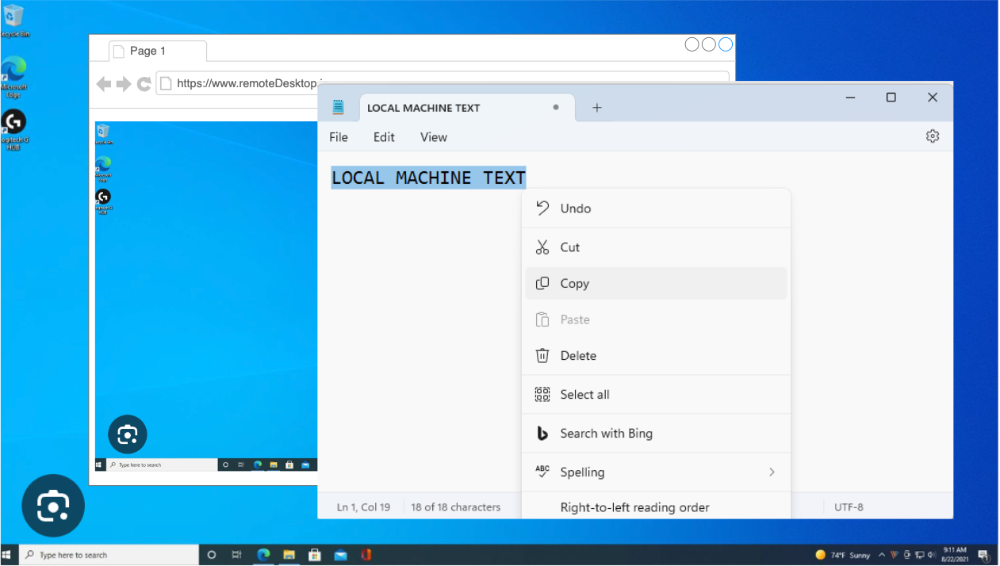
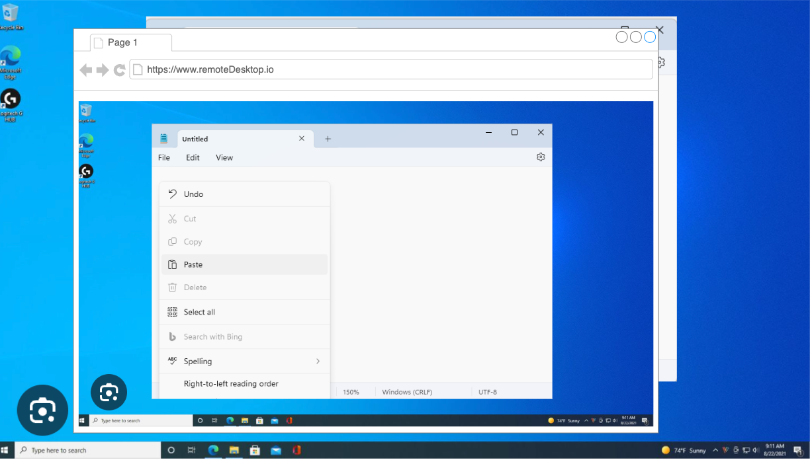
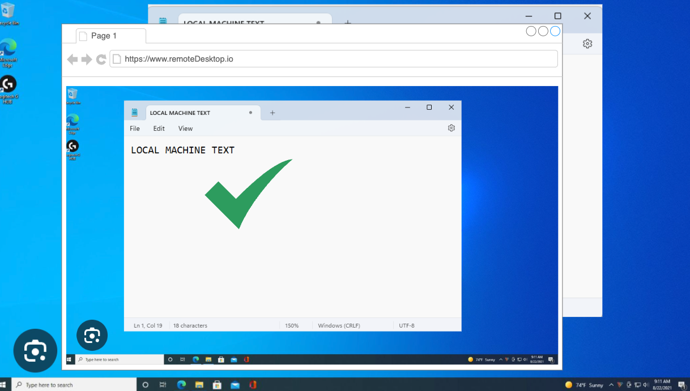
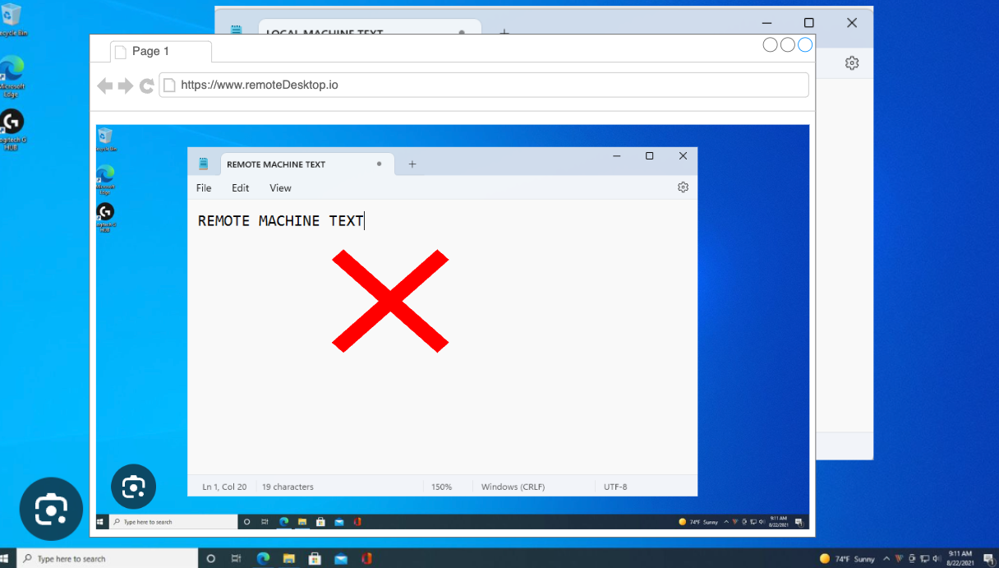
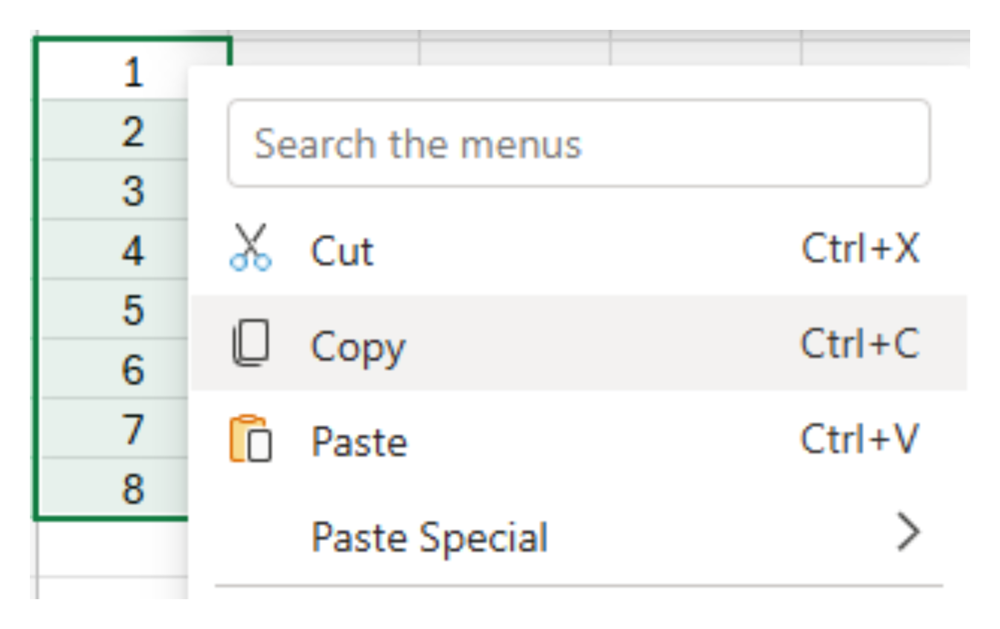
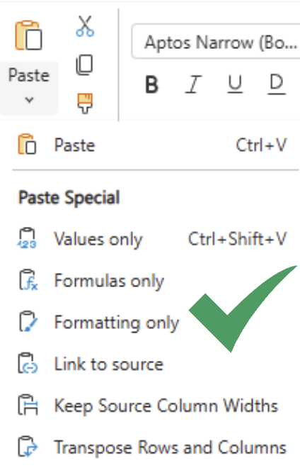
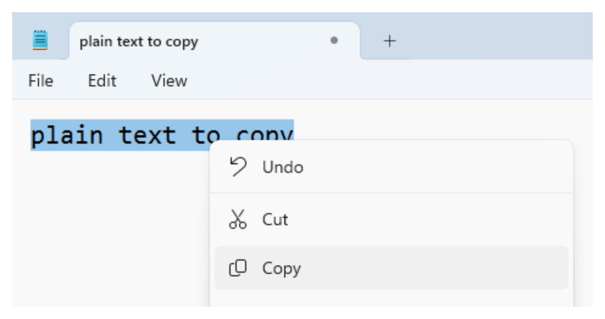
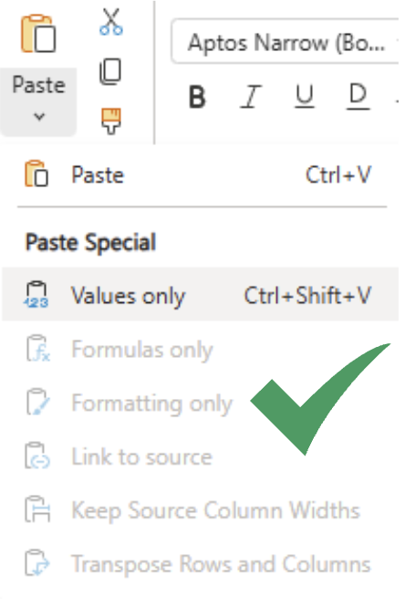
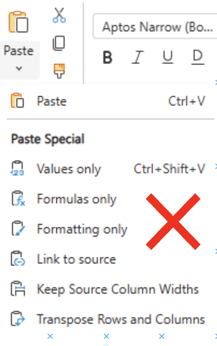

# Clipboardchange event explainer document

## Authors:
- Rohan Raja (roraja@microsoft.com)

## Participate
Feature request: [Async Clipboard: Add support for 'clipboardchange' event [41442253] - Chromium](https://issues.chromium.org/issues/41442253)
Spec: [Clipboard API and events (w3.org)](https://www.w3.org/TR/clipboard-apis/#clipboard-event-clipboardchange)

## Table of Contents

<!-- START doctoc generated TOC please keep comment here to allow auto update -->
<!-- DON'T EDIT THIS SECTION, INSTEAD RE-RUN doctoc TO UPDATE -->


- [1. Introduction](#1-introduction)
- [2. User scenarios](#2-user-scenarios)
  - [2.1 Scenario: Sync clipboard with a remote desktop](#21-scenario-sync-clipboard-with-a-remote-desktop)
    - [2.1.1 User copies text from any app within their local machine](#211-user-copies-text-from-any-app-within-their-local-machine)
    - [2.1.2 Using the remote desktop client web app, the user performs a paste operation within the remote desktop OS](#212-using-the-remote-desktop-client-web-app-the-user-performs-a-paste-operation-within-the-remote-desktop-os)
    - [2.1.3 With clipboard monitoring (using clipboardchange event or polling), the local machine's clipboard content is pasted](#213-with-clipboard-monitoring-using-clipboardchange-event-or-polling-the-local-machines-clipboard-content-is-pasted)
    - [2.1.4 Without clipboard monitoring, the remote desktop's clipboard content is pasted](#214-without-clipboard-monitoring-the-remote-desktops-clipboard-content-is-pasted)
  - [2.2 Scenario: Show available paste formats in web based editors](#22-scenario-show-available-paste-formats-in-web-based-editors)
    - [2.2.1 Copy multiple cells in a spreadsheet](#221-copy-multiple-cells-in-a-spreadsheet)
    - [2.2.2 Expected - Multiple paste options available](#222-expected---multiple-paste-options-available)
    - [2.2.3 Copy plain text from Notepad](#223-copy-plain-text-from-notepad)
    - [2.2.4 Expected - Only single paste format available](#224-expected---only-single-paste-format-available)
    - [2.2.5 Actual - Multiple paste formats available](#225-actual---multiple-paste-formats-available)
- [3. Motivation - Alternative to inefficient polling of clipboard](#3-motivation---alternative-to-inefficient-polling-of-clipboard)
- [4. Example javascript code for detecting clipboard changes:](#4-example-javascript-code-for-detecting-clipboard-changes)
- [5. Event spec details and open questions](#5-event-spec-details-and-open-questions)
  - [5.1 User permission requirement](#51-user-permission-requirement)
    - [5.1.1 Approach 1 - clipboard-read permission required to listen to clipboardchange event](#511-approach-1---clipboard-read-permission-required-to-listen-to-clipboardchange-event)
      - [Pros](#pros)
      - [Cons](#cons)
    - [5.1.2 Approach 2 - Considered alternative: No permission required](#512-approach-2---considered-alternative-no-permission-required)
      - [Pros](#pros-1)
      - [Cons](#cons-1)
    - [5.1.3 Conclusion](#513-conclusion)
  - [5.2 Page focus requirement](#52-page-focus-requirement)
    - [5.2.1 Approach 1 - Page required to be in focus to receive event](#521-approach-1---page-required-to-be-in-focus-to-receive-event)
      - [Pros](#pros-2)
      - [Cons](#cons-2)
    - [5.2.2 Approach 2 - No focus requirement](#522-approach-2---no-focus-requirement)
      - [Pros:](#pros)
      - [Cons:](#cons)
    - [5.2.3 Conclusion](#523-conclusion)
  - [5.3 Event details](#53-event-details)
- [6. Detailed design discussion](#6-detailed-design-discussion)
  - [6.1 Listen to clipboard change directly from the OS](#61-listen-to-clipboard-change-directly-from-the-os)
      - [Pros:](#pros-1)
      - [Cons:](#cons-1)
    - [6.1.1 APIs provided by all OS to listen to clipboardchange event:](#611-apis-provided-by-all-os-to-listen-to-clipboardchange-event)
  - [6.2 Considered alternative: Given the page focus restrictions, check clipboard hash change when page regains focus](#62-considered-alternative-given-the-page-focus-restrictions-check-clipboard-hash-change-when-page-regains-focus)
      - [Pros:](#pros-2)
      - [Cons:](#cons-2)
- [7. References & acknowledgements](#7-references--acknowledgements)

<!-- END doctoc generated TOC please keep comment here to allow auto update -->

## 1. Introduction

The clipboardchange event fires whenever the system clipboard contents are changed. This allows web-apps like remote desktop clients to stay in sync with the system clipboard. It provides an efficient alternative to polling the clipboard for changes.

## 2. User scenarios

### 2.1 Scenario: Sync clipboard with a remote desktop
When a user copies text or an image on their local machine, the web-based remote desktop application can detect this clipboard change event through the browser's Clipboard API.
Upon detecting the change, the application can automatically send the new clipboard content to the remote desktop environment.

#### 2.1.1 User copies text from any app within their local machine


#### 2.1.2 Using the remote desktop client web app, the user performs a paste operation within the remote desktop OS


#### 2.1.3 With clipboard monitoring (using clipboardchange event or polling), the local machine's clipboard content is pasted


#### 2.1.4 Without clipboard monitoring, the remote desktop's clipboard content is pasted


### 2.2 Scenario: Show available paste formats in web based editors
Web based editors like Excel Online, Word Online may support paste operation in multiple formats. Within the UI, it may show the available formats on the UI (like csv, image, plain text). The clipboard change event can be used to detect the change in available formats in clipboard and reflect the same on the UI as soon as it is changed. 

#### 2.2.1 Copy multiple cells in a spreadsheet

#### 2.2.2 Expected - Multiple paste options available

#### 2.2.3 Copy plain text from Notepad

#### 2.2.4 Expected - Only single paste format available

#### 2.2.5 Actual - Multiple paste formats available
Without monitoring clipboard, the web app can't update the available paste formats on the UI.


Similarly UI elements which depend on clipboard state, like "Paste image from clipboard" in an web based image editor, can be enabled/disabled using the clipboardchange event based on weather correct data format is present in clipboard or not.

## 3. Motivation - Alternative to inefficient polling of clipboard
Today, a web-app can monitor the system clipboard by polling and reading the clipboard through async clipboard API at regular intervals.
However, polling is not efficient and this feature aims to introduce an efficient way of notifying web apps when clipboard changes.
Additionally we must ensure that we monitor the clipboard only when absolutely required, that is, there is at least one document having required permissions and is listening to the clipboard change event. This will be described in design details.

## 4. Example javascript code for detecting clipboard changes:

```javascript
  function callback(event) {
      // Read clipboard contents using navigator.clipboard
      navigator.clipboard.readText().then(text => console.log(text));
  }
  // Start listening to the clipboardchange event
  navigator.clipboard.addEventListener("clipboardchange", callback);
```

## 5. Event spec details and open questions

### 5.1 User permission requirement

#### 5.1.1 Approach 1 - clipboard-read permission required to listen to clipboardchange event
Since the clipboard contains privacy-sensitive data, we should protect access to the clipboard change event using a user permission - clipboard-read. The web author should ensure that the site has the permission before it starts listening to this event otherwise the provided event handler won't be invoked whenever the clipboard changes. We should consider logging a warning message if the web author starts listening to clipboardchange without acquiring the permissions since web developers might miss integrating the permissions flow into their user experience.

Users can request permissions in two ways - 1) By performing a read operation like read or readText using Async clipboard API. 2) By explicitly requesting "clipboard-read" permission, the API for this is still under discussion (https://github.com/w3c/permissions/issues/158)

##### Pros
1. More defensive approach, guards against potential misuse of clipboard change event.
2. Ensures user consent before accessing clipboard data.

##### Cons
1. Not a clear user flow for requesting permissions.
2. Additional complexity for both implementation and web authors.

To simply further, we can prompt user for permissions as soon as the "addEventListener" method is called with "clipboardchange" in case the permissions are not already granted. This is still open for discussion as it is not a common pattern to prompt user for permissions when attaching event listeners.

#### 5.1.2 Approach 2 - No permission required
Since no data is being sent as part of the clipboardchange event, it can be argued that we don't need any permission to simply know when clipboard contents change. This will simplify the user flow as they don't need to explicitly ask for permissions before listening to the event.

##### Pros
1. Simpler implementation and user experience

##### Cons
1. Open to privacy attacks which simply monitor clipboard changes without user consent.

#### 5.1.3 Conclusion
We favour Approach 1 i.e. having clipboard-read permission required to listen to clipboardchange event, because it has more provisions which safegaurds user privacy.

### 5.2 Page focus requirement
As per the [current spec](https://www.w3.org/TR/clipboard-apis/#clipboard-event-clipboardchange), we should not fire "clipboardchange" event when a page is not is focus. This is in-line with the current behavior where async clipboard API is not accessible unless the given page is in focus. We do fire "clipboardchange" event when the page regains focus, incase the clipboard contents had changed when the page was out of focus. Note that even if the clipboard had changed multiple times while the page was out of focus, we will only fire a single "clipboardchange" event when the page regains focus. This is because the event is designed to indicate that the clipboard contents are different from what they were when the page lost focus, rather than tracking every individual change that occurred while the page was out of focus.

#### 5.2.1 Approach 1 - Page required to be in focus to receive event

##### Pros
1. More defensive and prevents background scripts from misuse of clipboardchange events.
  1.a) Example - Malicious scripts can detect when a cryptocurrency wallet address is copied to clipboard and replace it with attacker's address and that way redirect payment to attacker's account.  
  1.b) Example - Passwords / authentication keys / access tokens are frequently copied to clipboard and can be retrieved by malicious scripts reading clipboard in background.
2. Can simplify implementation since browsers can simply check for clipboard change on page focus. However, this needs to be further investigated.
3. This is in-line with current async clipboard focus APIs which require focus to access.

##### Cons
1. Might restrict web app scenarios which need to listen to clipboardchange events in the background.
2. Could result in a less responsive user experience if clipboard changes are detected with a delay - if clipboard got changed when the browser was in background, the event is fired only when the browser regains focus. The delay here is the duration between actual copy of contents to clipboard and firing of the clipboardchange event in browser.

#### 5.2.2 Approach 2 - No focus requirement

##### Pros:
1. Opens possibility for more user scenarios - e.g. For example, a web app can make network calls in the background when a specific clipboard item is updated - before pasting an image, a web app might want to check the image for embedded malicious content using a remote service. If the app can be notified about a clipboard change in background, it can trigger the necessary network operations while the user is in another page or application. When the user returns, the web app is ready with the results, reducing the wait time.

##### Cons:
1. Might be open to misuse - a web app will be able to monitor the clipboard even when the user is interacting with other applications / pages.
2. Not much useful unless the page focus requirement is removed from the async read/write clipboard API.
3. Could lead to higher resource consumption due to continuous monitoring. E.g. if a large number of pages are listening to the clipboardchange event, when the clipboard is changed, then all the pages will receive the event at once, which might put load on the system.

#### 5.2.3 Conclusion
We favour Approach 1 - Page required to be in focus to receive event, since this approach reduces the possibility of misusing the clipboard change event in privacy related attacks.

### 5.3 Event details 
"clipboardchange" is a system level event, hence it is not bound to any DOM element. Therefore, there is no bubbling associated with the event. This event simply signifies that the system clipboard got changed. Hence performing “preventDefault” for this event has no effect since there are no actions associated with it. The event does not provide any additional arguments in the callback handler - it is expected that the web app calls Async API to read the clipboard and get the changed clipboard contents within the callback.

## 6. Detailed design discussion

### 6.1 Listen to clipboard change directly from the OS
In this approach, the browser process can have a singleton service which listens to clipboard change event using OS specific APIs. If the platform doesn't provide any OS specific APIs, then we can consider polling to obtain the clipboard change event. 

The browser process can then forward the clipboard change event to all listening renderer processes and fire the event after performing the page focus and user permissions check. In case the page is out of focus, the renderer process won't dispatch the event right away but will set an internal flag which will cause the renderer process to dispatch a "clipboardchange" event as soon as the page regains focus. 

We can further optimize the page out of focus scenario as follows - when the page looses focus, we stop listening to clipboardchange event from the OS. Then upon regain of focus, we firstly check if the clipboard got changed by comparing clipboard hash using [SequenceNumber API](https://learn.microsoft.com/en-us/windows/win32/api/winuser/nf-winuser-getclipboardsequencenumber) and then fire a clipboardchange event if the hash is different from the previously stored one. Secondly, we restart listening to the clipboardchange event from the OS. This will help reduce system resource consumption since the browser won't need process every clipboard change event which is occurring in the OS, while the browser is not in focus.

Moreover, we can ensure to only listen to the OS clipboard when there is at least one renderer process interested in the event.

High level design doc available [here](https://docs.google.com/document/d/1bY2pzV6PSX56fiFcrXEgOjpFen07xaxmnsM5dqXFE1U/edit#heading=h.i1vomwqlf6kt)


##### Pros:
1. Will provide clipboard change events with minimal resource consumptions since we are using OS level APIs to monitor the clipboard.
2. Will cover all cases that can trigger a system clipboard change since we are monitoring clipboard at the OS level.

##### Cons:
1. Might need polling for some OS like MacOS which can lead to higher resource consumption due to continuous monitoring

#### 6.1.1 APIs provided by all OS to listen to clipboardchange event:

| OS            | API                                                                                                                                                                                                                                                                                                                         |
|---------------|-----------------------------------------------------------------------------------------------------------------------------------------------------------------------------------------------------------------------------------------------------------------------------------------------------------------------------|
| Windows       | We can use the [AddClipboardFormatListener](https://learn.microsoft.com/en-us/windows/win32/api/winuser/nf-winuser-addclipboardformatlistener) function (winuser.h) which posts a [WM_CLIPBOARDUPDATE](https://learn.microsoft.com/en-us/windows/win32/dataxchg/wm-clipboardupdate) message whenever the clipboard changes. |
| MacOS         | No API provided, need to poll OS clipboard for changes                                                                                                                                                                                                                                                                      |
| Linux         | TBD                                                                                                                                                                                                                                                                                                                         |
| ChromeOS      | TBD                                                                                                                                                                                                                                                                                                                         |
| Android / iOS | TBD                                                                                                                                                                                                                                                                                                                         |

### 6.2 Considered alternative: Given the page focus restrictions, check clipboard hash change when page regains focus
On page focus event, we can check the current hash of the clipboard (using a [SequenceNumber API](https://learn.microsoft.com/en-us/windows/win32/api/winuser/nf-winuser-getclipboardsequencenumber)) and compare it with the previously stored hash to infer if the clipboard changed. This is an alternative to directly using OS provided APIs for monitoring clipboard. For clipboard changes occurring within the browser, we can easily obtain the clipboard change event from the renderer process.

#### 6.2.1 Platform support for getting clipboard SequenceNumber/Version number
For Mac and Windows, sequence number is represented by a system-provided signature of the clipboard and on ChromeOS, Linux and Android, a new number is generated every time the system clipboard changes. Chromium already has an [internal cross-platform implementation to retrieve clipboard sequence number](https://source.chromium.org/chromium/chromium/src/+/main:ui/base/clipboard/clipboard.h;drc=3c3f08441ba5bf5d49fbdb51410b28e54c4753fb;l=154).

##### Pros:
1. Less dependency on OS level APIs, no need for polling where OS level API for clipboard change event is not provided.
2. Reduces the need for continuous monitoring, saving system resources.
3. Simplifies cross-platform implementation by relying on browser events.

##### Cons:
1. In case system clipboard is changed in background from a native app, then the web app won't know about it until the next page focus action.
2. Page focus event can happen frequently, checking clipboard hash/sequence number might have perf impact even though checking the sequence number should be a constant time operation. Accurate performance analysis of this approach is a TODO.
3. Dependency on page focus requirement - if we remove the page focus requirement in future, then we would need to re-implement a different design for monitoring system clipboard. Hence during the implementation, we need to ensure that the OS clipboard change detection module is decoupled from the rest of the modules.

## 7. References & acknowledgements

Many thanks for valuable feedback and advice from:

- Luke Klimek (zgroza@chromium.org)
- Prashant Nevase (pnevase@microsoft.com)
- Rakesh Goulikar (ragoulik@microsoft.com)
- Sanket Joshi (sajos@microsoft.com)
