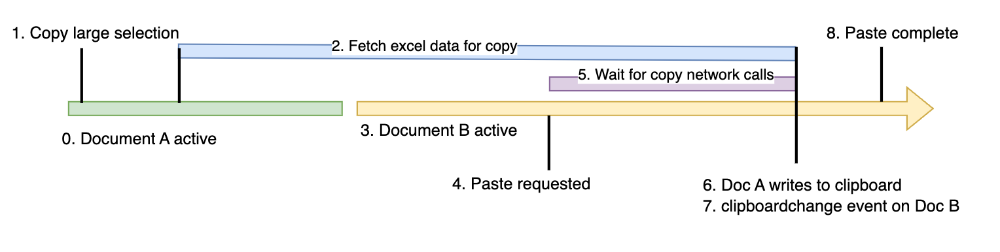

# Clipboardchange event explainer document

## Authors:
- Rohan Raja (roraja@microsoft.com)

## Participate
Feature request: [Async Clipboard: Add support for 'clipboardchange' event [41442253] - Chromium](https://issues.chromium.org/issues/41442253)
Spec: [Clipboard API and events (w3.org)](https://www.w3.org/TR/clipboard-apis/#clipboard-event-clipboardchange)

## Table of Contents

<!-- START doctoc generated TOC please keep comment here to allow auto update -->
<!-- DON'T EDIT THIS SECTION, INSTEAD RE-RUN doctoc TO UPDATE -->

- [1. Introduction](#1-introduction)
- [2. Motivating Use Cases and scenarios](#2-motivating-use-cases-and-scenarios)
  - [2.1 Scenario: Sync clipboard with a remote desktop](#21-scenario-sync-clipboard-with-a-remote-desktop)
  - [2.2 Scenario: Excel online - display available paste type options](#22-scenario-excel-online---display-available-paste-type-options)
  - [2.3 Scenario: Excel online - wait for long copy operation](#23-scenario-excel-online---wait-for-long-copy-operation)
  - [2.4 Alternative to inefficient polling of clipboard](#24-alternative-to-inefficient-polling-of-clipboard)
- [3. Example javascript code for detecting clipboard changes:](#3-example-javascript-code-for-detecting-clipboard-changes)
- [4. Event spec details](#4-event-spec-details)
  - [4.1 User permission requirement](#41-user-permission-requirement)
    - [Option 1: clipboard-read permission required](#option-1-clipboard-read-permission-required)
      - [Pros:](#pros)
      - [Cons:](#cons)
    - [Option 2: No permission required](#option-2-no-permission-required)
      - [Pros:](#pros-1)
      - [Cons:](#cons-1)
  - [4.2 Page focus requirement](#42-page-focus-requirement)
    - [Option 1: Page required to be in focus to receive event](#option-1-page-required-to-be-in-focus-to-receive-event)
      - [Pros:](#pros-2)
      - [Cons:](#cons-2)
    - [Option 2: No focus requirement](#option-2-no-focus-requirement)
      - [Pros:](#pros-3)
      - [Cons:](#cons-3)
  - [4.3 Event bound to](#43-event-bound-to)
  - [4.4 Event bubbles?](#44-event-bubbles)
  - [4.5 Event actions?](#45-event-actions)
  - [4.6 Event handler additional arguments](#46-event-handler-additional-arguments)
- [5. Detailed design discussion](#5-detailed-design-discussion)
  - [5.1 Design choice 1: Listen to clipboard change directly from the OS](#51-design-choice-1-listen-to-clipboard-change-directly-from-the-os)
      - [Pros:](#pros-4)
      - [Cons:](#cons-4)
  - [5.2 Design choice 2: With page focus restrictions, check clipboard hash change on regain focus event](#52-design-choice-2-with-page-focus-restrictions-check-clipboard-hash-change-on-regain-focus-event)
      - [Pros:](#pros-5)
      - [Cons:](#cons-5)
- [6 References & acknowledgements](#6-references--acknowledgements)

<!-- END doctoc generated TOC please keep comment here to allow auto update -->

## 1. Introduction

The clipboardchange event fires whenever the system clipboard contents are changed. This allows web-apps like remote desktop clients to stay in sync with the system clipboard. It provides an efficient alternative to polling the clipboard for changes.


## 2. Motivating Use Cases and scenarios

### 2.1 Scenario: Sync clipboard with a remote desktop
When a user copies text or an image on their local machine, the web-based remote desktop application can detect this clipboard change event through the browser's Clipboard API.
Upon detecting the change, the application can automatically send the new clipboard content to the remote desktop environment.

### 2.2 Scenario: Excel online - display available paste type options 
Apps like Excel online, may support paste operation in multiple formats. Within the UI, it may show the available formats before pasting (like csv, image, plain text). 
The clipboard change event can be used to detect the change in available formats in clipboard and reflect the same on the UI immediately. 

### 2.3 Scenario: Excel online - wait for long copy operation   

Excel online may perform some network calls on user copy operations e.g. when user copies a range of data which is not fully loaded on the client, say by "selecting all" rows in a document. The data retrieved from the network calls will eventually be written to the clipboard. If a paste operation is invoked in another document before the network call completes, the app would want to wait for the copy network call to complete before pasting. This completion of network calls can be notified to the pasting document using the clipboard change event, especially when the copy and paste both happen in separate documents. 


1. User selects a large range of data in Excel Online and triggers a copy to clipboard.
2. Excel Online initiates network calls to fetch the data.
3. User switches to a different document
4. User tries to paste the data into that document before the network call completes.
5. The paste operation waits for the network call to complete.
6. On network call completion, the fetched data is written to the clipboard.
7. Clipboard change event notifies the pasting document when the data is ready.
8. Data is finally pasted in the document


However, the page focus constraints in the async clipboard API will cause issues when writing to clipboard from an inactive document.

### 2.4 Alternative to inefficient polling of clipboard
Today, a web-app can still monitor the system clipboard by polling and reading the clipboard through async clipboard API at regular intervals. 
However, this is not efficient and this feature aims to improve the efficiency of web apps to monitor the clipboard. 
We should still monitor the clipboard only when absolutely required - i.e. there is at least one document listening to the clipboard change event and has valid permissions.


## 3. Example javascript code for detecting clipboard changes:

```javascript
  function callback(event) {
      // Read clipboard contents using navigator.clipboard
      navigator.clipboard.readText().then(text => console.log(text));
  }

  // Add event listener for clipboard change
  navigator.clipboard.addEventListener("clipboardchange", callback);
```

## 4. Event spec details 

### 4.1 User permission requirement

#### 4.1.1 Option A: clipboard-read permission required
Since the clipboard contains privacy-sensitive data, we should protect access to the clipboard change event using a user permission - clipboard-read. The web author should ensure that the site has the permission before it starts listening to this event. We should consider logging a warning message if the web author starts listening to clipboardchange without acquiring the permissions since web developers might miss integrating the permissions flow into their user experience.

##### Pros:
1. More defensive approach, guards against potential misuse of clipboard change event
2. Ensures user consent before accessing clipboard data.

##### Cons:
1. Not a clear user flow for requesting permissions.
2. Additional complexity for both implementation and web authors.

#### 4.1.2 Option B: No permission required
Since no data is being sent as part of the clipboardchange event, it can be argued that we don't need any permission to simply know when clipboard contents change. This will simplify the user flow as they don't need to explicitly ask for permissions before listening to the event.

##### Pros:
1. Simpler implementation and user experience

##### Cons:
1. Open to privacy attacks which simply monitor clipboard changes without user consent.
2. May violate privacy regulations in certain jurisdictions.

### 4.2 Page focus requirement
As per the current spec, we should not fire "clipboardchange" event when a page is not is focus. This is in-line with the current behavior where async clipboard API is not accessible unless the given page is in focus. We do fire the event when a page regains focus. (incase the clipboard contents changed meanwhile)

#### Option 1: Page required to be in focus to receive event

##### Pros:
1. More defensive and prevents background scripts from misuse of clipboardchange events.
2. Can simplify implementation since browsers can simply check for clipboard change on page focus.
3. In-line with current async clipboard focus APIs which require focus to access

##### Cons:
1. Might restrict web app scenarios which need to listen to clipboardchange events in the background.
2. Could result in a less responsive user experience if clipboard changes are detected with a delay.


#### Option 2: No focus requirement

##### Pros:
1. Opens possibility for more user scenarios (TODO - find examples) 

##### Cons:
1. Might be open to misuse (TODO - find examples)
2. Not much useful unless page focus requirement is removed from the async read/write clipboard API.
3. Could lead to higher resource consumption due to continuous monitoring.

### 4.3 Event bound to 
Window - Since this is a system level event

### 4.4 Event bubbles
No since it is bound to document only

### 4.5 Event actions
None - this event simply communicates with a web app that the system clipboard got changed. Hence performing “preventDefault” for this event has no effect.

### 4.6 Event handler additional arguments 
None - it is expected that the web app calls Async API to read the clipboard and get the changed clipboard contents. 

## 5. Detailed design discussion

### 5.1 Design choice 1: Listen to clipboard change directly from the OS

##### Pros:
1. Listening to change from a single source of truth, will cover all cases
2. Immediate detection of clipboard changes, providing real-time updates.
3. Simplifies the logic for detecting changes, as it relies on the OS's native capabilities.

##### Cons:
1. Might need polling for some OS like MacOS
2. Increased complexity in handling different OS-specific APIs.
3. Potential security concerns with direct OS-level access.
4. Higher resource consumption due to continuous monitoring in case of polling.


### 5.2 Design choice 2: With page focus restrictions, check clipboard hash change on regain focus event

##### Pros:
1. Less dependency on OS level APIs, no need for polling on problematic OS like MacOS
2. Reduces the need for continuous monitoring, saving system resources.
3. Simplifies cross-platform implementation by relying on browser events.

##### Cons:
1. In case system clipboard is changed in background from a native app, then we won't know about it until next focus.
2. Page focus event can happen frequently, checking clipboard hash/sequence number might have perf impact
3. Dependency on page focus requirement, if changed in future, complete re-implementation would be required.
4. Increased complexity in handling edge cases where focus changes rapidly.


## 6 References & acknowledgements

Many thanks for valuable feedback and advice from:

- Luke Klimek (zgroza@chromium.org)
- Prashant Nevase (pnevase@microsoft.com)
- Rakesh Goulikar (ragoulik@microsoft.com)
- Sanket Joshi (sajos@microsoft.com)
