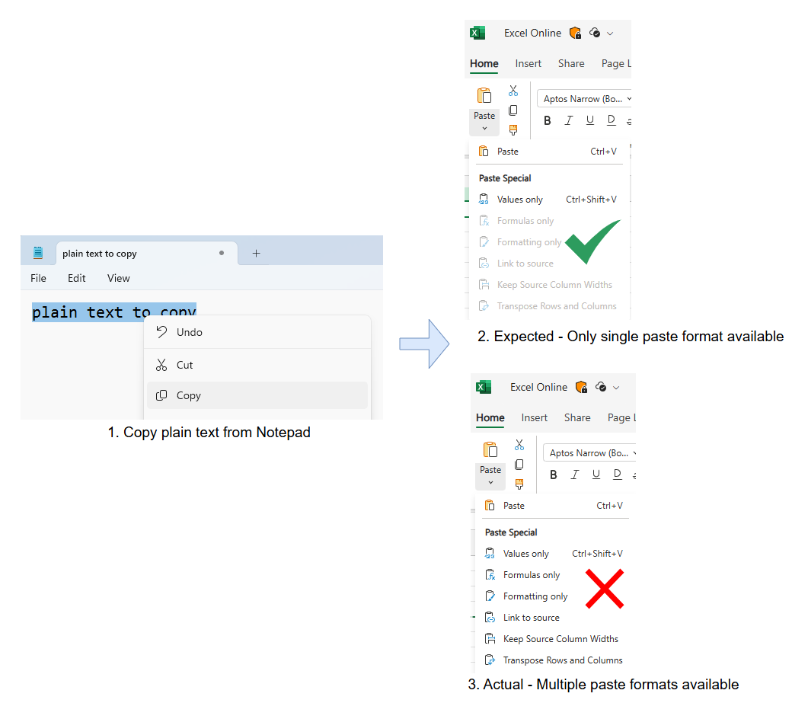

# clipboardchange event API explainer

## Authors:
- Rohan Raja (roraja@microsoft.com)

## Participate
Feature request: [Async Clipboard: Add support for 'clipboardchange' event [41442253] - Chromium](https://issues.chromium.org/issues/41442253)
Spec: [Clipboard API and events (w3.org)](https://www.w3.org/TR/clipboard-apis/#clipboard-event-clipboardchange)

## Table of Contents

<!-- START doctoc generated TOC please keep comment here to allow auto update -->
<!-- DON'T EDIT THIS SECTION, INSTEAD RE-RUN doctoc TO UPDATE -->

- [clipboardchange event API explainer](#clipboardchange-event-api-explainer)
  - [Authors:](#authors)
  - [Participate](#participate)
  - [Table of Contents](#table-of-contents)
  - [1. Introduction](#1-introduction)
  - [2. User scenarios](#2-user-scenarios)
    - [2.1 Scenario: Sync clipboard with a remote desktop](#21-scenario-sync-clipboard-with-a-remote-desktop)
    - [2.2 Scenario: Show available paste formats in web based editors](#22-scenario-show-available-paste-formats-in-web-based-editors)
      - [2.2.1 Copy multiple cells should show multiple paste options in Excel online](#221-copy-multiple-cells-should-show-multiple-paste-options-in-excel-online)
      - [2.2.2 Copy plain text should show only single paste option in Excel online](#222-copy-plain-text-should-show-only-single-paste-option-in-excel-online)
      - [2.2.3 Multiple paste options in Google sheets](#223-multiple-paste-options-in-google-sheets)
  - [3. Motivation - Alternative to inefficient polling of clipboard](#3-motivation---alternative-to-inefficient-polling-of-clipboard)
  - [4. Example javascript code for detecting clipboard changes:](#4-example-javascript-code-for-detecting-clipboard-changes)
    - [4.1 Paste options detection](#41-paste-options-detection)
  - [5. Event spec details and open questions](#5-event-spec-details-and-open-questions)
    - [5.1 Permissions and Interop](#51-permissions-and-interop)
        - [5.1.1.2 Acquiring the clipboard-read / clipboard-types-read permission](#5112-acquiring-the-clipboard-read--clipboard-types-read-permission)
        - [5.1.1.1 Permissions policy integration in cross-origin iframes](#5111-permissions-policy-integration-in-cross-origin-iframes)
      - [5.1.2 Approach 2 - No permission required](#512-approach-2---no-permission-required)
        - [Pros](#pros)
        - [Cons](#cons)
      - [5.1.3 Conclusion](#513-conclusion)
    - [5.2 Page focus requirement](#52-page-focus-requirement)
      - [5.2.1 Approach 1 (Preferred) - Page required to be in focus to receive event](#521-approach-1-preferred---page-required-to-be-in-focus-to-receive-event)
        - [Pros](#pros-1)
        - [Cons](#cons-1)
      - [5.2.2 Approach 2 - No focus requirement](#522-approach-2---no-focus-requirement)
        - [Pros:](#pros-2)
        - [Cons:](#cons-2)
      - [5.2.3 Approach 3 - Transient user activation](#523-approach-3---transient-user-activation)
        - [Pros:](#pros-3)
        - [Cons:](#cons-3)
      - [5.2.4 Conclusion](#524-conclusion)
    - [5.3 Event details](#53-event-details)
      - [5.3.1 Clipboard contents](#531-clipboard-contents)
      - [5.3.2 Clipboard data types](#532-clipboard-data-types)
  - [6 Appendix](#6-appendix)
    - [6.1 APIs provided by all OS to listen to clipboardchange event:](#61-apis-provided-by-all-os-to-listen-to-clipboardchange-event)
  - [7 Open issues](#7-open-issues)
    - [7.1 Future permission prompting mechanisms](#71-future-permission-prompting-mechanisms)
    - [7.2 Fencedframe](#72-fencedframe)
  - [8 References \& acknowledgements](#8-references--acknowledgements)

<!-- END doctoc generated TOC please keep comment here to allow auto update -->

## 1. Introduction

The clipboardchange event fires whenever the system clipboard contents are changed. This allows web-apps like remote desktop clients to be notified and respond to changes to the system clipboard. It provides an efficient alternative to polling the clipboard for changes.

## 2. User scenarios

### 2.1 Scenario: Sync clipboard with a remote desktop
When a user copies text or an image on their local machine, a web-based remote desktop application can detect that clipboard contents have changed by listening for the `clipboardchange` event. Upon detecting the change (which happens when 'clipboardchange' event is triggered on the web app when the page regains focus), the application can re-read the clipboard and send the updated clipboard content to the remote desktop environment.


### 2.2 Scenario: Show available paste formats in web based editors
Web-based editors like Word Online, Excel Online, Google Sheets, and similar applications support paste operations in multiple formats, such as CSV, images, HTML, and plain text. These editors may have separate paste functionality depending on the data type which is pasted, hence the web UI might have different paste buttons for each data type. The clipboard change event can be used to detect the change in available formats in clipboard and reflect the same on the UI as soon as it is changed.

**Example scenario with clipboardchange event**: Imagine a user working on a report in Word Online. They copy a table from Excel, which is available in multiple formats: plain text, HTML, and CSV. As soon as the user copies the table, the `clipboardchange` event fires, and Word Online's UI updates to show buttons for "Paste as Text," "Paste as HTML," and "Paste as CSV." The user can then choose the most suitable format for their report with a single click, streamlining their workflow. 

**Scenario without clipboardchange event**: If the user copies plain text then without clipboardchange notification, the web page would continue showing the "Paste as HTML" and "Paste as image" options. Clicking on "Paste as image" would require the web page to show some kind of error message. This unnecessary error scenario can be avoided by monitoring the clipboard and disabling the un-needed data type buttons upon clipboard change, which would prevent user clicking the invalid type button in the first place.

#### 2.2.1 Copy multiple cells should show multiple paste options in Excel online


#### 2.2.2 Copy plain text should show only single paste option in Excel online


#### 2.2.3 Multiple paste options in Google sheets


## 3. Motivation - Alternative to inefficient polling of clipboard
Today, a web-app can monitor the system clipboard by polling and reading the clipboard through async clipboard API at regular intervals.
However, polling is not efficient and this feature aims to introduce an efficient way of notifying web apps when clipboard changes.
Additionally we must ensure that we monitor the clipboard only when absolutely required, that is, there is at least one document having required permissions and is listening to the clipboard change event. This will be described in design details.

## 4. Example javascript code for detecting clipboard changes:

### 4.1 Paste options detection

```javascript
  // Event handler for clipboardchange event which contains the data types present in clipboard
  function onClipboardChanged(e) {
    document.getElementById("text_paste_button").disabled = !(e.clipboardData.types.indexOf('text/plain') > -1);
    document.getElementById("html_paste_button").disabled = !(e.clipboardData.types.indexOf('text/html') > -1);
    document.getElementById("png_paste_button").disabled = !(e.clipboardData.types.indexOf('img/png') > -1);
  }

  // This will trigger a permission popup for "clipboard-types-read" / "clipboard-read" (if choice not already provided)
  navigator.clipboard.addEventListener("clipboardchange", onClipboardChanged);
```

A sample web application which demonstrates the usage of "clipboardchange" event for showing available paste formats for rich web editors [Scenario 2.2](#22-scenario-show-available-paste-formats-in-web-based-editors) can be found [here](./clipboard-change-event-example-app.html).

## 5. Event spec details and open questions

### 5.1 Permissions and Interop

Today browser engines have different approaches to clipboard API permissions. 

While Chromium has [this permissions model](https://github.com/w3c/clipboard-apis/blob/main/explainer.adoc#clipboard-permissions) for clipboard. [Firefox](https://developer.mozilla.org/en-US/docs/Web/API/Clipboard_API) and [Safari](https://webkit.org/blog/10855/async-clipboard-api/) rely on combination of user activation and user gesture. 

**Paste button in Firefox**


**Permission prompt in Chromium**


For browsers that use clipboard permissions, as outlined in the privacy section, it becomes important that "clipboard-read" permission is a pre-requisite for ClipboardChange event. 

Firefox and Safari have User activation + User gesture approach and don't use clipboard permissions. In this case firing ClipboardChange event itself is not a privacy concern as clipboard reads are guarded by user gesture requirement. 

Conclusion, for Firefox and Safari the "clipboard-read" permission requirement need not be applicable for only firing the clipboardchange event (without any payload). 

Now, for the use cases outlined in the explainer especially the dynamic contextual menus and buttons appearing with different MIME types available on clipboard. Just firing the clipboard change event is not sufficient. Developers will need to know the available MIME types on clipboard. This can be achieved by: 

1.) Use Asnyc clipboard APIs to read clipboard for types every time ClipboardChange event is fired. 

Or 

2.) Make clipboard data types available as a payload on the ClipboardChange event. 

Challenge with 1.) would be that, in case of Firefox and Safari user will see Paste button (user gesture requirement) to allow reading clipboard and this does not server the use case of dynamically updating context menus. 

Hence we can use Approach 2.) to provide clipboard data types as part of event payload. And since the information about clipboard data types is still privacy sensitive, it needs to be gated by a user permission. Browsers like Chromium which already protect clipboard data with "clipboard-read" permission can use the same permission to gate the clipboardchange event (which inturn gates the clipboard types data which is payload of the event). Browsers which don't have this permission, like Firefox and Safari, can introduce a new permission, example "clipboard-types-read" (similar to how Firefox has [this permission model](https://support.mozilla.org/en-US/kb/does-firefox-share-my-location-websites?redirectslug=does-firefox-share-my-location-web-sites&redirectlocale=en-US) for accessing location services)

##### 5.1.1.2 Acquiring the clipboard-read / clipboard-types-read permission
The user can be prompted for permissions as soon as the "addEventListener" method is called with "clipboardchange" in case the permissions are not already granted.

In browsers like Chromium, web apps can request for the clipboard-read permissions in advance by performing a read operation using one of [read](https://w3c.github.io/clipboard-apis/#dom-clipboard-read) or [readText](https://w3c.github.io/clipboard-apis/#dom-clipboard-readtext) methods of the [Async clipboard API](https://w3c.github.io/clipboard-apis/#async-clipboard-api). In case the permission is granted after calling any of these methods, no further permission prompt would appear upon calling "addEventListener" method with "clipboardchange" as input.

##### 5.1.1.1 Permissions policy integration in cross-origin iframes

Listening to "clipboardchange" event within a cross-origin iframe can be enabled with [Permissions Policy](https://www.w3.org/TR/permissions-policy) which allows for selectively enabling and disabling specific browser features and APIs. Specifically, "clipboard-read" permission needs to be passed to the "allow" attribute of the iframe, similar to how this is required for accessing async clipboard read APIs within a cross-origin iframe.

```html
<iframe
    src="https://other-domain.com/will-monitor-clipboard.html"
    allow="clipboard-read;"
>
</iframe>
```

#### 5.1.2 Approach 2 - No permission required
##### Pros
1. Simpler implementation and user experience

##### Cons
1. This can cause user privacy violation - a site will be able to monitor the clipboard - a privileged OS component - without the user explicitly allowing it.

#### 5.1.3 Conclusion
We favour Approach 1 i.e. having clipboard-read/clipboard-data-types permission required to listen to clipboardchange event, because it has more provisions which safeguards user privacy.

### 5.2 Page focus requirement
As per the [current spec](https://www.w3.org/TR/clipboard-apis/#clipboard-event-clipboardchange), we should not fire "clipboardchange" event when a page is not is focus. This is in-line with the current behavior where async clipboard API is not accessible unless the given page is in focus. We do fire "clipboardchange" event when the page regains focus, incase the clipboard contents had changed when the page was out of focus. Note that even if the clipboard had changed multiple times while the page was out of focus, we will only fire a single "clipboardchange" event when the page regains focus. This is because the event is designed to indicate that the clipboard contents are different from what they were when the page lost focus, rather than tracking every individual change that occurred while the page was out of focus.

#### 5.2.1 Approach 1 (Preferred) - Page required to be in focus to receive event

##### Pros
1. This is in-line with current async clipboard focus APIs which require focus to access.

##### Cons
1. Might restrict web app scenarios which need to listen to clipboardchange events in the background.
2. Could result in a less responsive user experience if clipboard changes are detected with a delay - if clipboard got changed when the browser was in background, the event is fired only when the browser regains focus. The delay here is the duration between actual copy of contents to clipboard and firing of the clipboardchange event in browser.

#### 5.2.2 Approach 2 - No focus requirement

##### Pros:
1. Opens possibility for more user scenarios - e.g. For example, a web app can make network calls in the background when a specific clipboard item is updated - before pasting an image, a web app might want to check the image for embedded malicious content using a remote service. If the app can be notified about a clipboard change in background, it can trigger the necessary network operations while the user is in another page or application. When the user returns, the web app is ready with the results, reducing the wait time.

##### Cons:
1. Might be open to misuse - a web app will be able to monitor the clipboard even when the user is interacting with other applications / pages.
2. May not be useful unless the page focus requirement is also removed from the async read/write clipboard API.
3. Could lead to higher resource consumption due to continuous monitoring. E.g. if a large number of pages are listening to the clipboardchange event, when the clipboard is changed, then all the pages will receive the event at once, which might put load on the system.

#### 5.2.3 Approach 3 - Transient user activation
This approach allows the clipboardchange event to be fired for a short duration after the user loses page focus, such as up to 5 seconds. This ensures that clipboard changes occurring immediately after focus loss are still captured, enhancing user experience without compromising security.

##### Pros:
1. Clipboard changes occurring immediately after the user loses focus are still captured, ensuring the web app can respond promptly when the user returns.
Example: A web app can pre-process clipboard data while the user is in another application, reducing wait time when the user comes back.
2. Limits the duration for which clipboard monitoring is allowed after focus loss, reducing the risk of prolonged unauthorized access.

##### Cons:
1. The short duration might not be sufficient for some use cases where clipboard changes occur after the specified time.
2. Still requires monitoring for a brief period after focus loss, which could lead to resource usage if many pages implement this.
Example: Multiple tabs monitoring clipboard changes for 5 seconds could still cause a temporary spike in resource usage.

#### 5.2.4 Conclusion
We favour Approach 1 - Page required to be in focus to receive event, since this approach is inline with the current Async clipboard APIs and also reduces the possibility of misusing the clipboard change event in privacy related attacks. Also the approach has relatively lower resource usage.

### 5.3 Event details 
Since the clipboardchange event is not triggered by a user action and the event is not associated to any DOM element, hence this event doesn't bubble up and is not cancellable.

As per the spec, the clipboardchange event is a [ClipboardEvent](https://www.w3.org/TR/clipboard-apis/#clipboard-event-interfaces) that includes a [DataTransfer](https://html.spec.whatwg.org/multipage/dnd.html#datatransfer) object. This is similar to other clipboard related events like [cut](https://w3c.github.io/clipboard-apis/#clipboard-event-cut), [copy](https://w3c.github.io/clipboard-apis/#clipboard-event-copy) or [paste](https://w3c.github.io/clipboard-apis/#clipboard-event-paste) events. 


#### 5.3.1 Clipboard contents

TL;DR - Clipboard contents are not present as part of this event's payload. 

To get the changed clipboard data within the event handler, the [read](https://w3c.github.io/clipboard-apis/#dom-clipboard-read) or [readText](https://w3c.github.io/clipboard-apis/#dom-clipboard-readtext) methods of the [Async clipboard API](https://w3c.github.io/clipboard-apis/#async-clipboard-api) can be used to get the current contents of the system clipboard. Note that in browsers which don't have permission based access to clipboard (like Firefox), a call to async clipboard read might require user gesture like clicking paste tablet. In those browsers, web authors can instead show a "Sync" button on the UI, which can be enabled upon receiving clipboardchange event and disabled when user clicks the "Sync" button. 

Considered alternative - DataTransfer object: The [getData](https://html.spec.whatwg.org/multipage/dnd.html#dom-datatransfer-getdata) method of DataTransfer interface could be used to retrieve the clipboard contents of a specific format. However this is not preferred since 1. It is not expected to change the clipboard contents within a clipboardchange event handler 2. It would be inefficient to attach clipboard contents for all formats on every clipboardchange event, especially if the content is large in size and multiple sites are listening for the event. Therefore, the only way to read clipboard contents within a clipboardchange event handler would be using the Async Clipboard APIs. 

#### 5.3.2 Clipboard data types

The data types available in the clipboard (that are accessible via async clipboard read API) after the clipboardchange event can be accessed in the event payload via "event.clipboardData.types" property. The clipboard types are part of the event payload since the types are limited which won't cause any data bloating. Further, this should not introduce privacy concerns since it would be very hard to distinguish a user based on type of data copied to clipboard and there is a limited subset of types(that are accessible via async clipboard read API) which will be present in the payload.


## 6 Appendix

### 6.1 APIs provided by all OS to listen to clipboardchange event:

| OS            | API                                                                                                                                                                                                                                                                                                                         |
|---------------|-----------------------------------------------------------------------------------------------------------------------------------------------------------------------------------------------------------------------------------------------------------------------------------------------------------------------------|
| Windows       | We can use the [AddClipboardFormatListener](https://learn.microsoft.com/en-us/windows/win32/api/winuser/nf-winuser-addclipboardformatlistener) function (winuser.h) which posts a [WM_CLIPBOARDUPDATE](https://learn.microsoft.com/en-us/windows/win32/dataxchg/wm-clipboardupdate) message whenever the clipboard changes. |
| MacOS         | No API provided, need to poll OS clipboard for changes                                                                                                                                                                                                                                                                      |
| Linux         | TBD                                                                                                                                                                                                                                                                                                                         |
| ChromeOS      | TBD                                                                                                                                                                                                                                                                                                                         |
| Android / iOS | TBD                                                                                                                                                                                                                                                                                                                         |

## 7 Open issues

### 7.1 Future permission prompting mechanisms

In future, we may have additional ways of prompting the user for permissions - 1) By explicitly requesting for "clipboard-read"/"clipboard-types-read" permission, the API for this is still under discussion (https://github.com/w3c/permissions/issues/158). 2) The user can be prompted for permissions just before the browser dispatches the "clipboardchange" event. This way, the permissions prompt would appear only when required by the browser however web authors won't have control over when the prompt would be triggered which might not be desirable.  

### 7.2 Fencedframe

The clipboardchange event could be used as a communication channel between the host and the fencedframe, constituting a privacy threat. Hence the feasibility of this event within a fencedframe needs to be discussed.

## 8 References & acknowledgements

Many thanks for valuable feedback and advice from:

- Luke Klimek (zgroza@chromium.org)
- Mike Jackson (mjackson@microsoft.com)
- Prashant Nevase (pnevase@microsoft.com)
- Rakesh Goulikar (ragoulik@microsoft.com)
- Sanket Joshi (sajos@microsoft.com)
