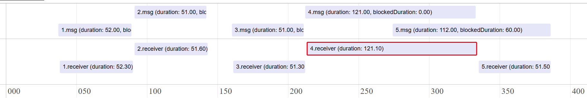
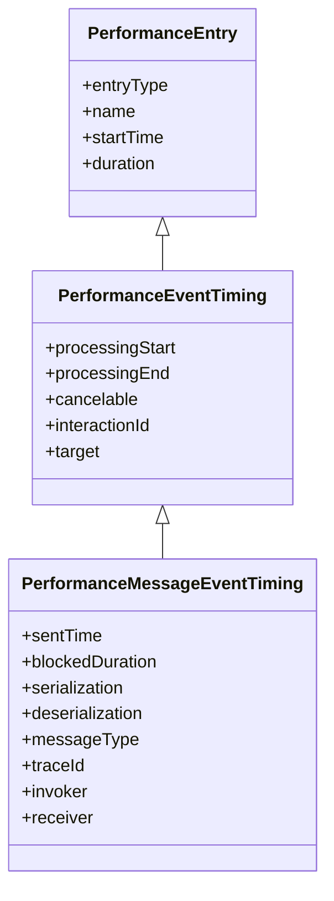

# Explainer: Congested Moment API

Author: [Joone Hur](https://github.com/joone) (Microsoft), Noam Rosenthal (Google) 

<!-- START doctoc generated TOC please keep comment here to allow auto update -->
<!-- DON'T EDIT THIS SECTION, INSTEAD RE-RUN doctoc TO UPDATE -->
# Table of Contents

- [Introduction](#introduction)
- [Goals](#goals)
- [Non-Goals](#non-goals)
- [Problems](#problems)
  - [1. Long-running tasks blocking the event loop](#1-long-running-tasks-blocking-the-event-loop)
    - [Long-running JavaScript tasks](#long-running-javascript-tasks)
  - [2. Task queue buildup from high-frequency work](#2-task-queue-buildup-from-high-frequency-work)
    - [Concurrent task sources causing queue congestion](#concurrent-task-sources-causing-queue-congestion)
    - [Queue buildup from high-frequency postMessage calls](#queue-buildup-from-high-frequency-postmessage-calls)
  - [3. Delays from browser-internal operations](#3-delays-from-browser-internal-operations)
    - [Microtask checkpoint processing](#microtask-checkpoint-processing)
    - [Serialization/Deserialization Overhead](#serializationdeserialization-overhead)
- [Proposed Solution: Congested Moment API](#proposed-solution-congested-moment-api)
  - [What is Congested Moment?](#what-is-congested-moment)
  - [How to use the API](#how-to-use-the-api)
  - [Congested Moment Entry Structure](#congested-moment-entry-structure)
  - [Message Event Entry Structure](#message-event-entry-structure)
  - [`PerformanceMessageScriptInfo` and `PerformanceExecutionContextInfo`](#performancemessagescriptinfo-and-performanceexecutioncontextinfo)
- [Relationship to the Long Animation Frames (LoAF) API](#relationship-to-the-long-animation-frames-loaf-api)
  - [Limitations of LoAF](#limitations-of-loaf)
    - [1. Not directly applicable to non-rendering contexts](#1-not-directly-applicable-to-non-rendering-contexts)
    - [2. A single LoAF entry cannot represent a congested moment](#2-a-single-loaf-entry-cannot-represent-a-congested-moment)
    - [3. Limited attribution of non-task delays](#3-limited-attribution-of-non-task-delays)
- [Relationship to the Delayed Message Timing API](#relationship-to-the-delayed-message-timing-api)
- [Alternatives Considered](#alternatives-considered)
  - [DevTools Tracing](#devtools-tracing)
  - [Manual Instrumentation / Polyfills](#manual-instrumentation--polyfills)
  - [Long Animation Frames (LoAF) API](#long-animation-frames-loaf-api)
- [Security and Privacy Considerations](#security-and-privacy-considerations)
- [Discussion](#discussion)
  - [Threshold for Identifying a Congested Moment](#threshold-for-identifying-a-congested-moment)
  - [Relationship to Event Timing API](#relationship-to-event-timing-api)
- [Related Discussion, Articles, and Browser Issues](#related-discussion-articles-and-browser-issues)
- [Acknowledgements](#acknowledgements)
- [References](#references)

<!-- END doctoc generated TOC please keep comment here to allow auto update -->

# Introduction

Modern web applications involve multiple execution contexts, such as documents, iframes, and workers, which process tasks including user input, timers, rendering updates, and messaging. Responsiveness depends on the timely execution of these tasks. However, execution contexts may become congested due to long-running tasks, high task arrival rates, or internal browser operations. As a result, runnable tasks may be delayed, leading to degraded user experience.

The Congested Moment API is a proposed Web Performance API that identifies all sources of delays during periods of persistent congestion in execution contexts. Developers can easily pinpoint the exact source of congestion using this API, without manual instrumentation.

# Goals

* **Detect congested execution contexts and congestion intervals**: Allow developers to identify execution contexts (e.g., documents, iframes, or workers) and the time intervals during which event or message processing is delayed.
* **Attribute causes of blocking**: Help developers identify tasks or operations that delay the processing of runnable events, including both script execution and internal browser operations.
* **Provide end-to-end timing for messaging**: Provide timing information for messaging events (e.g., [MessageEvent](https://developer.mozilla.org/en-US/docs/Web/API/MessageEvent)), including queueing delay and processing duration, to help diagnose latency in cross-context communication.

# Non-Goals

This API does not aim to monitor or provide diagnostics for the following types of message communications:

  * [Server-sent events](https://developer.mozilla.org/en-US/docs/Web/API/Server-sent_events)
  * [WebSockets](https://developer.mozilla.org/en-US/docs/Web/API/WebSockets_API)
  * [WebRTC data channels](https://developer.mozilla.org/en-US/docs/Web/API/RTCDataChannel)

# Problems

Users may experience delays in rendering or interaction, such as content not updating promptly after user input. These delays often occur when an execution context becomes congested and is unable to process events or messages in a timely manner.

Congestion may arise from various sources, including long-running tasks, a high rate of incoming tasks, or internal browser operations. Understanding the causes of such congestion, as well as which events are affected, is essential for diagnosing and improving application responsiveness.

We can categorize the problems into three types:

**1. Long-running tasks blocking the event loop**

The event loop is occupied by tasks or operations that run for a long duration, preventing runnable work from being processed.

This includes:
* Long-running JavaScript tasks
* Extended microtask execution (e.g., long Promise chains)
* Synchronous APIs that block the main thread

**2. Task queue buildup from high-frequency work**

Runnable tasks are enqueued faster than they can be processed, resulting in a growing queue and delayed execution. This can occur from a single high-frequency source or from multiple independent sources whose combined rate exceeds processing capacity.

This can occur when:

* High-frequency task sources (e.g., input events, timers, network callbacks, or messaging) continuously enqueue work
* Multiple independent sources (e.g., input events and timers, or messages from multiple workers) enqueue work concurrently
* Medium-duration tasks accumulate without sufficient idle gaps

For example, frequent messaging (e.g., repeated `postMessage` calls between windows, frames, or workers) can enqueue `message` events faster than they can be processed, leading to a sustained backlog even when individual handlers are short.

**3. Delays from browser-internal operations**

The execution context is delayed by internal browser operations that run on the event loop but are not always visible as explicit JavaScript tasks.

Examples include:
* Garbage collection pauses
* Style and layout processing
* Rendering-related processing
* Message serialization and deserialization
* Microtask checkpoint processing

The following sections will analyze each area with examples. Some examples involve web workers, but similar situations can also occur between the main window and iframes.

## 1. Long-running tasks blocking the event loop

A long-running task fully occupies the event loop of an execution context, blocking all other runnable work until it completes. This applies to both the main thread and web workers. Even though workers run off the main thread, a long task in a worker still blocks that worker's own event loop.

### Long-running JavaScript tasks

The following example code demonstrates how a long-running task on a worker thread can block subsequent messages in its task queue.

[Link to live demo](https://wicg.github.io/delayed-message-timing/examples/long_task/)

**index.html**

```html
<!DOCTYPE html>
<html lang="en">
<head>
    <meta charset="UTF-8">
    <title>Delayed Messages in Web Workers Caused by Task Overload</title>
</head>
<body>
    <h3>Delayed Messages in Web Workers Caused by Task Overload</h3>
    <button onclick="runWorker()">Start</button>
    <p id="result"></p>
    <script src="main.js"></script>
</body>
</html>
```

**main.js**

When the user clicks the "Start" button, the `runWorker` function dispatches five messages to the worker at 60ms intervals. Each message includes an input number that dictates how long a simulated task should run in the worker.

```javascript
function runWorker() {
  const worker = new Worker("worker.js", { name: "long_task_worker" });
  let i = 0;
  const interval = 60; // Interval in milliseconds
  const inputArray = [50, 50, 50, 120, 50]; // Durations for tasks in worker

  // Function to send messages to the worker at the specified interval
  function sendMessage() {
    if (i < inputArray.length) {
      const input = inputArray[i];
      // Send a message to the worker
      worker.postMessage({
        no: i+1,
        input: input,
        startTime: performance.now() + performance.timeOrigin, // Absolute time
      });
      i++;
    } else {
      // Stop sending messages.
      clearInterval(messageInterval);
    }
  }

  // Start sending messages every 60ms
  const messageInterval = setInterval(sendMessage, interval);
}
```

**worker.js**

The web worker receives messages and simulates a task that runs for the duration specified by `e.data.input`. If this duration is greater than the message sending interval (60ms), it can block subsequent messages.

```javascript
// Simulates a task that consumes CPU for a given duration
function runTask(duration) {
  const start = Date.now();
  while (Date.now() - start < duration) { // Use duration directly
    /* Busy wait to simulate work */
  }
}

onmessage = function runLongTaskOnWorker(e) {
  const processingStart = e.timeStamp; // Time when onmessage handler starts
  const taskStartTime = performance.now();
  
  runTask(e.data.input); // Simulate the work
  
  const taskDuration = performance.now() - taskStartTime;
  // Calculate timings relative to worker's performance.timeOrigin
  const startTime = e.data.startTime - performance.timeOrigin;
  const blockedDuration = processingStart - startTime;
};
```

The following timeline illustrates message handling:


In this timeline, messages \#1, \#2, and \#3 are handled promptly because their simulated tasks (50ms) complete within the 60ms interval at which messages are sent.

However, message \#4's task is instructed to run for 120ms. While it's processing, message \#5 (sent 60ms after message \#4 was sent) arrives at the worker. Message \#5 must wait in the worker's task queue until message \#4 completes. This results in message \#5 experiencing a significant delay (approximately 60ms) before its handler can even begin.

Manually instrumenting code with `performance.now()` and `event.timeStamp` can help identify the root cause of delays as shown. However, in complex real-world applications, precisely identifying which long task caused a specific message delay, or distinguishing between delay caused by a preceding long task versus a message's own long handler, is very challenging without comprehensive, dedicated monitoring.

## 2. Task queue buildup from high-frequency work

Congestion can also occur when tasks arrive faster than they can be processed, even if no single task is long. On the main thread, this happens when high-frequency sources such as input events, timers, or network callbacks saturate the queue. In web workers, it occurs when a large volume of messages is posted in a short period. In both cases, the accumulated backlog delays subsequent tasks, including time-sensitive ones.

### Concurrent task sources causing queue congestion

In this example, `mousemove` events and a periodic timer callback independently enqueue tasks on the same event loop. Although each task does only a small amount of work, their combined arrival rate can exceed the event loop's processing capacity and cause the timer callback to experience noticeable delay.

[Link to live demo](https://wicg.github.io/delayed-message-timing/congested_moment/concurrent_task_sources/)

```html
<!doctype html>
<html>
  <body>
    <h3>Move your mouse inside the box</h3>
    <div id="area" style="width:300px;height:200px;border:1px solid black;"></div>

    <script>
      // Simulate work
      function busyWork(ms) {
        const start = performance.now();
        while (performance.now() - start < ms) {}
      }

      const NOTICEABLE_DELAY_MS = 50;

      // INPUT EVENT SOURCE
      document.getElementById("area").addEventListener("mousemove", (e) => {
        const schedulingDelay = performance.now() - e.timeStamp; // how late the event was handled
        busyWork(8); // small work per event
        if (schedulingDelay > NOTICEABLE_DELAY_MS)
          console.log(`mousemove scheduling delay: ${schedulingDelay.toFixed(1)} ms`);
      });

      // TIMER SOURCE
      const interval = 100;
      let expectedTime = performance.now() + interval;
      setInterval(() => {
        const now = performance.now();
        const schedulingDelay = now - expectedTime; // how late the timer actually fired
        expectedTime = now + interval;

        busyWork(5); // background periodic work

        if (schedulingDelay > NOTICEABLE_DELAY_MS)
          console.log(`Timer scheduling delay: ${schedulingDelay.toFixed(1)} ms`);
      }, interval);

      console.log("Move your mouse rapidly inside the box...");
    </script>
  </body>
</html>
```

### Queue buildup from high-frequency postMessage calls

This example demonstrates how task queues in web workers can become congested when tasks take longer to process than the rate at which messages are sent. It sends delete tasks every 30ms, then a read task, measuring queue wait times to show the congestion effect.

[Link to live demo](https://wicg.github.io/delayed-message-timing/examples/congested/)

**index.html**

```html
<!doctype html>
<html lang="en">
  <head>
    <meta charset="UTF-8" />
    <meta name="viewport" content="width=device-width, initial-scale=1.0" />
    <title>An example of a task queue experiencing congestion</title>
  </head>
  <body>
    <h1>Task Queue Congestion Example</h1>
    <button onclick="sendTasksToWorker()">Start</button>
    <script src="main.js"></script>
  </body>
</html>
```

**main.js**

In main.js, the email application sends 10 deleteMail tasks every 30 ms to clear junk emails, keeping the worker occupied with intensive processing. Shortly after, the user requests to check their emails, requiring an immediate response.

```js
const worker = new Worker("worker.js");

// Counter for generating unique email IDs for each delete task
let emailID = 0;

function sendTasksToWorker() {
  const interval = setInterval(() => {
    // Send delete task with unique email ID and timestamp
    worker.postMessage({
      emailId: emailID,
      taskName: `deleteMail`,
      startTime: performance.now() + performance.timeOrigin, // Absolute timestamp for timing analysis
    });
    console.log(`[main] dispatching the deleteMail task(email ID: #${emailID})`);
    emailID++;
    if (emailID >= 10) {
      clearInterval(interval);
      // Send final read task - this will experience the most queue delay
      worker.postMessage({
        taskName: "checkMails",
        startTime: performance.now() + performance.timeOrigin, // Timestamp when task is queued
      });
      console.log("[main] dispatching the checkMail task");
    }
  }, 30); // 30ms interval creates congestion (faster than worker's 50ms task duration)
}
```

**worker.js**

The web worker's `onmessage` handler processes `deleteMail` and `checkMails` tasks received from the main thread. Each task requires 50ms to complete.

```js
onmessage = async (event) => {
  const processingStart = event.timeStamp; // Time when worker starts processing this message
  const startTimeFromMain = event.data.startTime - performance.timeOrigin; // Convert to worker timeline
  // Calculate task queue wait time by comparing when the message
  // was sent (from main thread) vs when it started processing (in worker)
  const blockedDuration = processingStart - startTimeFromMain;
  const message = event.data;

  if (message.taskName === "checkMails") {
    await checkMails(message, blockedDuration);
  } else if (message.taskName === "deleteMail") {
    await deleteMail(message, blockedDuration);
  }
};

// Check emails from the mail storage
function checkMails(message, blockedDuration) {
  const startRead = performance.now();
  // Simulate task
  const start = Date.now();
  while (Date.now() - start < 50) {
    /* Do nothing */
  }
  const endRead = performance.now();
  console.log(
    `[worker] ${message.taskName},`,
    `blockedDuration: ${blockedDuration.toFixed(2)} ms,`,
    `duration: ${(endRead - startRead).toFixed(2)} ms`,
  );
}

// Delete an email by ID.
async function deleteMail(message, blockedDuration) {
  return new Promise((resolve) => {
    const startDelete = performance.now();
    // Simulate the delete task.
    const start = Date.now();
    while (Date.now() - start < 50) {
      /* Do nothing */
    }
    const endDelete = performance.now();
    console.log(
      `[worker] ${message.taskName}(email ID: ${message.emailId}),`,
      `blockedDuration: ${blockedDuration.toFixed(2)} ms,`,
      `duration: ${(endDelete - startDelete).toFixed(2)} ms`,
    );
    resolve();
  });
}
```

The following timeline illustrates this congestion:


In this scenario, the worker processes 10 `deleteMail` tasks, each taking 50ms, while being sent every 30ms. This disparity causes tasks to accumulate in the task queue. Consequently, later tasks, like the 11th task `checkMails`, spend a significant amount of time waiting in the queue (e.g., 245ms) even if their own processing time is short (e.g., 51.5ms).

While delays in background tasks like `deleteMail` might be acceptable, delays in user-initiated, high-priority tasks like `checkMails` severely impact user experience. It's important for developers to identify if a browser context or worker is congested and which tasks contribute most to this congestion.

## 3. Delays from browser-internal operations

Some delays originate from browser-internal operations that are not directly visible as JavaScript tasks. The following examples demonstrate how microtask processing and serialization overhead can contribute to congestion.

### Microtask checkpoint processing

Microtask checkpoint processing executes all pending microtasks (such as Promise reactions) to completion before returning to the task queue. A large or continuously growing microtask queue can delay the dispatch of runnable tasks, leading to sustained congestion even when individual microtasks are short.

Although Promise chains are initiated by JavaScript code, the delay they cause is not obvious from the code alone. The mechanism is an internal browser behavior: the browser drains the entire microtask queue before processing the next task. As a result, a `message` event or other pending task can be delayed significantly without any indication in the JavaScript code that this is happening.

The following example demonstrates how chained Promise reactions can delay a `message` event. When the button is clicked, a `postMessage()` call enqueues a `message` event, but a recursive Promise chain that runs for 1000ms keeps the microtask queue occupied — preventing the `message` event from being dispatched until all microtasks complete.

[Link to live demo](https://wicg.github.io/delayed-message-timing/congested_moment/microtask_checkpoint)

```html
<!doctype html>
<html>
  <body>
    <button id="start">Start</button>

    <script>
      window.addEventListener("message", (event) => {
        console.log("MessageEvent task ran:", event.data);
      });

      document.getElementById("start").addEventListener("click", () => {
        console.log("Click handler started");

        // Enqueue a MessageEvent task.
        console.log("Posting a message to enqueue a MessageEvent task...");
        window.postMessage("ping");

        // Keep enqueuing microtasks via chained Promises for 1000ms.
        const deadline = performance.now() + 1000;
        let count = 0;
        function chainPromise() {
          count++;
          if (performance.now() < deadline) {
            return Promise.resolve().then(chainPromise);
          }
          console.log(`Chained Promise microtasks completed: ${count}`);
        }
        chainPromise();

        console.log("Click handler finished");
      });
    </script>
  </body>
</html>
```

### Serialization/Deserialization Overhead

When data is sent using `postMessage()`, it undergoes serialization by the sender and deserialization by the receiver. For large or complex JavaScript objects (e.g., a large JSON payload or a deeply nested object), these processes can consume considerable time, blocking the respective threads.

The following example code demonstrates the delay introduced by serializing/deserializing a large JSON object during `postMessage()`.

[Link to live demo](https://wicg.github.io/delayed-message-timing/examples/serialization/)

**index.html**

```html
<!doctype html>
<html lang="en">
  <head>
    <meta charset="UTF-8" />
    <title>postMessage Serialization/Deserialization Performance Impact</title>
  </head>
  <body>
    <button id="sendJSON">Send Large JSON (~7MB)</button>
    <script src="main.js"></script>
  </body>
</html>
```

**main.js**

In the main.js file, 7000 JSON objects are sent to the worker using `postMessage()`. The duration of serialization can be measured by calling `performance.now()` before and after executing `postMessage()`.

```js
const worker = new Worker("worker.js");

// Generate a large JSON object to demonstrate serialization overhead
function generateLargeJSON(size) {
  const largeArray = [];
  for (let i = 0; i < size; i++) {
    largeArray.push({ 
      id: i, 
      name: `Item ${i}`, 
      data: Array(1000).fill("x") // Each item contains ~1KB of string data
    });
  }
  return { items: largeArray }; // Returns ~7MB object when size=7000
}

// Send a large JSON object to the worker to demonstrate serialization overhead
function sendLargeJSON() {
  const largeJSON = generateLargeJSON(7000); // ~7MB of data
  console.log("[main] Dispatching a large JSON object to the worker.");

  // Measure time for postMessage call (includes serialization)
  const startTime = performance.now();
  worker.postMessage({
    receivedData: largeJSON,
    startTime: startTime + performance.timeOrigin,
  });
  const endTime = performance.now();
  
  // Note: This timing includes serialization but may also include other overhead
  console.log(
    `[main] postMessage call duration (includes serialization): ${(endTime - startTime).toFixed(2)} ms`,
  );
}

// Add event listener to the button
document.getElementById("sendJSON").addEventListener("click", sendLargeJSON);
```

**worker.js**

In worker.js, the duration of deserialization is estimated by calling `performance.now()` immediately before and after the first access to properties of event.data (e.g., `event.data.startTime`), as this access typically triggers the deserialization process.

```js
// Worker receives large data
onmessage = (event) => {
  const processingStart = event.timeStamp;
  // Measure deserialization time by accessing the large data object
  // Note: Deserialization typically occurs when data is first accessed (implementation-dependent)
  const deserializationStartTime = performance.now();
  const startTimeFromMain = event.data.startTime - performance.timeOrigin;
  const receivedData = event.data.receivedData;
  const deserializationEndTime = performance.now();
  const blockedDuration = processingStart - startTimeFromMain;

  console.log("[worker] Deserialized Data:", receivedData.items.length, "items.");
  console.log(
    "[worker] Deserialization time:",
    (deserializationEndTime - deserializationStartTime).toFixed(2),
    "ms",
  );

  const totalDataProcessingTime = (deserializationEndTime - startTimeFromMain); 
  console.log("[worker] blockedDuration (including serialization):", blockedDuration.toFixed(2), "ms");
  console.log("[worker] serialization + deserialization (estimate):", totalDataProcessingTime.toFixed(2), "ms");
};
```

**Console logs**
```
[main] Dispatching a large JSON object to the worker.
[main] postMessage call duration (~7MB object serialization): 111.20 ms
[worker] Deserialized Data: 7000 items.
[worker] Deserialization time: 454.40 ms
[worker] blockedDuration (including serialization): 111.10 ms
[worker] serialization + deserialization (estimate): 566.00 ms
```
As shown, serialization on the main thread (approx. 111.20 ms) occurs synchronously during the `postMessage()` call, blocking other main thread work. Similarly, deserialization on the worker thread (approx. 454.40 ms) is a significant operation that blocks the worker's event loop during message processing, delaying the execution of the `onmessage` handler and any subsequent tasks.

In this example, the worker log `blockedDuration: 111.10 ms` indicates the time elapsed from when the main thread initiated the `postMessage()` (including its 111.20 ms serialization block) to when the worker's `onmessage` handler began execution. This suggests that the task queue wait time is nearly zero, and the delay is primarily caused by serialization on the sender side. However, the cost of data handling is difficult to estimate because the size of the message payload can vary depending on the scenario.

# Proposed Solution: Congested Moment API

## What is Congested Moment?

A **Congested Moment** is a time interval during which an execution context, such as the main thread or a web worker, is persistently overloaded and unable to process events in a timely manner.

More precisely, a Congested Moment is a continuous time interval where:

1. At least one _runnable_ task is pending (spent more than 200ms in the message queue)
   (e.g. MessageEvent, UIEvent, StorageEvent, FetchEvent).
2. Event handling is blocked by one or more long-running tasks or equivalent delays.
3. The interval ends when **no runnable tasks remain pending**.

## How to use the API

```js
const observer = new PerformanceObserver((list) => {
  console.log(list.getEntries());
});

observer.observe({ type: 'congested-moment', buffered: true });
```

## Congested Moment Entry Structure

```js
const someCongestedMomentEntry = {
  entryType: "congested-moment",
  startTime,   // When congestion began
  duration,    // Total duration of the congested moment (endTime = startTime + duration)

  // --- Congestion summary ---
  taskCount,         // Total tasks executed during the interval
  scriptTaskCount,   // Tasks that were JS entry-points

  // Duration breakdown by congestion source:
  scriptDuration,          // Total time executing scripts
  gcDuration,              // Time in garbage collection pauses
  microtaskDuration,       // Time draining microtask queues
  serializationDuration,   // Total serialization cost
  deserializationDuration, // Total deserialization cost

  // --- Blocking scripts (PerformanceScriptTiming[], reuses LoAF mechanism) ---
  // https://developer.mozilla.org/en-US/docs/Web/API/PerformanceScriptTiming
  scripts: [
    {
      name,          // "script"
      entryType,     // "script"
      startTime,     // When script execution began
      duration,      // Elapsed time through microtask queue completion

      // Invocation
      invokerType,   // "classic-script" | "module-script" | "event-listener" | "user-callback" | "resolve-promise" | "reject-promise"
      invoker,       // Descriptive identifier of what triggered execution (e.g. "Worker.onmessage")
      executionStart, // When actual execution began (after compilation, if any)

      // Source attribution
      sourceURL,           // e.g. "https://example.com/worker.js"
      sourceFunctionName,  // e.g. "runTask"
      sourceCharPosition,  // Character offset within the source file

      // Blocking costs
      pauseDuration,                 // Time in synchronous blocking ops (alert, sync XHR, etc.)
      forcedStyleAndLayoutDuration,  // Time in forced style/layout (main thread only)

      // Window attribution (main thread only; null in worker contexts)
      window,             // Reference to originating same-origin window, or null
      windowAttribution,  // "self" | "descendant" | "ancestor" | "same-page" | "other"
    }
  ],

  // --- Delayed events that triggered or fell within this congested moment ---
  delayedEvents: [
    // UI events (click, mousemove, etc.) — PerformanceEventTiming shape
    {
      name,            // e.g. "click", "mousemove"
      entryType,       // "event"
      startTime,
      duration,
      processingStart,
      processingEnd,
      cancelable,
      interactionId,
      target,
      blockedDuration  // Time waiting in queue before processingStart
    },
    // Message events (postMessage, BroadcastChannel, MessageChannel) - PerformanceMessageEventTiming
    {
      name,            // "message"
      entryType,       // "event"
      startTime,       // When postMessage() was called (sender clock, adjusted)
      duration,        // startTime → processingEnd
      sentTime,        // When message was enqueued in receiver's task queue
      processingStart,
      processingEnd,
      blockedDuration, // sentTime → processingStart (pure queue wait)
      serialization,   // Time to serialize on sender side
      deserialization, // Time to deserialize on receiver side
      messageType,     // "cross-worker-document" | "channel" | "cross-document" | "broadcast-channel"
      traceId,         // For correlating sender and receiver entries
      invoker,         // PerformanceMessageScriptInfo — script that called postMessage()
      receiver         // PerformanceMessageScriptInfo — script handling the message
    }
  ]
}
```

## Message Event Entry Structure



Message events contribute to execution context congestion both as sources of blocking work and as delayed tasks that accumulate in the queue. To expose their end-to-end timing, we propose **PerformanceMessageEventTiming**, a new interface that extends the [Event Timing API](https://developer.mozilla.org/en-US/docs/Web/API/PerformanceEventTiming).

```js
const someMessageEventEntry = {
  name: "message",
  entryType: "message",

  // Timing
  startTime,       // When postMessage() was called on the sender side
  duration,        // startTime → processingEnd
  sentTime,        // When the message was enqueued in the receiver's task queue
  processingStart, // When the onmessage handler began executing
  processingEnd,   // When the onmessage handler completed

  // Attribution
  blockedDuration,  // sentTime → processingStart (pure queue wait time)
  serialization,    // Time spent serializing the message on the sender side
  deserialization,  // Time spent deserializing the message on the receiver side

  // Message metadata
  messageType, // "cross-worker-document" | "channel" | "cross-document" | "broadcast-channel"
  traceId,     // Unique identifier to correlate sender and receiver entries

  // Script attribution (PerformanceMessageScriptInfo)
  invoker,  // Details about the script that called postMessage()
  receiver  // Details about the script handling the message
}
```

## `PerformanceMessageScriptInfo` and `PerformanceExecutionContextInfo`

`PerformanceMessageScriptInfo` provides attribution details for the script responsible for sending (`invoker`) or handling (`receiver`) a `message` event, including the source URL, function name, and position within the source file. Its `executionContext` property is a `PerformanceExecutionContextInfo` instance that identifies the type of execution context (window, iframe, or worker) where that script is running. Together, these interfaces allow developers to pinpoint exactly which script and context is responsible for a delayed message event.

```js
const somePerformanceMessageScriptInfo = {
  name,                 // "invoker" or "receiver"
  sourceURL,            // URL of the script that sent or handled the message
  sourceFunctionName,   // Function name at the call site; empty string if unavailable
  sourceCharPosition,   // Character offset within the source file
  sourceLineNumber,     // Line number within the source file
  sourceColumnNumber,   // Column number within the source file

  executionContext: {
    id,    // Unique integer ID for this context within the agent cluster (e.g. 0 = main thread)
    name,  // Worker name from new Worker("...", { name }), or window.name; may be empty
    type   // "main-thread" | "dedicated-worker" | "shared-worker" | "service-worker" | "window" | "iframe"
  }
}
```

# Relationship to the Long Animation Frames (LoAF) API

The Long Animation Frames (LoAF) API provides visibility into long animation frames on the main thread, helping developers identify expensive work that contributes to rendering delays and visual jank.

While LoAF is effective for diagnosing rendering-related performance issues, it does not fully capture all forms of responsiveness degradation.

## Limitations of LoAF

### 1. Not directly applicable to non-rendering contexts

LoAF is semantically and architecturally tied to the rendering pipeline. Its name ("Long Animation Frames") and several of its properties, including `renderStart`, `styleAndLayoutStart`, and `firstUIEventTimestamp`, are specific to the rendering context and have no meaning in a web worker, where no animation frames are produced and no rendering pipeline exists.

Beyond naming, LoAF's 50ms threshold is not appropriate for web workers. Web workers are specifically designed to run longer-duration tasks in order to offload work from the main thread.Applying a 50ms threshold in that context would produce entries even when there is no real responsiveness problem.

Therefore, adapting LoAF for workers would require redefining its core unit (replacing animation frames with task clusters), replacing its threshold semantics, and dropping rendering-specific properties, amounting to a new API that inherits only the name. The Congested Moment API is designed from the ground up to apply uniformly to both the main thread and worker contexts, with a threshold and model suited to each.

### 2. A single LoAF entry cannot represent a congested moment

LoAF is frame-cadenced. The HTML event loop interleaves rendering opportunities between tasks: after each task completes, the browser can produce a rendering update. This creates two distinct blind spots when diagnosing congestion with LoAF.

**Case 1: Many short tasks — LoAF reports nothing.**
LoAF's threshold is fixed at 50ms and is calibrated for detecting slow frame production, not task queue backlog. If individual tasks are each under 50ms, every rendered frame is short and no LoAF entry is triggered, even if the task queue is severely backlogged.

For example, suppose a worker sends 100 `postMessage` calls to the main thread in rapid succession, and each message handler completes in under 5ms. Since each task is well below the 50ms threshold and a frame update can occur between tasks, LoAF would detect no delay at all. Yet the main thread has accumulated a backlog of 100 messages, and the last one must wait approximately 99 × 5ms ≈ 495ms before it can begin processing. Congested Moment would surface this as a single entry; LoAF would report nothing.

**Case 2: Many long tasks — LoAF produces fragmented entries.**
If individual tasks each exceed 50ms, each rendered frame is long enough to trigger a LoAF entry. However, each entry covers only one frame. A sustained 500ms congestion period produced by ten 60ms tasks would generate multiple LoAF entries, one per long frame, rather than a single entry representing the congestion interval as a whole. A developer would need to manually correlate those entries across time to reconstruct what Congested Moment surfaces as a single, unified signal.

**On adding `desiredStartTime` or similar scheduling metadata.**
A `desiredStartTime` field on a LoAF entry would expose when the first task in a given frame was originally scheduled, allowing per-frame scheduling delay to be computed like this:
```
schedulingDelay = startTime - desiredStartTime
```
This is useful metadata, but it does not resolve the two blind spots above. In Case 1, no LoAF entries are produced at all, so there is no entry on which `desiredStartTime` could appear, meaning the scheduling delay remains invisible to the developer. In Case 2, `desiredStartTime` would appear on each fragmented entry but would still require manual correlation across entries to reconstruct the full congestion interval. Neither case produces a single entry representing the sustained backlog as a whole, which is what Congested Moment is specifically designed to provide.

### 3. Limited attribution of non-task delays

LoAF attributes work within frames, primarily focusing on script execution and rendering-related tasks. However, delays may also arise from internal browser operations that are not easily attributed to a specific task.

Examples include:

* Garbage collection pauses
* Microtask checkpoint processing
* Message serialization and deserialization

These sources of delay may contribute to congestion without appearing clearly in LoAF entries.

# Relationship to the Delayed Message Timing API

The [Delayed Message Timing API](https://github.com/WICG/delayed-message-timing) was an earlier proposal focused on exposing timing information for individual `message` deliveries, such as when a message was sent, when processing began, and how long it waited before being handled. That proposal established the core idea that delayed `message` delivery can be an important signal of responsiveness problems, especially in communication between windows, iframes, and workers.

The Congested Moment API builds on that foundation, but broadens the scope from **individual delayed messages** to **periods of sustained congestion within an execution context**.

This change reflects two observations:

* Delayed `message` events are only one manifestation of congestion. The same overloaded execution context can also delay other runnable work, such as input events, timers, rendering-related tasks, or other queued callbacks.
* Looking at messages one by one can fragment diagnosis. In practice, multiple adjacent delayed messages are often symptoms of the same underlying cause, such as a long-running script, repeated medium-length tasks, heavy microtask processing, garbage collection, or serialization/deserialization overhead.

For this reason, this proposal shifts the primary unit of observation from the **individual delayed message** to the **congested interval** that caused the delay.

At the same time, the message-timing concepts introduced by the Delayed Message Timing API remain important. Message delivery still needs end-to-end timing and attribution, including:

* when sending began
* when the message became runnable in the receiver
* how long it waited before processing
* how much time was spent in serialization and deserialization
* which scripts and execution contexts were responsible for sending and handling the message

Rather than defining a separate delayed-message-specific performance entry, this proposal incorporates those concepts into **`PerformanceMessageEventTiming`**, treating `message` delivery as a specialized form of event timing. This aligns the model more closely with the broader event timing ecosystem, while still exposing the message-specific fields needed for cross-context diagnostics.

In this model:

* **`PerformanceMessageEventTiming`** provides per-message timing and attribution.
* **`PerformanceCongestedMomentTiming`** provides interval-level attribution for sustained congestion and can include delayed `message` events alongside other affected work.

As a result, the Congested Moment API should be viewed as an evolution of the Delayed Message Timing API rather than a separate direction: it preserves the useful per-message timing model, but places it within a more general framework for understanding execution-context congestion.

# Alternatives Considered

## DevTools Tracing

Modern browser developer tools offer tracing capabilities that can show task execution timelines and event dispatch. While useful for manual inspection, these tools are not designed for systematic, large-scale metric collection, aggregation, or automated performance monitoring in production environments.

The Congested Moment API offers structured timing data suitable for production monitoring. It enables automated detection and attribution of congestion without requiring manual tooling, developer intervention, or complex trace analysis.

## Manual Instrumentation / Polyfills

Developers can attempt to instrument event timing manually by wrapping `postMessage()` calls and `onmessage` handlers with `performance.now()`, or using `addEventListener` to measure UI event dispatch latency. The [Event Timing API](https://w3c.github.io/event-timing/) already exposes per-event timing for UI events (e.g., `click`, `keydown`, `pointerdown`) via `PerformanceObserver`, providing some coverage without manual wrapping. However, these approaches have several drawbacks:

* They cover individual event categories in isolation; no single approach captures `postMessage` events, UI events, and worker-side events together.
* It's challenging to intercept all event sources, especially those from third-party libraries.
* Accurately measuring internal browser operations like GC pauses, microtask processing, serialization, deserialization, and precise queue wait time is not feasible from JavaScript.
* Detecting that a period of congestion has begun and ended requires constant polling or heuristics.
* The Event Timing API is limited to the main thread and does not apply to worker contexts.

A native API can provide more accurate and comprehensive data with lower overhead, covering all event types across both the main thread and workers.

## Long Animation Frames (LoAF) API

LoAF provides script-level attribution for long frames on the main thread. However, as described above, it is frame-oriented, main-thread-only, and does not represent sustained queue congestion or internal browser delays. The Congested Moment API is designed to complement LoAF, not replace it.

# Security and Privacy Considerations

This API is designed to provide developers with insights into the performance of their own applications and does not introduce new cross-origin information leakage.

* **Same-Origin Data:** `PerformanceCongestedMomentTiming` entries are only exposed to the same origin being observed. The `scripts` property within the entry and within `delayedEvents` only contains information about same-origin scripts. Cross-origin script URLs and function names are not revealed.
* **No New Cross-Origin Information:** The API does not expose any new information about cross-origin interactions that isn't already observable through other means. Details of cross-origin execution contexts or script contents are not revealed.
* **Fingerprinting:** The risk of this API being used for user fingerprinting is considered low.
  * The information provided reflects the performance characteristics of the web application itself, not the user's underlying hardware beyond what influences JavaScript execution speed.
  * The 200ms pending threshold for triggering a congested moment entry limits the volume and granularity of data reported, making it less suitable for fingerprinting.
  * Timing variations are more likely attributable to application state and workload than to unique user environment characteristics.

# Discussion

## Threshold for Identifying a Congested Moment

We propose that a congested moment is triggered when at least one runnable event has been pending for more than **200ms**. This threshold aligns with the default `durationThreshold` used in the Delayed Message Timing API and represents a duration that is perceptible to users as a meaningful delay.

However, the impact of a delay is context-dependent. A 200ms delay in a background worker task may be harmless, while the same delay during a user interaction with the main thread could significantly degrade responsiveness. Further discussion is needed on whether a configurable threshold (similar to `durationThreshold` in LoAF and Event Timing) should be supported.

## Relationship to Event Timing API

The `PerformanceMessageEventTiming` interface extends `PerformanceEventTiming`. Whether delayed `message` events should be reported by the existing `event` observer or the `congested-moment` observer or both is an open question. Keeping them within the congested moment entry ensures message event timing is only reported in contexts where it is actionable (i.e., when congestion has actually occurred).

# Related Discussion, Articles, and Browser Issues

- **Chromium Issue:** [Support Long Tasks API in workers](https://issues.chromium.org/issues/41399667)
  Web developers are interested in extending the Long Tasks API to monitor delayed execution in web workers. Unlike the Long Animation Frames (LoAF) API, the current Long Tasks API lacks script attribution, making it harder to trace the source of delays.

- **Chromium Issue:** [postMessage between Trello and iframes timing out more frequently](https://issues.chromium.org/issues/40723533)
  This issue highlights increasing latency in `postMessage` communication between Trello and embedded iframes, suggesting a need for better diagnostics around message delivery delays.

- **Article:** [Is postMessage slow?](https://surma.dev/things/is-postmessage-slow/)
  This article explains how serialization and deserialization are major sources of delay in `postMessage()` usage. While `SharedArrayBuffer` can eliminate copying overhead via shared memory, its real-world usage is limited due to strict security constraints and the complexity of manual memory management.

# Acknowledgements

Thank you to Abhishek Shanthkumar, Alex Russell, Andy Luhrs, Dave Meyers, Ethan Bernstein, Evan Stade, Jared Mitchell, Luis Pardo, Michal Mocny, Noam Helfman, Noam Rosenthal, Sam Fortiner, Samuele Carpineti, Steve Becker, Yoav Weiss, Yehor Lvivski for their valuable feedback and advice.

# References

- [Event Timing API](https://w3c.github.io/event-timing/)
- [Long Animation Frames (LoAF) API](https://developer.chrome.com/docs/web-platform/long-animation-frames)
- [Delayed Message Timing API Explainer](https://github.com/WICG/delayed-message-timing/blob/main/README.md)
- [Extending Long Tasks API to Web Workers](https://github.com/MicrosoftEdge/MSEdgeExplainers/blob/main/LongTasks/explainer.md)
- [PerformanceEventTiming](https://developer.mozilla.org/en-US/docs/Web/API/PerformanceEventTiming)
- [PerformanceLongAnimationFrameTiming](https://developer.mozilla.org/en-US/docs/Web/API/PerformanceLongAnimationFrameTiming)
- [PerformanceScriptTiming](https://developer.mozilla.org/en-US/docs/Web/API/PerformanceScriptTiming)
- [MessageEvent](https://developer.mozilla.org/en-US/docs/Web/API/MessageEvent)
