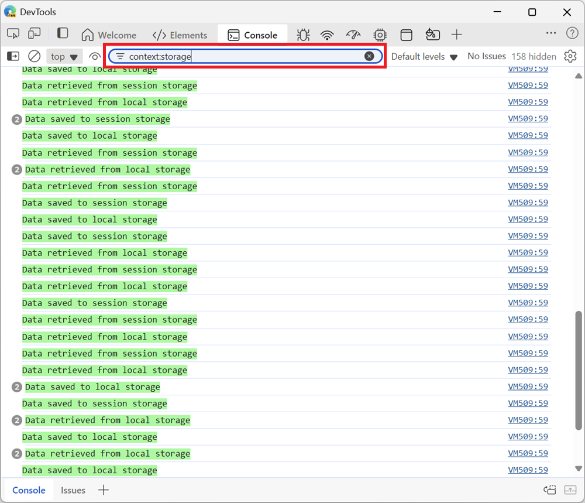
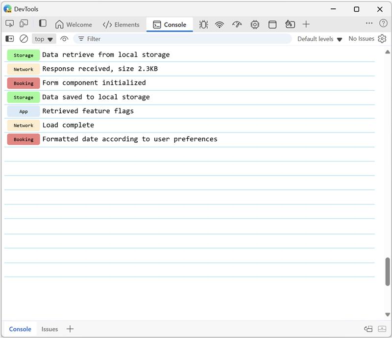
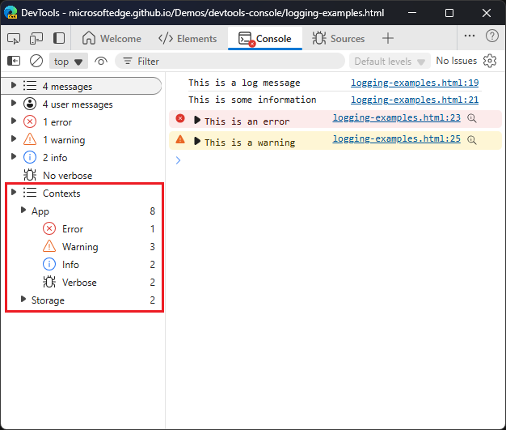

# DevTools contextual logging with `console.context()`

## Authors

 - *[Leah Tu](https://github.com/leahmsft)*, Microsoft Edge
 - *[Patrick Brosset](https://github.com/captainbrosset)*, Microsoft Edge

## Participate

- For feedback about this explainer, open [an issue on the MSEdgeExplainers repo](https://github.com/MicrosoftEdge/MSEdgeExplainers/issues/new?template=console-context.md).
- The expected venue for this is the [Console spec](https://console.spec.whatwg.org/). For feedback about the spec changes, see [console.context()](https://github.com/whatwg/console/issues/193) on the spec's repo.

## Table of Contents

* [Status of this feature](#status-of-this-feature)
* [Introduction](#introduction)
* [User-facing problem](#user-facing-problem)
* [Goals](#goals)
   * [Non-goals](#non-goals)
* [Proposed approach](#proposed-approach)
  * [Current experience in Chromium](#current-experience-in-chromium)
  * [Proposed improvements](#proposed-improvements)
    * [Changes to the `console.context()` method](#changes-to-the-consolecontext-method)
    * [Changes to the Console tool UI](#changes-to-the-console-tool-ui)
* [Alternatives considered](#alternatives-considered)
* [Accessibility, privacy, and security considerations](#accessibility-privacy-and-security-considerations)
* [Stakeholder feedback / opposition](#stakeholder-feedback--opposition)
* [References & acknowledgements](#references--acknowledgements)

## Status of this feature

An initial version of this feature has been available in [Chromium](https://chromium-review.googlesource.com/c/v8/v8/+/522128) since 2017, and Microsoft Edge starting with version 79. This explainer proposes improvements to the feature.

## Introduction

This project aims to enhance the debugging process for large web applications by improving Chromium's `console.context()` method and enhancing filter options in the Console UI. This method allows developers to define logging contexts, making it easier to filter and identify log messages. Our improvements include introducing an optional color argument to `console.context()` for quick visual differentiation and updating the Console UI with context badges and additional filter support. These changes will make debugging more efficient, improve log readability, and simplify contextual logger creation.

## User-facing problem

When debugging web applications with large code bases having many components from many different teams, it can be challenging for developers to filter through the many log messages that appear in the Console tool and find the relevant ones. Often, developers want to filter the messages so that only the ones from the component they're working on appear. For example, a developer might want to see the logs that are emitted by a given UI control only, or by a database utility module only. Other times, developers want to see all logs, but quickly identify which components of their app they belong to.

Developers can use existing techniques that help with this use case, but these techniques have limitations:

* Use the `console.group()` API to group log messages together. However:

  * This requires developers to always open a group before logging and then close it.
  * Unrelated logs can inadvertently get included into groups.
  * Nested groups lead to visually nested log messages in the Console, which might not always be desirable if developers want to focus only on their component.

* Prefix log messages with a name.

  * This can be tedious and error prone. Developers can build their own console logging utility to handle this systematically, which requires extra work and maintenance.

## Goals

Our goal is to improve on the experimental `console.context()` method, which exists in Chromium, to provide a better solution for logging messages from a multi-component web app's code base, and more easily filter messages in the Console.

The `console.context(contextName)` method returns an instance of an object that implements the same methods as [the `console` namespace](https://console.spec.whatwg.org/#console-namespace). Developers can create different contexts for the different parts of their apps. Messages logged from a context object _belong_ to the context and can be filtered in the Console tool, currently by typing `context:contextName` in the Console's search field.

Our goals are to:

1. Improve the debugging process for large web applications, by making it easier and faster to navigate many console log messages thanks to context-based filtering.
2. Improve the overall readability of the console, by making logs that belong to different logging contexts easier to distinguish visually.
3. Make it easy for developers to create contextual loggers, without requiring them to write their own utility code.

### Non-goals

We are not proposing to change the current method for applying a color to individual log messages. This capability will still work for log messages to a context.

## Proposed approach

This proposal addresses three main use cases:

1. Emit logs from a specific context of an application.
2. Filter the output of the Console tool to show only the logs from a specific context.
3. Distinguish logs from different contexts visually.

### Current experience in Chromium

The experimental `console.context()` method is already available in Chromium, and addresses some of the above use cases, to some extent. The following items describe how well each use case is currently addressed:

1. Emit logs from a specific context of an application.

   Developers can create different loggers for specific contexts of their application by using the `console.context()` method. Developers can then use the returned logger to log messages as normal.

   ```javascript
   const myLogger = console.context("name-of-my-context");
   myLogger.log("This is a log message from my context");
   myLogger.warn("This is a warning message from my context");
   ```

   ✅ **This use case is addressed.**

1. Filter the output of the Console tool to show only the logs from a specific context.

   Developers can filter the Console tool by typing `context:name-of-my-context` in the Console's search field. This will show only the logs that were emitted from that context.

   

   ⚠️ **This use case is partially addressed. Developers must know about the search syntax, and remember context names. The filtering UI is not user-friendly.**

1. Distinguish logs from different contexts visually.

   Developers can use `%c` log formatting to set a color for each log message in a given context, and/or write some code to prefix the log messages with the context name. For example:

   ```javascript
   const myLogger = console.context("name-of-my-context");
   myLogger.log("%c[MY CONTEXT] This is a log message from my component", "background-color:lemonchiffon;");
   ```

   ❌ **This use case is not addressed. Extra effort and code is required for each and every message being logged.**

### Proposed improvements

We're proposing to improve the existing Chromium experience by making changes to the `console.context()` method and  by adding in new functionality in the Console tool.

#### Changes to the `console.context()` method

1. Add a second, optional `color` argument to `console.context()`.

   Syntax examples:

   ```javascript
   const myLogger = console.context("app");
   const myColoredLogger = console.context("storage", { color: "lemonchiffon" });
   ```

   Adding a color to a contextual logger instance will help developers easily find messages at a glace in the Console tool, without needing to filter out other messages.
   
   Giving developers the ability to specify a color at the logger level makes it easier, faster, and less error prone than what the current experience requires.

   If no color is provided, we propose assigning a random color that hasn't been used yet when the new logger instance is created. This will ensure that all context log messages are easily distinguishable.

#### Changes to the Console tool UI

> [!NOTE]  
> This section is non-normative.
>
> Conforming user agents are not required to implement this UI. It is explanatory for how console contexts may be used for the purposes of surfacing information to developer tools which consume console messages.

1. Display context badges next to messages logged from a context.

   Since all contexts will have a name and an assigned color (whether randomly or manually assigned), we propose to display these information in the form of a badge, next to logged messages.
   
   This will make messages easy to read and help developers see the context for any message at a glance, even without needing to filter messages for their context.

   

   Displaying the color of the context in a badge, rather than as the message background color, has benefits too:

   * Messages may be logs, warnings, or errors, and therefore already have a background color that's important to keep.
   * Messages can be formatted with `%c` to have a custom background color, and we don't want to override that.

1. Add a new filter option for contexts.

   We propose to keep the existing `context:context-name` search syntax, but also add new filtering UI in the Console sidebar.
   
   To make filtering for contextual logs more user-friendly, we propose adding context names to the Console sidebar in a new section, so that developers can easily click on a context to filter out everything else.

   

   As seen above, one category is created in the sidebar for each context. Categories can also be expanded to show the logs from various levels. This way, developers can optionally filter the logs emitted when using the `error()`, `warn()`, `info()`, and `debug()` methods.

## Alternatives considered

We have a few options for color customization outlined below. If users want the ability to customize, then we'd like to keep things as simple as possible for users.

### `console.context()` remains the same, with no option for color customization

One option is to not provide any new way for user customization on a context's log messages. That is, `console.context()` will remain as it is with only one string argument to name the context. If a user wants to attempt to control the colors to distinguish logs, they can use the `%c` formatting for each message in a context (as described above in [Current experience in Chromium](#current-experience-in-chromium)).

In the Console UI, the display of context log messages will be determined by browser implementors. We will generate unique colors for context badges based on the user's theme (light or dark) and ensure these colors meet accessibility contrast standards in Chromium DevTools.

### Apply `%c` formatting in a context name

Another option is to just apply `%c` to the context name, like how you would to console logs.

   > [!NOTE]  
   > See https://github.com/whatwg/console/issues/193#issuecomment-2760521319 for a discussion about accepting `%c` formatting instead.

### Show badges as outlined instead of filled

In the Console UI, one consideration for filled color badges is the readability of the text color. Certain badge background colors might make the text difficult to read. To address this, we could allow users to specify two colors in `console.context()`: one for the badge background and one for the badge text. However, this level of customization might be overly complex and unnecessary.

Instead, we could simplify it by using outlined badges with the label in the same color.`console.context()` would have a second optional `color` argument which we would use as the color for the badge outline and label, making color customization easier for users. Additionally, users could use `light-dark()` to specify a color for the context in both light and dark modes.

## Accessibility, privacy, and security considerations

We don't expect particular privacy or security implications for this feature. Console contexts are strings that do not expose private or sensitive information in any more ways than log messages do. They also not open new attack vectors that console messages do not already have.

Low color contrast in a context badge can lead to accessibility issues:

* For user-provided colors, we are not planning on addressing the potential issue. The Console tool will not change the color that were provided by the user. This is similar to how the tool currently does not change the color of messages that are logged with `%c` formatting. Users are expected to provide colors that are accessible.
* For colors provided by the Console tool, when the user does not provide a color, we will ensure that the random color combination is accessible. **TODO: needs more details.**

## Stakeholder feedback / opposition

- Mozilla: Positive. [Bug](https://bugzilla.mozilla.org/show_bug.cgi?id=1948870), [specification discussion](https://github.com/whatwg/console/issues/193#issuecomment-2690631598).
- Web developers: Positive. [LinkedIn post from Stefan Judis which got 277 reactions](https://www.linkedin.com/posts/stefan-judis_if-youre-a-log-debugging-person-arent-activity-7297262562084081664-WPiy?utm_source=share&utm_medium=member_desktop&rcm=ACoAAABm63wB9NIFWK7Z8l7ky8iGh6Y2nJRE5dY).

## References & acknowledgements

* Thank you to Alexey Kozyatinskiy, Dmitry Gozman, Jakob Linke, Igor Sheludko, and Pavel Feldman for writing and reviewing the code for the initial version of `console.context()` in V8 ([Chromium CL](https://chromium-review.googlesource.com/c/v8/v8/+/522128)).
* Thank you to Nicolas Chevobbe, from Firefox DevTools, for iterating with us on the design of the API in the [Console spec discussion](https://github.com/whatwg/console/issues/193).
* Many thanks for valuable feedback and advice from: Rob Paveza, Sam Fortiner, and Vidal Guillermo Diazleal Ortega
