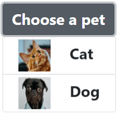
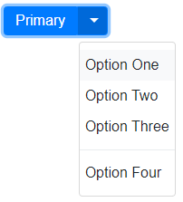

# Enabling Custom Control UI

Authors:
* [Dan Clark](https://github.com/dandclark) (Microsoft)
* [Bo Cupp](https://github.com/BoCupp) (Microsoft)
* [Mason Freed](https://github.com/mfreed7) (Google)
* [Ionel Popescu](https://github.com/ipopescu93) (Microsoft)
* [Melanie Richards](https://github.com/melanierichards) (Microsoft)
* [Greg Whitworth](https://github.com/gregwhitworth) (Salesforce)

## Status of this Document
This document is intended as a starting point for engaging the community and standards bodies in developing collaborative solutions fit for standardization. As the solutions to problems described in this document progress along the standards-track, we will retain this document as an archive and use this section to keep the community up-to-date with the most current standards venue and content location of future work and discussions.
* This document status: **Active**
* Expected venue: [W3C Web Incubator Community Group](https://wicg.io/)
* Current version: this document
    
## Introduction

A common frustration for developers who try to work with the browser's built-in form controls (`<select>` and various `<input>` types) is that they cannot customize the appearance of these controls to fit their site's design or user experience. In a survey of [web developers about form controls and components](http://gwhitworth.com/surveys/controls-components), the top reason that devs rewrite their own versions of these controls is the inability to sufficiently customize the appearance of the native controls.

When developers reimplement form controls from scratch, they're not able to leverage the work done on the Web Platform to optimize performance, reliability, and accessibility of the native controls. This proposal enables web developers to customize the native controls to fit their site while leaning on investments in the web platform, saving time for developers and improving experience of the end users who interact with the controls.


## Goals

* Developers can style any arbitrary part of a native control.
* Developers can add arbitrary content into any part of a native control (with some limitations; some interactive content like other controls and things like `<iframe>`s may be blocked).
* For controls composed of multiple parts, developers can style a particular part without rewriting the whole UI.
* Developers can customize the UI without needing to reimplement the data model and the code for reacting to user input.  This is in contrast to current approaches for customization like rewriting controls as custom elements, which requires the developer to start from scratch.
* Customized controls are accessible by default.

## Incremental Approach

The purpose of this document is to consider a model that achieves the goals above and can be applied to all controls, but the actual application of the model will be one control at a time - each of which will come with their own specific proposals. The roll-out will be based on developer demand and complexity for each control, and may never be applied to some control types.

This document makes heavy use of `<select>` and `<input type="range">` for conceptual examples, but it is not a goal of this document to fully specify the behavior of those controls.  Once there is agreement on the overal controls customization approach, further work will hammer out specific behavior for `<select>`, `<input type="range">`, and other controls.  Progress along these lines has already begun at the https://open-ui.org/ project, for example see the proposed [`<select>`](https://open-ui.org/components/select) anatomy.

## Use Cases

The key use case addressed in this proposal is that of a web developer who wants to include a form control on their site but needs a high degree of flexibility over the appearance of the control. They might also wish to add parts to the control UI; for example, an 'X' button inside a `<select>`'s dropdown that closes the dropdown.

Currently such a developer would need to rewrite the control from scratch, including the code to link the scriptable model of the control to the UI of the control and the ARIA attributes to make it accessible. With this proposal, the developer provides some custom markup and styles for the UI of their control, and the web platform provides the rest.

## Proposed Solution

### Note on form controls as MVC

When considering this proposal it can be useful to think of form controls in terms of the MVC design pattern where the control is constituted by three distinct parts: the model, the view, and the controller. These concepts are used throughout the coming section, so we'll define them here:

* __Model__: The data members and the capabilities of the control, accessible to script via its properties and methods. Examples include the `value`, form association, and validity state.
* __View__: The user interface. Makes the state of the control visible to the user, and the user can interact with it to change the state of the control.
* __Controller__: Acts as an intermediary between the model and the view. Informs the model of user interactions with the view through click and keyboard handlers. Informs the view of changes to the control's model through events, CSS pseudo-classes, and exposing relevant properties.

Stated in these terms, the goal of this proposal is to allow developers to customize all or part of a control's view while leveraging the native model and controller code.

### Custom content and styles via standardized parts, named slots, and shadow DOM replacement

Web developers will have three options for customizing native controls:
* Using standardized parts and states to override the native control styles via pseudo-classes and pseudo-elements.
* Using named `<slots>` to replace parts of the native control UI with developer content, while optionally leaving some native parts in place.
* Replacing the entire UI of the native control with an author-supplied shadow root.

#### Standardized control UI anatomy, parts, and behavior

One aspect of enabling this functionality for a given control type will be standardizing the anatomy of the control UI in terms of its conceptual parts and their behaviors, with standardized names for those parts.

For the purposes of this document a 'part' is an element that has standardized meaning to the control. This knowledge of those standardized parts allows the platform to wire up the necessary events and attributes to respond to user interaction which allow for a functional and accessible control (the "controller" code).

Rough examples:

* The anatomy of a `<select>` could be defined as consisting of 1 'button' part containing 1 'selected-value' part and 1 popup 'listbox' part containing 0-N 'option' parts. At a very high level, the expected behavior of clicking the button is to expand the list, the expected behavior of the selected-value part is to keep its inner text updated to show the value of the currently selected option, the expected behavior of clicking outside the opened list is to collapse it, etc.
* The anatomy of an `<input type="range">` could be defined as consisting of 1 draggable 'thumb' part that moves along 1 'track' part.

When the developer provides a custom UI with the parts identified, the platform can apply native event handlers and ARIA roles to the elements designated as the parts to light up the control's expected behavior and accessibility without extra code from the developer.

Note that the native styles of the controls will not be standardized and are still expected to differ across browsers. The anatomy of the control and the interaction between the conceptual parts is what must be standardized, to ensure that they are a developer's custom control UI will be fully interoperable across browsers.

#### Styling native parts using pseudo-classes and the part pseudo-element

The control parts that are standardized as per the previous section will be exposed to styling by developers via the `part` pseudo-element.  For example, a developer will be able to change the color of a `<select>`'s button in an interoperable manner without replacing any of the HTML:

```html
<style>
  .styled-select::part(button) {
    background-color: red
  }
</style>
<select class="styled-select">
  <option>choice 1</option>
  <option>choice 2</option>
</select>
```

Additional states for the controls will also be standardized as appropriate, such as an `open` state for `<select>` to allow styling like the following:

```css
.styled-select:open::part(button) {
  /* Change the color of the button when the <select> dropdown is open */
  background-color: lightgray;
}
```

#### Named slots

More powerful customizations will be enabled with named slots.

For each customizable native control type, a set of slot names will be standardized corresponding to each piece of the control's view that a developer might want to replace with their own content. For `<select>` the platform might expose slot names for the button and for the listbox dropdown that is expanded when the button is clicked. The user could then provide custom content for the parts in this manner, where the styles are defined in the light DOM (that is, outside of the control's shadow DOM).

```html
<style>
  .custom-button {
    /*...*/ 
  }

  option {
    /*...*/
  }

  .option-text {
    /*...*/
  }
</style>
<select>
  <div slot="button" part="button" class="custom-button">Choose a pet</div>
  <div slot="listbox" part="listbox" class="custom-listbox">
    <option>
      
      <div class="option-text">Cat</div>
    </option>
    <option>
      
      <div class="option-text">Dog</div>
    </option>
  </div>
</select>
```

(The use of the `part` attribute here is described in the following section).

The result is a `<select>` that looks something like this when expanded:



If no content is provided for a given slot, it will fall back to the default UI provided by the web platform. For example, say that the standardized slots for an `<input type="range">` are `thumb` for the moveable thumb of the slider and `track` for the track that it moves along. If a user wants to tweak the appearance of the thumb but use the default track, they could do so by providing content with `slot="thumb"` but not `slot="track"`, and the web platform will fall back to the default UI for the latter (see example in the following [section](#Light-DOM-content-under-<input>)).

### Hooking up native controller code to user-provided UI parts

A goal of this proposal is that users can customize a control's view without needing to write controller code to react to user input, or to update the view in response to scripted changes to the model.

When developer content is slotted in from the light DOM or added to the replaced shadow DOM, platform code will run to identify elements corresponding to the required control parts. These are identified by the value of the `part` attribute and/or the element type (e.g. `<option>`s in a `<select>`).  Note that a `part` attribute has already been proposed in the context of [CSS Shadow Parts](https://drafts.csswg.org/css-shadow-parts/#idl).  The usage proposed here is complementary to the usage with the `::part()` CSS pseudo-element.

Where applicable, the platform will apply native event handlers to the elements identified this way to handle user input. For example, a keyboard event handler would be applied to the thumb part of an `<input type="range">` to move the thumb in response to arrow keys. A click event handler would be applied to an `<option>` in a `<select>` so that the value of the `<select>` is updated to the value of the `<option>` when it is clicked.

In the [Named Slots](#named-slots) section's example, the `<div part="button">`, `<div part="listbox">`, and the `<option>` elements would have native event handlers wired up to them in this manner. The remaining elements are just for layout/styling purposes and would not be selectable.

This automatic application of controller code enables developers to make UI tweaks without writing tons of JavaScript to handle input, and ensures that customized control UIs can handle all of the input modalities that users expect.

#### Light-DOM content under `<input>`

A blocker for the idea of using light DOM children to provide custom UI for a control is that the HTML parser does not put children under `<input>` (see case in ["in body" insertion mode](https://html.spec.whatwg.org/multipage/parsing.html#parsing-main-inbody)).

To work around this limitation we propose that when UI customization is introduced for a given `<input>` type, it is done by standardizing a new HTMLElement corresponding to the `<input>` type in question. The new element would be equivalent to an `<input>` element of the given type, but with all the methods/properties irrelevant to that type removed. The `type` property would be read-only and always return the string matching the input type corresponding to the element. The key difference is that it would follow the parsing rules for an [ordinary](https://html.spec.whatwg.org/multipage/parsing.html#ordinary) element and therefore be able to have child DOM elements.

For example, for `<input type="range">` an `HTMLRangeElement` would be introduced. This would have the same methods, properties, and behaviors as an `<input>` element in the [Range state](https://html.spec.whatwg.org/multipage/input.html#range-state-(type=range)), minus the methods and properties only relevant to other `<input>` types. It could be used as follows to provide a custom SVG slider thumb:

```html
<range>
  <div slot="thumb" part="thumb"><svg><!-- Use SVG to draw the thumb icon... --></svg></div>
</range>
```

#### Attribute for opt-in

Some form controls will need to explicitly opt-in to the new behavior.  `<select>` in particular would run into issues if we changed the behavior by default, for two reasons:
* Changing the parsing behavior for `<select>` to allow other element children by default would likely break a lot of old sites that depend on the current behavior.
* The `<select>` popup currently has the capability to break outside the window of the browser or of an `iframe`.  Sites likely depend on this behavior, but we would need to remove it for security reasons if `<select>` is allowed to contain arbitrary content.  So again this would need to be opt-in to avoid breaking existing sites.

The proposed opt-in mechanism is a `custom` attribute present on the element:
`<select custom=""></select>`.  If present, the new behavior would be switched on for that element instance (new parsing rules, content can be slotted into element's native shadow DOM, dropdown doesn't escape window...).

Controls like `<range>` for which we're introducing new elements wouldn't need this opt-in.

Alternative ideas for opt-in are considered in an [open question](#open-questions).

#### Shadow DOM replacement

An alternative method for allowing developers to provide a custom control view is by swapping in their own shadow DOM.

Calling `attachShadow()` on any form control currently throws an exception ([step 2](https://dom.spec.whatwg.org/#dom-element-attachshadow)). When enabling customization for a given control type, this restriction will be removed and calling `attachShadow()` will result in the default user-agent shadow DOM being swapped out with a new shadow root that can be populated with content provided by the developer:

```js
let customSelect = document.createElement('select');
customSelect.setAttribute("custom", "");
let selectShadow = customSelect.attachShadow({ mode: 'open' });
selectShadow.innerHTML = `My custom select UI`;
document.body.appendChild(customSelect);
```

(We expect that this eventually will also be possible without JavaScript via declarative shadow DOM [[1]](https://github.com/whatwg/dom/pull/858), [[2]](https://github.com/whatwg/html/pull/5465)).

The platform will require that the developer labels the core parts of the user-provided shadow DOM using the part attribute. For example a custom `<select>` shadow DOM would need to have an element with `part="button"` and an element with `part="listbox"`, and a custom shadow-DOM for `<input type="range">` would require an element with `part="thumb"` and `part="track"`.

If any required parts are not supplied, the shadow DOM will not be rendered. The purpose of this requirement is so that the platform can apply the correct accessibility semantics and user input event handlers so that the control parts respond to users as expected.  When parts are missing, the platform won't make an attempt to guess at the right behavior, and won't render an incomplete control implementation.

We expect that replacing the shadow DOM (as opposed to slotting in content from the light DOM) will be the preferred approach for developers who want to customize the entire UI of the control, or for frameworks who want to ship a customized control that isn't affected by the styles of the host page. Developers who just want to customize part of a control's UI might prefer to use the slotting approach so that they don't need to recreate the entire UI in the shadow.

### Custom view updates in response to scripted model changes

In most cases, CSS included with a web developer's custom control view will be sufficient to react to control model changes. For example, a custom `<select>` implementation might include CSS rules like the following to to highlight and un-highlight selected and de-selected options without explicitly watching for changes to the value property.

```css
select option {
  /* styles for an option that is not selected */
}

select option[selected="true"] {
 /* styles for an option that is selected */
}
```

In other cases, the developer may want to perform scripted operations in response to control model changes. This will usually be the case for control types with a range of values that are not author supplied, such as `<input type="color">`. For these controls, developers will need to watch for scripted changes to the control model in order to update their UI accordingly. We expect that the standard way to do this will be to extend the built-in element type and add a setter for the attributes and properties of interest. The developer may also need to add an input event handler to respond to user input in cases where the native controller code applied to the control parts is not sufficient.

For example, if a custom `<select>` UI needed to perform scripted updates in response to value changes, the developer could specify the control as follows:

```js
class MyCustomSelect extends HTMLSelectElement {
  constructor() {
    super();
    this.shadow_ = this.attachShadow({ mode: 'open' }); // Replace the native shadow root
    this.shadow_.innerHTML = `...`; // Supply the custom view

    // Ensure that we update the view in response to user input
    this.addEventListener('input', this.updateView.bind(this));
  }

  // Intercept any scripted setting of the value.  Forward the value
  // change to HTMLSelectElement and update the view.  Can be done for
  // other view-impacting properties as well.
  set value(newValue) {
    super.value = newValue;
    this.updateView();
  }

  updateView() {
    // Do whatever work is needed to update the view to reflect the new state
  }
};
window.customElements.define('custom-select', MyCustomSelect, { extends: 'select' });
```

It is an [open question](#open-questions) whether the ergonomics of managing model/view interactions this way are sufficiently painful that the platform should expose a new way of doing so, or whether this will really be a common use case.

### Ensuring accessibility by default

A key goal of this proposal is that custom control UIs are accessible by default. To achieve this, the platform controller code will apply implicit accessibility semantics to elements that are identified as known UI parts. These known parts will be identifiable through the value of the `part` attribute.

The term '__implicit__ accessibility semantics' is used in this document in the same sense as the implicit semantics specified by the [HTML AAM](https://www.w3.org/TR/html-aam-1.0/).  ARIA attributes won't actually be added to the author's HTML, but the platform will report to accessibility tools as if the appropriate ARIA attributes were present.  This is analogous to how a `<button>` element is given the ARIA role of button per the [HTML AAM Element Role Mappings](https://www.w3.org/TR/html-aam-1.0/#html-element-role-mappings), even if no `role` content attribute is actually present.

For example, if a developer provides a custom thumb for a range slider:

```html
<range>
  <div slot="thumb" part="thumb"><svg><!-- Use SVG to draw the thumb icon... --></svg></div>
</range>
```

The platform would report the following implicit accessibility semantics to accessibility tools for the `<div>` with `part="thumb"`:
* An ARIA role of [slider](https://www.w3.org/TR/html-aria/#index-aria-slider).
* [aria-valuenow](https://www.w3.org/TR/wai-aria-1.1/#aria-valuenow) reflecting the value property of the control
* [aria-valuemax](https://www.w3.org/TR/wai-aria-1.1/#aria-valuemax) reflecting the max property of the control
* [aria-valuemin](https://www.w3.org/TR/wai-aria-1.1/#aria-valuemin) reflecting the min property of the control

### Additional examples: Implicit accessibility semantics applied to parts

#### Example 1:

Consider this HTML:

```html
<select>
  <div slot="button" part="button" class="custom-button">Choose a pet</div>
  <div slot="listbox" part="listbox" class="custom-listbox">
    <option>
      
      <div class="option-text">Cat</div>
    </option>
    <option>
      
      <div class="option-text">Dog</div>
    </option>
  </div>
</select>
```

This results in the following implicit ARIA mappings when popup is in closed state (Note that the aria HTML content attributes won't actually be set on the DOM elements; these are just written below for explanatory purposes.  These are added to show that the slotted content will receive these implicit accessibility semantics.  In other words, the accessibility tree will be built as if these elements had these roles and `aria-*` properties.).

```html
<select>
  <div slot="button" part="button" class="custom-button" role="button" aria-haspopup="listbox" aria-expanded="false">Choose a pet</div>
  <!-- listbox is display:none when closed, so not in accessibility tree --> 
  <div slot="listbox" part="listbox" class="custom-listbox" role="listbox">
    <option role="option">
      
      <div class="option-text">Cat</div>
    </option>
    <option role="option">
      
      <div class="option-text">Dog</div>
    </option>
  </div>
</select>
```

And when in the open state:

```html
<select>
  <div slot="button" part="button" class="custom-button" role="button" aria-haspopup="listbox" aria-expanded="true">Choose a pet</div>
  <div slot="listbox" part="listbox" class="custom-listbox" role="listbox">
    <option role="option" aria-selected="true">
      
      <div class="option-text">Cat</div>
    </option>
    <option role="option">
      
      <div class="option-text">Dog</div>
    </option>
  </div>
</select>
```

#### Example 2:

The following HTML:

```html
<range value="10" min="0" max="20">
  <div slot="thumb" part="thumb"><svg><!-- Draw icon with SVG --></svg></div>
</range>
```

Results in these implicit accessibility semantics:

```html
<range value="10" min="0" max="20">
  <div slot="thumb" part="thumb" role="slider" aria-valuenow="10" aria-valuemin="0" aria-valuemax="20"><svg><!-- Draw icon with SVG --></svg></div>
</range>
```

### Accessible name computation

Control parts will generally compute their accessible names and descriptions using the algorithm defined in [Accessible Name and Description: Computation and API Mappings 1.1](https://www.w3.org/TR/accname-aam-1.1/).
An important detail here is that some parts are given implicit ARIA roles that support [name from content](https://www.w3.org/TR/wai-aria/#namefromcontent), for example `<div slot="button">` receives the combobox role and `<option>` has the option role.  This means that their children are used to calculate their ARIA names.  Revisiting this example and adding alt attributes to the images:

```html
<select>
  <div slot="button" part="button" class="custom-button">Choose a pet</div>
  <div slot="listbox" part="listbox" class="custom-listbox">
    <option>
      
      <div class="option-text">Cat</div>
    </option>
    <option>
      
      <div class="option-text">Dog</div>
    </option>
  </div>
</select>
```

The accessible names are:
* `<div slot="button" part="button">`: Choose a pet"
* `<div slot="listbox" part="listbox">`: No accessible name (which is OK since this shouldn't be focusable)
* First `<option>`: Cat picture Cat
* Second `<option>`: Dog picture Dog

The presence of the img alt captions in the `<option>` names is somewhat redundant in this example.  But,  just using the [Accessible Name and Description: Computation and API Mappings 1.1](https://www.w3.org/TR/accname-aam-1.1/) with [name from content](https://www.w3.org/TR/wai-aria/#namefromcontent) should provide the best results in normal cases.  Consider the case where the options just consisted of `` tags, with no option text.  In this scenario it is critical that the accessible names of the ``s are announced.

In conclusion, the normal accessible name computation algorithm should be suitable for custom controls; no special rules should be necessary.  Developers should use the same considerations for adding `alt` text to images in custom controls as they would for normal content in a page.

### Accessible name forwarding from control element

Consider the case where the control element itself has an explicitly set accessible name:

```html
<label for="my-range">My custom range</label>
<range id="my-range" value="10" min="0" max="20">
  <div slot="thumb" part="thumb"><svg><!-- Draw icon with SVG --></svg></div>
</range>
```

There was initially a question of whether the accessible name of the light DOM element would need to be "forwarded" by controller code somehow to the custom UI in the shadow DOM.

However, experiments with accessibility tools (Narrator, NVDA, VoiceOver) and a sample page with a named shadow host demonstrated that this is not necessary.  When focus is changed from outside the shadow root to some focusable item within the shadow root, the name of the shadow host is announced, followed by the name of whatever was focused in the shadow.  This behavior should also apply to custom control UIs, so no special handling is necessary to ensure that the light DOM element's name is properly announced.

### Feature detection

Developers will have a couple of options for feature-detecting custom controls
in order to apply a polyfill or go down a fallback codepath in browsers where
they have not yet been implemented.

For controls for which new `HTMLElement` types are introduced, e.g. `<range>`
for `<input type="range">`, feature detection could check whether the new
element exists:

```js
if (!window.hasOwnProperty("HTMLRangeElement")) {
  /* apply polyfill/fallback */
}
```

If new element types are not introduced for things like custom `<select>`, an
alternative is to check `attachShadow`, which currently throws for controls like
`<select>` but will not do so with this proposal -- see
[Shadow DOM replacement](#Shadow-DOM-replacement):
```js
function hasCustomSelectFeature() {
  try {
    document.createElement("select").attachShadow({mode: "open"});
    return true;
  } catch (e) {
    return false;
  }
}
```

For a CSS selector specifying a control part, if the part doesn't exist (e.g.
because a browser hasn't implemented this proposal yet for the control in
question) then the rule will simply be ignored:

```css
select::part(button) {
 /*
  * This will apply to the button of a <select> if customizable <select> has
  * been implemented, and will be a no-op on browsers that haven't yet
  * implemented customizable <select> since the selector won't match
  * anything. Other CSS rules in the stylesheet will still apply normally.
  */
}
```

## Privacy and Security Considerations

### Privacy

No considerable privacy concerns are expected, but we welcome community feedback.

### Security

Some built-in controls have privileged behavior that could be dangerous if opened up to third-party code. For example, the built-in `<select>`'s dropdown listbox can expand outside the containing browser window and outside of `<iframe>`s. If arbitrary content is allowed in the `<select>` this capability could be used for spoofing OS UI outside of the browser frame, or spoofing content of an outer site from within an `<iframe>`.

All control types that are opened up for customization will have to be carefully examined for such cases of potentially exploitable privileged behavior.

## Alternative Solutions

An alternative to using named slots to bring custom content into the native control shadow DOM is to use HTML elements that are defined to have special behavior when under the customized element. For example, for `<select>` we could define special behavior for the `<button>` element such that it is inserted into the button slot and receives the behavior of the button part.  Additionally we could introduce a new `<listbox>` element for the listbox part that is automatically placed into the listbox slot.  A developer would then provide custom `<select>` styling like so:

```html
<select>
  <button><div class="has-custom-button-styles">Button text</div></button>
  <listbox>
    <div class="has-custom-listbox-styles">
      <option>option 1</option>
      <option>option 2</option>
    </div>
  </listbox>
</select>
```

This approach allows the same level of control for the user over which parts of the control they can replace, but has a different set of advantages:

__Advantages of `<button>` and `<listbox>` approach:__

* May be more intuitive for developers; clearer that they are doing something supported/built-in.
* Developers don't need to apply `slot` and `part` attributes to indicate where content should be present in the shadow DOM, and where controller code should be hooked up; instead these are determined from the element type.

__Disadvantages of `<button>` and `<listbox>` approach:__

* The approach of adding new elements is less flexible and makes it more difficult to extend customizable UI to other controls. Would we need to add a `<slider>` or `<thumb>` element for `<input type="range">`? Or a `<grid>` element for `<input type="date">`? etc. etc. On the other hand the `<slot>` approach just requires us to decide on what named slots and parts we want to support for each new control.
* Introducing slots and parts as separate concepts is more powerful than tying them together in the element type.  Introducing them as separate concepts allows for more complex use cases such as the split-button `<select>` (see [Examples of Extensibility](#examples-of-extensability)).
* Defining new elements would likely add complexity and lengthen the road to standardization.
  * Defining the parser behavior in particular will be a major source of complexity, especially if we want to use parser fixup to add default content when the developer doesn't provide it. Behavior of `<slots>` on the other hand is already specified.

## Open Questions

* Should the platform expose a new way of watching changes to properties like `value`? This would simplify the work of developers writing complex controls that require manually handling scripted changes to the model. Aside from the method explored in [Custom view updates in response to scripted model changes](#Custom-view-updates-in-response-to-scripted-model-changes), another approach might be to add functionality to [ElementInternals](https://html.spec.whatwg.org/multipage/custom-elements.html#the-elementinternals-interface) that would allow developers to easily register to watch for changes to properties relevant to the view.
* Since we are not standardizing control styles across browsers, there may be interoperability issues with partial styling.  For example if the developer replaces the slider thumb of a `<range>` but not the track it moves along, there may be pixel differences between the appearance of the track on different browsers that cause the custom thumb to be off-center.  For elements like `<select>` where the button and listbox don't overlap, this may not be as much of an issue, but even there it's not clear how we can guarantee things won't break if an author needs things to be pixel-perfect.
  * Allowing the developer to clear the default styles and provide their own stylesheet isn't a solution, because different platforms may have used a different HTML structure to build their control views.  E.g. the slider track might be built with styled `<div>`s in one platform and styled `<span>`s in another.  So the same developer-provided stylesheet would not work interoperably unless the entire control UI was replaced.
* How would `<select>` work on Mobile platforms, where OS-native UIs are used for some control popups?  Would we switch to the browser popup if we detect that a developer has applied any custom styles or markup for it?
* For `<range>` it's not clear how controller code should position a user-provided slider thumb in reponse to model changes given that control styles will not be standardized.  Simply updating a given CSS property won't work consistently because there could be a variety of platform and author styles that could cause the content to be positioned differently.  It seems that a level of indirection between the controller code and the CSS properties may be necessary, e.g. a CSS variable that the controller code would update based on `range.value` changes.
  * There could also be difficulties with handling mouse and touch input (including drags) for `<range>`.  Determining the position of the thumb and the resulting `value` is not straightforward if the styles of the control are not known.
  * There is also some question of how wide a range of custom interaction models developers will be able create while still relying on the platform to facilitatate model-view interactions.  Could a `<range>` that looks like a dial still make use of platform controller code, or would the user have to write the JavaScript themselves for a slider that's not a straight line?
* Using a `custom` attribute for opt-in could result in some tricky corner cases in the event that the attribute is added/removed dynamically.  Consider the case where the `<select>` is created dynamically via `document.createElement()`, when the `custom` attribute must be set using `setAttribute()`.  When should the transition to the custom behavior be applied?  Applying it at the point of `setAttribute()` would be inconsistent with how other elements like `input[type=range]` work when created dynamically; typically the transformation would occur when the element was appended to the DOM.  But, this means that for a dynamically created `<select>`, the developer would have to wait until the `<select>` is appended to the DOM before calling `attachShadow()`.
  * Alternative 1: Don't overload any existing native controls, just mint new element names for all of them.
  * Alternative 2: Apply the new behavior by default, and provide an opt-out mechanism.

## Appendix

### Another example of extensibility: Split-button select

Tying the platform's controller code to developer-provided parts enables web developers to extend the control to their needs without writing a bunch of JavaScript to reimplement native functionality. Let's use the `<select>` as an example with the following [anatomy](https://open-ui.org/components/select#anatomy-1) template definition:

```html
<template>
  <slot name="button-container">
    <button part="button" aria-expanded="${x => x.open == true}" aria-haspopup="listbox">
      <span part="selected-value"></span>
    </button>
  </slot>
  <slot name="listbox-container">
    <listbox>
      <slot></slot>
    </listbox>
  </slot>
</template>
```

By exposing the select parts that were historically hidden we can then access them for extending style capabilities. Here is an example HTML markup using the above anatomy to re-create a split button solution similar to [Bootstrap's](https://getbootstrap.com/docs/4.3/components/dropdowns/#split-button).

```html
<select>
  <div slot="button-container">
    <div class="select-label">Primary</div>
    <div class="arrow" part="button"></div>
  </div>
  <div name="listbox-container" slot=”listbox-container” part=”listbox”>
    <option value="Option One">Option One<option>
    <option value="Option Two">Option Two</option>
    <option value="Option Three">Option Three</option>
    <div class="separator"></div>
    <option value="Option Four">Option Four</option>
  </div>
 </select>
```

This results in the following rendering (CSS isn't shown):



Let's take a look at why leveraging the MVC paradigm has the potential of making web platform controls so powerful.

```html
<div class="arrow" part="button">
```

Because the `part="button"` has meaning to the `<select>` it allows the controller code to wire up the necessary events and attributes to ensure accessibility support. Accessibility tools will see the following:

```html
<div slot="button-container" part="button" tabindex="0" aria-haspopup="true" aria-expanded="false" role="button">
```

Necessary input events are wired up to the parts as well so the web developer doesn't have to wire up the various end user interactions such as updating `aria-expanded` upon invocation. Keyboard events will be applied so that for example pressing 'Enter' on the `part="button"` will open the popup.  The `<option>` parts will listen for up/down arrows to iterate through the options. This becomes powerful because in this example, there is a separator element between options three and four for decoration but the expected end user traversal just works.

```html
<option value="Option Three">Option Three</option>
<div class="separator"></div>
<option value="Option Four">Option Four</option>
```

Note that the `<div class="arrow">` is the one that gets `part="button"`, not the `<div name="listbox-container">`.  The result of this is that only the half of the button with the dropdown arrow can be clicked to open the popup, which is similar to the behavior of [Bootstrap's split-button](https://getbootstrap.com/docs/4.3/components/dropdowns/#split-button).  If we wanted the entire button to activate the popup, then we'd apply `part="button"` to the `<div name="listbox-container">` instead.
