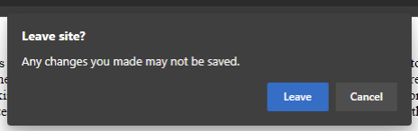
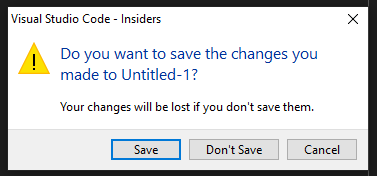
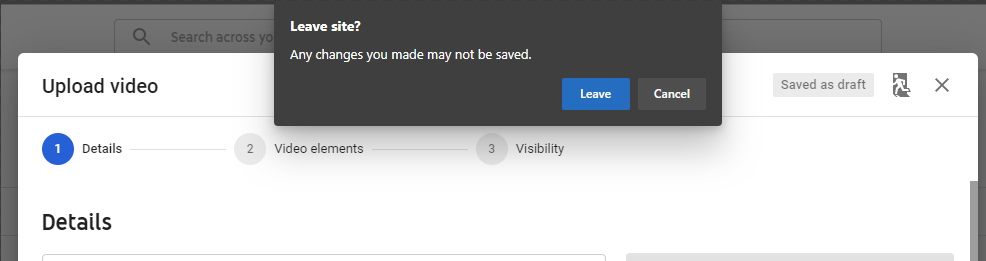
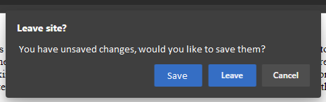
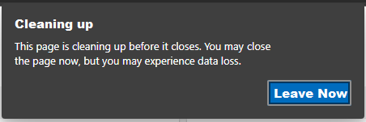
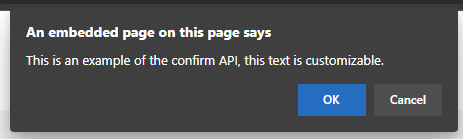

# Custom Dialog On Close

## Authors:

-   Austin Orion

## Introduction
Installed PWAs need a way to prompt the user and conditionally perform asynchronous operations (such as saving a file) before the user leaves the page and their state is lost.

## Scope
This capability should only be exposed to installed PWAs. Allowing arbitrary websites the ability to interrupt the leaving flow with a custom dialog would be a regression in browser security. This capability is important to a complete user experience, but can also be harmful and thus should only be available to sites the user has signaled that they trust via installation as a PWA.

## Current State
Currently, the only way a site can prompt a user before they leave is by adding an event listener for beforeunload events, which causes this dialog to be displayed before the tab is closed.



The problem is that the website can't communicate to users why they are being prompted, and the site can't offer the user a quick way to resolve the situation and then let them leave.

## Use Cases
There are many scenarios in which the web developer may want to invoke this dialog before the end user leaves the site, but some of the most common ones we've seen during our investigations are:

1. Text editing sites could display a dialog to the user before the page is closed/refreshed/navigated away from, allowing the user to save their changes before they are lost.



2. Sites could provide better warnings to users that leaving would cancel pending operations, such as file uploads.



## Proposed Solution
### Extend the beforeunload event
A familiar way to interrupt the leaving flow is to use the beforeunload event's properties, either calling `preventDefault()` or assigning a value to `returnValue`. In line with this pattern, we are proposing the addition of a new property to the beforeunload event: `dialog`. The `dialog` property would have several methods `setMessage()`, `setButtonLabel()`, and `show()`. These functions are how the developer will customize the dialog, and provide code that will run based on the user's selection.
```javascript
window.addEventListener("beforeunload", (event) => {
    if (event.dialog) {
      event.dialog.setMessage("You have unsaved changes, would you like to save them?");
      event.dialog.setButtonLabel("Save");
      event.dialog.show().then(async (result) => {
        if (result == "Save"){
          // save the document.
        }
      });
    }
});
```



`show()` returns a promise that will resolve with the user's selection. Once it resolves, the code provided by the developer will run, and the tab will close when it is finished. While the developer's code is running, we should display a dialog indicating that some work is being done, and present an option to the user that let's them cancel the work and leave immediately. Here is an example of how this "Cleaning up" dialog may look:




#### Time limit
To avoid a poor user experience from websites that take a long time to complete their task, we propose that there should be a time limit on how long the operation can run for. Currently, Chromium based browser display a warning if the synchronous code in the beforeunload event handler takes a long time.

`[Violation] 'beforeunload' handler took 53921ms`

However, no time limit is actually enforced. We propose strictly enforcing a time limit that starts as soon as the user makes a selection on the "Leave Site?" dialog. What that limit should be will need to be researched further. An error message such as this should be displayed if the limit is reached:
`The beforeunload promise did not resolve within the X second time limit. The operation has been cancelled.`

#### Sequence Diagram
Below is a sequence diagram to illustrate the flow when this new capability is used.
```
App         "Leave Site?" Dialog     "Cleaning up" Dialog     Developer's Promise
 |
 | User attempts to close app
 | ----------------->| User selects "Save" option
 | <---------------- |
 | --------------------------------------> |
 |                                         |-------------------> |                     
 |                                         |                     | Unsaved changes are saved
 |                                         | <------------------ |
 | <-------------------------------------- | Promise resolves, times out, or user force exits
 |  "Cleaning up" Dialog closes
App closes
```

## Avoiding Misuse

While this feature fills a gap in the platform that will improve the end user experience when used responsibly; it, like many other APIs, does introduce the potential for abuse if not mitigated by the UA. Some examples of abuse that we have identified, and recommended mitigations, follow:
 - The user accidentally clicks an ad, or otherwise has an unwanted tab appear. They try to close the tab as quickly as possible, but are unable to due to a confirmation dialog.
   - The user must have interacted with the page to allow the site to prompt the user or perform asynchronous actions on tab close.
 - The user attempts to navigate away from a tab, but is convinced to wait for the site to perform some action before they leave. The site intentionally takes an excessively long time, perhaps displaying ads while the user is waiting for the tab to close itself.
   - There should be a time limit on how long the asynchronous code can run for, at the end of the time limit there should be a "leave anyway" dialog, or some other mechanism that allows the user to cancel the async task and leave immediately.
   - A second attempt to close the tab, via clicking the "x" or ctrl+w, should immediately close the tab.
 - A website displays alarming text, to try and convince the user to stay on the site or perform some harmful action.
   - This capability should only be available to installed PWAs, and not arbitrary websites.
   - The text that the website can display should be limited in length and not allow formatting.
   - Always display "Leave" and "Cancel" buttons on the dialog, and only allow websites to add a third option which could be customizable.

## Considered Alternatives
### Extend window.confirm()
[`window.confirm()`](https://developer.mozilla.org/en-US/docs/Web/API/Window/confirm) is a familiar API that lets websites query the user and act based on their response.



We could extend this API to allow websites to add a new options to the dialog and have it return a promise with the user's selection. The website would then return a promise by calling .then() on window.confirm(). When the returned promise settles, the User Agent will close the tab. For example:
    
For example:
```javascript
window.addEventListener("beforeunload", (event) => {
  if (featureDetectNewConfirmDialog()) {
    return window.confirm("You have unsaved changes, would you like to save them?", "Save & Leave").then(function(result) {
      // Perform the work to save the document.
      resolve(); // The tab closes at this point.
    });
  } else {
    event.preventDefault();
  }
});
```

However, this proposal brings confusion because window.confirm() would behave differently depending on if it was called from a beforeunload handler or not. It is also not a common pattern, and currently User Agents are allowed to deny showing window.confirm() dialogs from the beforeunload handler. For these reasons, this proposal was not chosen.

### Fully customizable dialog

We considered allowing the developer to design and show a fully customizable dialog, perhaps via the proposed [modal-window](https://github.com/adrianhopebailie/modal-window/blob/master/explainer.md), but this was not chosen due to it's additional complexity and the increased potential for abuse. For example, the site could choose to show only an "Accept" option, and no option to cancel. While mitigations for problems like this exist, the user experience would be worse than the proposed solution, where it is guaranteed that the user is given the option to leave a site immediately.

## Privacy
This extension of the beforeunload event would increase browser fingerprinting capabilities by adding a feature-detectable API. However, as this API holds no user preferences, fingerprinting capabilities are limited to detecting large cohorts of users of particular browsers.

## Security
This capability may have some security concerns by allowing malicious websites to trick users, as well as accepting untrusted input from web developers. Discussion is ongoing about how to mitigate the former, and a thorough security review of the code will be performed to ensure the latter is handled appropriately.
