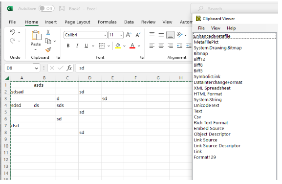

# Delayed Clipboard Rendering

Authors: [Ana Sollano Kim](https://github.com/anaskim), [Anupam Snigdha](https://github.com/snianu), [Sanket Joshi](https://github.com/sanketj)

## Status of this Document
This document is a starting point for engaging the community and standards bodies in developing collaborative solutions fit for standardization. As the solutions to problems described in this document progress along the standards-track, we will retain this document as an archive and use this section to keep the community up-to-date with the most current standards venue and content location of future work and discussions.
* This document status: **`ACTIVE`**
* Expected venue: [W3C Web Incubator Community Group](https://wicg.io/)
* **Current version: this document**

## Introduction

Delayed clipboard rendering is the ability to delay the generation of a particular payload until it is needed by the target applications. It is useful when source applications support several clipboard formats, some or all of which are time-consuming to render. Currently, delayed rendering is supported in Linux, Mac OS X, and Windows.

## Background

In web applications, the clipboard can be accessed via the Data Transfer and Asynchronous Clipboard APIs, which provide methods to read and write supported formats from and to the system clipboard. Data Transfer APIs can only be accessed via JS events that block the main thread. If the clipboard payload is huge, performance is affected. The Asynchronous Clipboard API solves this by allowing asynchronous copy/paste operations, thus not blocking the main thread. In this document we will focus on the Asynchronous Clipboard API.

Quoting from the [editor's draft](https://w3c.github.io/clipboard-apis/#clipboard-item-interface):
> A clipboard item is conceptually data that the user has expressed a desire to make shareable by invoking a "cut" or "copy" command. A clipboard item serves two purposes. First, it allows a website to read data copied by a user to the system clipboard. Second, it allows a website to write data to the system clipboard.

A clipboard item may have multiple representations described by a MIME type. A target application, usually in response to the user performing a paste operation, will read one or more representations from the clipboard. The source application typically does not know where the user intends to paste the content at the time of copy, so the author must produce several formats when writing to the clipboard to prepare for many possible target applications. The generation of some or all representations may take enough time that it is noticeable to the user and it is unlikely that the target application will need all produced representations.

The ability to delay the generation of clipboard data until it is needed is important for applications that support data types that are _expensive to generate_. In this context, _expensive to generate_ refers to the time and resources needed to process and produce the clipboard payload on the client side. Web applications may need to make calls to the server, encode or decode a large amount of data, serialize HTML, produce web custom formats, etc. in order to provide a high fidelity copy/paste experience to the user. Source applications would be able to wait until the target application attempts to access a particular representation before generating data for it, as opposed to producing all formats at once when attempting to write to the clipboard.

## Goal

Leverage the existing Async Clipboard API to allow web applications to exchange large data payloads and improve their performance by only producing clipboard payload when it’s needed by target applications.

## Non-Goals

* Modify the Data Transfer API

## Scenarios

Here are couple of scenarios where we think this feature would be useful:

### Scenario 1: User copies cells from the native Excel App

With just text in the cells, we see 22 different formats on the clipboard.



Native Excel uses delayed clipboard rendering, so we don’t have the data for all the formats in the clipboard. The data for a particular format gets populated when the user pastes the content in an app that supports that format, e.g., when the user pastes this content in MS Paint, image formats are being read from the clipboard, but not the other formats (like CSV, HTML, Link, etc.)
In this scenario, we can see that since the destination app is not known during copy, the native app must produce all the formats it supports for paste operation. The cost for serialization of data for each of these formats is high, so the app delay renders the most expensive formats (such as XML Spreadsheet, Bitmap, Embed Source, etc.), and populates the common ones that are relatively cheaper to produce (such as text, Unicode Text, etc.)

On the web, we support web custom formats that apps can use to copy/paste high fidelity content between web-to-web, web-to-native or vice versa. These formats are expensive to produce, and only the app that supports the custom format can parse its content, so these formats are ideal candidates for delay rendering.

For Excel online specifically, the model lives on the server, so copy-paste involves data transfer between the client and the server. This leads to a lot of COGS due to server-side processing and large amounts of data being transferred over-the-wire, particularly for large payloads. With delayed clipboard rendering, Excel online app is looking to efficiently handle the web custom formats (that are expensive compared to text & html) when it’s not requested by the target app where the user pastes the content copied from Excel online.

### Scenario 2: Adobe PS use case
From the PS perspective, copying a layer or object has two behaviors: it creates an internal clipboard copy which remains inside the PS engine (it is also a pointer to immutable data structures and virtual memory backed data) and is used for internal copy and paste, and on web surface now also must create a PNG encoded rendition and pass this to the clipboard API. Delayed clipboard rendering would mean the app could avoid that additional rasterization and encode until the user pastes externally to the app. This also plays into the fact that PS documents can be massive – encoding a 16k x 16k image that is never used is prohibitive to the UX and may cause memory issues to boot. CPU time savings on copy, memory saving would be some of the benefits of delaying rendering of a format.

## Proposed solution: Add a callback to `ClipboardItemData`

In this proposal, web authors decide which formats they want to delay render and which ones they want to provide immediately in the `ClipboardItem` constructor. The advantages of this approach is that it provides better developer ergonomics and it's easier to differentiate formats that will be written immediately to the clipboard from those that, at the web author's discretion, will be produced on-demand with delayed rendering.

An example of the usage is shown below:

```js
const textBlob = new Blob(['Hello, World!'], {type: 'text/plain'});
const clipboardItemInput = new ClipboardItem({
                            'text/plain': Promise.resolve(textBlob), 
                            'web application/x-custom-format-clipboard-format': Promise.resolve(generateExpensiveCustomFormatBlob),
                           });
navigator.clipboard.write([clipboardItemInput]);
```
where the callback `generateExpensiveCustomFormatBlob` is defined as follows:
```js
function generateExpensiveCustomFormatBlob() {
  // TODO: Provide an example on how a custom format can be expensive to generate.
  var inputData = ...;
  return new Blob([inputData], {type: 'web application/x-custom-format'});
}
```
In this example, plain text is written immediately to the clipboard, while the custom format is delayed rendered. `generateExpensiveCustomFormatBlob` returns a [Blob](https://w3c.github.io/FileAPI/#blob-section). The blob constructor takes in the content that will be written to the clipboard and its type.

### IDL changes to `ClipboardItemData`

```
typedef (DOMString or Blob) ClipboardItemValue;
callback ClipboardItemValueCallback = ClipboardItemValue();
typedef Promise<(ClipboardItemValue or ClipboardItemValueCallback)> ClipboardItemData;

[SecureContext, Exposed=Window]
interface ClipboardItem {
  constructor(record<DOMString, ClipboardItemData> items,
              optional ClipboardItemOptions options = {});

  readonly attribute PresentationStyle presentationStyle;
  readonly attribute FrozenArray<DOMString> types;

  Promise<Blob> getType(DOMString type);
};
```

## Considered alternative 1: Map of MIME type to callback in `ClipboardItem` constructor

An alternative to our proposal is to add a new argument to the `ClipboardItem` constructor which takes a map of a MIME type to a callback. Authors should still be able to produce some formats immediately, so they may define the usual map with a MIME type as the key and a Blob as the value for formats that they don’t want to be delayed rendered. The disadvantage of this approach is that web authors may need to provide redundant format information to the callback map, which can also create confusion to UAs if the same format(s) appear(s) in both the promise `ClipboardItem` map and callback map. An example is shown below:

```js
const textBlob = new Blob(['Hello, World!'], {type: 'text/plain'});
const delayedCallbacksMap = {
  'web application/x-custom-format-clipboard-format': generateExpensiveCustomFormatBlob
};
const clipboardItemInput = new ClipboardItem({'text/plain': textBlob}, delayedCallbacksMap);
navigator.clipboard.write([clipboardItemInput]);
```
where the callback `generateExpensiveCustomFormatBlob` is defined as follows:
```js
function generateExpensiveCustomFormatBlob() {
  // TODO: Provide an example on how a custom format can be expensive to generate.
  var inputData = ...;
  return new Blob([inputData], {type: 'web application/x-custom-format'});
}
```
Similarly to the example in the proposed solution, plain text is written immediately to the clipboard, while the custom format is delayed rendered. `generateExpensiveCustomFormatBlob` returns a [Blob](https://w3c.github.io/FileAPI/#blob-section). The blob constructor takes in the content that will be written to the clipboard and its type.

### IDL changes to `ClipboardItem`

```
typedef (DOMString or Blob) ClipboardItemValue;
callback ClipboardDelayedCallback = ClipboardItemValue();
typedef Promise<ClipboardItemValue> ClipboardItemData;

[SecureContext, Exposed=Window]
interface ClipboardItem {
  constructor(record<DOMString, ClipboardItemData> items,
              record<DOMString, ClipboardDelayedCallback> callbacks,
              optional ClipboardItemOptions options = {});

  readonly attribute PresentationStyle presentationStyle;
  readonly attribute FrozenArray<DOMString> types;

  Promise<Blob> getType(DOMString type);
};
```


## Considered alternative 2: Map of MIME type to callback in new method

Another alternative to this is to use a new method, called `addDelayedWriteCallback`, that takes in a map of formats to callbacks. As the `ClipboardItem` constructor remains the same, web authors that want to adopt delayed clipboard rendering in their web applications will be able to move the generation of data to the callbacks map and pass it to `addDelayedWriteCallback`, without needing to change the existing `ClipboardItem` constructor. If the web author doesn't provide a delayed rendering callback or data, then an error is thrown in the source application and the write operation fails. The disadvantages of this approach are that it adds overhead to the web author (it is a new function for them to learn) and it can create the same confusion as the first considered alternative when having the same format(s) repeated in both the `ClipboardItem` constructor and in `addDelayedWriteCallback`'s map. A similar proposal has been considered in the past with an static method called [`createDelayed`](https://www.w3.org/TR/clipboard-apis/#dom-clipboarditem-createdelayed), this proposal has the same downsides as the ones that we have just described. An example of the usage is shown below:

```js
const delayedFunctionsMap = {
  'image/png': generateExpensiveImageBlob,
  'text/html': generateExpensiveHTMLBlob
};
navigator.clipboard.addDelayedWriteCallback(delayedFunctionsMap);
const blobInput1 = new Blob([], {type: 'image/png'});
const blobInput2 = new Blob([], {type: 'text/html'});
const clipboardItemInput = new ClipboardItem({['image/png']: blobInput1, ['text/html']: blobInput2,});
navigator.clipboard.write([clipboardItemInput]);
```

## What happens to the clipboard data on Tab/Browser Close?

When a format is delay rendered during the copy operation, the site only provides a callback for this format to the `ClipboardItem`. After the copy operation, if the user decides to close the browser/tab or change the content of the document, then the paste would fail unless the site has a way to track the history of changes or cache the state of the document or write the data for the format by triggering the callback associated with it.

Following is a list of options to mitigate this issue:

1. Add a `beforeunload` event listener: A web author could choose to `preventDefault` the `beforeunload` event and notify the user that there is some data pending to be written into the clipboard. In this event handler, web authors could use a new clipboard API (like `navigator.clipboard.undelayFormats([""])` or something similar) to write the data for the formats that were delay rendered.

e.g.
```js
function generateExpensiveCustomFormatBlob() {
// Produce the expensive data here...
....
return new Blob....
}
const clipboard_item = new ClipboardItem({
                'text/html': Promise.resolve(generateExpensiveCustomFormatBlob)
                });
navigator.clipboard.write([clipboard_item]);

const beforeUnloadListener = (event) => {
      event.preventDefault();
       navigator.clipboard.undelayFormats(['text/html']`);
      return (event.returnValue = "");
 };
```

**Problems with this approach**
Chromium doesn't allow the message that is shown to the user to be customized, so this could be confusing to the user if the default dialog shows up due to formats being delay rendered. Moreover, it's also detrimental to the performance of the site if there is a beforeunload event listener attached.
Some sites provide options to paste as plain text or html during the paste operation, so if the web author chooses to delay render both formats, but only provide the data for one format in the new web API during `beforeunload` event, then it would be a bad experience for the user if they want to choose the delay rendered format for paste.

2. Browser could choose to trigger all the callbacks before it fires `beforeunload` event so it could populate the data for the delay rendered formats. That way the web authors don't have to register for `beforeunload` event. In this case, a timeout can also be added to prevent sites from abusing the delay rendering of formats.

**Problems with this approach**
Could slow down the browser/tab close operation. The timeout is a way to mitigate this performance issue, but it could lead to other problems like the web author may not have enough time to generate the payload for the format, so the clipboard would have empty data for that format.

3. Choose to only keep the formats that are cheaper to produce and remove the rest (the formats that are delay rendered) by performing another clipboard.write operation: Native Excel has some logic to clear the clipboard and write a smaller subset of the initial formats that were on the clipboard when a user decides to close the app. Web authors can do this as well.

**Problems with this approach**
This would affect the experience of the user if they are unable to paste the format that has high fidelity content and is delay rendered by the web author. Also, this has to be done during `beforeunload` event which affects performance of the site and slow down browser/tab close operation.

4. Throw away all the delay rendered formats and put empty data for those formats in the clipboard.

**Problems with this approach**
It would be a bad user experience, but a web author could also choose to not populate the formats that were registered for delay rendering.

5. Browsers could choose to show a confirmation dialog if there is any delay rendered formats in the clipboard: Although it is similar to option 1, here the text of the dialog explicitly mentions delay rendering of formats which is more informative to the the user.

**Problems with this approach**
This option has similar concerns as option 1, but it does affect navigations, so it slows down browser/tab shutdown behavior.

More info [here](https://docs.google.com/document/d/1H6ow7RWa4MeycKP3OQBoMhLuMaJct3jSCWW6apcVu9U/edit?usp=sharing)

### Proposal

Proposal is a hybrid of options 2 and 3

1. At least one built-in format must be written to the clipboard without delay as part of the write operation so there will be some data on the clipboard (could be a low fidelity `text/plain` format) if the browser/tab closes and the site doesn't get a chance to generate the data for the delay rendered formats within the timeout window. If the site only writes one format to the clipboard, then an exception would be thrown to prevent the write operation.

2. If a delay rendered callback is already running before the page unloads, cancel the callback after a timeout period if the callback hasn't completed yet. When the callback is cancelled, set empty data to the clipboard for that delay rendered format.

3. If the site registered for `beforeunload` event to run the callback, run the callback but cancel it if it exceeds a timeout period so it doesn't cause delays in navigation.

## Privacy and Security Considerations

### Privacy

* Delay rendering of Web Custom Formats

  * [Web custom formats](https://github.com/w3c/editing/blob/gh-pages/docs/clipboard-pickling/explainer.md) are specific to an app ecosystem. When a site registers a callback for a web custom format, it doesn't know where the user is going to paste until the user performs the paste in an app that supports pasting of the copied web custom format. On paste, when the web custom format is read from the clipboard, the clipboard calls back into the browser to trigger the callback that was registered for this format so it can return the data to the paste target. By registering delay-rendered custom formats on the clipboard and tracking if and when particular delay render callbacks get called, the site can make some educated guesses about which applications or webpages the user is pasting data into.
  More details about the issue: https://github.com/w3c/editing/issues/439.
  

  * Proposed mitigation

    * UAs can decide to trigger all web custom format callbacks after an arbitrary timeout and not in response to a paste event. That way the callback trigger wouldn't be tied to the paste event and the source site wouldn't be able to determine where the user has pasted the data into. The disadvantage with this approach is that it makes the API less useful but provides a reasonable compromise for UAs that want to support a special privacy mode in their browsers.

    * UAs can support a small number of web custom formats so the malicious authors can't cast a wide net to determine all the apps that support pasting of web custom formats. Unless we see an increase in the number of web custom formats for sophisticated sites, the proposal is to support just one web custom format for now.


### Security

This feature works with mandatory data types and custom formats, it does not change the sanitization (or lack thereof) of the clipboard's payload. A user gesture requirement (transient user activation) and existing async clipboard API security measures (focus document, permission prompts) will remain as they are.

## Open Questions

* What should happen if the user attempts to paste the content in a target application, but they have already closed the tab where the async data is supposed to be produced? We’ve identified three alternatives to address this issue:
  * Generate the clipboard data, which would override the author’s decision of delaying it until needed by a target application but prevents loss of information.
  * Asking the user if they would like to preserve contents on the clipboard before the app closes, which would require adding an extra step to close the tab.
  *  Throwing the contents of the clipboard away, which is in line with avoiding the production of expensive payloads that won’t be needed by a target application.
* Are there target applications or operating systems that expect data to be immediately available when the user tries to paste the content of the clipboard? If so, what should happen with the generation of data? Two main alternatives considered:
  * Ignoring the delayed formats completely and or throwing an error. This would add burden to the web authors as they would have to handle that case.
  * Producing the contents of delayed formats immediately.
* What should the result of `getType()` be? There are two main alternatives:
  * Generate the clipboard's payload. This would be consistent with the on-demand behavior of delayed clipboard rendering and with current behavior of `getType()`.
  * Return an empty blob. This would be a very strict interpretation of only producing clipboard data when a target application needs it via a paste command.
* Should we provide a way for authors to update the callbacks of the delayed rendered formats? Consider the following scenario: By the time a user tries pasting the content of the clipboard, the callback function needs data that is no longer available and/or has changed.
* Feature detection: Is it relevant to web authors to know whether the browser supports delayed rendering? If yes, how should we let them know?
  * Programatically, via an API.
  * Other media (such as articles, blog posts, etc.)

## Related discussion

[Support for delayed clipboard data](https://github.com/w3c/clipboard-apis/issues/41)
