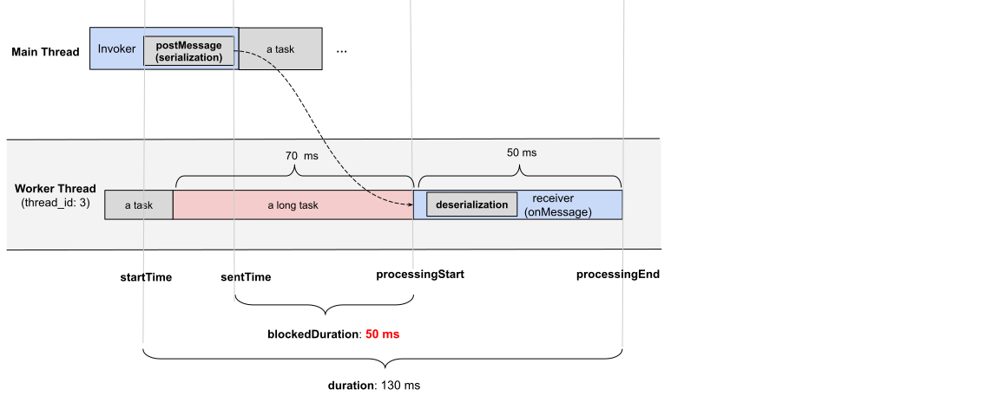

# Explainer: Delayed Messages API

Author: [Joone Hur](https://github.com/joone)

# Participate

- [Issue tracker](https://github.com/MicrosoftEdge/MSEdgeExplainers/labels/DelayedMessages)

<!-- START doctoc generated TOC please keep comment here to allow auto update -->
<!-- DON'T EDIT THIS SECTION, INSTEAD RE-RUN doctoc TO UPDATE -->
# Table of Contents

- [Explainer: Delayed Messages API](#explainer-delayed-messages-api)
- [Overview](#overview)
- [Goals](#goals)
- [Non-goals](#non-goals)
- [Problems](#problems)
  - [Case 1: Thread Being Occupied](#case-1-thread-being-occupied)
    - [index.html](#indexhtml)
    - [main.js](#mainjs)
    - [worker.js](#workerjs)
  - [Case 2: Message Queue Congestion](#case-2-message-queue-congestion)
    - [index.html](#indexhtml-1)
    - [main.js](#mainjs-1)
    - [worker.js](#workerjs-1)
  - [Case 3: Serialization/Deserialization Time](#case-3-serializationdeserialization-time)
    - [index.html](#indexhtml-2)
    - [main.js](#mainjs-2)
    - [worker.js](#workerjs-2)
    - [Console logs](#console-logs)
    - [Summary of Problems](#summary-of-problems)
- [Proposal: Introducing the Delayed Messages API](#proposal-introducing-the-delayed-messages-api)
  - [`PerformanceDelayMessageTiming` Interface](#performancedelaymessagetiming-interface)
    - [`postMessage` Timestamps and Durations:](#postmessage-timestamps-and-durations)
    - [Instance Properties](#instance-properties)
      - [`PerformanceEntry.entryType`](#performanceentryentrytype)
      - [`PerformanceEntry.name`](#performanceentryname)
      - [`PerformanceEntry.startTime`](#performanceentrystarttime)
      - [`PerformanceEntry.duration`](#performanceentryduration)
      - [`PerformanceDelayMessageTiming.sentTime`](#performancedelaymessagetimingsenttime)
      - [`PerformanceDelayMessageTiming.processingStart`](#performancedelaymessagetimingprocessingstart)
      - [`PerformanceDelayMessageTiming.processingEnd`](#performancedelaymessagetimingprocessingend)
      - [`PerformanceDelayMessageTiming.blockedDuration`](#performancedelaymessagetimingblockedduration)
      - [`PerformanceDelayMessageTiming.serialization`](#performancedelaymessagetimingserialization)
      - [`PerformanceDelayMessageTiming.deserialization`](#performancedelaymessagetimingdeserialization)
      - [`PerformanceDelayMessageTiming.messageType`](#performancedelaymessagetimingmessagetype)
      - [`PerformanceDelayMessageTiming.traceId`](#performancedelaymessagetimingtraceid)
      - [`PerformanceDelayMessageTiming.invoker`](#performancedelaymessagetiminginvoker)
      - [`PerformanceDelayMessageTiming.receiver`](#performancedelaymessagetimingreceiver)
      - [`PerformanceDelayMessageTiming.scripts`](#performancedelaymessagetimingscripts)
  - [`PerformanceMessageScriptInfo` Interface](#performancemessagescriptinfo-interface)
    - [Instance Properties](#instance-properties-1)
      - [`PerformanceMessageScriptInfo.name`](#performancemessagescriptinfoname)
      - [`PerformanceMessageScriptInfo.sourceFunctionName`](#performancemessagescriptinfosourcefunctionname)
      - [`PerformanceMessageScriptInfo.sourceURL`](#performancemessagescriptinfosourceurl)
      - [`PerformanceMessageScriptInfo.executionContext`](#performancemessagescriptinfoexecutioncontext)
      - [`PerformanceMessageScriptInfo.sourceCharPosition`](#performancemessagescriptinfosourcecharposition)
      - [`PerformanceMessageScriptInfo.sourceLineNumber`](#performancemessagescriptinfosourcelinenumber)
      - [`PerformanceMessageScriptInfo.sourceColumnNumber`](#performancemessagescriptinfosourcecolumnnumber)
  - [`PerformanceExecutionContextInfo` Interface](#performanceexecutioncontextinfo-interface)
    - [Instance Properties](#instance-properties-2)
      - [`PerformanceExecutionContextInfo.id`](#performanceexecutioncontextinfoid)
      - [`PerformanceExecutionContextInfo.name`](#performanceexecutioncontextinfoname)
      - [`PerformanceExecutionContextInfo.type`](#performanceexecutioncontextinfotype)
  - [Monitoring Delayed `postMessage` Events](#monitoring-delayed-postmessage-events)
    - [`durationThreshold`](#durationthreshold)
  - [Examples of a `delayed-message` Performance Entry](#examples-of-a-delayed-message-performance-entry)
- [Alternatives Considered](#alternatives-considered)
  - [DevTools Tracing](#devtools-tracing)
  - [Manual Instrumentation / Polyfills](#manual-instrumentation--polyfills)
- [Security and Privacy Considerations](#security-and-privacy-considerations)
- [Discussion](#discussion)
  - [Minimum Duration for Delayed Messages (`durationThreshold`)](#minimum-duration-for-delayed-messages-durationthreshold)
- [References](#references)

<!-- END doctoc generated TOC please keep comment here to allow auto update -->

# Overview

Web applications frequently use `postMessage` to send messages across different execution contexts, such as between windows, iframes, and web workers. However, message delays happen when messages are queued but not processed promptly, often because the event loop in the receiving context is occupied with long-running tasks or the message queue itself becomes congested due to a high volume of messages.

Such delays can degrade user experience by making applications feel unresponsive. Identifying the root cause of these delays—whether it's a busy thread, a congested message queue, or the overhead of preparing message data—is currently challenging for web developers.

The Delayed Messages API allows web developers to identify congested browser contexts or workers and provide details on the end-to-end timing of `postMessage` events, as well as their related blocking tasks. These metrics help identify the causes of `postMessage` delays and improve application performance.

# Goals

  * **Enable detection of congested contexts:** Allow websites to identify specific browser contexts (windows, tabs, iframes) or workers that are slow to process `MessageEvent`s. This covers [cross-document messaging](https://developer.mozilla.org/en-US/docs/Web/API/Window/postMessage), [cross-worker/document messaging](https://developer.mozilla.org/en-US/docs/Web/API/Worker/postMessage), [channel messaging](https://developer.mozilla.org/en-US/docs/Web/API/Channel_Messaging_API), and [broadcast channels](https://developer.mozilla.org/en-US/docs/Web/API/Broadcast_Channel_API).
  * **Provide detailed end-to-end timing:** Offer comprehensive timing information for `postMessage` events, including message queue wait time, and the time taken for serialization and deserialization, to help pinpoint bottlenecks.
  * **Identify blocking tasks:** Help developers find the specific scripts that prevent `postMessage` events from being handled promptly from the message queue.

# Non-goals

This API does not aim to monitor or provide diagnostics for the following types of message communications:

  * [Server-sent events](https://developer.mozilla.org/en-US/docs/Web/API/Server-sent_events)
  * [Web sockets](https://developer.mozilla.org/en-US/docs/Web/API/WebSockets_API)
  * [WebRTC data channels](https://developer.mozilla.org/en-US/docs/Web/API/RTCDataChannel)

# Problems

While developers expect messages sent via `postMessage` to web workers or iframes to be processed promptly, these tasks typically receive default priority in the browser's task scheduler(e.g. Chromium). As a result, `postMessage` communication can experience noticeable delays due to lower prioritization compared to user-visible tasks, often compounded by synchronous JavaScript blocking the target thread, a flood of messages overwhelming the message queue, or significant time spent processing the data being transferred, making the root cause challenging to pinpoint.

These problems can be broadly categorized into three areas:

1.  **Thread being occupied:** The receiving thread is busy executing long-running tasks.
2.  **Message queue becoming congested:** Too many messages are enqueued faster than they can be processed.
3.  **Serialization/deserialization processes taking significant time:** The data being sent is large or complex, leading to overhead.

The following sections will analyze each area with examples. All examples involve web workers, but similar situations can also occur between the main window and iframes, or between different windows.

## Case 1: Thread Being Occupied

The following example code demonstrates how a long-running task on a worker thread can block subsequent messages in its message queue.

[Link to live demo](https://joone.github.io/web/explainers/delayed_messages/long_task/)

### index.html

```html
<!DOCTYPE html>
<html lang="en">
<head>
    <meta charset="UTF-8">
    <title>Delayed Messages in Web Workers Caused by Task Overload</title>
</head>
<body>
    <h3>Delayed Messages in Web Workers Caused by Task Overload</h3>
    <button onclick="runWorker()">Start</button>
    <p id="result"></p>
    <script src="main.js"></script>
</body>
</html>
```

### main.js

When the user clicks the "Start" button, the `runWorker` function dispatches five messages to the worker at 60ms intervals. Each message includes an input number that dictates how long a simulated task should run in the worker.

```javascript
function runWorker() {
  const worker = new Worker("worker.js", { name: "long_task_worker" });
  let i = 0;
  const interval = 60; // Interval in milliseconds
  const inputArray = [50, 50, 50, 120, 50]; // Durations for tasks in worker

  // Function to send messages to the worker at the specified interval
  function sendMessage() {
    if (i < inputArray.length) {
      const input = inputArray[i];
      console.log(`message #${i+1}: sending a message with input ${input}`);
      // Send a message to the worker
      worker.postMessage({
        no: i+1,
        input: input,
        startTime: performance.now() + performance.timeOrigin, // Absolute time
      });
      i++;
    } else {
      // Stop sending messages.
      clearInterval(messageInterval);
    }
  }

  // Start sending messages every 60ms
  const messageInterval = setInterval(sendMessage, interval);
}
```

### worker.js

The Web Worker receives messages and simulates a task that runs for the duration specified by `e.data.input`. If this duration is greater than the message sending interval (60ms), it can block subsequent messages.

```javascript
// Simulates a task that consumes CPU for a given duration
function runTask(duration) {
  const start = Date.now();
  while (Date.now() - start < duration) { // Use duration directly
    /* Busy wait to simulate work */
  }
}

onmessage = function runLongTaskOnWorker(e) {
  const processingStartOnWorker = e.timeStamp; // Time when onmessage handler starts
  const taskSimulationStartTime = performance.now();
  
  runTask(e.data.input); // Simulate the work
  
  const taskSimulationDuration = performance.now() - taskSimulationStartTime;

  // Calculate timings relative to worker's performance.timeOrigin
  const startTimeFromMain = e.data.startTime - performance.timeOrigin;
  const messageQueueWaitTime = processingStartOnWorker - startTimeFromMain;

  console.log(`message #${e.data.no}: original postMessage call at ${startTimeFromMain.toFixed(2)} ms (relative to worker origin)`);
  console.log(`message #${e.data.no}: started processing in worker at ${processingStartOnWorker.toFixed(2)} ms`);
  console.log(
    `message #${e.data.no}: ran a task for input (${e.data.input}ms), actual duration: ${taskSimulationDuration.toFixed(2)}ms`
  );
  console.log(
    `message #${e.data.no}: total time from postMessage to task end: ` +
    `task duration (${taskSimulationDuration.toFixed(2)}) + ` +
    `message queue wait time etc. (${messageQueueWaitTime.toFixed(2)}) = ` +
    `${(taskSimulationDuration + messageQueueWaitTime).toFixed(2)} ms (approx)`
  );
};
```

The following timeline illustrates message handling:


In this timeline, messages \#1, \#2, and \#3 are handled promptly because their simulated tasks (50ms) complete within the 60ms interval at which messages are sent.

However, message \#4's task is instructed to run for 120ms. While it's processing, message \#5 (sent 60ms after message \#4 was sent) arrives at the worker. Message \#5 must wait in the worker's message queue until message \#4 completes. This results in message \#5 experiencing a significant delay (approximately 60ms) before its handler can even begin.

Manually instrumenting code with `performance.now()` and `event.timeStamp` can help identify the root cause of delays as shown. However, in complex real-world applications, precisely identifying which long task caused a specific message delay, or distinguishing between delay caused by a preceding long task versus a message's own long handler, is very challenging without comprehensive, dedicated monitoring. This API aims to simplify such diagnoses.

## Case 2: Message Queue Congestion

Even without individual long-running tasks, a high volume of messages sent in a short period can overwhelm the receiving context. The message queue can grow, leading to congestion and delays for all subsequent messages, including potentially urgent ones.

The following example code demonstrates this situation, where multiple `deleteMail` tasks congest the message queue before an urgent `readMail` task.

[Link to live example](https://joone.github.io/web/explainers/delayed_messages/congested/)

### index.html

```html
<!doctype html>
<html lang="en">
  <head>
    <meta charset="UTF-8" />
    <meta name="viewport" content="width=device-width, initial-scale=1.0" />
    <title>An example of a message queue experiencing congestion</title>
  </head>
  <body>
    <h1>Message Queue Congestion Example</h1>
    <button onclick="sendTasksToWorker()">Start</button>
    <script src="main.js"></script>
  </body>
</html>
```

### main.js

In main.js, the email application sends 10 deleteEmail tasks every 30 ms to clear junk emails, keeping the worker occupied with intensive processing. Shortly after, the user requests to check their emails, requiring an immediate response.

```js
// Create a Web Worker
const worker = new Worker("worker.js");

// Open the mail storage
worker.postMessage({
  taskName: "openMailStorage",
  startTime: performance.now() + performance.timeOrigin,
});
console.log(`[main] dispatching the openMailStorage task`);

// Send a message every 30ms
let emailID = 0;
function sendTasksToWorker() {
  const interval = setInterval(() => {
    // Delete an email by ID
    worker.postMessage({
      emailId: emailID,
      taskName: `deleteMail`,
      startTime: performance.now() + performance.timeOrigin,
    });
    console.log(`[main] dispatching the deleteMail task(id=#${emailID})`);
    emailID++;
    if (emailID >= 10) {
      clearInterval(interval);
      // Read emails
      worker.postMessage({
        taskName: "readMails",
        startTime: performance.now() + performance.timeOrigin,
      });
      console.log("[main] dispatching the readMail task");
    }
  }, 30);
}
```

### worker.js

The Web Worker's `onmessage` handler processes `openMailStorage`, `deleteMail`, and `readMails` tasks received from the main thread. Each task requires 50ms to complete."

```js
// Listen for messages from the main thread
onmessage = async (event) => {
  const processingStart = event.timeStamp;
  const startTimeFromMain = event.data.startTime - performance.timeOrigin;
  const blockedDuration = processingStart - startTimeFromMain;
  const message = event.data;

  if (message.taskName === "openMailStorage") {
    await openMailStorage(message, blockedDuration);
  } else if (message.taskName === "readMails") {
    await readMails(message, blockedDuration);
  } else if (message.taskName === "deleteMail") {
    await deleteMail(message, blockedDuration);
  }
};

// Open the mail storage.
async function openMailStorage(message, blockedDuration) {
  return new Promise((resolve) => {
    const startOpenMailStorage = performance.now();
    // Simulate the openMailStorage task.
    const start = Date.now();
    while (Date.now() - start < 50) {
      /* Do nothing */
    }
    const endOpenMailStorage = performance.now();
    console.log(
      `[worker] ${message.taskName},`,
      `message queue wait time + etc: ${blockedDuration.toFixed(2)} ms,`,
      `task duration: ${(endOpenMailStorage - startOpenMailStorage).toFixed(2)} ms`,
    );
    resolve();
  });
}

// Read emails from the mail storage
async function readMails(message, blockedDuration) {
  return new Promise((resolve) => {
    const startRead = performance.now();
    // Simulate the read task.
    const start = Date.now();
    while (Date.now() - start < 50) {
      /* Do nothing */
    }
    const endRead = performance.now();
    console.log(
      `[worker] ${message.taskName},`,
      `message queue wait time + etc: ${blockedDuration.toFixed(2)} ms,`,
      `task duration: ${(endRead - startRead).toFixed(2)} ms`,
    );
    resolve();
  });
}

// Delete an email by ID.
async function deleteMail(message, blockedDuration) {
  return new Promise((resolve) => {
    const startDelete = performance.now();
    // Simulate the delete task.
    const start = Date.now();
    while (Date.now() - start < 50) {
      /* Do nothing */
    }
    const endDelete = performance.now();
    console.log(
      `[worker] ${message.taskName}(ID: ${message.emailId}),`,
      `message queue waitTime + etc: ${blockedDuration.toFixed(2)} ms,`,
      `task duration: ${(endDelete - startDelete).toFixed(2)} ms`,
    );
    resolve();
  });
}
```

The following timeline illustrates this congestion:


In this scenario, the worker processes 10 `deleteMail` tasks, each taking 50ms, while being sent every 30ms. This disparity causes tasks to accumulate in the message queue. Consequently, later tasks, like the 11th task `readMail`, spend a significant amount of time waiting in the queue (e.g., 245ms) even if their own processing time is short (e.g., 51.5ms).

While delays in background tasks like `deleteMail` might be acceptable, delays in user-initiated, high-priority tasks like `readMail` severely impact user experience. It's important for developers to identify if a browser context or worker is congested and which tasks contribute most to this congestion.

## Case 3: Serialization/Deserialization Time

When data is sent using `postMessage`, it undergoes serialization by the sender and deserialization by the receiver. For large or complex JavaScript objects (e.g., a large JSON payload or a deeply nested object), these processes can consume considerable time, blocking the respective threads.

The following example code demonstrate the delay introduced by serializing/deserializing a large JSON object during `postMessage`.

[Link to live demo](https://joone.github.io/web/explainers/delayed_messages/serialization/)


### index.html

```html
<!doctype html>
<html lang="en">
  <head>
    <meta charset="UTF-8" />
    <title>postMessage Serialization/Deserialization Example</title>
  </head>
  <body>
    <h1>postMessage Serialization/Deserialization Example</h1>
    <button id="sendJSON">Send Large JSON</button>
    <script src="main.js"></script>
  </body>
</html>
```

### main.js

In the main.js file, 7000 JSON objects are sent to the worker using `postMessage`. The duration of serialization can be measured by calling the `performance.now()` before and after executing `postMessage`.

```js
const worker = new Worker("worker.js");

// Generate a large JSON object
function generateLargeJSON(size) {
  const largeArray = [];
  for (let i = 0; i < size; i++) {
    largeArray.push({ id: i, name: `Item ${i}`, data: Array(1000).fill("x") });
  }
  return { items: largeArray };
}

// Send a large JSON object to the worker
function sendLargeJSON() {
  const largeJSON = generateLargeJSON(7000);
  console.log("[main] Dispatching a large JSON object to the worker.");

  const startTime = performance.now();
  worker.postMessage({
    receivedData: largeJSON,
    startTime: startTime + performance.timeOrigin,
  });
  const endTime = performance.now();
  console.log(
    `[main] Serialization(estimate): ${(endTime - startTime).toFixed(2)} ms`,
  );
}

// Add event listener to the button
document.getElementById("sendJSON").addEventListener("click", sendLargeJSON);
```

### worker.js

In worker.js, the duration of deserialization is estimated by calling `performance.now()` immediately before and after the first access to properties of event.data (e.g., `event.data.startTime`), as this access typically triggers the deserialization process.

```js
// Worker receives large data
onmessage = (event) => {
  const processingStart = event.timeStamp;
  // Deserialize the data
  const deserializationStartTime = performance.now();
  const startTimeFromMain = event.data.startTime - performance.timeOrigin;
  const receivedData = event.data.receivedData;
  const deserializationEndTime = performance.now();

  console.log(
    "[worker] Deserialized Data: ",
    receivedData.items.length,
    "items.",
  );
  console.log(
    "[worker] Deserialization: ",
    (deserializationEndTime - deserializationStartTime).toFixed(2),
    "ms",
  );

  const blockedDuration = processingStart - startTimeFromMain;
  console.log(
    "[worker] message queue wait time + etc:",
    blockedDuration.toFixed(2),
    "ms",
  );
};

```

### Console logs
```
[main] Dispatching a large JSON object to the worker.
[main] Serialization(estimate): 130.30 ms
[worker] Deserialized Data:  7000 items.
[worker] Deserialization:  114.30 ms
[worker] message queue wait time + etc: 130.40 ms
```
As shown, serialization on the main thread (approx. 130.30 ms) occurs synchronously during the `postMessage` call, blocking other main thread work. Similarly, deserialization on the worker thread (approx. 114.30 ms) is a significant operation that blocks the worker's event loop during message processing, delaying the execution of the `onmessage` handler and any subsequent tasks.

In this example, the worker log `message queue wait time + etc: 130.40 ms` indicates the time elapsed from when the main thread initiated the `postMessage` (including its ~130.30 ms serialization block) to when the worker’s `onmessage` handler began execution. This suggests that the message queue wait time is nearly zero, and the delay is primarily caused by serialization on the sender side. However, the timing of deserialization, which the [specification](https://html.spec.whatwg.org/multipage/web-messaging.html#dom-window-postmessage-options-dev) suggests should occur before the message event, can vary across browsers. For example, browsers like Chromium, may delay this process until the message data is actually accessed for the first time. This inconsistency, combined with a busy event loop that makes it difficult to distinguish serialization, actual queueing, deserialization, and task execution delays even with manual instrumentation, further underscores the need for an API to expose this particular timing information.

### Summary of Problems

Message delays frequently occur and can degrade user experience. While existing tools can detect delays, pinpointing the exact cause is difficult. Delays often stem from the receiver's thread being busy with long tasks, message queue congestion, or serialization/deserialization overhead. Accurately measuring internal message queue wait time is especially challenging with manual instrumentation. A dedicated API is needed to precisely measure, attribute, and identify these specific sources of delay.

# Proposal: Introducing the Delayed Messages API

The Delayed Messages API introduces the `PerformanceDelayMessageTiming` interface, delivered via the PerformanceObserver API. This interface allows developers to identify browser contexts or workers where `postMessage` events are significantly delayed in the message queue. It also provides detailed breakdowns of the event's lifecycle, including information about the invoker, receiver, and blocking scripts.

This new interface relies on two supporting interfaces:

  * `PerformanceMessageScriptInfo`: Provides details about the script that sent or received the message.
  * `PerformanceExecutionContextInfo`: Describes the execution context (e.g., main thread, worker) of the sender or receiver.

## `PerformanceDelayMessageTiming` Interface

This interface provides end-to-end timing for a `postMessage` event.
The following diagram illustrates the key timestamps:



### `postMessage` Timestamps and Durations:

  * **`startTime`**: The timestamp when the `postMessage` API is called in the sending context.
  * **`sentTime`**: The timestamp when the message is added to the task queue of the receiving browser context or worker.
  * **`processingStart`**: The timestamp when the receiving context begins processing the message (i.e., when its `onmessage` handler is about to be executed).
  * **`processingEnd`**: The timestamp when the message processing (i.e., the `onmessage` handler) is completed in the receiving context.
  * **`duration`**: The total time from `startTime` to `processingEnd`.
  * **`blockedDuration`**: The time the message spent waiting in the receiver's message queue after `sentTime` but before `processingStart`.

This interface is available in both browser contexts and web workers, providing insights into `postMessage` timings. For round-trip timing analysis, developers would need to correlate entries from both the sender and receiver contexts (e.g., by sending performance entries back or using a unique identifier).

### Instance Properties

This interface extends `PerformanceEntry`. The following properties are specific to or have special meaning for `PerformanceDelayMessageTiming` entries:

#### `PerformanceEntry.entryType`

Returns `"delayed-message"`.

#### `PerformanceEntry.name`

Returns the name associated with the `postMessage` event, if one was provided. If no name is provided, it returns an empty string.
To facilitate this, we propose extending the `postMessage` API to accept an options with a `name` property. This feature allows developers to assign meaningful names to messages, making it easier to distinguish and analyze them in performance traces, especially in complex applications.

Example:

```javascript
worker.postMessage({ query: 'find a user' }, { name: 'userSearchQuery' });
```

#### `PerformanceEntry.startTime`

Returns a `DOMHighResTimeStamp` representing the time when the `postMessage` was executed in the sending context. The timestamp is relative to the `timeOrigin` of the context where the `PerformanceDelayMessageTiming` entry is observed.
*Note for developers:* When an entry is observed in a worker for a message sent from the main window (or vice-versa), `startTime` reflects the sender's clock, adjusted to the observer's `timeOrigin`. This means `startTime` can sometimes be a negative value if the sending context was initialized earlier than the observing context. The relative durations provided by the API remain accurate.

#### `PerformanceEntry.duration`

Returns a `DOMHighResTimeStamp` representing the total time from `startTime` to `processingEnd`.

#### `PerformanceDelayMessageTiming.sentTime`

Returns a `DOMHighResTimeStamp` representing the time when the message was added to the message queue of the receiving browser context or worker.

#### `PerformanceDelayMessageTiming.processingStart`

Returns a `DOMHighResTimeStamp` representing the time when the event dispatch started (i.e., the `onmessage` handler is about to be executed in the receiving execution context).

#### `PerformanceDelayMessageTiming.processingEnd`

Returns a `DOMHighResTimeStamp` representing the time when the event dispatch ended (i.e., the `onmessage` handler completed in the receiving execution context).

#### `PerformanceDelayMessageTiming.blockedDuration`

Returns a `DOMHighResTimeStamp` representing the duration a dispatched `postMessage` waited in the message queue of the receiving context *after* `sentTime` and *before* `processingStart`. It is calculated as `processingStart - sentTime`.

#### `PerformanceDelayMessageTiming.serialization`

Returns a `DOMHighResTimeStamp` representing the duration taken by the sending context to serialize the data attached to the message.

#### `PerformanceDelayMessageTiming.deserialization`

Returns a `DOMHighResTimeStamp` representing the duration taken by the receiving context to deserialize the attached data from the message. This occurs before `processingStart`.

#### `PerformanceDelayMessageTiming.messageType`

Returns a string indicating the type of `postMessage` communication. Possible values:

  * `"cross-worker-document"` (between a worker and a document)
  * `"channel"` (via a `MessageChannel`)
  * `"cross-document"` (between windows/iframes using `window.postMessage`)
  * `"broadcast-channel"` (via a `BroadcastChannel`)

#### `PerformanceDelayMessageTiming.traceId`

Returns a unique identifier (e.g., an incrementing number) for the message. This can help correlate logs or entries if necessary, especially if messages are sent back and forth.

#### `PerformanceDelayMessageTiming.invoker`

Returns a `PerformanceMessageScriptInfo` instance providing details about the script that sent the message.

#### `PerformanceDelayMessageTiming.receiver`

Returns a `PerformanceMessageScriptInfo` instance providing details about the script that handled (or is handling) the message.

#### `PerformanceDelayMessageTiming.scripts`

Returns an array of `PerformanceScriptTiming` instances. These represent the long tasks that were executing on the receiver's thread between `sentTime` and `processingStart`, thus contributing to `blockedDuration`. This leverages the same mechanism as the [Long Animation Frames API](https://developer.mozilla.org/en-US/docs/Web/API/PerformanceLongAnimationFrameTiming/scripts).

## `PerformanceMessageScriptInfo` Interface

This interface provides insights into the script responsible for sending (`invoker`) or handling (`receiver`) a `postMessage` event.

### Instance Properties	 

#### `PerformanceMessageScriptInfo.name`

Returns either `"invoker"` or `"receiver"`.

#### `PerformanceMessageScriptInfo.sourceFunctionName`

Returns the function name associated with sending or handling the `postMessage` event, if available.

#### `PerformanceMessageScriptInfo.sourceURL`

Returns the source URL of the script containing the function responsible for sending or handling the `postMessage` event.

#### `PerformanceMessageScriptInfo.executionContext`

Returns a `PerformanceExecutionContextInfo` instance containing details about the execution environment of the script.

#### `PerformanceMessageScriptInfo.sourceCharPosition`

Returns the character position within the source file where the function responsible for sending or handling the `postMessage` event begins.

#### `PerformanceMessageScriptInfo.sourceLineNumber`

Returns the line number in the source file where the function responsible for sending or handling the `postMessage` event begins. 

#### `PerformanceMessageScriptInfo.sourceColumnNumber`

Returns the column number in the source file where the function responsible for sending or handling the `postMessage` event begins. 


## `PerformanceExecutionContextInfo` Interface

This interface provides information about the execution environment (context) where the sender or receiver script is running.

### Instance Properties

#### `PerformanceExecutionContextInfo.id`

Returns a unique identifier for the execution context (e.g., a string or an integer). For example, the main thread might be "0", the first worker "1", and so on. These IDs are unique within the current agent cluster.

#### `PerformanceExecutionContextInfo.name`

Returns the name of the execution context. For workers, this is the name provided during instantiation (e.g., `new Worker("worker.js", { name: "MyWorker" })`). It might be empty, as the name is optional. For windows or iframes, it might be empty or derived from `window.name`.

#### `PerformanceExecutionContextInfo.type`

Identifies the type of execution context. Possible values:

  * `"main-thread"`
  * `"dedicated-worker"`
  * `"service-worker"`
  * `"shared-worker"`
  * `"window"`
  * `"iframe"`

## Monitoring Delayed `postMessage` Events

Developers can monitor `postMessage` events that exceed a certain duration threshold using a `PerformanceObserver`.

```javascript
const observer = new PerformanceObserver((list) => {
  console.log(list.getEntries());
});

observer.observe({type: 'delayed-message', buffered: true});
```

### `durationThreshold`
The definition of a "delayed" message can vary by application. The API allows developers to set a `durationThreshold` (in milliseconds) when observing. Only messages whose total `duration` (from `startTime` to `processingEnd`) exceeds this threshold will generate a performance entry.

  * The default `durationThreshold` is 200ms.
  * A minimum threshold (e.g., 50ms) will be enforced to prevent excessive entry generation for very frequent, short messages.


```js
// Observe entries where the total duration exceeds 50ms
observer.observe({ type: "delayed-message", durationThreshold: 50, buffered: true });

```
## Examples of a `delayed-message` Performance Entry

The following JSON shows sample performance entries for the delayed messages identified in **Case 1: Thread Being Occupied**. This API automatically detects and reports these delays without requiring manual `performance.now()` tracking.

By examining `blockedDuration` and the handler execution time (`processingEnd - processingStart`), developers can diagnose the cause:

  * In the **first entry** (message \#4), `duration` is `121ms`, and the handler execution time (`processingEnd - processingStart`, which is `121.1ms`. `blockedDuration` is `0ms`. This indicates the message's *own handler* was long, causing the overall delay.
  * In the **second entry** (message \#5), the handler time is `51.5ms`. However, `blockedDuration` is `60.0ms`. This shows that other tasks were occupying the worker's event loop, preventing this message from being handled promptly. The `scripts` property (shown for the second entry) would list these blocking tasks.

```json
[
   {
      "name": "delayed-message",
      "entryType": "delayed-message",
      "startTime": 212.80000019073486,
      "duration": 121,
      "traceId": 4,
      "messageType": "cross-worker-document",
      "sentTime": 213,
      "processingStart": 213.30000019073486,
      "processingEnd": 334.40000009536743,
      "blockedDuration": 0,
      "serializeDuration": 0,
      "deserializeDuration": 0,
      "scripts": [],
      "invoker": {
          "name": "invoker",
          "sourceURL": "https://joone.github.io/web/explainers/delayed_messages/long_task/main.js",
          "sourceFunctionName": "sendMessage",
          "sourceCharPosition": 510,
          "sourceColumnNumber": 14,
          "sourceLineNumber": 15,
          "executionContext": {
              "name": "",
              "type": "window",
              "id": 0
          }
      },
      "receiver": {
          "name": "receiver",
          "sourceURL": "https://joone.github.io/web/explainers/delayed_messages/long_task/worker.js",
          "sourceFunctionName": "runLongTaskOnWorker",
          "sourceCharPosition": 168,
          "sourceColumnNumber": 41,
          "sourceLineNumber": 8,
          "executionContext": {
              "name": "",
              "type": "dedicated-worker",
              "id": 1
          }
      }
  },
  {
      "name": "delayed-message",
      "entryType": "delayed-message",
      "startTime": 274.40000009536743,
      "duration": 112,
      "traceId": 5,
      "messageType": "cross-worker-document",
      "sentTime": 274.5,
      "processingStart": 335.19999980926514,
      "processingEnd": 386.69999980926514,
      "blockedDuration": 60,
      "serializeDuration": 0,
      "deserializeDuration": 0,
      "scripts": [
          {
              "name": "script",
              "entryType": "script",
              "startTime": 213.30000019073486,
              "duration": 121,
              "invoker": "DedicatedWorkerGlobalScope.onmessage",
              "invokerType": "event-listener",
              "windowAttribution": "other",
              "executionStart": 213.30000019073486,
              "forcedStyleAndLayoutDuration": 0,
              "pauseDuration": 0,
              "sourceURL": "https://joone.github.io/web/explainers/delayed_messages/long_task/worker.js",
              "sourceFunctionName": "runLongTaskOnWorker",
              "sourceCharPosition": 168,
              "sourceLine": 8,
              "sourceColumn": 41
          }
      ],
      "invoker": {
          "name": "invoker",
          "sourceURL": "https://joone.github.io/web/explainers/delayed_messages/long_task/main.js",
          "sourceFunctionName": "sendMessage",
          "sourceCharPosition": 510,
          "sourceColumnNumber": 14,
          "sourceLineNumber": 15,
          "executionContext": {
              "name": "",
              "type": "window",
              "id": 0
          }
      },
      "receiver": {
          "name": "receiver",
          "sourceURL": "https://joone.github.io/web/explainers/delayed_messages/long_task/worker.js",
          "sourceFunctionName": "runLongTaskOnWorker",
          "sourceCharPosition": 168,
          "sourceColumnNumber": 41,
          "sourceLineNumber": 8,
          "executionContext": {
              "name": "",
              "type": "dedicated-worker",
              "id": 1
          }
      }
  }
]
```

# Alternatives Considered

## DevTools Tracing

Modern browser developer tools offer tracing capabilities that can show `postMessage` events and task execution timelines. While useful for manual inspection, these tools are not designed for systematic, large-scale metric collection, aggregation, or automated performance monitoring in production environments.

The proposed API offers structured timing data suitable for production monitoring. It enables automated monitoring and performance attribution without requiring manual tooling, developer intervention, or complex trace analysis.

## Manual Instrumentation / Polyfills

Developers can attempt to wrap `postMessage` calls and `onmessage` handlers with their own timing logic (e.g., using `performance.now()`). However, this approach has several drawbacks:

  * It's challenging to intercept all messages, especially those from third-party libraries.
  * Accurately measuring internal browser operations like serialization, deserialization, and precise queue waiting time is not feasible from JavaScript.

A native API can provide more accurate and comprehensive data with lower overhead.

# Security and Privacy Considerations

This API is designed to provide developers with insights into the performance of their own applications and does not introduce new cross-origin information leakage.

  * **Same-Origin Data:** `PerformanceDelayMessageTiming` entries are only exposed to the same origin that initiated and received the messages. Information about message timings between `A.com` and an iframe from `B.com` would only be available to `A.com` if it can observe the receiver in `B.com` (which generally requires `B.com` to cooperate) or vice-versa, subject to standard cross-origin policies. The `scripts` property, which details blocking tasks, also only contains information about same-origin scripts.
  * **No New Cross-Origin Information:** The API does not expose any new information about cross-origin interactions that isn't already observable through other means (e.g., whether a message was sent or received). Details of cross-origin execution contexts or script contents are not revealed.
  * **Fingerprinting:** The risk of this API being used for user fingerprinting is considered low.
      * The information provided is about the performance characteristics of the web application itself, not the user's underlying system hardware beyond what influences JavaScript execution speed.
      * The `durationThreshold` for observing entries limits the granularity and volume of data reported, making it less suitable for creating a detailed fingerprint.
      * While timing variations could exist, they are more likely attributable to the application's state and workload rather than unique user environment characteristics.

# Discussion

## Minimum Duration for Delayed Messages (`durationThreshold`)

We propose a default `durationThreshold` of 200ms for identifying delayed messages. However, the impact of a delay can be context-dependent. For example, a 100ms delay might not cause any issues in a background worker task, but the same delay could be noticeable to users if it affects communication between an iframe and its parent window during a user interaction.

To address this, the API makes `durationThreshold` configurable by the developer. This allows developers to adjust the threshold to their specific application's performance requirements and specific use cases. In addition, the `durationThreshold` also helps ensure that data is only collected for messages that are genuinely problematic, reducing unnecessary monitoring overhead.

Further discussion is needed to determine the minimum allowed value for this threshold (e.g., 50ms as suggested) to ensure it remains useful without introducing significant performance costs.

# References
- [Event Timing API](https://w3c.github.io/event-timing/)
- [Extending Long Tasks API to Web Workers](https://github.com/joone/MSEdgeExplainers/blob/add_id_src_type/LongTasks/explainer.md)
- https://developer.mozilla.org/en-US/docs/Web/API/PerformanceLongTaskTiming
- https://developer.mozilla.org/en-US/docs/Web/API/PerformanceScriptTiming
- https://developer.mozilla.org/en-US/docs/Web/API/MessageEvent
- https://developer.chrome.com/docs/web-platform/long-animation-frames
