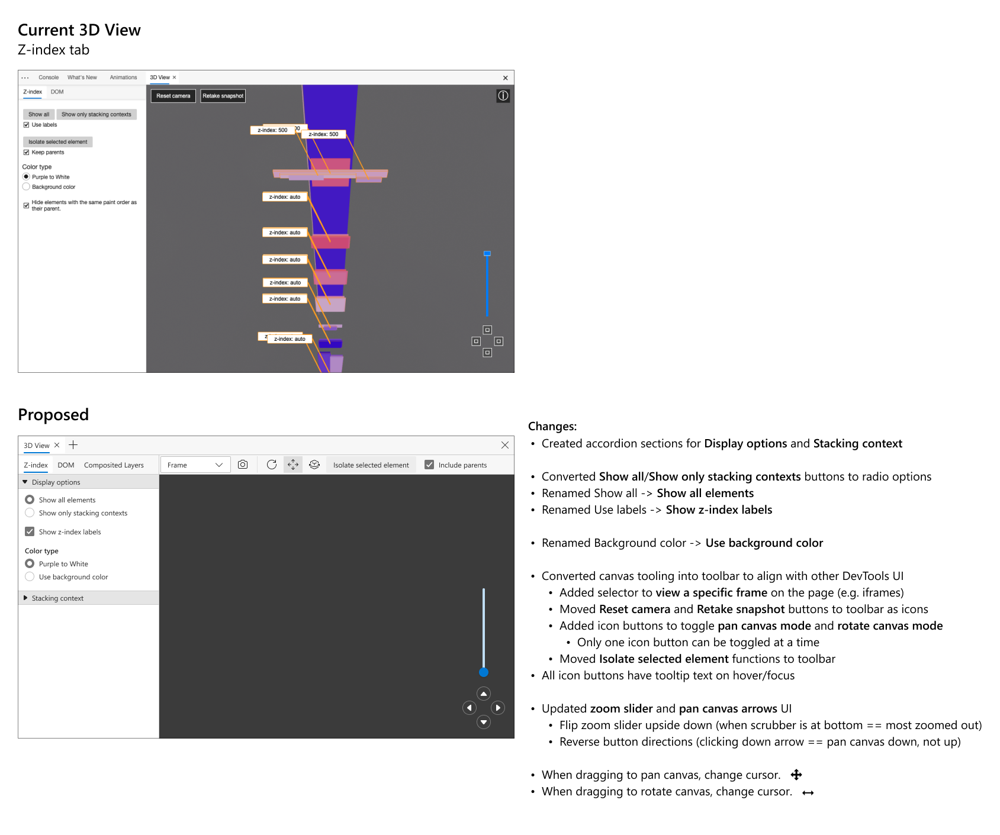
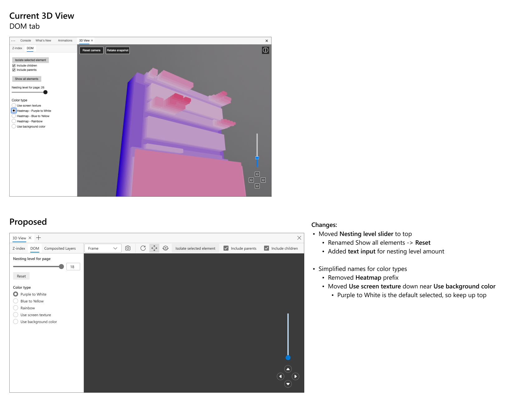

# Update 3D View

Authors: [Erica Draud](https://github.com/erdraud)

## Status of this Document
* This document status: **`ARCHIVED`**
* **Current version: https://github.com/MicrosoftEdge/DevTools/blob/main/explainers/3DView/explainer.md**
    
## Introduction
We released [3D View](https://docs.microsoft.com/en-us/microsoft-edge/devtools-guide-chromium/3d-view/) as a comprehensive tool for debugging your web application in the 3D space. This document will cover enhancements and adjustments we're making based on feedback.

## Goals
* Make the UI in the DOM and Z-index tabs consistent by updating the strings and their organization
* Create a toolbar with the canvas and camera controls integrated
* Adjust canvas controls for more intuitive use
* Persistent settings after snapshot is taken
* Remove the experiment since 3D View has already rolled out
* Remove Layers pane, as it is now Composited Layers pane in 3D View

## Use Cases
* A developer using both the DOM and Z-index tabs is confused about the difference between a `Heatmap` color and one without the `Heatmap` identifier. They waste time playing with the colors until they realize there is no difference.
* A developer is debugging their application. They're used to the Layers pane and have started using 3D View, not realizing that they can just stay in the 3D View for the same experience without switching context.
* A developer believes the left side of the mouse should be used for panning. The DOM rotates instead of panning. They do not realize that the functionality they need exists, so they give up and close out of 3D View.

## Proposed Solution

### 3D View UI
We will be updating the DOM tab's UI to match that of the Z-index tab's for greater consistency. We will flip the `Show all elements` and `Isolate selected element` sections to match the order of the Z-index tab. We will also remove the `Heatmap` identifier for the color types in the DOM tab.

The icons in the 3D canvas need to be updated to align with the DevTools  UI. 3D View is getting even more discovery with the **+** button in DevTools, so it is particularly important that the UI is up to par. We are currently working with the design team to get the assets needed for this.

A toolbar will be added at the top of the tool, which will be consistent between 3D View's different tabs, so that users can access and understand the functions of the canvas and camera better. The panning and rotate buttons in the toolbar will be highlighted when in use and can be selected directly with panning being the default option. Users will still be able to access these tools with the mouse and keyboard as usual. 

The zoom slider will swap directions, since users currently view it as being fully zoomed in. It will be updated to mimic the zoom sliders of common applications such as maps. The proposed changes are shown below:

### Persistent settings
Users want 3D View pane settings to persist when taking a new snapshot. In the DevTools, taking a new snapshot is a way to refresh the canvas view. The settings currently refresh with the canvas, but users would like them to stay the same, leaving only the DOM to adjust. This would help make the 3D View feel more personalized to the user.
