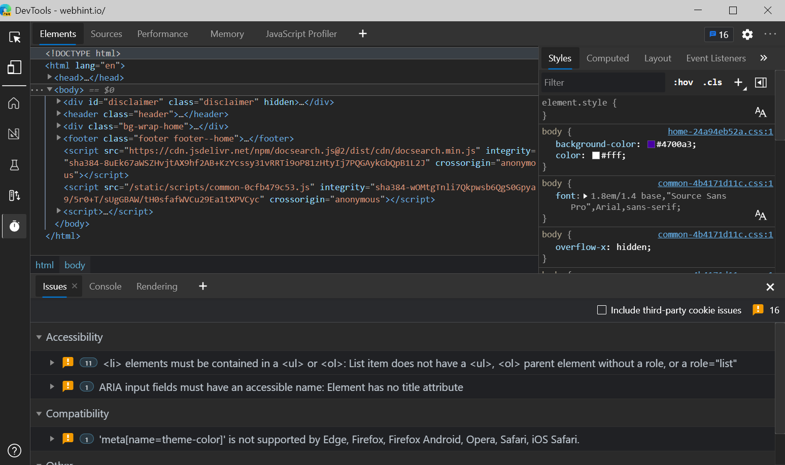
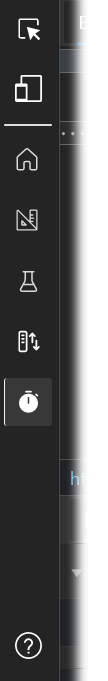

# DevTools: Focus Mode UI

Authors:
 - [Rachel Simone Weil](https://github.com/hxlnt), Program Manager
 - [Jose Leal Chapa](https://github.com/joselea), Senior Software Engineer
 - [Patrick Brosset](https://github.com/captainbrosset), Senior Software Engineer
 - [Chait Pinnamaneni](https://github.com/noobtiger), Software Engineer
 - Ebou Jobe, Software Engineer
 - Josephine Le, Designer

## Status of this feature
This feature is experimental and in active development. See [Changelog section](#changelog) for details on progressive feature implementation starting with Edge 90.0.810.0.

The team welcomes your feedback on this feature; please [file an issue](https://github.com/MicrosoftEdge/MSEdgeExplainers/issues/new?labels=DevTools&template=devtools.md&title=%5BDevTools%5D+%3CTITLE+HERE%3E) to share your thoughts.

## Introduction
Over the years, the Chromium DevTools have grown to include a large array of specialized tools—about 30 at time of writing—to help web developers troubleshoot web applications. Some, like **Elements** and **Console**, may be used daily, while others, like **Sensors** and **Performance monitor,** may have more specialized but infrequent use.

DevTools users tell us that a side effect of having numerous tools is that the overall experience can be visually and conceptually overwhelming. New web developers may not have a clear idea of where to start and how to explore and use the DevTools. More experienced developers may find themselves in one or two familiar workflows that want to focus in on.

To address these diverse needs, we're experimenting with new features that make it easier to learn and use the Edge DevTools, such as
  -  A redesign of **What's New** (now called **Welcome**) that highlights documentation, resources, and new features in a user-friendly format,
  -  New ways to customize tab layout, and
  -  A tooltip help feature to help you learn what different parts of DevTools do.

This document describes a fourth new feature to address the complexity of DevTools: Focus Mode. Focus Mode is an alternative, minimal UI option that lives alongside the "classic" Chromium DevTools UI. This interface will offer all the same functionality but with a cleaner, customizable interface, helping you put in focus your most important debugging tasks without extra clutter or distractions.

## Goals
  1. To lower the learning curve for new users of Edge DevTools,
  2. To reduce the complexity of the Edge DevTools without compromising its feature set, and
  3. To allow users to use predefined or custom layouts suited to certain debugging tasks and personal preference.

Those of us creating this new interface acknowledge the responsibility that comes with changes of this magnitude. For this reason, we're limiting these new features to early adopters who wish to opt-in to trying them. The new UI can be turned on and off, so no commitment is required.

We're also approaching the development of these features iteratively, gaining feedback, tweaking features, and learning as we go. (After all, our team is made up of web developers, too!) We expect the first few releases to be a little rough around the edges, but we think it's valuable to work out in the open to ensure these changes are ones that Edge DevTools users will love. Your feedback (via an [issue on this repo](https://github.com/MicrosoftEdge/MSEdgeExplainers/issues/new?labels=DevTools&template=devtools.md&title=%5BDevTools%5D+%3CTITLE+HERE%3E) or on [Twitter](https://twitter.com/EdgeDevTools)) is valued, especially in these early stages.

## Usage

### Switch to Focus Mode
To try Focus Mode in Microsoft Edge 90.0.810.0 and later, open the Settings pane, then choose the Experiments section on the left side. Select the checkboxes next to "Focus Mode and DevTools Tooltips" and "Enable + button tab menus to open more tools," then restart DevTools. The Focus Mode experiment also enables DevTools Tooltips.

To return to the default DevTools UI, repeat the process above, unchecking the checkboxes.

Note that the "Enable + button tab menus to open more tools" experiment is an independent feature; however, we recommend turning this feature on when using Focus Mode for the best experience.

### Use DevTools in Focus Mode

With this experiment selected, an activity bar will appear along the left side of DevTools. In top-to-bottom order, the menu contains shortcuts to the following:

|              | Menu shortcuts                                          |
|--------------|---------------------------------------------------------|
|    |   <ul><li><strong>Inspect</strong> tool</li><li><strong>Device mode</strong>: Emulate alternative devices and responsive design changes.</li><li><strong>Home</strong>: A collection of your favorite tools. By default, this will be populated with the tools you last had open.</li><li><strong>Layout</strong>: A collection of front-end tools ideal for troubleshooting layouts, CSS, etc.</li><li><strong>Testing</strong>: A collection of tools useful for debugging testing your web app against different network conditions, client configurations, and more.</li><li><strong>Network</strong>: A collection of tools to help you monitor security features and network requests.</li><li><strong>Optimization</strong>: A collection of tools to help you optimize your web app for performance, compatibility, and more.</li><li><strong>Tooltips</strong>: The ? icon toggles tooltips, which show what each portion of the DevTools UI does and, where applicable, links to further documentation.</li></ul>

When in Focus Mode, you still have access to all the tools that are available in the default UI. The tool groups (**Home**, **Layout**, **Testing**, **Network**, and **Optimization**) organize the tools based on common web development scenarios.

### Customize tool groups in Focus Mode

Each tool group is customizable: Remove unwanted tools by selecting the X in the top corner of the tab, and add new tools by selecting the More Tools button (+).

In an upcoming release, you will be able to further customize tool groups by removing default groups and adding your own.

## Changelog

| Edge release | Changelog                                               |
|--------------|---------------------------------------------------------|
| 90.0.810.0   | Initial release of Focus Mode as experimental feature.  |
