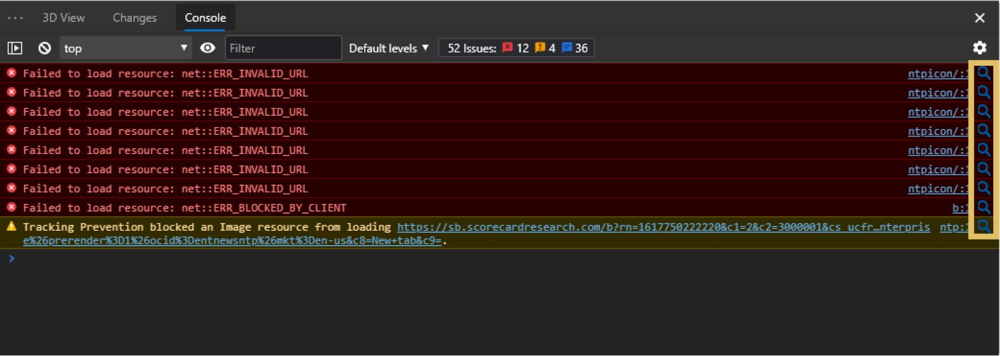
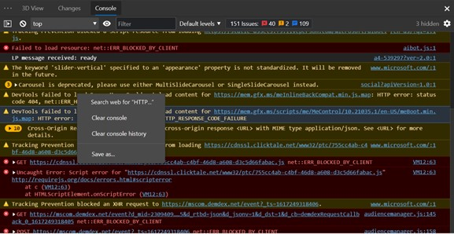

# Search the Console for Errors

Authors: [Erica Draud](https://github.com/erdraud)

## Status of this Document
* This document status: **`ARCHIVED`**
* **Current version: https://github.com/MicrosoftEdge/DevTools/blob/main/explainers/SearchConsole/explainer.md**
    
## Introduction

One of the most common problems users that are new to the Developer Tools face is understanding Console messages. "Why are there errors and what does /error message/ mean?" We'd like to make it easier for users to answer these questions. We are experimenting on the error message workflow. We will start by adding a function to search for the Console error or warning directly from its banner. Further experimentation will be based on the response from the first experiment.

## Goals

1. To reduce context switching in Edge DevTools,
2. To make the Console less intimidating to inexperienced users, and 
3. To learn more about the greatest pain points that our new developers face. 

## Non-Goals

* Integrate search experience throughought the Developer Tools

## Use Cases

A new developer is using the DevTools Console, one of the most used tools we have. They see an error message they don’t understand. What’s their first instinct? Look it up. We’re going to make this experience easier and easier for them.

A new developer clicks on the links in the error or warning message, which links them to tools they find even more confusing. They can instead turn to the familiar information icon for help.

## Proposed Solution

We will add a search icon to the end of the error message, which will open a new tab with their default search browser with results for that error. 

 

We will track the amount of usage for this feature. If it's less than 1%, we will try to address whether it's discovery or usability that is the problem. We'll track which error message types are most requested.

Based on the number of searches and what error messages are most searched for, we will experiment with integrating documentation directly into the Developer Tools. Users will have a way to expand the error message or open a “documentation pane” within the DevTools to learn about the most popularly requested error messages without switching context. 

## Alternative Solutions

We were previously considering adding the search option to the context menu that appears when the user right-clicks an error message. This experience is similar to what a user would experience if they highlighted text in the error message and right-clicked their selection. The existing context menu search experience closely models that of the browser, where you can also highlight text, right-click your selection, and access a search tool. This shows that context menus might not be the expected location for such a feature for new developers.
 
