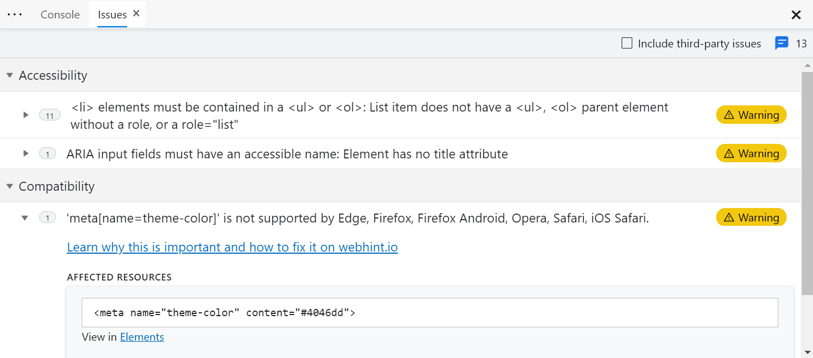
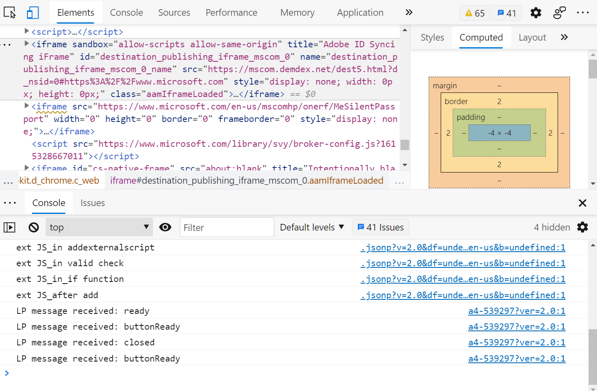

# DevTools: webhint integration in Issues

Authors:
 - [Rachel Simone Weil](https://github.com/hxlnt), Program Manager
 - [Tony Ross](https://github.com/antross), Senior Software Engineer
 - [David Garcia Gomez](https://github.com/sarvaje), Software Engineer
 - [John Emau](https://github.com/johnemau), Software Engineer
 - Josephine Le, Designer

## Status of this feature
This feature is experimental and in active development. See [Changelog section](#changelog) for details on progressive feature implementation starting with Edge 85.

## Introduction
The [2019 MDN Web Developer Needs Assessment report](https://mdn-web-dna.s3-us-west-2.amazonaws.com/MDN-Web-DNA-Report-2019.pdf) illuminates a number of pain points that web developers face in their work. Among the challenges were implementing and testing cross-browser compatibility, security, performance, and accessibility. Web developers also note the difficulty of keeping up with documentation and the latest best practices.

There are numerous tools that audit websites for problems in compatibility, security, etc. However, keeping up with these solutions, learning how to use and configure them, and finally integrating them into a web development workflow can require a great deal of time and effort. Additionally, most tools provide audits or reports that are generally run *after* a site is built&mdash;in CI/CD, for example, when changes are more challgening or costly to make.

To address these pain points, the Edge DevTools now offer *proactive* feedback on accessibility, cross-browser compatibility, performance, security, PWAs, and more that can be used in real-time during development and debugging. We acheive this through the inclusion of [https://webhint.io](webhint), a fully open-source best practices engine that uses indsutry-leading APIs from MDN, Deque Univeristy. 

## Goals
Our goal in including webhint in DevTools is to help developers rapidly address known pain points around accessibility, cross-browser testing, etc. *during* development, rather than after. webhint is both open-source and highly customizable, meaning it reflects the best practices of web developers rather than browser vendors. webhint's recommendations, which appear **Issues** tool in DevTools, are:

  - **specific,** down to the line of code or HTTP request in question,
  - **trustworthy,** linking to relevant documentation when more context is needed, 
  - **just in time,** conveniently updating in real-time like a code linter,
  - **customizable,** catering the kind of feedback you see based on your project's needs, and 
  - **actionable,** with concrete recommendations on how to fix the issue.

## Usage

### View feedback in **Issues**

**Issues** can be opened in DevTools by selecting the blue dialog box in the top-right corner of DevTools. Alternatively, it can be opened by opening the ... menu and choosing More tools > Issues.

Feedback is sorted into categories based on the type of feedback. Click a category to expanded or collapse it. Each recommendation includes documentation, affected code snippet (where applicable), a severity label (e.g., Warning, Error, Info), and links to other relevant information in the **Elements,** **Network,** or **Sources** tools. 

### Preview issues in **Elements**

With the Show issues in Elements experiment selected, wavy underlines will appear in the Elements pane to indicate code for which there is a warning or recommendation. These underlines match those you might see in web IDEs such as [VS Code](https://code.visualstudio.com).

To see the issue details, Shift + click on the underlined item. Or, use the context menu and select View issues.

### Roadmap for new features

Plans for upcoming releases include

 - additional sort and filter capabilities, and
 - localization of feedback to match the language of your DevTools

The team welcomes your feedback on this feature; please [file an issue](https://github.com/MicrosoftEdge/MSEdgeExplainers/issues/new?labels=DevTools&template=devtools.md&title=%5BDevTools%5D+%3CTITLE+HERE%3E) to share your thoughts.

## Changelog

| Edge release | Changelog                                               |
|--------------|---------------------------------------------------------|
| 85           | Initial integration of webhint feedback into Issues as an experimental feature.  |
| 88           | Added code snippets, documentation links, and links to other tools in DevTools.  |
| 91           | Added severity icons and underlines in Elements.        |
