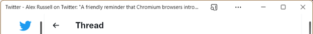
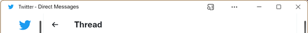

# Installed Web App window title (`appTitle`)
***(formerly HTML Document Subtitle)***

Authors: [Diego Gonzalez](https://github.com/diekus)

## Status of this Document
This document is a starting point for engaging the community and standards bodies in developing collaborative solutions fit for standardization. As the solutions to problems described in this document progress along the standards-track, we will retain this document as an archive and use this section to keep the community up-to-date with the most current standards venue and content location of future work and discussions.
* This document status: **Active**
* Expected venue: [W3C Web Incubator Community Group](https://wicg.io/)
* **Current version: this document**
    
## Introduction

**Installed web apps cannot provide dynamic/controllable contextual information in their title bar**. Contextual information can be the name of an open document, the section of an app or any other information that can be relevant to the running installed PWA. Having this information in the title bar can be useful to identify the open window when selecting among open apps in surfaces like the Alt+Tab action on Windows (and similar actions on macOS and Linux to jump between open apps).

 The current behavior is that an installed web application will put the app's name from the manifest and append the page’s inner text from the `<title>` HTML tag in the head of the page. This often can create awkward titles for some web apps. For instance, some social networking apps change the title of the page to the content it is displaying itself, creating a title that is often too long and not good to identify the installed web app window. See the image below as reference:

We want to fix the text that appears on the title bar by giving developers control over the information that appears there. Generally, applications utilize the text in the title bar of the window to specify the application's name and any other contextual information that is important to identify the window in the corresponding's platform UX. As an example, most word processors and image editors would display the name of the application and the name of the document or file that is being edited.

To fix this situation, we require a bucket to store this contextual information. Considering that this information is generally different from what is displayed in the page's title, we propose adding an `appTitle` definition that can be used for this specific purpose. The source of the title bar in installed web apps would be composed of the app's name as defined in the manifest, and an additional contextual/detail from a meta tag in the head of the document.

## Goals
* Align the UI of installed web apps to that of platform specific applications.
* Provide better accessibility regarding information about the context of a web app.

## Non-Goals
* **Provide advanced/custom title bar compositions**: APIs like `Window Controls Overlay` should be used to create custom title bar configurations.
* **Change/update the name of the installed PWA**: The text that appears before the hyphen is specified by the app name that comes from the manifest file. It is not in the scope of this API to change the text that corresponds to the title of the application.

## Use Cases
This will allow developers 2 cases for the standard title bar.
1.	Installed web apps that only have the app’s name as define in the manifest file.
    * Useful to replicate some native experiences that only have the app’s name in the title bar (This is the default behaviour for web apps that do not specify the appTitle meta tag or define it through the JS API).
2.	Installed Web Apps that have the app’s name and a appTitle or detail as defined in the document’s meta tag.
    * Useful for apps that can have multiple instances running with several documents open, such as word processors.

## Proposed Solution

As defined in the [HTML specification](https://html.spec.whatwg.org/multipage/semantics.html#the-meta-element), “meta element represents various kinds of metadata that cannot be expressed using the title, base, link, style, and script elements”. This is the case for the type of information we want to convey in the particular and novel case of text in the title bar of an installed web app/tab in browser. Following the guidelines of [usage for own metadata](https://html.spec.whatwg.org/multipage/semantics.html#other-metadata-names) names, there can be processing requirements for the UA so a new [standard name](https://html.spec.whatwg.org/#standard-metadata-names) needs to be added to the existing list. 

`<meta name="appTitle" content="additional/secondary text to go in the title bar">`

This also requires to add an IDL attribute to the WHATWG spec to reflect and expose the appTitle to the document.

`document.appTitle`

The following image is a mockup of a PWA using the `appTitle` API.

This is achieved by adding the following meta tag in the head of the page:

`<meta name="appTitle" content="Direct Messages">`

## Privacy and Security Considerations

The TAG privacy and security self-review is located [here](https://docs.google.com/document/d/1CwYQEf98fI5z96Y6AsQdSafp70SD5STgepD5Z8cx1HQ/edit?usp=sharing).

## Alternative Solutions

* Using a field on the manifest to store the contextual information. This alternative would require constant reading and writing to an external (manifest) file and doesn't necessarily fit semantically with the context of the application's state.
* Let the developer update the value of the title once the web application is installed. This might be problematic as  many websites still rely on the title (generally displayed in the tab on the browser) for when there is new notifications or certain events on the page. For instance, messaging apps can update the title every time a new message comes in to show number of unread messages. Additionally, in the case that a title didn't change on a web site, once a PWA is installed, if the user opens the web app in the browser through the `...` menu the original/current state title would have to be restored.
* Use a media query to determine when an app is running in `standalone` mode to change the text that appears on the title of the document: This approach has several disadvantages, starting by having limited accessibility to the contextual information when you compare it to having the data in a defined bucket. It also requires JavaScript to match a media query and change the name of the document's title. This in return means the title must be stored or lost to make space for the new contextual subtitle. This can involve using local storage to cache the previous text, which is cumbersome and should be avoided.   
           
## Open Questions

* The name `subtitle` might be misleading, so there is a possibility of using a more generic name that aligns better with the use of the content. Suggested, `app-title-suffix` and `app-title-custom` work as well. The final value of the meta tag name will likely be different from subtitle.
    * `subtitle` has been changed to `appTitle`.
