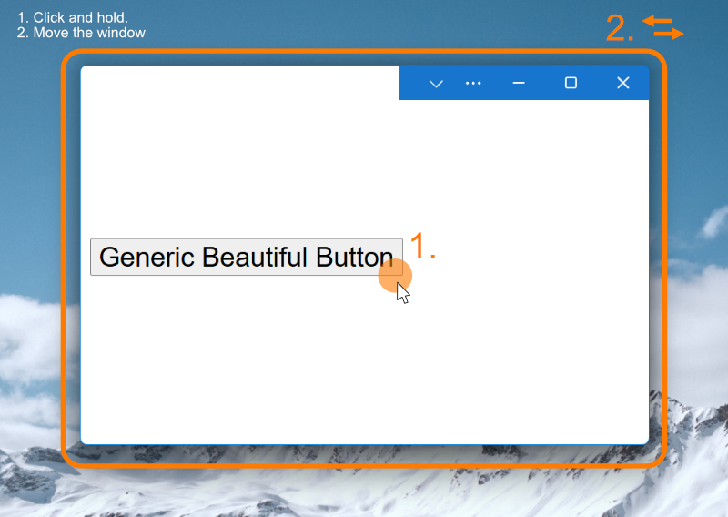

# Draggable App Region 

## Authors

- [Diego Gonzalez](https://github.com/diekus)

## Participate

- [Issue tracker](https://github.com/MicrosoftEdge/MSEdgeExplainers/labels/Draggable%20App%20Region)

## Status of this Document

This document is intended as a starting point for engaging the community and
standards bodies in developing collaborative solutions fit for standardization.
As the solutions to problems described in this document progress along the
standards-track, we will retain this document as an archive and use this section
to keep the community up-to-date with the most current standards venue and
content location of future work and discussions.

* This document status: **Active**
* Expected venue: [CSS Working Group](https://www.w3.org/Style/CSS/)
* Current version: this document

## Table of Contents

- [Draggable App Region](#draggable-app-region)
  - [Authors](#authors)
  - [Introduction](#introduction)
  - [Goals](#goals)
  - [Non Goals](#non-goals)
  - [Feature Usage](#feature-usage)
  - [Property Values](#property-values)
  - [Current Property Behaviour](#current-property-behaviour)
  - [Sample Use Case](#sample-use-case)
  - [Stakeholder Feedback / Opposition](#stakeholder-feedback--opposition)
  - [Accessibility, Privacy, and Security Considerations](#accessibility-privacy-and-security-considerations)
  - [References \& acknowledgements](#references--acknowledgements)


## Introduction

The `-webkit-app-region` and `app-region` properties exist as a styling feature used primarily in desktop web applications to define draggable regions of a window. This is useful when applications recreate a custom title bar or title bar region, as it **allows users to click and drag the window to move it when the default OS window chrome is not present**.

This property is used by several technologies to move a window in the OS, including:
* [Web Apps through the WCO API](https://wicg.github.io/window-controls-overlay/)
* [Electron](https://www.electronjs.org/docs/latest/tutorial/custom-window-interactions#custom-draggable-regions)

The property is not currently standard, this leaves a gap on implementations that needs to be fixed. 

## Goals

* Standardize the `app-region` CSS property.
* Allow a _standalone_ window to be moved by a user when no other platform UX is present.

## Non-goals

* Allow DOM objects to move a browser window (app running inside a tab).
* Work outside of scenarios that show the default platform's window moving UX (generally the titlebar).

## Feature Usage

There is interest in standardizing this feature as it is already 'widely' used on the platform and it enables a basic expected interaction for applications. At the time of writing (August 2025), `-webkit-app-region` shows [0.79%](https://chromestatus.com/metrics/css/timeline/popularity/412) of page loads using it and `app-region` [0.24%](https://chromestatus.com/metrics/css/timeline/popularity/702). The lack of definition and assumptions on what the feature does can be confusing for users, and undesirable for technologies that need to rely on this property.

* [User asking about definition of property in IDEs](https://stackoverflow.com/questions/54448328/why-is-webkit-app-region-not-a-defined-css-property-in-most-code-editors).
* [Confusion on how the feature works](https://github.com/electron/electron/issues/1354).

## Property Values

The `app-region` property has 2 possible values:
* `drag`: marks an element as a draggable area. Clicking and dragging on the element moves the entire window on the screen.
* `no-drag`: cancels the draggable behaviour in a nested element.

## Current property behaviour

The `app-region` property works on `inline` and `block` elements. There is one requirement for the feature to work on web apps and that is to have the application running in a standalone window and with a `display-override` value of `['window-controls-overlay']`. The reason for this is that when in this override, the host window loses its titlebar, which is the only area that allows an end user to move the window in the screen.

Below is an illustration of such case, showing the [WCO](https://developer.mozilla.org/en-US/docs/Web/API/Window_Controls_Overlay_API) feature toggled _on_:



And here is the HTML code for the example:

```html
<!DOCTYPE html>
<html lang="en">
<head>
    <meta charset="UTF-8">
    <meta name="viewport" content="width=device-width, initial-scale=1.0">
    <title>test</title>
    <link rel="manifest" href="manifest.json">
    <style>
        button {
            font-size: 1.5rem;
            animation-name: moveDown;
            animation-duration: 120s;
            animation-iteration-count: infinite;
            app-region: drag; /* <-------- APP-REGION */
        }

        @keyframes moveDown {
            from { margin-top: 0px; }
            to { margin-top: 600px;}
        }
    </style>
</head>
<body>
    <button title="should be draggable">
        Generic Beautiful Button
    </button>
    
</body>
</html>
```

In this example, the 'WCO' feature is enabled, hence the window has lost the meaningful area to be moved across the screen.

The (Generic Beautiful) button has the `app-region` set to `drag`. This button can be used to drag the window around.

> Note: This is just an example to test the _current_ behaviour on elements that have animations. The `app-region` is generally used on emulated titlebars or other UX designed to let the end user move the window around.

### `app-region` and pointer events

Current implementations of `app-region` **consume all pointer events**, even if they don't result in a drag. Interactive elements inside an area defined with `app-region: drag` will require a `app-region: no-drag` to be interacted with.

### Suppression of `app-region`

The `app-region` property applies to a DOM element, and allows it to become a point from where to drag and move a window. If this element's `visibility` is `hidden` or `collapsed`, or if the element is occluded by an element with a higher `z-index` then the window can't be dragged from that element.

### `app-region` and animations
A drag operation started in an `app-region` continues so long as the user continues to keep their pointer down, even if an animation has moved the element away from where that pointer is.

## Sample use case

A sample use case is a web application that is using [Window Controls Overlay](https://developer.mozilla.org/en-US/docs/Web/API/Window_Controls_Overlay_API) to create a custom titlebar. Elements like buttons and textboxes that need to be interacted with use the `no-drag` value to be accessed. Everything else in the `#titlebar` style will be a point from where the user can drag and move the window.

```css
/* Custom titlebar style */
#titlebar {
    width: env(titlebar-area-width, 100%);
    height: env(titlebar-area-height, 32px);
    top: env(titlebar-area-y, 0px);
    left: env(titlebar-area-x, 0px);
    ...
    -webkit-app-region: drag;
    app-region: drag;
}

/*A search textbox inside the custom titlebar*/
#searchBox {
  app-region: no-drag; /* allows the textbox to be interacted with*/
}
```
## Stakeholder Feedback / Opposition
The process to standardize this feature was logged in an [issue #7017](https://github.com/w3c/csswg-drafts/issues/7017) in 2022. This explainer aims at restarting the conversation. 

Note that there is [positive](https://github.com/w3c/csswg-drafts/issues/7017#issuecomment-1609114145) developer signals in the issue.

## Accessibility, Privacy, and Security Considerations
There are no considerations at this time.

## References & acknowledgements

This work aknowledges and thanks the following individuals for their contributions:

- Amanda Baker
