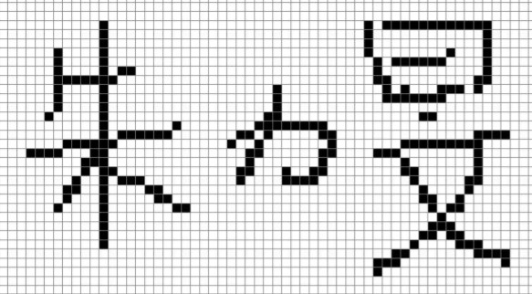

# End User Defined Characters (EUDC): Explainer
## Introduction

  

[End User Defined Characters (EUDC)](https://docs.microsoft.com/en-us/windows/desktop/Intl/end-user-defined-characters
) utilize the [private use area (PUA)](https://unicode-table.com/en/blocks/private-use-area/) within unicode to provide extensibility to support custom
characters. They can be defined by the end user or another party such as an equipment manufacturer, a user group, a government body, or a font design company. Their use enables users to form names and other words using characters that are not available in standard screen and printer fonts.

The EUDC font is distrubted via either a TTF or TTE file ([read more here](https://docs.microsoft.com/en-us/windows/desktop/intl/character-sets-and-fonts)) which are registered via the registry as supplementing the private use range of a specific or all system fonts. Typically organizations distribute this through a group policy script.

## Evidence
  - Microsoft has received feedback to retain support for EUDC for line-of-business and government applications and for their end users to utilize pre-defined characters.

## Goals
  - Enable access to the EUDC unicode codepoints on Windows
  - PUA characters in a font file will continue to be ignored as per [spec](https://www.w3.org/TR/css-fonts-3/#char-handling-issues) – only PUA characters registered via the windows EUDC mechanism will light up

## Use-cases
  - When a user utilizes this character it is rendered correctly rather than U+FFFD which is usually utilized when
     rendering an unknown or unpresentable character.
  - A common scenario is a user in Chinese or Japanese whose name is not representable utilizing the base font character set, EUDC allows the user to represent their name in text format. The example in the image provided is actually a colleague who, until fonts began supporting the final character correctly utilized EUDC to write his name.

## Proposed Solution
 - The proposed solution hooks into the font fallback loop. On Windows, the fallback loop will look at CSS 'font-family' specified fonts  before resorting to system fonts. This solution enables a check for EUDC fonts after system fonts have been considered. If we arrive at this stage and we are requesting a character in the PUA, a call to the browser process will be made. In the browser process, Skia will be updated to call the DWrite function that returns the system EUDC collection.

 ---
 [Related issues](https://github.com/MicrosoftEdge/MSEdgeExplainers/labels/EUDC) | [Open a new issue](https://github.com/MicrosoftEdge/MSEdgeExplainers/issues/new?title=%5BEUDC%5D)
