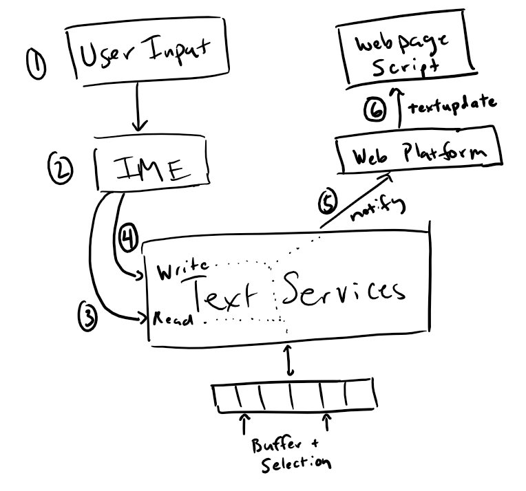
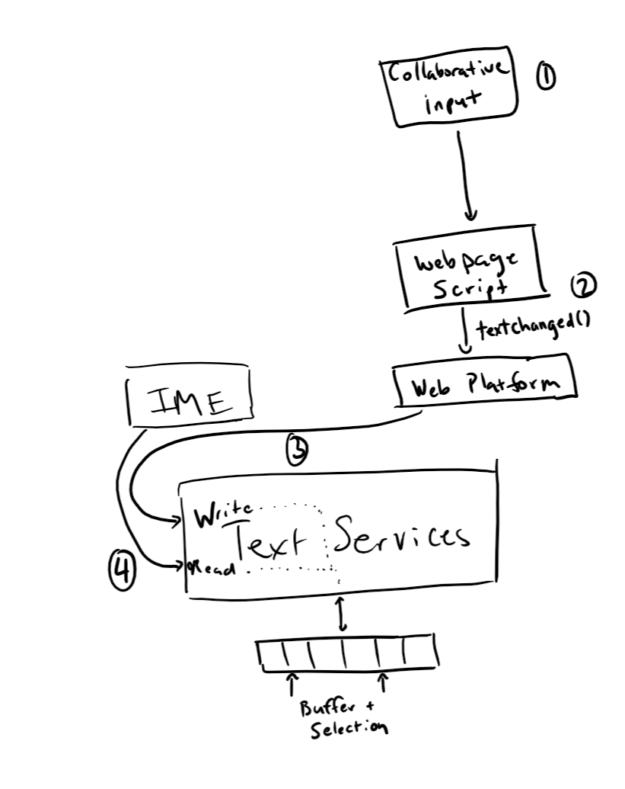

# Developer Design



The typical flow of text input comes from the user pressing keys on the keyboard. These are delivered to the browser, which opted-in to using the system's text services framework in order to integrate with the IMEs installed on the system. This will cause input to be forwarded to the active IME. The IME is then able to query the text services to read contextual information related to the underlying editable text in order to provide suggestions, and potentially modify which character(s) should be written to the shared buffer. These modifications are typically performed based on the current selection, which is also communicated through the text services framework. When the shared buffer is updated, the web application will be notified of this via the ```textupdate``` event.

When an EditContext has focus, this sequence of events is fired when a key is pressed and an IME is not active:

|  Event        | EventTarget        |
| ------------- | ------------------ |
|  keydown      | focused element    |
|  textupdate   | active EditContext |
|  keyup        | focused element    |

Because the web page has opted in to the EditContext having focus, keypress is not delivered, as it is redundant with the `textupdate` event for editing scenarios.

Now consider the scenario where an IME is active, the user types in two characters, then commits to the first IME candidate by hitting 'Space'.

|  Event                | EventTarget        |  Related key in sequence
| -------------         | -----------------  | -------------------
|  keydown              | focused element    |  Key 1
|  compositionstart     | active EditContext |  ...
|  textupdate           | active EditContext |  ...
|  keyup                | focused element    |  ...
|  keydown              | focused element    |  Key 2
|  textupdate           | active EditContext |  ...
|  keyup                | focused element    |  ...
|  keydown              | focused element    |  Space
|  textupdate           | active EditContext |  (committed IME characters available in event.updateText)
|  keyup                | focused element    |  ...
|  compositionend       | active EditContext |

Note that the composition events are also not fired on the focused element as the composition is operating on the shared buffer that is represented by the EditContext.

### Externally triggered changes

Changes to the editable contents can also come from external events, such as collaboration scenarios. In this case, the web editing framework may get some XHR completion that notifies it of some pending collaboartive change that another user has committed. The framework is then responsible for writing to the shared buffer, via the ```textChanged()``` method.



## API Details

The ```textupdate``` event will be fired on the EditContext when user input has resulted in characters being applied to the editable region. The event signals the fact that the software keyboard or IME updated the text (and as such that state is reflected in the shared buffer at the time the event is fired). This can be a single character update, in the case of typical typing scenarios, or multiple-character insertion based on the user changing composition candidates. Even though text updates are the results of the software keyboard modifying the buffer, the creator of the EditContext is ultimately responsible for keeping its underlying model up-to-date with the content that is being edited as well as telling the EditContext about such changes. These could get out of sync, for example, when updates to the editable content come in through other means (the backspace key is a canonical example &mdash; no ```textupdate``` is fired in this case, and the consumer of the EditContext should detect the keydown event and remove characters as appropriate).

Updates to the shared buffer driven by the webpage/javascript are performed by calling the ```textChanged()``` method on the EditContext. ```textChanged()``` accepts a range (start and end offsets over the underlying buffer) and the characters to insert at that range. ```textChanged()``` should be called anytime the editable contents have been updated. However, in general this should be avoided during the firing of ```textupdate``` as it will result in a canceled composition.

The ```selectionupdate``` event may be fired by the browser when the IME wants a specific region selected, generally in response to an operation like IME reconversion.

```selectionChanged()``` should be called by the web page in order to communicated whenever the selection has changed. It takes as parameters a start and end character offsets, which are based on the underlying flat text buffer held by the EditContext. This would need to be called in the event that a combination of control keys (e.g. Shift + Arrow) or mouse events result in a change to the selection on the edited document.

The ```layoutChanged()``` method must be called whenever the [client coordinates](https://drafts.csswg.org/cssom-view/#dom-mouseevent-clientx) (i.e. relative to the origin of the viewport) of the view of the EditContext have changed. This includes if the viewport is scrolled or the position of the editable contents changes in response to other updates to the view. The arguments to this method describe a bounding box in client coordinates for both the editable region and also the current selection. 

The ```textformatupdate``` event is fired when the input method desires a specific region to be styled in a certain fashion, limited to the style properties that correspond with the properties that are exposed on TextFormatUpdateEvent (e.g. backgroundColor, textDecoration, etc.). The consumer of the EditContext should update their view accordingly to provide the user with visual feedback as prescribed by the software keyboard. Note that this may have accessibility implications, as the IME may not be aware of the color scheme of the editable contents (i.e. may be requesting blue highlight on text that was already blue).

```compositionstart``` and ```compositionend``` fire when IME composition begins and ends. It does not provide any other contextual information, as the ```textupdate``` events will let the application know the text that the user chose to insert.

There can be multiple EditContext's per document, and they each have a notion of focused state. Because there is no implicit representation of the EditContext in the HTML view, focus must be managed by the web developer, most likely by forwarding focus calls from the DOM element that contains the editable view. ```focus``` and ```blur``` events are fired on the EditContext in reponse to changes in the focused state. EditContext focus is bound to the element that was focused when the EditContext became active, that is, if the focused element changes, the EditContext will also lose focus.

The ```mode``` property on the EditContext (also can be passed in a dictionary to the constructor) denotes what type of input the EditContext is associated with. This information is typically provided to the underlying system as a hint for which software keyboard to load (e.g. keyboard for phone numbers may be a numpad instead of the default keyboard). This defaults to 'text'.

#### Links to Relevant operating systems input APIs
| Operating System |    |
| ---------------- | -- |
| Android | [InputMethodManager](https://developer.android.com/reference/android/view/inputmethod/InputMethodManager) |
| OS X | [Implementing Text Input Support](https://developer.apple.com/library/archive/documentation/TextFonts/Conceptual/CocoaTextArchitecture/TextEditing/TextEditing.html#//apple_ref/doc/uid/TP40009459-CH3-SW25) |
| iOS | [Communicating with the Text Input System](https://developer.apple.com/library/archive/documentation/StringsTextFonts/Conceptual/TextAndWebiPhoneOS/LowerLevelText-HandlingTechnologies/LowerLevelText-HandlingTechnologies.html#//apple_ref/doc/uid/TP40009542-CH15-SW16) |
| Linux | [Intelligent Input Bus (IBus) ](https://github.com/ibus/ibus/wiki)
| Windows | [Text Services Framework](https://docs.microsoft.com/en-us/windows/desktop/TSF/text-services-framework) |