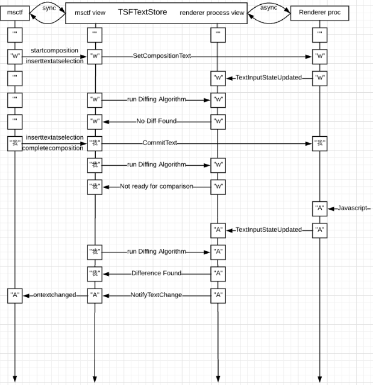
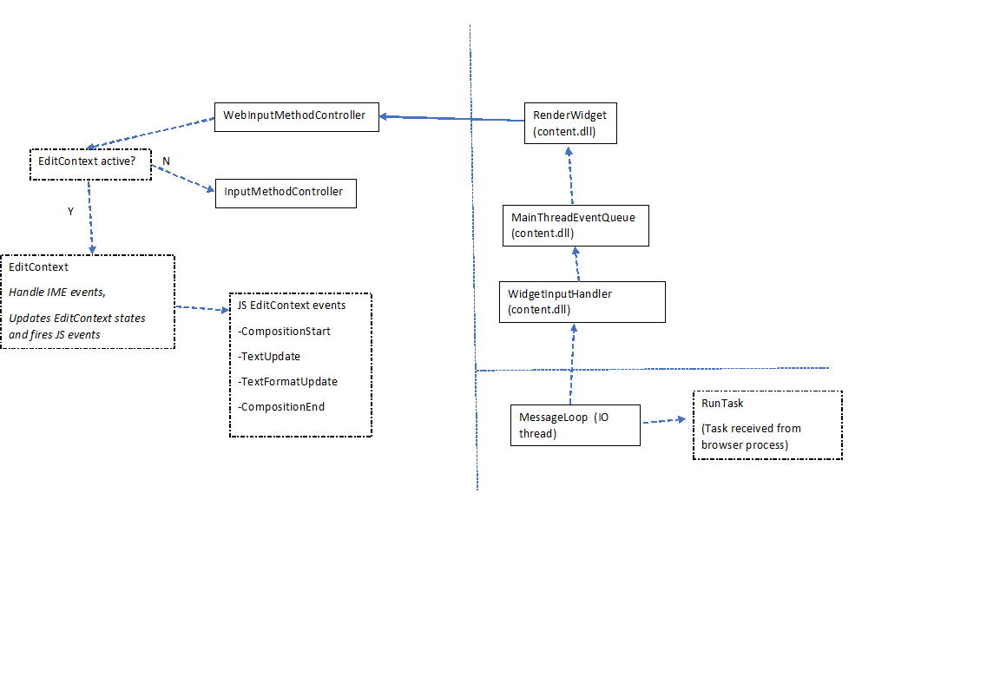
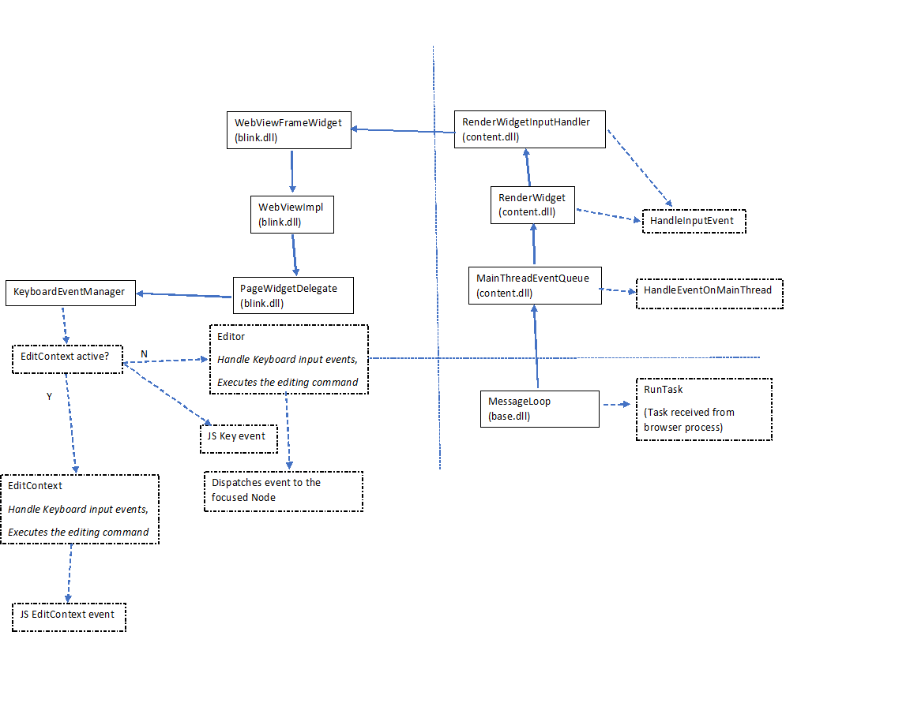

# Developer Design


The typical flow of text input comes from the user pressing keys on the keyboard. These are delivered to the browser, which opted-in to using the system's text services framework in order to integrate with the IMEs installed on the system. This will cause input to be forwarded to the active IME. The IME is then able to query the text services to read contextual information related to the underlying editable text in order to provide suggestions, and potentially modify which character(s) should be written to the shared buffer. These modifications are typically performed based on the current selection, which is also communicated through the text services framework. When the shared buffer is updated, the web application will be notified of this via the ```textupdate``` event.

When an EditContext has focus, this sequence of events is fired when a key is pressed and an IME is not active:

|  Event        | EventTarget        |
| ------------- | ------------------ |
|  keydown      | focused element    |
|  textupdate   | active EditContext |
|  keyup        | focused element    |

Because the web page has opted in to the EditContext having focus, keypress is not delivered, as it is redundant with the `textupdate` event for editing scenarios.

Now consider the scenario where an IME is active, the user types in two characters, then commits to the first IME candidate by hitting 'Space'.

|  Event                | EventTarget        |  Related key in sequence
| -------------         | -----------------  | -------------------
|  keydown              | focused element    |  Key 1
|  compositionstart     | active EditContext |  ...
|  textupdate           | active EditContext |  ...
|  keyup                | focused element    |  ...
|  keydown              | focused element    |  Key 2
|  textupdate           | active EditContext |  ...
|  keyup                | focused element    |  ...
|  keydown              | focused element    |  Space
|  textupdate           | active EditContext |  (committed IME characters available in event.updateText)
|  keyup                | focused element    |  ...
|  compositionend       | active EditContext |

Note that the composition events are also not fired on the focused element as the composition is operating on the shared buffer that is represented by the EditContext.

### Externally triggered changes

Changes to the editable contents can also come from external events, such as collaboration scenarios. In this case, the web editing framework may get some XHR completion that notifies it of some pending collaboartive change that another user has committed. The framework is then responsible for writing to the shared buffer, via the ```textChanged()``` method.


## API Details

The ```textupdate``` event will be fired on the EditContext when user input has resulted in characters being applied to the editable region. The event signals the fact that the software keyboard or IME updated the text (and as such that state is reflected in the shared buffer at the time the event is fired). This can be a single character update, in the case of typical typing scenarios, or multiple-character insertion based on the user changing composition candidates. Even though text updates are the results of the software keyboard modifying the buffer, the creator of the EditContext is ultimately responsible for keeping its underlying model up-to-date with the content that is being edited as well as telling the EditContext about such changes. These could get out of sync, for example, when updates to the editable content come in through other means (the backspace key is a canonical example &mdash; no ```textupdate``` is fired in this case, and the consumer of the EditContext should detect the keydown event and remove characters as appropriate).

Updates to the shared buffer driven by the webpage/javascript are performed by calling the ```textChanged()``` method on the EditContext. ```textChanged()``` accepts a range (start and end offsets over the underlying buffer) and the characters to insert at that range. ```textChanged()``` should be called anytime the editable contents have been updated. However, in general this should be avoided during the firing of ```textupdate``` as it will result in a canceled composition.

The ```selectionupdate``` event may be fired by the browser when the IME wants a specific region selected, generally in response to an operation like IME reconversion.

```selectionChanged()``` should be called by the web page in order to communicated whenever the selection has changed. It takes as parameters a start and end character offsets, which are based on the underlying flat text buffer held by the EditContext. This would need to be called in the event that a combination of control keys (e.g. Shift + Arrow) or mouse events result in a change to the selection on the edited document.

The ```layoutChanged()``` method must be called whenever the [client coordinates](https://drafts.csswg.org/cssom-view/#dom-mouseevent-clientx) (i.e. relative to the origin of the viewport) of the view of the EditContext have changed. This includes if the viewport is scrolled or the position of the editable contents changes in response to other updates to the view. The arguments to this method describe a bounding box in client coordinates for both the editable region and also the current selection. The rectangles communicated through this API are used to scroll the EditContext into view when the software input panel gets raised by text input service or for IMEs to position the candidate window at the location where the composition is taking place.

The ```textformatupdate``` event is fired when the input method desires a specific region to be styled in a certain fashion, limited to the style properties that correspond with the properties that are exposed on TextFormatUpdateEvent (e.g. backgroundColor, textDecoration, etc.). The consumer of the EditContext should update their view accordingly to provide the user with visual feedback as prescribed by the software keyboard. Note that this may have accessibility implications, as the IME may not be aware of the color scheme of the editable contents (i.e. may be requesting blue highlight on text that was already blue).

```compositionstart``` and ```compositionend``` fire when IME composition begins and ends. It does not provide any other contextual information, as the ```textupdate``` events will let the application know the text that the user chose to insert.

There can be multiple EditContexts per document, and they each have a notion of focused state. Because there is no implicit representation of the EditContext in the HTML view, focus must be managed by the web developer, most likely by forwarding focus calls from the DOM element that contains the editable view. ```focus()``` and ```blur()``` APIs are used to set focus and blur on the EditContext respectively.

The ```type``` property on the EditContext (also can be passed in a dictionary to the constructor) denotes what type of input the EditContext is associated with. This information is typically provided to the underlying system as a hint for which software keyboard to load (e.g. keyboard for phone numbers may be a numpad instead of the default keyboard). This defaults to 'text'. Some possible values of this property are as follows:
enum EditContextInputType { "text", "password", "search", "email", "number", "telephone", "url", "date", "datetime" }.

The ```action``` property on the EditContext (also can be passed in a dictionary to the constructor) denotes what type of Enter key action the EditContext is associated with. This information indicates to the text input services to display different glyphs for the enter key on the software input panel which also changes the functionality of the enter key such as enter to search, enter to send etc.
Some possible values of this property are as follows:
enum EditContextInputAction { "enter", "done", "go", "next", "previous", "search", "send" }.

## Windows IME components
Browser Process Communication


Windows IME event flow in the Browser and Renderer processes:



Renderer Process Communication In IME



### IME Components Details
### TSFTextStore Creation and lifetimes:
When the browser process launches for the first time, it calls BrowserMainRunnerImpl::Initialize  to initialize the main thread and other things like the main message loop, OLE etc. In this function, ui::InitializeInputMethod() is called which is a static method that initializes the TSFBridgeImpl (a TLS implementation of TSFBridge). It lives in the thread environment block of the UI thread.
TSFBridge::Initialize() is a static method that should be called on the UI thread. This API creates a new TSFBridgeImpl and calls TSFBridgeImpl::Initialize.
TSFBridgeImpl::Initialize method CoCreates the thread manager instance and then initializes the DocumentMapInternal through InitializeDocumentMapInternal API.
TSFBridgeImpl::InitializeDocumentMapInternal API has a document-to-TSFTextStore map based on text input type of the text input client(in TSF1 it’s the RenderWidgetHostViewAura). It creates a TSF text store for a text input type. This text input type can have the below values:
TEXT_INPUT_TYPE_NONE, TEXT_INPUT_TYPE_TEXT, TEXT_INPUT_TYPE_PASSWORD,  TEXT_INPUT_TYPE_SEARCH, TEXT_INPUT_TYPE_EMAIL,     TEXT_INPUT_TYPE_NUMBER, TEXT_INPUT_TYPE_TELEPHONE, TEXT_INPUT_TYPE_URL
Also, the TSF document manager is created for a specific window handle. 
TSFBridge::Shutdown is a static API that deletes the TSFBridgeImpl from TSFBridgeTLS when UI thread is shutting down. This happens in ui::ShutdownInputMethod() that gets called in BrowserMainRunnerImpl::Shutdown.

### Browser process IME components:
IMEInputContextHandlerInterface: This interface has some common APIs that are used to inform the text input engine to perform operations such as commit a text, update the composition text, delete the surrounding text, sending key events etc.
InputMethod: An interface implemented by a class that encapsulates native input method service provided by the underlying operating system, and acts as a "system wide" input method for all Chrome windows. A class that implements this interface should behave as follows:
- Receives a keyboard event directly from a message dispatcher for the system through the InputMethod::DispatchKeyEvent API, and forwards it to
  an underlying input method for the OS.
- The input method should handle the key event either of the following ways:
  1) Send the original key down event to the focused window, which is e.g. a NativeWidgetAura (NWA) or a RenderWidgetHostViewAura (RWHVA), using
     internal::InputMethodDelegate::DispatchKeyEventPostIME API, then send a Char event using TextInputClient::InsertChar API to a text input client, which is, again, e.g. NWA or RWHVA, and then send the original key up event to the same window.
  2) Send VKEY_PROCESSKEY event to the window using the DispatchKeyEvent API, then update IME status (e.g. composition text) using TextInputClient,
     and then send the original key up event to the window.
- Keeps track of the focused TextInputClient to see which client can call APIs, OnTextInputTypeChanged, OnCaretBoundsChanged, and CancelComposition,
  that change the state of the input method.
In Aura environment, aura::WindowTreeHost creates an instance of ui::InputMethod and owns it.
InputMethodBase overrides methods from InputMethod and IMEInputContextHandlerInterface that are used to set focus/blur on a text input client, send ui keys events, notify text input state changed, update composition texts etc. Currently below are the classes that inherits from InputMethodBase:
1.	InputMethodAuraLinux: Linux input method editor
2.	InputMethodMinimal: Minimal implementation that only has direct input without any compositions or conversions.
3.	InputMethodMus: Input method editor implementation of MUS. MUS stands for Mandoline UI Service
4.	InputMethodChromeOS: ChromeOS input method editor implementation
5.	InputMethodWinBase: Windows input method editor implementation

For Windows OS, InputMethodWinBase is used as a common InputMethod base implementation

InputMethodWinIMM32: IMM32 based input method editor.
InputMethodWinTSF: TSF1 based input method editor.
TSFBridge: TSFBridge provides high level IME related operations on top of Text Services Framework (TSF). TSFBridge is managed by TLS because TSF related stuff is associated with each thread and not allowed to access across thread boundary. To be consistent with IMM32 behavior, TSFBridge is shared in the same thread. TSFBridge is used by the web content text inputting field, for example DisableIME() should be called if a password field is focused. TSFBridge also manages connectivity between TSFTextStore which is the backend of text inputting and current focused TextInputClient. All methods in this class must be used in UI thread.
TSFBridgeImpl (TLS implementation of TSFBridge)
TSFTextStore: TSFTextStore is used to interact with the input method via TSF manager.
TextInputClient: It is the interface that is implemented by a view that needs text input support. 
RenderWidgetHostViewAura: It is the text input client that TSF1 uses to fetch the text range, update text input state, delete a range, insert text etc.
### Renderer process IME components:
WidgetInputHandlerImpl: Receives the IME messages in the IO thread and posts it to the main thread of the renderer process. It is then received by the RenderWidget that sends it to the WebInputMethodControllerImpl to decide which component should handle the IME event and fire the corresponding JS event.
WebInputMethodControllerImpl routes the IME events to the EditContext if there is an EditContext in focus, else it calls the InputMethodController APIs if the focused node is editable.
InputMethodController: A final class that is created using LocalFrame. This class has APIs to interact with DOM, selection controllers, “visible” range in the plain text view of the DOM etc. It also facilitates composition that is platform agnostic. It uses generic structure to represent the range of the selection, composed text (ImeTextSpan) etc.

### Renderer Process Communication In English Typing:


### EditContext:
This class implements the WebInputMethodController interface and is also the event target for various JS events that get fired based on the IME and English typing events. The lifetime of the EditContext is managed by the Document. There can be multiple EditContext for an active document but only one can be focused at a time. The EditContext JS events are fired whenever there is an active composition or during English typing. EditContext also maintains internal states that get updated during these input events. These internal states are used to communicate changes to the text input services. This communication happens through TextInputState which lives in RenderWidget. On BeginMainFrame, the TextInputState is queried from the EditContext and compared with the previous state. If there is a change, then RenderWidget sends an IPC message to Browser process with the updated TextInputState. In the Browser process, this text input state is used to send notifications to the text input service and synchronizes the state of the text input service with the EditContext.
#### Links to Relevant operating systems input APIs
| Operating System |    |
| ---------------- | -- |
| Android | [InputMethodManager](https://developer.android.com/reference/android/view/inputmethod/InputMethodManager) |
| OS X | [Implementing Text Input Support](https://developer.apple.com/library/archive/documentation/TextFonts/Conceptual/CocoaTextArchitecture/TextEditing/TextEditing.html#//apple_ref/doc/uid/TP40009459-CH3-SW25) |
| iOS | [Communicating with the Text Input System](https://developer.apple.com/library/archive/documentation/StringsTextFonts/Conceptual/TextAndWebiPhoneOS/LowerLevelText-HandlingTechnologies/LowerLevelText-HandlingTechnologies.html#//apple_ref/doc/uid/TP40009542-CH15-SW16) |
| Linux | [Intelligent Input Bus (IBus) ](https://github.com/ibus/ibus/wiki)
| Windows | [Text Services Framework](https://docs.microsoft.com/en-us/windows/desktop/TSF/text-services-framework) |