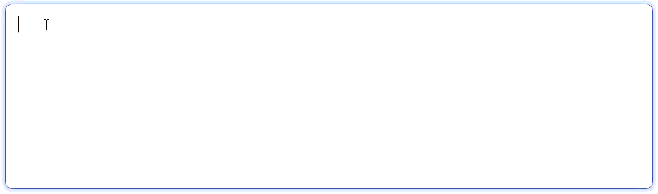
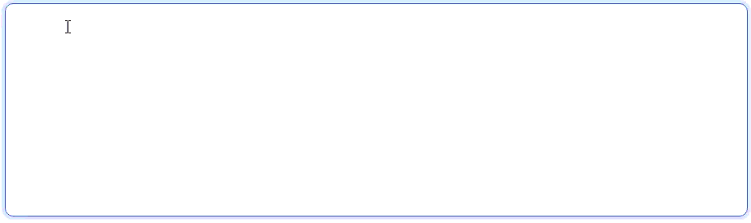

# Hide Mouse Cursor While Typing on Windows

Authors: [Ashish Kumar](mailto:ashishkum@microsoft.com)

## Participate

- Chromium feature request: [Hide mouse cursor while typing](https://issues.chromium.org/issues/516096689)

## Table of Contents

<!-- START doctoc generated TOC please keep comment here to allow auto update -->
<!-- DON'T EDIT THIS SECTION, INSTEAD RE-RUN doctoc TO UPDATE -->

- [Introduction](#introduction)
- [User Problem](#user-problem)
- [Goals](#goals)
- [Non-Goals](#non-goals)
- [Proposal](#proposal)
  - [Behavior summary](#behavior-summary)
- [Accessibility, Privacy, and Security Considerations](#accessibility-privacy-and-security-considerations)
- [Potential Opposition & Mitigations](#potential-opposition--mitigations)
- [References & Acknowledgements](#references--acknowledgements)

<!-- END doctoc generated TOC please keep comment here to allow auto update -->

## Introduction

On Windows, every native application (Notepad, Windows Terminal etc.) automatically hides the mouse pointer while the user types into an editable field, honoring the OS-level *Hide pointer while typing* setting (`SPI_GETMOUSEVANISH`). Chromium does not. This leaves Chromium-based browsers as the only major software on Windows where the pointer remains visible and obstructive during typing. This is a [long-standing request](https://issues.chromium.org/issues/41021563) that affects every Chromium embedder.

This proposal adds the same behavior to Chromium on Windows: **on Windows, automatically hide the mouse pointer while the user is typing into an editable region, and instantly restore it on the next mouse move or click**.

**Note:** On macOS, Chromium already hides the cursor for all apps during typing via the system-level `[NSCursor setHiddenUntilMouseMoves:]` primitive. macOS is therefore **out of scope** for this proposal.

## User Problem

When a user is typing into a text input on a Chromium-based browser or app, the **mouse pointer stays parked at its last position on screen**. Because users almost always click into a field before typing, that "last position" is typically right next to, and frequently directly on top of, the text caret. The result is a pointer that visually **obscures the very characters the user is typing**, forcing the user to physically nudge the mouse aside to read what they just typed. For anyone who works in text-heavy environments (developers, writers etc.), this means **moving the mouse out of the way potentially hundreds of times a day**, a persistent friction that accumulates into productivity loss and frustration.

*Current Behavior*

*Expected behavior*

## Goals

- Hide the mouse pointer while the user is typing in an editable region on Windows, reducing visual obstruction over the text being typed.
- Honor the Windows *Hide pointer while typing* OS setting (`SPI_GETMOUSEVANISH`), which is on by default on Windows 10/11.
- Restore the pointer instantly on the next mouse move or click so users never feel "stuck" with a hidden cursor.
- Remain invisible to web content: no new APIs, no observable behavior change for pages or scripts.

## Non-Goals

- **Non-Windows platforms.** This proposal targets Chromium on Windows only. macOS already provides this behavior. Linux/ChromeOS behavior is unchanged by this proposal and can be picked up in a later phase.
- **Browser views.** Pointer hiding in browser-owned UI (omnibox, search bars, settings) is out of scope; this covers DOM-level editable regions only. Extending to browser views can be picked up in a later phase.
- **New web-platform APIs.** This is a UI behavior gap, not a standards issue.

## Proposal

When all of the following are true on Windows, the OS mouse pointer is **hidden**:

- The Windows OS-level *Hide pointer while typing* preference (`SPI_GETMOUSEVANISH`) is enabled.
- The focused element is editable (e.g. `<input>`, `<textarea>`, or a `contenteditable` region).
- The user presses a key that produces a character or modifies editable content. This includes character keys, `Backspace`, `Delete`, and `Enter`. Navigation keys also trigger hiding because they reposition the caret within the editable region. Bare modifiers, function keys, media/launcher keys, and keyboard shortcuts (e.g. `Ctrl+A`) do **not** trigger hiding.
- No IME composition is currently active. Once composition commits, subsequent keystrokes resume normal hiding behavior.

The pointer is **restored** on the **next mouse move or click**. Recovery is immediate; a single mouse nudge is enough.

### Behavior summary

| Scenario | Current behavior | With this proposal |
|----------|------------------|--------------------|
| Type in an editable region | Pointer parked over text | Pointer hides on first keystroke; reappears on next mouse move or click |
| Press a function key or keyboard shortcut (e.g. `F5`, `Ctrl+A`) | Pointer visible | Pointer visible (unchanged) |
| Type while IME composition is active | Pointer visible | Pointer visible during composition (unchanged); after composition commits, next keystroke hides pointer normally |
| Press keys while focus is not in an editable element | Pointer visible | Pointer visible (unchanged) |
| Windows user has turned off *Hide pointer while typing* | Pointer visible | Pointer visible (OS preference honored) |

## Accessibility, Privacy, and Security Considerations

- **Accessibility:** Users who prefer the pointer always visible (e.g. some screen-magnifier and low-vision workflows) can disable the OS-level "hide pointer while typing" setting in the OS Mouse settings. Recovery is instantaneous on the next mouse move or click. For users with cognitive or attention-related needs, removing the stationary pointer over freshly typed characters can reduce visual noise.
- **Privacy:** No data is collected, persisted, or sent to a server. Pointer visibility is a local UI presentation state.
- **Security:** No new attack surface is introduced. The browser already controls cursor visibility internally; this proposal only constrains *when* it hides the pointer. Pages cannot trigger or observe the behavior.

## Potential Opposition & Mitigations

Some users may prefer a permanently visible pointer. However, this behavior is already established in Chromium on macOS.
Mitigations include:

1. **OS preference gating**: The behavior is only active when the Windows *Hide pointer while typing* setting (`SPI_GETMOUSEVANISH`) is enabled. Users can disable it in OS Mouse settings.
2. **Progressive rollout**: The feature ships behind a flag, allowing controlled rollout and the ability to disable it quickly if issues arise.
3. **Instant recovery**: A single mouse move or click immediately restores the pointer, so users are never stuck with a hidden cursor.

## References & Acknowledgements

- **Chromium feature request**: [*Hide mouse cursor while typing*](https://issues.chromium.org/issues/516096689)
- **Chromium past issue**: [*Mouse pointer doesn't disappear when typing*](https://issues.chromium.org/issues/41021563)
- **Firefox bug**: [*Support Windows "Hide pointer while typing" system setting to hide the mouse pointer*](https://bugzilla.mozilla.org/show_bug.cgi?id=1757463)
- **Vscode issue**: [*Mouse cursor doesn't disappear when typing*](https://github.com/microsoft/vscode/issues/79915)
- **Windows Mouse Vanish setting**: [*SPI_GETMOUSEVANISH* (About Mouse Input)](https://learn.microsoft.com/en-us/windows/win32/inputdev/about-mouse-input#mouse-vanish), [*SystemParametersInfoW*](https://learn.microsoft.com/en-us/windows/win32/api/winuser/nf-winuser-systemparametersinfow)
