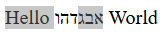
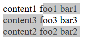
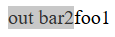

# Multi-Range Selection

This document proposes updating the W3C Selection API specification to support multiple selection ranges, enabling discontinuous text selection across the web platform. Firefox already supports multi-range selection; this proposal seeks to align the spec and other browser engines with that behavior.

## Authors

- Samba Murthy Bandaru (sambamurthy.bandaru@microsoft.com)

## Participate

- Spec: [W3C Selection API](https://w3c.github.io/selection-api/)
- Canonical spec issue: [w3c/selection-api#41 - Support multi range selection](https://github.com/w3c/selection-api/issues/41)
- Spec issue tracker: [w3c/selection-api](https://github.com/w3c/selection-api/issues)
- [W3C Web Editing Working Group](https://www.w3.org/groups/wg/webediting/)
- Chromium feature request: [issues.chromium.org/504686717](https://issues.chromium.org/issues/504686717)

<!-- START doctoc generated TOC please keep comment here to allow auto update -->
<!-- DON'T EDIT THIS SECTION, INSTEAD RE-RUN doctoc TO UPDATE -->
**Table of Contents** 

- [Introduction](#introduction)
- [Problem Statement](#problem-statement)
- [Goals and Non-Goals](#goals-and-non-goals)
- [Current State of the Platform](#current-state-of-the-platform)
- [Key Use Cases](#key-use-cases)
  - [1. Ctrl+Click Discontinuous Word Selection](#1-ctrlclick-discontinuous-word-selection)
  - [2. Table Column Selection](#2-table-column-selection)
  - [3. Bidirectional Text Selection](#3-bidirectional-text-selection)
  - [4. CSS Grid Layout Reordering](#4-css-grid-layout-reordering)
  - [5. Shadow DOM Slot Reordering](#5-shadow-dom-slot-reordering)
  - [6. Multi-Cursor Code Editors](#6-multi-cursor-code-editors)
- [Proposed API Design](#proposed-api-design)
- [Compatibility Risk and Mitigation](#compatibility-risk-and-mitigation)
- [Privacy and Security Considerations](#privacy-and-security-considerations)
- [Interoperability and Spec Alignment](#interoperability-and-spec-alignment)
- [Open Questions](#open-questions)

<!-- END doctoc generated TOC please keep comment here to allow auto update -->


## Introduction

The [Selection interface](https://w3c.github.io/selection-api/#selection-interface) exposes  methods like `addRange()`, `removeRange()`, `getRangeAt(index)`, and the `rangeCount` attribute — all originally designed for a collection of disjoint `Range` objects. In 2011, the spec was narrowed to mandate single-range semantics: `addRange()` must be ignored when a range already exists, and `rangeCount` must be `0` or `1`. Chrome and Safari follow this restriction; Firefox never adopted it and continues to support multiple ranges.

This explainer proposes removing that restriction, restoring the multi-range semantics the API was designed for. Chromium is actively pursuing implementation ([feature request](https://issues.chromium.org/issues/504686717)).

## Problem Statement

**The User-Visible Problem**

Desktop applications like Microsoft Word and LibreOffice Writer support Ctrl+Click (Cmd+Click on macOS) to build non-contiguous selections. On the web, this interaction is blocked by the spec's single-range restriction; Ctrl+Click in Chromium and Safari simply replaces the existing selection.

Code editors like VS Code and JetBrains IDEs work around this by implementing multi-cursor entirely via custom overlays, bypassing the native Selection API.

**Developer Workarounds**

Because the platform does not support multi-range selection, developers are forced into complex workarounds:

- Web-based spreadsheets (Google Sheets, Notion, Airtable) maintain custom canvas/overlay highlight layers to simulate column selection
- Browser-based code editors (vscode.dev, CodeMirror) implement multi-cursor entirely outside the native `Selection`, losing native clipboard, copy, and accessibility integration

**The API Gap**

```javascript
const sel = window.getSelection();
sel.removeAllRanges();

const r1 = document.createRange();
r1.setStart(node, 0); r1.setEnd(node, 5);
sel.addRange(r1);
console.log(sel.rangeCount); // 1

const r2 = document.createRange();
r2.setStart(node, 10); r2.setEnd(node, 15);
sel.addRange(r2);           // silently ignored
console.log(sel.rangeCount); // still 1
```

The W3C Selection API spec (Step 2 of `addRange()`) mandates: "If `rangeCount` is not `0`, abort these steps." This leaves developers without a standards-based way to express discontinuous selection.

## Goals and Non-Goals

**Goals**

1. Update the W3C Selection API spec to permit multiple ranges per selection, restoring the API's original multi-range design
2. `addRange()` accumulates ranges rather than silently discarding subsequent calls
3. `rangeCount`, `getRangeAt(i)`, `removeRange()` work correctly for N ranges
4. Enable discontinuous text selection via Ctrl+Click/Drag across all implementing browsers
5. Native clipboard integration: Ctrl+C copies the concatenated text of all ranges
6. All selected ranges are visually highlighted
7. Backward compatibility: existing code using `getRangeAt(0)` or checking `rangeCount` must continue to work without modification

**Non-Goals**

1. Cross-origin or cross-frame multi-range selection
2. Multi-range inside `<input>` / `<textarea>` text controls (these use a separate selection model with tighter OS input API constraints)
3. Changing Shift+Arrow selection extension behavior (Shift+Arrow operates on a single logical selection; multi-range selection extension is a separate future concern)

## Current State of the Platform

**Browser Landscape**

| Browser | Multi-range support | Notes |
|---------|-------------------|-------|
| **Firefox (Gecko)** | Yes | Shipped since early Gecko. [MDN reference](https://developer.mozilla.org/en-US/docs/Web/API/Selection/addRange) |
| **Chromium (Blink)** | No | `addRange()` no-op when non-empty (follows spec Step 2). [Feature request](https://issues.chromium.org/issues/504686717) |
| **Safari (WebKit)** | No | Same as Chrome; no public signal |

**The W3C Selection API Spec (Current State)**

The [W3C Selection API](https://w3c.github.io/selection-api/) (Editor's Draft, January 2025, edited by Ryosuke Niwa of Apple) currently mandates single-range behavior:

**Definition (Section 2):** "Each selection can be associated with a single range."

**`addRange()` (Section 3):** Step 2 says "If `rangeCount` is not `0`, abort these steps."

**`rangeCount` (Section 3):** "must return `0` if this is empty... and must return `1` otherwise."

**Spec NOTE explaining the single-range restriction:**
> "Originally, the Selection interface was a Netscape feature. The Netscape implementation always allowed multiple ranges in a single selection, for instance so the user could select a column of a table. However, multi-range selections proved to be an unpleasant corner case that web developers didn't know about and even Gecko developers rarely handled correctly. Other browser engines never implemented the feature, and clamped selections to a single range in various incompatible fashions."
>
> "This specification follows non-Gecko engines in restricting selections to at most one range, but the API was still originally designed for selections with arbitrary numbers of ranges."

**Spec NOTE on `addRange()`:** "At Step 2, Chrome 58 and Edge 25 do nothing. Firefox 51 gives you a multi-range selection."

**WPT Test Coverage**

The WPT suite (`selection/addRange-*.html` tests) explicitly asserts that the second `addRange()` call does nothing:

```javascript
// addRange.js:
testAddRangeDoesNothing(exception, range2, endpoints2, "second", testName);
```

These tests reflect the current spec and would need to be updated alongside the spec change.

## Key Use Cases

### 1. Ctrl+Click Discontinuous Word Selection

Desktop text editors universally support Ctrl+Click to select non-contiguous words.

```
"The [quick] brown [fox] jumps over the [lazy] dog"
```

User selects "quick", Ctrl+clicks "fox", Ctrl+clicks "lazy". Result: three disjoint ranges.

**Real-world need:** Microsoft Word and LibreOffice Writer support this interaction natively. Users expect the same behavior in the browser.

### 2. Table Column Selection

Selecting a table column means selecting cells from many rows while excluding other columns. This is inherently non-contiguous in DOM order.

<table>
  <tr>
    <th></th><th>Col 1</th><th>Col 2</th><th>Col 3</th>
  </tr>
  <tr>
    <td>Row 1</td><td>A</td><td><b>B</b></td><td>C</td>
  </tr>
  <tr>
    <td>Row 2</td><td>D</td><td><b>E</b></td><td>F</td>
  </tr>
  <tr>
    <td>Row 3</td><td>G</td><td><b>H</b></td><td>I</td>
  </tr>
</table>

Selecting column 2 requires three ranges: one for "B", one for "E", one for "H". A single DOM Range from "B" to "H" would incorrectly include cells A, C, D, F, G (the entire table).

### 3. Bidirectional Text Selection

In bidirectional (bidi) text, a visually contiguous selection can be non-contiguous in logical (DOM) order. Consider:

```html
<div>Hello &#x05D0;&#x05D1;&#x05D2;&#x05D3;&#x05D4;&#x05D5; World</div>
```

**Visual rendering** (due to the [Unicode Bidi Algorithm](https://unicode.org/reports/tr9/)):



The Hebrew characters render right-to-left within the LTR paragraph. If the user drags from after "Hello" rightward through half the Hebrew, a true visual selection maps to two non-contiguous DOM ranges:
- Position 0 up to position 6 (the space after "Hello")
- Positions 9 to 12

Positions 6-9 would be skipped because they are visually to the *right* of what the user selected.

A single DOM Range is not sufficient to represent this visual selection and would show a disjoint selection as in the above image, which is not what the user expects.

*Reference: [Ben Peters (Microsoft), public-webapps mailing list, Jan 2015](https://lists.w3.org/Archives/Public/public-webapps/2015JanMar/0098.html): "Depending on who you talk to, BIDI should support selection in document order or layout order. Layout order is not possible without multi-selection."*

### 4. CSS Grid Layout Reordering

CSS Grid can visually reorder elements independent of DOM order. When the user drags to select visually contiguous content, the resulting single DOM Range includes content from visually non-adjacent grid items.

```html
<style>
  .grid { display: grid; }
</style>
<div class="grid">
  <div style="grid-row: 1">content1 foo1 bar1</div>
  <div style="grid-row: 3">content2 foo2 bar2</div>
  <div style="grid-row: 2">content3 foo3 bar3</div>
</div>
```
**Visual rendering**



If the user drags from "foo1" (row 1) to "foo3" (visually row 2), they expect to select `"oo1 bar1"` + `"content3 f"`. But a single Range in DOM order includes the intervening `"content2 foo2 bar2"` (row 3, visually below), which is not part of the visual selection.

With multi-range, the browser can represent exactly what's visually selected: two ranges that skip the DOM-interleaved content.

*Source: [yoichio's TPAC 2017 multi-range proposal](https://github.com/yoichio/public-documents/blob/master/multiranges.md)*

### 5. Shadow DOM Slot Reordering

Shadow DOM slots can display slotted content in a different order than the light DOM. This creates the same visual-vs-DOM mismatch as CSS Grid.

```html
out
<span id="host">
  <span slot="s1">foo1</span>
  <span slot="s2">bar2</span>
</span>
<script>
  host.attachShadow({ mode: "open" }).innerHTML =
    '<slot name="s2"></slot><slot name="s1"></slot>';
</script>
```

**Visual rendering** 

 

If the user selects from "out" to "bar2" (visually adjacent), `getRangeAt(0)` returns a Range `{out, 1, bar2, 2}` that includes "foo1", content that is **not visually between** the start and end of the selection.

With multi-range, the selection can be represented as two ranges: `{out, 1, out, 3}` and `{bar2, 0, bar2, 2}`, matching what the user sees.

*Source: [yoichio's TPAC 2017 multi-range proposal](https://github.com/yoichio/public-documents/blob/master/multiranges.md); see also [w3c/selection-api#336](https://github.com/w3c/selection-api/issues/336)*

### 6. Multi-Cursor Code Editors

VS Code's web version (vscode.dev), CodeMirror, and other browser-based IDEs simulate multi-cursor via canvas or custom overlay elements. With native multi-range selection:
- Each cursor/selection would be a native `Range`
- Clipboard operations would automatically aggregate all ranges
- Screen readers would receive native selection-changed events
- IME composition panels would position correctly at the focused range

These editors currently reimplement selection entirely outside the platform, losing native clipboard, accessibility, and input method integration.

**Note on visual-vs-DOM mismatch cases (bidi, Grid, Shadow DOM)**

Use cases 3-5 above (bidi text, CSS Grid reordering, Shadow DOM slot reordering) describe scenarios where a single visual selection maps to non-contiguous DOM positions. This proposal enables user agents to represent such selections as multiple ranges, but does **not** mandate that they do so. Whether a browser creates multi-range selections during drag/click in these scenarios is a user agent decision; the spec change removes the API restriction that currently makes it impossible.

## Proposed API Design

**Behavior Changes**

**`addRange(range)` accumulates ranges**

When a selection already exists:
- **Current (spec-mandated):** silently ignore the call.
- **Proposed:** add `range` as an additional disjoint range.
  - If `range` overlaps or is adjacent to an existing range, merge them into a union range.
  - Ranges are stored sorted by document-order start position.

```javascript
sel.removeAllRanges();
sel.addRange(r1);  // [r1]
sel.addRange(r2);  // [r1, r2] or merged if overlapping
console.log(sel.rangeCount);  // 2
```

**`rangeCount` reflects true count**

Returns the actual number of ranges: 0, 1, or N.

**`getRangeAt(index)` works for all valid indices**

Valid for `0 <= index < rangeCount`. Ranges ordered by document position.

**`toString()` concatenates all ranges**

Returns text of all ranges in document order with no separator.

**Clipboard copy (Ctrl+C)**

Copies text of all ranges separated by newlines. This matches the behavior of word processors (Microsoft Word, LibreOffice) when copying discontinuous selections and provides better usability than no separator.

**User gesture: Ctrl+Click / Ctrl+Drag**

Browsers should handle Ctrl+Click/Drag (Cmd+Click/Drag on macOS) as "add to selection":
- Ctrl+Click: add a caret or word selection at the click position
- Ctrl+Drag: add a range for the drag. Merge if overlapping.

**Unchanged APIs**

- `collapse()`, `collapseToStart()`, `collapseToEnd()`: collapse to single caret, removing all other ranges
- `extend()`: extends the focused (most recently added) range only. If the extended range overlaps another range, the other range is truncated (the focused range takes priority).
- `setBaseAndExtent()`: replaces all ranges with a single new range
- `selectAllChildren()`: replaces all ranges with a single range
- `deleteFromDocument()`: deletes content of all ranges

**`getComposedRanges()` Extension**

Currently returns at most one `StaticRange`. Under multi-range, returns a `StaticRange[]` for each range, each rescoped to the provided shadow roots.

> **Note:** The behaviors described in this section (merge semantics, range sorting, `toString()` concatenation, `deleteFromDocument()` on all ranges) are consistent with Gecko's existing multi-range implementation, which serves as the primary interop reference.

## Compatibility Risk and Mitigation

| Risk | Severity | Mitigation |
|------|----------|------------|
| Sites checking `rangeCount === 1` as a guard | Medium | Incremental rollout behind feature flags; telemetry to assess frequency |
| Polyfills calling `addRange()` expecting no-op | Low | Monitor calls with existing non-empty selection via telemetry |
| WPT tests assert `addRange` does nothing | Low | Update WPT expectations alongside spec change |
| IME composition with multi-range active | Medium | Collapse to focused range on IME start (matching multi-cursor editor convention) |

## Privacy and Security Considerations

This feature introduces no new privacy or security concerns. The `Selection` and `Range` APIs already exist; this proposal changes the behavior of existing methods, not the API surface. No new user information is exposed.

## Interoperability and Spec Alignment

**Required Spec Changes**

This proposal requires updating the W3C Selection API spec to remove the single-range restriction. The specific text to change:

**Section 2 (Definition):** Change "Each selection can be associated with a single range" to allow a collection of ranges.

**Section 3 (`addRange()`):** Remove Step 2 ("If `rangeCount` is not `0`, abort these steps") and define accumulation/merge semantics.

**Section 3 (`rangeCount`):** Allow values greater than 1.

**Section 3 (`getRangeAt()`):** Allow index values > 0.

The spec NOTE about the single-range restriction would be updated to reflect the new multi-range consensus.

**Spec Change Strategy**

1. File an issue on [w3c/selection-api](https://github.com/w3c/selection-api/issues) proposing multi-range support
2. Engage with the spec editor (Ryosuke Niwa, Apple) and Web Editing Working Group
3. Define merge semantics for overlapping ranges (see [Firefox Reference Behavior](#firefox-reference-behavior) below)
4. Clarify `anchor`/`focus` semantics when N ranges exist
5. Land spec PR alongside browser implementations

**Firefox Reference Behavior**

Gecko is the only engine that currently implements multi-range selection. Key behaviors that serve as the interop reference:
- `addRange()` merges overlapping ranges; ranges sorted by document-order start position
- `anchorNode`/`anchorOffset` = first range's start; `focusNode`/`focusOffset` = last range's end
- `toString()` concatenates text with no separator; `deleteFromDocument()` deletes all ranges

Early engagement with the spec editor (Ryosuke Niwa, Apple) and the Web Editing Working Group is needed to build consensus. The API surface (`addRange()`, `rangeCount`, `getRangeAt(index)`) retains its original multi-range design, so the change is a restriction removal rather than a new API.

## Open Questions

1. **Merge or error on overlap?**
   Should overlapping ranges be merged into a union range, or should the call throw? **Recommendation:** merge (consistent with Gecko).

2. **What is `anchorNode`/`focusNode` when `rangeCount > 1`?**
   One approach: `anchor` = first range's start, `focus` = last range's end (since ranges are sorted by start position). **Recommendation:** adopt this convention for interop.

3. **IME composition with multi-range?**
   **Recommendation:** use the focused range, collapse all others on IME start (matching multi-cursor editor convention).

4. **Clipboard copy separator?**
   `toString()` uses no separator between ranges. However, clipboard copy (Ctrl+C) of discontinuous selections in word processors uses newline separators. **Recommendation:** `toString()` with no separator for API compat; clipboard copy with newline separators for user-facing consistency with desktop apps.
