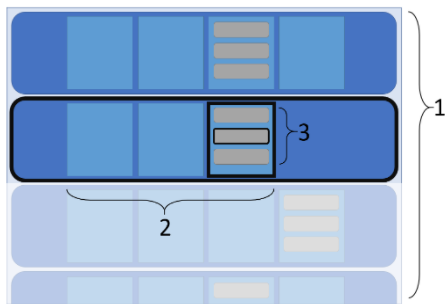

# focusgroup for HTML and CSS
> Now with 100% more Style[sheet support]!

Authors: [Travis Leithead](https://github.com/travisleithead),
         [David Zearing](https://github.com/dzearing),
         [Chris Holt](https://github.com/chrisdholt/)

## Status of this Document
This document is a starting point for engaging the community and standards bodies in
developing collaborative solutions fit for standardization. As the solutions to problems
described in this document progress along the standards-track, we will retain this 
document as an archive and use this section to keep the community up-to-date with the 
most current standards venue and content location of future work and discussions.
* This document status: **Active**
* Expected venue: [WHATWG HTML Workstream](https://whatwg.org/workstreams#:~:text=html)
* **Current version: this document**

## 1. Introduction

When writing custom controls, authors need to implement the semantics of various known
controls (see [ARIA authoring guide](https://www.w3.org/TR/wai-aria-practices-1.1/)) to
enable proper (and expected) keyboard support. Control examples include tabs and tabsets,
combo boxes, accordion panels, carousels, focusable grid tables, etc. Many of these 
patterns expect arrow-key navigation, as well as support for page down/up, home/end, even
"type ahead" behavior. 

The native web platform supports *some* of these linear navigation behaviors in native
controls like radio button groups (wrap-around arrow key movement that changes both focus
and linked selection), &lt;select&gt; element popups (up/down movement among options), and 
date-time controls (arrow key movement among the components of the date), but **does not 
expose a primitive** that can be used independently to get this behavior. 

We propose exposing a new web platform primitive—'focusgroup'—to facilitate focus navigation (not selection)
using arrow keys among a set of focusable elements. This feature can then be used 
(**without any JavaScript**) to easily supply platform-provided focus group navigation into
custom-authored controls in a standardized and predictable way for users.

Customers like Microsoft's Fluent UI team are excited to leverage this built-in capacity
for its keyboard consistency, default accessibility (provides a signal to ATs for alternate 
keyboard navigation), and promised interoperability
over existing solutions.

While this document emphasizes the usage of the keyboard arrow keys for accessibility
navigation, we acknowledge that there are other input modalities that work (or can be adapted 
to work) equally well for focusgroup navigation behavior (e.g., game controllers, gesture 
recognizers, touch-based ATs, etc.)

## 2. Goal

The goal of this feature is to "pave the cow path" of an existing authoring practice 
(and [accessibility best-practice](https://www.w3.org/TR/wai-aria-practices-1.1/)) 
implemented in nearly every Web UI library: the "roving tabindex". Here's a few sources 
that explain roving tabindex in more detail as well as a selection of common libraries 
implementing the pattern:

* [What's 'roving tabindex'?](https://www.stefanjudis.com/today-i-learned/roving-tabindex/)
* [Rob Dodson explains roving tabindex (YouTube)](https://www.youtube.com/watch?v=uCIC2LNt0bk)
* [roving tabindex in React](https://js.coach/package/react-roving-tabindex)
* [Angular's ListKeyManager in the Component Dev Kit](https://material.angular.io/cdk/a11y/overview#listkeymanager)
* [FocusZone in Fluent UI](https://developer.microsoft.com/en-us/fluentui#/controls/web/focuszone)
* [Elix component library's KeyboardDirectionMixin](https://component.kitchen/elix/KeyboardDirectionMixin)

To achieve this goal, we believe that the solution must be done with declarative markup or CSS.
If JavaScript is required, then there seems little advantage to using a built-in feature over
what can be implemented completely in author code. Furthermore, a declarative solution provides
the key signal that allows the platform's accessibility infrastructure to make the group 
accessible by default:

* Signaling to the AT that arrow-key navigation can be used on the focused element.
* Understanding the bounds/extent of the group, providing list context like "X in Y items" 
   (posinset/setsize)
* Providing a consistent and reliable navigation usage pattern for users with no extra author code
   required.

## 3. Non-Goals

In most roving tabindex implementations, the notion of moving *focus* is 
tightly coupled with the notion of *selection*. In some cases, it makes sense to have selection follow
the focus, but in other scenarios these need to be decoupled. For this proposed standard, we decouple 
selection from focus and only focus (cough) on the focus aspect: moving focus using the
keyboard among eligible focus targets. Adding selection state, e.g., tracking the currently selected 
option in a list, will be a separate feature. To handle selection-based scenarios, we defer to the 
CSS proposal [**Toggles**](https://tabatkins.github.io/css-toggle/) which can work nicely with focusgroups.

No additional UI (e.g., a "focus ring") is associated with focusgroups. A focusgroup
is wholly intended as a logical (transparent) grouping mechanism for a set of already focusable child elements,
providing arrow key navigation among them. All the pre-existing styling/ native UI affordances for
focus tracking are unchanged with this proposal.

## 4. Principles

1. Intuitive use in declarative scenarios. Focusgroups
    * are easy to reason about (self-documenting) in the source markup or CSS.
    * provide an intuitive interaction between focusgroups.
    * integrate well with other related platform semantics.
2. Focusgroups are easy to maintain and configure.
    * Configuration is managed in one place.
    * Provide easy to understand usage into HTML and CSS patterns.
    * Avoid "spidery connections" e.g., using IDRefs or custom names that are hard to maintain.
3. Complimentary declarative representations in HTML and CSS
    * HTML attributes offers focusgroup usage directly with impacted content and provide for
       the most straightforward scenarios.
    * CSS properties allow for responsive design patterns to conditionally apply focusgroup 
       behavior under changing layouts. Enables some advanced use cases where selector-based
       matching is advantageous.
     
## 5. Use Cases

1. (Child opt-in) Group a set of focusable child elements under a single focusgroup.
2. (Descendent opt-in) Focusable elements deeply nested can participate in a single focusgroup.
3. (Wrap) Focusgroup can be configured to have wrap-around focus semantics.
4. (Horizontal/vertical) A focusgroup can be configured to respond to either horizontal navigation
    keys or vertical keys or both (to trivially reserve one axis of arrow key behavior for 
    supplementary actions, such as opening nodes in a tree view control).
5. (Extend same direction) Focusgroups can be nested to provide arrow navigation into multiple 
    composed widgets (such as lists within lists).
6. (Extend opposite direction) Focusgroups can be nested to provide arrow navigation into composed
    widgets with orthogonal navigation semanantics (such as horizontal-inside-vertical menus).
7. (Multiple focusgroups) Multiple focusgroups can be established on a single element (advanced CSS 
    scenario).
8. (Opt-out) Individual elements can opt-out of focusgroup participation (advanced CSS scenario)
9. (Grid) Focusgroups can be used for grid-type navigation (structured content grids like &lt;table&gt;,
    not "presentation" grids).

## 6. Focusgroup Concepts

A focusgroup is a group of elements that are related by arrow-key navigation and for which the 
platform provides the arrow key navigation behavior by default (no JavaScript event handlers needed)!
Navigation is provided according to order or structure of the DOM (not how the content is presented 
in a user interface).

This document describes two kinds of focusgroups: **linear focusgroups** and **grid focusgroups**.
Linear focusgroups provide arrow key navigation among a *list* of elements. Grid focusgroups provide 
arrow key navigation behavior for tabular (or 2-dimensional) data structures.

Multiple linear focusgroups can be combined together into one logical focusgroup, but linear focusgroups
cannot be combined with grid focusgroups and vice-versa.

Focusgroups consist of a **focusgroup definition** that establish **focusgroup candidates** and
**focusgroup items**. Focusgroup definitions manage the desired behavior for the associated focusgroup 
items. Focusgroup items are the elements that actually participate in the focusgroup (among the possible
focusgroup candidates).

When a focusgroup definition is associated with an element, all of that element's direct children
become focusgroup candidates. Focusgroup candidates become focusgroup items if they are focusable, e.g.,
implicitly focusable elements like `<button>`, or explicitly made focusable via `tabindex` or some
other mechanism (e.g., `contenteditable`).

In HTML, *one* **focusgroup definition** can be added to an element using the `focusgroup` attribute:

Example 1:
```html
<p id=parent focusgroup>
   Some text
   <a id=one href="…">a link</a>.
   Some more text.
   <span id=two tabindex=-1> focusable span</span>.
   <a id=three href="…">another link</a>
</p>
```

Using CSS, a focusgroup definition can be applied with selectors, and must include a name. `auto` is 
a reserved name that corresponds to the same focusgroup implied by the HTML `focusgroup` attribute.
(Several additional reserved names are defined for grid focusgroups; any other name is considered a custom
linear focusgroup.)

```css
#parent { 
   focus-group: auto;
}
```

For the `parent` element which includes the focusgroup definition, the elements `one`, `two`, and `three`
(and any other children of `parent` that may be added or removed) are focusgroup candidates and because
each are focusable, they also become focusgroup items. When one of the focusgroup items is focused, then
the user can move focus sequentially according to DOM order among all the focusgroup items using the arrow
keys (up/right moves focus forward, down/left moves focus backwards). Note that only elements `one` and
`three` can be focused using the Tab key (because element `two` has `tabindex=-1` set, which takes it out
of the tabindex sequential navigation ordering).

Focusgroup definitions may include the following (in addition to a name):

* extend -- a mechanism to join this focus group to an ancestor focusgroup. Note: linear focusgroups cannot
   be joined to grid focusgroups and vice versa.
* direction -- applies to linear focusgroups only: constrains the keys used for arrow key navigation to 
   horizontal, vertical, or both (the default).
* wrap -- what to do when the attempting to move past the end of a focusgroup. The default/initial value is 
   nowrap which means that focus is not moved past the end of a focus group with the arrow keys.

In HTML these focusgroup definitions are applied as space-separated token values to the `focusgroup` 
attribute. In CSS, these definitions are specified as properties (including a `focus-group` shorthand
property for convenience).

Example 1b:

```html
<div focusgroup="wrap horizontal">
```

Example 1c:
```css
div { 
   focus-group-name: auto;
   focus-group-wrap: wrap;
   focus-group-direction: horizontal;
}
```

In the case that HTML attribute values conflict with CSS properties, the CSS values override the 
HTML-defined values. For example:

Example 1d:
```html
<div focusgroup="wrap horizontal" style="focus-group-name: auto; focus-group-wrap: nowrap; focus-group-direction: both">
```

The CSS-specified value of 'nowrap' would override the HTML attribute value's "wrap" directive; 
similarly for 'both' overriding "horizontal".

There is no change to the way Tab navigation works with `tabindex` nor the Tab ordering behavior. To 
use a focusgroup, focus must enter that element's focusable children somehow: for accessibility
and keyboard-only scenarios, the Tab key is typically used--programmatic calls to `element.focus()` 
or user clicks with a pointing device are alternatives.

The focusgroup can be used to reduce the number of tab stops (`tabindex=0`) necessary in a document
by converting those into `tabindex=-1` and adding a focusgroup to manage them. The 'roving tabindex'
scenario is accomplished by picking an entry point to the focusgroup (a child with `tabindex=0`), and 
setting the rest of the focusable elements to `tabindex=-1`. This is the same pattern needed to setup
the roving tabindex, but by adding `focusgroup`, no JavaScript is necessary to manage it afterward:

Example 2:
```html
<my-list focusgroup>
  <my-listitem tabindex="0">...</mylistitem>
  <my-listitem tabindex="-1">...</mylistitem>
  <my-listitem tabindex="-1">...</mylistitem>
  <my-listitem tabindex="-1">...</mylistitem>
  <my-listitem tabindex="-1">...</mylistitem>
</my-list>
```

From outside of the above markup, assume a Tab key press lands focus on the first `<my-listitem>`. From
this point, the user can use the arrow keys to move from the beginning of the list to the end, or press
Tab again to move outside of this group. Alternatively, maybe you want to support both Tab *and* Arrow
key navigation in your scenario. No problem, just change the setup so that all the list items participate
in the tab order:

Example 3:
```html
<my-list focusgroup>
  <my-listitem tabindex="0">...</mylistitem>
  <my-listitem tabindex="0">...</mylistitem>
  <my-listitem tabindex="0">...</mylistitem>
  <my-listitem tabindex="0">...</mylistitem>
  <my-listitem tabindex="0">...</mylistitem>
</my-list>
```

The focusgroup doesn't "remember" the last element that was focused when focus leaves the group 
and returns later. Instead, the "leaving" and "returning" logic (for keyboard scenarios) depends on the
preexisting *tabindex sequential focus navigation* only. In other words, because Tab is often used to enter,
optionally move through, and leave a focusgroup, the enter-and-exit points depend on which elements
participate in the tab order (those with `tabindex=0` for example). The [CSS Toggles](https://tabatkins.github.io/css-toggle/) 
proposal could be used in this same scenario to track the "toggle state" among this group of toggle-able
elements, allowing focus changes to be decoupled from "selection/toggle" state.

### 6.1. Key conflicts

The focusgroup handles keystrokes (keydown) with a default behavior to move the focus within 
focusgroup items. This default keyboard handling could interfere with other actions the application would like
to take. Therefore, authors may cancel the focusgroup's default behavior by canceling 
(`preventDefault()`) on the keydown event. These events will be dispatched by the focused element, and 
bubble through the focusgroup parent element, which is a convenient place to handle the event.

### 6.2. Key traps

Some built-in controls like `<input type=text>` "trap" nearly all keys that would be handled by the
focusgroup. This proposal does not provide a way to prevent this from happening (Tab should continue
to be used to "exit" these trapping elements).

### 6.3. Enabling wrapping behaviors

By default, focusgroup traversal with arrow keys ends at boundaries of the focus group (the start and
end of a linear focusgroup, and the start and end of both rows and columns in a grid focusgroup). The 
following focusgroup definition values can configure this:

| HTML attribute value | CSS property & value | Explanation |
|----------------------|----------------------|-------------|
| focusgroup="wrap" | focus&#8209;group&#8209;wrap:&nbsp;wrap | **linear focusgroup**: causes movement beyond the ends of the focusgroup to wrap around to the other side; **grid focusgroup**: causes focus movement at the ends of the rows/columns to wrap around to the opposite side of the same rows/columns |
| focusgroup="" (unspecified) | focus&#8209;group&#8209;wrap:&nbsp;nowrap | Disables any kind of wrapping (the initial/default value) |

The following are only applicable to grid focusgroups:

| HTML attribute value | CSS property & value | Explanation |
|----------------------|----------------------|-------------|
| focusgroup="row&#8209;wrap" | focus&#8209;group&#8209;wrap:&nbsp;row&#8209;wrap | Rows wrap around, but column wrapping [and flowing as described below] is disabled. |
| focusgroup="col&#8209;wrap" | focus&#8209;group&#8209;wrap:&nbsp;col&#8209;wrap | Columns wrap around, but row wrapping [and flowing as described below] is disabled. |
| focusgroup="flow" | focus&#8209;group&#8209;wrap:&nbsp;flow | Movement past the end of a row wraps the focus to the beginning of **the next row**. Movement past the beginning of a row wraps focus back to the end of **the prior row**. Same for columns. The last row/column wraps to the first row/column and vice versa. |
| focusgroup="row&#8209;flow" | focus&#8209;group&#8209;wrap:&nbsp;row&#8209;flow | Rows "flow" from row ends to the next/prior row as described above, but column flowing/wrapping is disabled. |
| focusgroup="col&#8209;flow" | focus&#8209;group&#8209;wrap:&nbsp;col&#8209;flow | Columns "flow" from column ends to the next/prior column as described above, but row flowing/wrapping is disabled. |

No option is provided for the hybrid condition of row wrap + column flow behavior (or vice-versa) in the 
same grid. If this combination of behavior is needed, we want to hear this feedback.

### 6.4. Expanding and connecting linear focusgroups together (`extend`)

By default, a focusgroup definition's focusgroup candidates are its direct children. To "extend the
reach" of a linear focusgroup's candidates, a linear focusgroup definition can declare that it intends
to `extend` an ancestor linear focusgroup. If there is an anscestor linear focusgroup of the same name,
the extending focusgroup becomes an extension of that ancestor's focusgroup. Extending a linear 
focusgroup is also an opportunity to change the directionality (and, conditionally, the wrappping) of
the newly extended focusgroup candidates (as described later).

Using `extend` in a focusgroup definition is only valid for linear focusgroups. Grid focusgroups 
**cannot** use `extend` to become a part of linear focusgroup. Similarly, linear focusgroups **cannot**
use `extend` to become part of a grid focusgroup. And grid focusgroups cannot use `extend` to join
an anscestor grid focusgroup.

Below, the `<my-accordion>` element with a focusgroup attribute defines a focusgroup with nothing
focusable in it; the focusable `<button>` elements are separated by an `<h3>` element. The `<h3>` and 
`<div>` elements are the focusgroup candidates, and are not focusable:

Example 4:
```html
<my-accordion focusgroup>
  <h3><button aria-expanded=true aria-controls=p1>Panel 1</button></h3>
  <div id=p1 role=region>Panel 1 contents</div>
  <h3><button aria-expanded=true aria-controls=p2>Panel 2</button></h3>
  <div id=p2 role=region>Panel 2 contents</div>
</my-accordion> 
```

To make the `<button>`s belong to one focusgroup, a focusgroup definition must placed on the `<h3>`
elements that explicitly declares `extend`, causing `<h3>` children to become focusgroup candidates.

Example 5:
```css
my-accordion[focusgroup] > h3 {
   focus-group-name: auto extend;
}
```

The `extend` value employs an ancestor lookup to attempt to locate-and-extend a same-named
linear focusgroup. It is not necessary that an extending linear focusgroup be a direct
child of an existing focusgroup. The first-located focusgroup definition in the ancestor 
chain of elements is the focusgroup definition that is considered for extending.

When extending a focusgroup, traversal order is based on document order. Given the following: 

Example 6:
```html
<div focusgroup> 
  <div id=A tabindex=0></div> 
  <div id=B tabindex=-1>
    <div>
      <div focusgroup=extend>
        <div id=B1 tabindex=-1></div> 
        <div id=B2 tabindex=-1></div>
      </div>
    </div>
  </div> 
  <div id=C tabindex=-1></div> 
</div> 
```

Sequentially pressing the right arrow (assuming `horizontal-tb` + LTR writing-mode) would move
through the `<div>`s: A, B, B1, B2, C. (And in reverse direction: C, B2, B1, B, A, as expected.)

Unless otherwise explicitly changed, focusgroup definition state of the ancestor is applied to
the extending focusgroup definition: wrapping and direction. These directives do not need to be
repeated in an extending focusgroup.

Under certain conditions (explained later), the extended state can't be changed. For
example: specifying `wrap` on an extending focusgroup definition when "nowrap" (even implicitly)
was specified on a parent focusgroup does not make sense; the extending focusgroup candidates
join the rest of the ancestor focusgroup candidates to form one logical ordering--they do not
define a separate range of focusgroup candidates to apply different wrapping logic onto.

Example 7:
```html
<!-- This is an example of what NOT TO DO -->
<div focusgroup> 
  <div id=A tabindex=0></div> 
  <div id=B tabindex=-1 focusgroup="extend wrap"> <!-- 'wrap' will not apply -->
    <div id=B1 tabindex=-1></div> 
    <div id=B2 tabindex=-1></div> 
  </div> 
  <div id=C tabindex=-1></div> 
</div> 
```

In this, `wrap` specified on the extending focusgroup definition will not cause any wrapping
behavior to apply. The extending focusgroup (id=B) extended a "nowrap" state from its ancestor
focusgroup and will use that value regardless of the presence of `wrap`.

#### 6.5. Limiting linear focusgroup directionality

In many cases, having multi-axis directional movement (both right arrow and down arrow linked to 
the forward direction) is not desirable, such as when implementing a tablist, and it may not make
sense for the up and down arrows to also move the focus left and right. Likewise, when moving up
and down in a vertical menu, the author might wish to make use of the left and right arrow keys to
provide behavior such as opening or closing sub-menus. In these situations, it makes sense to limit
the linear focusgroup to one-axis traversal.

Note that the following only apply to linear focusgroup definitions (they have no effect on grid
focusgroups).

| HTML attribute value | CSS property & value | Explanation |
|----------------------|----------------------|-------------|
| focusgroup="horizontal" | focus&#8209;group&#8209;direction:&nbsp;horizontal | The focusgroup items will respond to forward and backward movement only with the "horizontal" arrow keys (left and right). |
| focusgroup="vertical" | focus&#8209;group&#8209;direction:&nbsp;vertical | The focusgroup items will respond to forward and backward movement only with the "vertical" arrow keys (up and down). |
| focusgroup="" (unspecified) | focus&#8209;group&#8209;direction:&nbsp;both | The focusgroup items will respond to forward and backward movement with both directions (horizontal and vertical). The default/initial value. |

Example 8:
```html
<style>
  tab-group { focus-group: auto horizontal wrap; }
</style>
<!-- ... -->
<tab-group role=tablist> 
  <a-tab role=tab tabindex=0>…</a-tab> 
  <a-tab role=tab tabindex=-1>…</a-tab> 
  <a-tab role=tab tabindex=-1>…</a-tab> 
</tab-group> 
```

In the above example, when the focus is on the first `<a-tab>` element, pressing either the up or
down arrow key does nothing because the focusgroup is configured to only respond to the left/right
arrow keys.

Because 2-axis directionality is the default, specifying both `horizontal` and `vertical` at the
same time on one focusgroup is not allowed:

Example 9:
```html
<!-- This is an example of what NOT TO DO -->
<radiobutton-group focusgroup="horizontal vertical wrap"> 
  This focusgroup configuration is an error--neither constraint will be applied (which is actually 
  what the author intended).
</radiobutton-group> 
```

#### 6.3.4. Interactions with directionality + extending

Powerful scenarios are possible when extending single-axis focusgroups. For example, authors
can create tiles that are navigated with left and right arrow keys, and within each tile use 
sub-menus that are navigated with the up and down keys (all in one focusgroup!). Vertical email
lists can be navigated with up and down keys, while email actions can be easily accessed with right
and left keys. Alternating horizontal and vertical interactions can be combined arbitrarily deep 
in the DOM. 

When a focusgroup extends another focusgroup, it never extends the parent's directionality values
(`horizontal` or `vertical`). Each extending focusgroup must declare (or take the default
2-axis) directionality. 

##### 6.3.4.1. Making extended linear groups

When a focusgroup is processing an arrow keypress, if it has an extending
focusgroup that supports the direction requested, then the arrow keypress is forwarded to that 
focusgroup. When the axes are aligned, this is how the focusgroup is extended into a contiguous 
linear group as described previously.

Example 10:
```html
<vertical-menu focusgroup="vertical wrap">
  <menu-item tabindex="-1">Action 1</menu-item>
  <menu-item tabindex="0">Action 2</menu-item>
  <menu-group focusgroup="vertical extend">
    <menu-item tabindex="-1">Sub-Action 3</menu-item>
    <menu-item tabindex="-1">Sub-Action 4</menu-item>
  </menu-group>
  <menu-item tabindex="-1">Action 5</menu-item>
</vertical-menu>
```

When focus is on "Action 2" and a down arrow key is pressed, the `<vertical-menu>`'s focusgroup sees
that the `<menu-group>`'s focusgroup is configured to handle a `vertical` directional arrow (also),
and so, the down arrow key press passes to the `<menu-group>`'s focusgroup which ends up focusing the
"Action 3" `<menu-item>`.

If the right arrow key was pressed with "Action 2" focused, the `<vertical-menu>`'s focusgroup checks
the `<menu-group>`'s focusgroup to see if it supports the `horizontal` axis, and because it does not,
the right arrow key press is ignored.

Because the parent and the extending focusgroup are axis-aligned, they form an **extended linear group**.

Note: only the immediately extending focusgroups are checked for axis-alignment (in either the forward
or reverse navigation directions). In other words, once a candidate check fails, the algorithm won't
continue looking further at other extended focusgroups.

##### 6.3.4.2. Extending using Ascending and Descending relationships

Example 11:
```html
<horizontal-menu focusgroup="horizontal wrap">
  <menu-item tabindex="-1">Action 1</menu-item>
  <menu-item tabindex="0">Action 2</menu-item>
  <omni-menu tabindex="-1" focusgroup="extend">
    <menu-item tabindex="-1">Sub-Action 3</menu-item>
    <menu-item tabindex="-1">Sub-Action 4</menu-item>
  </omni-menu>
  <menu-item tabindex="-1">Action 5</menu-item>
</horizontal-menu>
```

The above is an example of a vertical menu nested inside of a horizontal menu. When "Action 2" is 
focused and a down arrow key is pressed, the `<horizontal-menu>` focusgroup ignores the key because
it is configured to only handle `horizontal` keys. However, when focus moves to the `<omni-menu>`
element and a down arrow key is pressed, the `<horizontal-menu>` focusgroup will consult that element's
focusgroup and check to see if it supports the given axis. In this case it supports both horizontal and 
vertical directions, and so the down arrow key is forwarded to the `<omni-menu>`'s focusgroup, 
which processes this forward direction (down and right map to forward) by focusing "Sub-Action 3".
What was different in this case is that the down arrow key which was not supported by the 
`<horizontal-menu>`'s focusgroup, was able to be handled by the `<omni-menu>`'s focusgroup. 

The above is a **descent** operation.

Interestingly, this configuration is not bi-directional. Once focus has descended into the 
`<omni-menu>`'s focusgroup the down arrow key (when focus is on "Sub-Action 4") cannot be used
to continue to the `<horizontal-menu>`'s "Action 5" because the `<horizontal-menu>`'s focusgroup
will reject that axis. Conversely, with "Sub-Action 3" focused, the up arrow key will not move focus
to the `<omni-menu>` element because the vertical axis arrow keys are rejected by the owning
`<horizontal-menu>`'s focusgroup.

Once descended into the `<omni-menu>`'s focusgroup, the way to **ascend** again is through an arrow
keypress that is axis-aligned with the parent's focusgroup (when focus is at the start or end of the
child's focusgroup since the child's focusgroup handles both axes). Continuing with Example 11 and 
"Sub-Action 3" focused, a left arrow key press (reverse direction) causes an ascension into the parent's
focusgroup (focusing the `<omni-menu>` element). Similarly, when "Sub-Action 4" is focused, a right 
arrow key will cause an ascension to the parent's focusgroup and focus "Action 5". The horizontal axis
is aligned between the focusgroups and so horizontal arrow key requests are extensions of the parent's 
focusgroup, while vertical arrow key presses stay "stuck" in the child focusgroup.

When extending focusgroups have orthogonal directionality they create ascender or descender 
relationships.

The arrow key interactions will be clearer to users when nested focusgroups are strictly orthogonal
to each other. For example:

Example 12:
```html
<horizontal-menu focusgroup="horizontal wrap">
  <menu-item tabindex="-1">Action 1</menu-item>
  <menu-item tabindex="0">Action 2</menu-item>
  <vertical-menu tabindex="-1" focusgroup="vertical extend">
    <menu-item tabindex="-1">Sub-Action 3</menu-item>
    <menu-item tabindex="-1">Sub-Action 4</menu-item>
  </vertical-menu>
  <menu-item tabindex="-1">Action 5</menu-item>
</horizontal-menu>
```

When focus is on the `<vertical-menu>` element, only a down arrow key will descend into the nested 
focusgroup (not a right arrow key because this is disallowed by the vertical extending focusgroup).
Similarly, only a left arrow key will ascend back to the `<horizontal-menu>`'s focusgroup. Using 
alternating directions in nested focusgroups ensures natural symmetry for users (cross-axis forward
to descend, cross-axis reverse to ascend).

When a focusgroup is considering a cross-axis arrow key to descend, only the currently focused
element (with a focusgroup) is considered. This behavior ensures that no unexpected descents occur
when focus is not on a currently descendible element. Conversely, *any* of a focusgroup's focused 
children will check the parent focusgroup for a cross-axis ascent (if that axis is not already 
handled by the current focusgroup--and if it is handled, only the extremities of the focusgroup's 
children perform this check as in Example 11). This means that ascending to the parent focusgroup
is possible from any extending children.

##### 6.3.4.3. How extended 'wrap' works

As noted previously, `wrap` is sometimes extended. More precisely, it is extended only when two
focusgroups have an axis-aligned relationship:

Example 13:
```html
<div focusgroup=wrap> 
  <span focusgroup=extend>…</span> 
</div> 
```

Both the `<div>` and `<span>` have focusgroups configured with default 2-axis directionality.
Both sets of axes are aligned, and so the `wrap` value is extended down and cannot be overridden
by the `<span>`'s focusgroup. (Because the axes are aligned, they are an extended linear group.
As one logical linear group, it does not make sense to try to change the wrapping behavior for a
subset of the focusgroup.) 

Example 14:
```html
<div focusgroup=wrap> 
  <span focusgroup="extend horizontal">…</span> 
</div> 
```

The above is a case where the focusgroups make an extended linear group in the horizontal direction 
(`wrap` state cannot be changed by the child for the horizontal direction), and a 
descender/ascender relationship in the vertical direction (it's one-way: from the `<span>` to the
`<div>` not vice-versa). But because the `<span>`'s focusgroup does not support the vertical 
direction, there's nothing to extend from the parent. Conversely:

Example 15:
```html
<div focusgroup="wrap horizontal"> 
  <span focusgroup="extend">…</span> 
</div>
```

The focusgroups still have an extended linear group relationship in the horizontal direction (`wrap`
in the horizontal direction cannot be changed by the child), and a descender/ascender relationship in
the vertical direction (also one-way from `<div>` to `<span>` and not vice-versa). The `<span>`'s
focusgroup supports a direction (vertical) that it doesn't extend from the `<div>`'s focusgroup and
so vertical arrow keys (while focused inside the `<span>`'s focusgroup) can be independently
configured to wrap or not wrap by adding or omitting the `wrap` value on the `<span>`'s focusgroup 
attribute. In Example 15, the up/down arrows keys will not wrap, but given Example 16:

Example 16:
```html
<div focusgroup="horizontal"> 
  <span focusgroup="wrap extend">…</span> 
</div> 
```

The up/down arrow keys would wrap around (exclusively) in the `<span>`'s focusgroup, but not when
traversing the extended linear group relationship in the horizontal direction.

When the relationships are descender/ascender in both directions, then `wrap` can't extend in any
direction, and will apply to each focusgroup's chosen direction independently:

Example 17:
```html
<div focusgroup="wrap horizontal"> 
  <span focusgroup="wrap vertical extend">…</span> 
</div> 
```

In Example 17, both focusgroups can be set to wrap or not wrap independently because the `wrap` 
value in the given direction doesn't apply to the other.

##### 6.3.4.4. Deep combinations

Nesting focusgroups can be applied to arbitrary depths to create either extended linear groups 
or ascender/descender relationships as needed--all forming a single logical `focusgroup`.
Consider vertical menus (3) inside of cards oriented horizontally (2) nested inside of table 
data rows (1):



Structurally: 

Example 18:
```html
<data-table focusgroup=vertical> 
  <table-row focusgroup="extend horizontal wrap" tabindex=-1> 
    <card-view focusgroup="extend vertical wrap" tabindex=-1> 
      <focusable-entry tabindex=-1></focusable-entry> 
      <div class=somestructure focusgroup="extend vertical"> 
        <focusable-entry tabindex=-1></focusable-entry> 
        <focusable-entry tabindex=-1></focusable-entry> 
      </div> 
    </card-view> 
    …n card-view similar siblings 
  </table-row> 
  …m table-row similar siblings 
</data-table> 
```

In this example, the `<data-table>`'s rows can be navigated with up/down arrows. When the 
user has focused a row they would like to explore, the right arrow key moves them into 
the `<card-view>` items in the row, and they can use left and right arrow keys (that wrap 
around start-to-end) to cycle through the cards. If desired, while at any card, the up
arrow will take them back to the parent `<table-row>` to move up/down to the next row.
Alternatively, while looking at a card with a nested vertical list, they can press the
down arrow to descend into the first `<focusable-entry>` in the list items, and cycle 
through them (with wrapping). The `<focusable-entry>` elements have some `<div>` support
structure in the markup. To "unify" the `<focusable-entry>`s into one logical list for 
arrow navigation, the focusgroup on the `<div>` just extends in the same direction as 
the parent (and the wrapping value is also extended).

#### 6.3.5. 'grid' - navigating structured grids

Some focusable data is structured not as a series of nested linear groups, but as a 
2-dimensional grid such as Excel, where focus can move logically from cell-to-cell either
horizontally or vertically. In these data structures, it makes sense to support the 
user's logical usage of the arrow keys to move around the data.

Grid navigation is fundamentally different than the approaches described above.
Firstly, the data is expected to be highly structured and not arbitrarily nested. Highly
structured grids have consistent rows and columns where DOM structure reflects this
organization. Because grid structure navigation in two directions uses the arrow keys
previously used to descend and ascend, new metaphors are needed to express "entering"
and "existing" a grid cell.

##### 6.3.5.1. Not for CSS grids or layout-only grids

The arrow navigation in the grid (and in the previous non-grid scenarios) should
reflect the accessible structure of the document, not the presentation view made
possible with CSS. For example, it is easy to create views that visually appear
grid-like, but do not make sense to navigate like a grid if considering that the 
data model is fundamentally a list, which is how users of accessibility technology
would perceive it. Wrapping a list of contact cards on screen in a grid-like
presentation allows for more content density on screen for sighted users. In that 
scenario, arrow key navigation to move linearly (left-to-right following the 
line-breaking across each line) through the contents makes sense (especially if 
these are alphabetized), but orthogonal movement through the "grid" (up/down when 
cards are aligned or in a masonry layout) jumps the focus to seemingly arbitrary
content. Multi-directional arrow key navigation seems appropriate for sighted users
that have the visual context only, but not for assistive technology. In this 
scenario, a linear navigation model through the cards makes the most sense for 
sighted as well as users with accessibility needs.

When considering using a grid-based focusgroup be sure that the data is structured
like a grid and that the structure makes semantic sense in two dimensions (and not
just for a particular layout or presentation).

##### 6.3.5.2. Grid structural requirements

Two focusgroups working together are required to successfully navigate a grid. The
first (outer) focusgroup is purely for understanding the structure of the grid
contents, and to be able to navigate the DOM structure to support the 
two-dimensional arrow key navigation directions. (None of its children need be
focusable.) The second (inner) focusgroup will contain the content that will be
focused (the cells).

To configure an (outer) focusgroup to work like a grid, add the value `grid` to
the attribute value. The `grid` value will extend down to all child focusgroups
(the inner focusgroup), so it only needs to be declared once.

Note: if there is no extending (inner) focusgroup, among any of the focusgroup's
children, then the value of `grid` is ignored and the focusgroup falls back its
non-grid behavior.

Grid data structures typically include cells inside of row structures (e.g., 
classic HTML Tables). To support custom controls that may structure cells in column
structures, a value of either `horizontal` (a.k.a. "row") or `vertical` (a.k.a. 
"column") is also needed.

Note: the `grid` value must be present with either `horizontal` or `vertical` but
not both.

Example 19:
```html
<tbody focusgroup="grid horizontal"> 
  <tr focusgroup=extend>…</tr> 
  <tr focusgroup=extend>…</tr> 
  <tr focusgroup=extend>…</tr> 
</tbody> 
```

The `<tbody>`'s focusgroup is an (outer) focusgroup where the children are row
(horizontal) structured elements (`<tr>`s). The `<tr>` focusgroups extend the value
of `grid` (so that they are setup as inner grid focusgroups). Focusgroups that extend 
`grid` are not required to declare a direction because their direction is computed to
be orthogonal to the direction of the (outer) focusgroup. In this setup, left/right 
arrow keys will navigate linearly along the (inner) focusgroups children, while 
up/down arrow keys will compute the new target based on the DOM position of the
current child and its index relative to children in the prior or next (inner)
focusgroup. 

Example 20:
```html
<columnbased-data focusgroup="vertical grid"> 
   <col-data focusgroup=extend>…</col-data> 
   <col-data focusgroup=extend>…</col-data> 
   <col-data focusgroup=extend>…</col-data> 
</columnbased-data> 
```
In the above custom control, data is presented in column format (each `<col-data>` 
contains the data for all that column's rows). In this model, up/down arrow keys
navigate linearly along the (inner) focusgroups candidate focus targets,
while left/right compute a position as noted previously.

##### 6.3.5.3. Empty Cell data 

Like non-grid focusgroups, focus is only set on elements that are focusable.
The arrow key navigation algorithms attempt to find a focusable cell in the
direction the arrow was pressed. If there are non-focusable cells, these are
passed over in the search.

##### 6.3.5.4. Grid wrapping 

By default (in the no-wrap case), when arrow navigation reaches the boundary of
the grid it stops. Grids can be configured to wrap in either row or column 
direction by adding the `wrap` value to either the (inner) or (outer) focusgroups
(or both):

Example 21:
```html
<tbody focusgroup="grid horizontal"> 
  <tr focusgroup="extend wrap">…</tr> 
  <tr focusgroup="extend wrap">…</tr> 
  <tr focusgroup="extend wrap">…</tr> 
</tbody> 
```

In example 21, the grid is configured not to wrap around the columns but is 
permitted to wrap around the rows.

## 7. Privacy and Security Considerations

### 7.1. Privacy

No considerable privacy concerns are expected, but we welcome community feedback.

### 7.2. Security

No significant security concerns are expected.

## 8. Alternative Solutions

We considered various alternative solutions before arriving at the current proposal:

1. We considered a design more closely aligned with HTML's radio button groups, wherein
    to form a 'focusgroup' each participating element used a similarly-named moniker.
    The platform was expected to automatically link same-named groups together. This 
    enabled groups to be widely dispersed across the DOM. In practice few scenarios 
    require that degree of flexibility and data locality helps ensure that lists of
    items stay relatively adjacent to each other structurally. Furthermore, this approach
    provided no common "controller" element, and additional attributes were proposed to
    potentially link these groups together. Finally, this proposal suggested that the
    attribute also enable the element to get keyboard focus if it didn't already have
    it--another new way of making elements focusable wasn't deemed a great idea.
 2. In another iteration, we considered codifying the ARIA authoring practices applying
    platform behavior automatically based on the presence of certain ARIA attributes
    (such as role="tab"). This idea didn't get too far, as we ultimately felt that
    aria attributes really shouldn't have native behavior locked into them as that sets
    a bad precedent. It was also considered that aria in some fundamental ways is a
    patch on top of the native HTML engine for support that should eventually become
    a native part of the platform. That was the insight that took us in the direction 
    of building a native HTML feature to expose the built-in platform arrow-key
    navigation of certain controls.

## 9. Related Work

### 9.1. CSS Basic UI 4 Keyboard Navigation properties

[Since at least 2002](https://www.w3.org/TR/2002/WD-css3-ui-20020802/#nav-dir) the CSS WG
has defined related CSS properties `nav-up`, `nav-right`, `nav-down`, `nav-left` in 
[CSS Basic UI 4's Keyboard Control](https://drafts.csswg.org/css-ui-4/#keyboard). These 
properties are expected to provide focus navigation control similar to `focusgroup`. They 
differ in some significant ways:

* `nav-*` are defined using CSS (vs HTML). Not that HTML-without-CSS is really a modern 
    concern, but proposing focusgroup in HTML enables the user agent to setup focusgroups 
    without the CSS dependency (or behavior change should CSS application be delayed due to 
    network conditions).
* Each of `nav-up`, etc., require an explicit content selector (id) for ordering, which
    makes them relatively brittle. This design presents at least three challenges:
    
    * The possibility of mis-alignment to content. If stylesheet `nav-*` selectors are not
        updated in terms of changes to document content (at authoring time) the navigation 
        expectations can get out of sync.
    * Unexpected side-effects with responsive design. If the wrapping and reflow of 
        presentational content changes depending on device characteristics (such as orientation,
        zoom level), authors must likely provide dynamic run-time updates to `nav-*` properties 
        in order to keep top/left/bottom/right navigation logical per the current layout.
    * Related to the previous point, it can be easy to make logical errors in navigation 
        sequences when targetting specific directions. This can lead to directions that don't
        match the property names (e.g., `nav-left` actually navigates up or right) while also
        opening up the possibility of unidirectional navigation (e.g., after navigating right,
        the user can't go "back" to the left due to missing or erroneous selectors).
* Ordering is not based on content. These properties serve visual presentations, but possibly
    make focus navigation illogical for accessibility users (especially when *any* element
    can be targeted by selector).
* Verbose descriptors. To get four-direction navigation on one element requires specifying 
    four unique CSS properties.
* Special focus handling. The use of a selector on one of the `nav-*` properties has the unique
    property of making that element focusable upon keyboard navigation to it. Additional 
    clarity on how this special semantic applies would be needed for implementation. It
    is unclear (especially given the related Note in the spec) if this is a desirable 
    behavior.

In nearly 20 years, user agents have not implemented these properties. It is likely that 
`focusgroup` will create an incongruency in the platform with these `nav-*` CSS properties.
Should the two exist simultaneously, the `nav-*` properties might provide override semantics
for directional movement, and take precedence over the `focusgroup` attribute. However, we 
hope that such a conflict will not occur.

### 9.2. Spatial Navigation

Another approach to focusable navigation has been defined in
[CSS Spatial Navigation](https://drafts.csswg.org/css-nav-1/). This specification enables 
user agents to deterministically navigate focusable elements in logical directions 
(top, left, bottom, and right) according to those element's visual presentation. It assumes
that a user agent will use some undefined trigger to enter a "spatial navigation mode" in 
which the specification-defined behavior will apply. This mechanism of navigating content
can be an alternative (or addition to) traditional TAB key navigation (or equivalent) for 
a variety of devices (like TVs).

Spatial navigation occurs in the context of a "spatial navigation container" which defaults
to any scroll container (e.g., the viewport). The specification provides an API to enable
programmatic navigation, and offers several CSS properties: to enable additional spatial 
navigation containers, to control the behavior of focus and scroll actions by navigation 
keys, and to customize the algorithm used for finding the next focusable element in a given
direction.

The specification does not presume to use spatial navigation in a limited (e.g., scoped
and grouped) way as `focusgroup` implies. It appears to assume that arrow key direction
navigation will be a primary navigation technique, thus any and all focusable content 
should participate.

It may be possible for Spatial Navigation and `focusgroup` to coexist simultaneously in 
the same content. In the case that spatial navigation is only enabled via a special mode,
it would be likely that its navigation model would take precedence over `focusgroup`, as 
it is meant to make all visual, focusable content navigable, and would provide a 
super-set of navigational movement for visual content. It is worth noting that accessibility
tools would not likely enable spatial navigation mode.

It seems desirable to have a feature to easily enable spatial-navigation-like behavior 
for a subset of elements in a presentation. While this would not be ideal for an 
accessibility-view of the content, it is possible that particular spatial navigation metaphors
could be omitted by accessibility tools when performing navigation. For example, when an
AT interfaces with the user agent, the AT might limit navigation to "forward/backward" content
navigation modes, while a user not working with an AT (or ATs designed for visual navigation)
would enable the full spatial navigation model. An opt-in for spatial navigation would certainly
be a requirement and could be an extension to `focusgroup` (e.g., `focusgroup=spatial`).

## 10. Open Questions

<b id="note1">1.</b> It may not make sense to support focusgroup on every HTML element,
especially those that already have platform-provide focusgroup-like internal behavior 
(e.g., &lt;select&gt;). Then again, if the key navigation behavior is explained by the
presence of an external attribute on these elements, perhaps the internal behavior 
should defer to the external specified behavior (usage of the attribute would cancel 
the element's preexisting built-in behavior in favor of the new generic behavior).
Implementation experience and additional community feedback will be necessary to land 
a reasonable plan for this case.

### 9.1. Additional Keyboard support 

In addition to arrow keys, the focusgroup should also enable other navigation keys such as
pageup/down for paginated movement (TBD on how this could be calculated and in what 
increments), as well as the home/end keys to jump to the beginning and end of groups.

It might also be interesting to add support for typeahead scenarios (though what values to
look for when building an index would need to be worked out, and may ultimately prove to be
too complicated).
