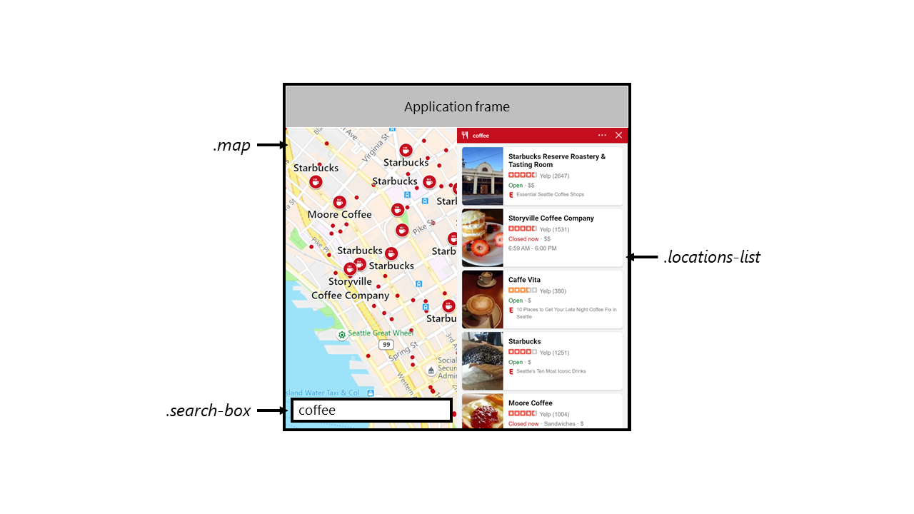
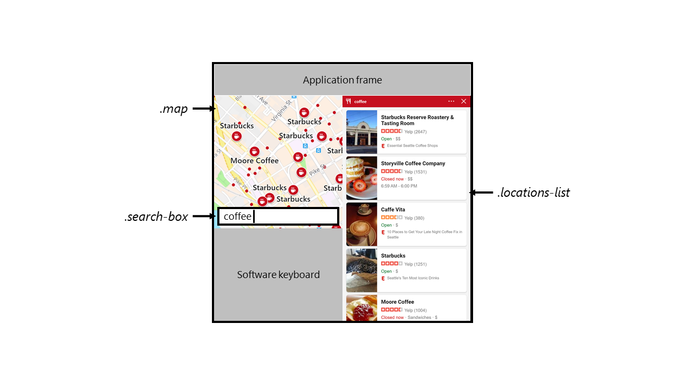
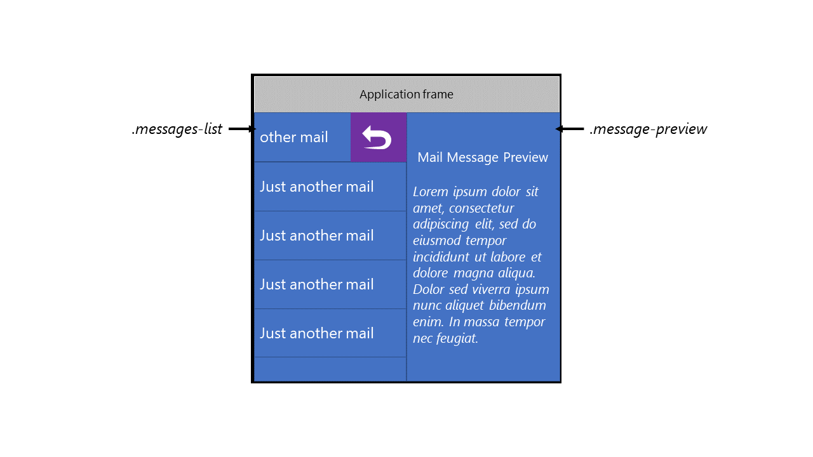
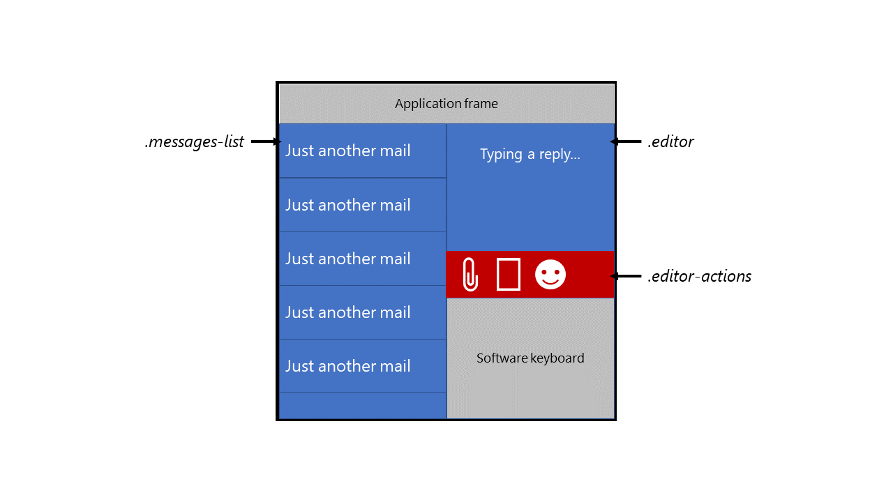

# Window Segments Enumeration API

Authors: [Bogdan Brinza](https://github.com/boggydigital), [Daniel Libby](https://github.com/dlibby-), [Zouhir Chahoud](https://github.com/Zouhir)

## Motivation:
Web developers who want to target foldable devices meet emerging and interesting challenges as the web platform does not yet provide the necessary primitives for building layouts that are optimized for foldable experiences.

Developers are trying to achieve at least the following:

- Effectively lay out the content in a window that spans multiple displays;
- React when areas of that window are occluded by the OS, for example when soft keyboard pops up.

Developers might solve those problems by taking a hard dependency on a specific device hardware parameters - an approach that is not scalable, fragile and requires work duplication for each new device.

### Some of the current problems:
More specific challenges we've heard from our internal product teams that were exploring building experiences for this emerging classes of devices include:

- *Hardware differences*: Devices could be seamless (e.g. Samsung Galaxy Fold) or have a seam (e.g. [Microsoft Surface Neo](https://www.microsoft.com/en-us/surface/devices/surface-neo) or ZTE Axon M), in the latter case developers might want to take it into account or intentionally ignore depending on scenario;
- *Folding capabilities, state*: the fold area could be safe or unsafe region to present content;
- *Software occlusion*: Parts of the individual window segments could be occluded by software keyboard, notifications or other transient pieces of UI, permanently or temporarily. Application might decide to react or ignore depending on the current content and occlusion area;
- *Future-proofing*: Ideally developers would want a somewhat stable way to target this class of devices that won't require updates for every new device.

### Complementary existing proposals:
Before discussing the solution proposal - let's overview existing proposals that are relevant and applicable to the problem space.
As matter of principle we should generally avoid creating redundant concepts if we can reuse existing platform APIs and capabilities.

- [Presentation API](https://w3c.github.io/presentation-api/) is solving the problem of a effective use of a _secondary_ screen and likely won't attempt to solve challenges outlined above that are specific to devices where a window can span separate physical displays. This would likely still be a separate problem for foldables

- [Screen Enumeration API Explainer](https://github.com/spark008/screen-enumeration/blob/master/EXPLAINER.md) provides information about the physical screen configuration. Web developers might be able to leverage that on foldables, but would need to do extra effort to correlate that information with window parameters. Some concrete examples on why a special purpose API might be useful in addition to Screen Enumeration:
	- Getting adjacency information about spanning window regions to lay out content in several areas in logical way for a device;
	- Getting inner window dimensions that account for application frame, OS UI elements, etc.
- [Window Placement API Explainer](https://github.com/spark008/window-placement/blob/master/EXPLAINER.md) is useful in multi-window scenarios on multiple screen devices, but does not target scenarios in which the hosting application (i.e. browser) has a single window which spans multiple displays. In this case, the developer may not wish to open new windows - just hints to help lay out things properly and take advantage of the physical partitioning of the available layout space.

Additionally, while not a solution in the same sense, a ["[css-media-queries] Foldables support and enablement"](https://github.com/w3c/csswg-drafts/issues/4141) issue discusses the problem space and outlines some details and touches upon outlined issues. Longer term we might want to rethink some of the fundamental assumptions (i.e. a single contiguous rectangular space for laying out content) making it hard to use current layout queries - but in the short term we have a chance to improve developer experience by solving specific problems.

## Proposal:

A summary of the concepts from the other proposals:
* Display - the logical representation of an physical monitor.
* Screen - the aggregate 2D space occupied by all the connected displays.

We propose a new concept of Window Segments that represent the regions (and their dimensions) of the window that reside on separate (adjacent) displays. Window Segment dimensions are expressed in CSS pixels and will be exposed via a JavaScript API that allows developers to enumerate segments, including about regions that are occluded.

This proposal is primarily aimed at reactive scenarios, where an application wants to take advantage of the fact that it spans multiple displays, by virtue of the user/window manager placing it in that state. It is not designed for scenarios of proactively placing content on the various displays available (this would fall under the [Window Placement API](https://github.com/spark008/window-placement/blob/master/EXPLAINER.md) or [Presentation API](https://w3c.github.io/presentation-api/)). Note that given the [Screen Enumeration API](https://github.com/spark008/screen-enumeration/blob/master/EXPLAINER.md) and existing primitives on the Web, it is possible to write JavaScript code that intersects the rectangles of the Display and window, while taking into account devicePixelRatio in order to compute the interesting layout regions of a window spanned across displays. However this may not correctly handle corner cases of future device form factors, and thus this proposal tries to centralize access to "here are the interesting parts of the screen a developer can target or consider for presenting content" as a practical starting point.

```
partial interface Window {
	[NewObject] sequence<WindowSegment> getWindowSegments();
	attribute EventHandler onsegmentschange;
}

[Exposed=Window]
interface WindowSegment {
	readonly attribute long left;
	readonly attribute long top;
	readonly attribute long width;
	readonly attribute long height;
        readonly attribute bool isOcclusion;
}
```

At any point the number of window segments change, due to software keyboard visibility change for instance, the user agent must fire `segmentschange` event at the Window of the active document.

### Non-goals:
This proposal doesn't aim to substitute existing APIs and the proposed development model can be summarized as requesting current window segments on interesting events and adjusting to the new presentation environment. There are no additional lifecycle proposals - the window segments are immutable and developers would request them upon common sense events (e.g. orientationchange, resize).
This proposal doesn't suggest how developers would use window segments to position, scale and orient content - in practical explorations developers used window segments to select the best declarative layout, not to modify layouts in script, but either would be possible.

## Examples of user experiences and solution outlines that can leverage two screens:

Let's take a look at a few practical examples of the scenarios above and how window segments would allow to resolve them for better user experience. In each case we'll start with some existing scenario and complicate it to provide opportunity to apply the proposal.

### A map application that presents a map on one window segment and search results on another



Solution outline:

```js  
const screenSegments = window.getWindowSegments().filter( segment => segment.isOcclusion === false );

if( screenSegments.length > 1 ) {
	// now we know the device is a foldable
	// and we can update CSS classes in our layout as appropriate
	document.body.classList.add('is-foldable');
	document.querySelector('.map').classList.add('flex-one-half');
	document.querySelector('.locations-list').classList.add('flex-one-half');
}
```

Then if a software keyboard shows up in a region that would be occluded:



```js  
window.onsegmentschange = function() {
	const segments = window.getWindowSegments();
	segments.forEach( segment => {
		if( segment.isOcclusion ) {
			// assume we checked the segment's position
			// and we learned it's a soft-keyboard docked to the bottom left
			document.querySelector('.searchbox').style.bottom = `${segment.height + 15}px`;
		}
	})
}
```

### A mail app that might present a list of mails on one window segment and selected mail on another



```js  
const screenSegments = window.getWindowSegments().filter( segment => segment.isOcclusion === false );

if( screenSegments.length > 1 ) {
	// now we know the device is a foldable
	// and we can update CSS classes in our layout as appropriate
	document.body.classList.add('is-foldable');
	document.querySelector('.message-list').classList.add('flex-one-half');
	document.querySelector('.message-preview').classList.add('flex-one-half');
}
```

if a software keyboard shows up in a region that would be occluded:



```js  
window.onsegmentschange = function() {
	const segments = window.getWindowSegments();
	segments.forEach( segment => {
		if( segment.isOcclusion ) {
			// assume we checked the segment's position
			// and we learned it's a soft-keyboard docked to the bottom right
			document.querySelector('.editor-actions').style.bottom = `${segment.height}px`
		}
	})
}
```

---
[Related issues](https://github.com/MicrosoftEdge/MSEdgeExplainers/labels/Window%20Segments%20API) | [Open a new issue](https://github.com/MicrosoftEdge/MSEdgeExplainers/issues/new?title=%5BWindow%20Segments%20API%5D)
