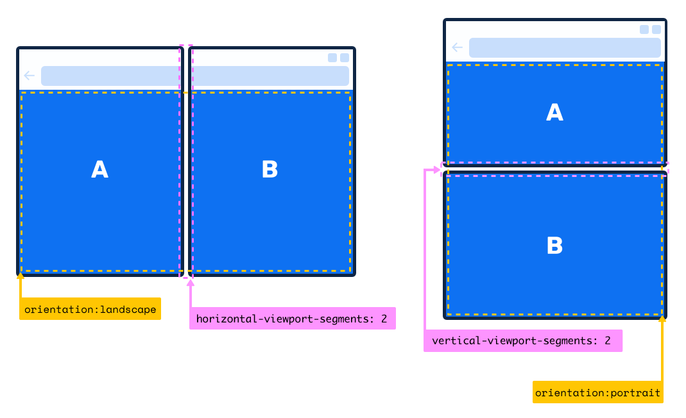
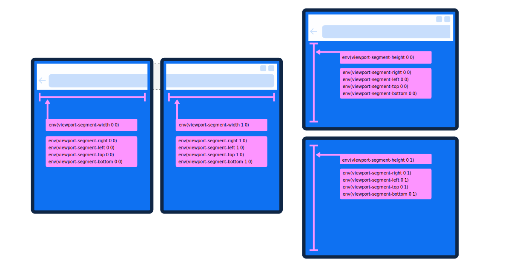
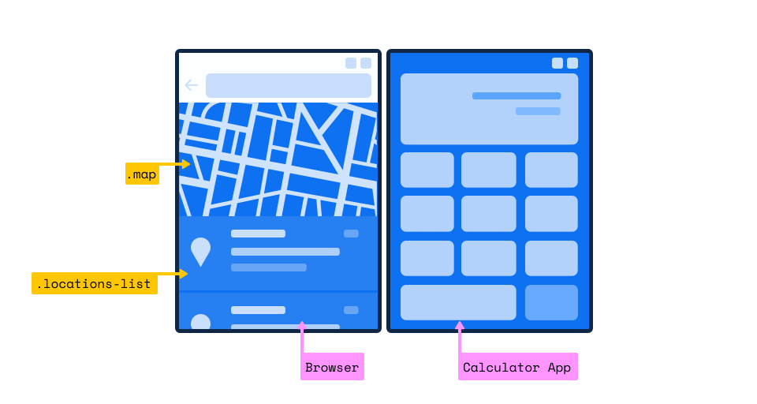
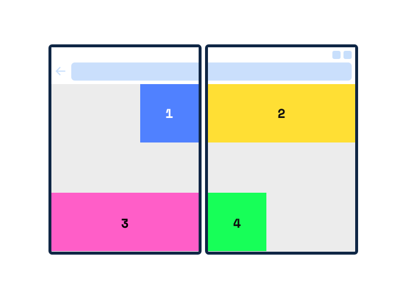

# Web Platform Primitives for Enlightened Experiences on Foldable Devices

Authors: [Bogdan Brinza](https://github.com/boggydigital), [Daniel Libby](https://github.com/dlibby-), [Zouhir Chahoud](https://github.com/Zouhir)

### Important Announcements and Updates
- Feb 26, 2020: 🚚📦 [Window Segments Enumeration JavaScript API](#proposal-window-segments-enumeration-javascript-api) has now moved to the Second-screen W3C CG repo on GitHub, for issues and comments please refer to [webscreens/window-segments](https://github.com/webscreens/window-segments)

### Table of content
- [Motivation](#motivation)
	* [Some of the current problems](#current-problems)
	* [Complementary existing proposals](#complementary-existing-proposals)

- [Proposal: CSS primitives for dual screen layouts](#proposal-css-primitives-for-building-dual-screen-layouts)
	* [The 'spanning' CSS media feature](#the-spanning-css-media-feature)
	* [Device fold CSS environment variables](#device-fold-css-environment-variables)
	* [Non-goals](#non-goals)

- [Proposal: Window Segments Enumeration JavaScript API](#proposal-window-segments-enumeration-javascript-api)

- [Security and Privacy](#security-and-privacy)
	* [APIs avalibility in iframe context](#apis-avalibility-in-iframe-context)

- [Examples of user experiences and solution outlines that can leverage two screens](#examples-of-user-experiences-and-solution-outlines-that-can-leverage-two-screens)

- [Additional Links](#additional-links)
	* [CSS Spanning media feature polyfill & example](https://github.com/zouhir/spanning-css-polyfill)
	* [Window Segments Enumeration API polyfill & example](https://github.com/zouhir/windowsegments-polyfill)
	* [Simple CSS spanning media feature demo in a web-based device emulator](https://foldables-emulator.netlify.com/?url=https://css-spanning.netlify.com/demo/basic/)

## Motivation:
Web developers targeting foldable devices want to be able to effectively lay out the content in a window that spans multiple displays. However, the web platform does not yet provide the necessary primitives for building layouts that are optimized for foldable experiences.
Developers may be able to solve this by taking a hard dependency on a specific device hardware parameters - an approach that is fragile, not scalable, and requires work duplication for each new device.

### Current problems:
More specific challenges we've heard from our internal product teams that were exploring building experiences for this emerging classes of devices include:

- *Hardware differences*: Devices could be seamless (e.g. Samsung Galaxy Fold) or have a seam (e.g. [Microsoft Surface Neo](https://www.microsoft.com/en-us/surface/devices/surface-neo), [Microsoft Surface Duo](https://www.microsoft.com/en-us/surface/devices/surface-duo) or ZTE Axon M). In the latter case developers might want to take it into account or intentionally ignore depending on scenario;
- *Folding capabilities, state*: the fold area could be safe or unsafe region to present content;
- *Future-proofing*: Ideally developers would want a somewhat stable way to target this class of devices without having to rely on specific device hardware parameters.

### Complementary existing proposals:
Before discussing the solution proposal - let's overview existing proposals that are relevant and applicable to the problem space. 
As matter of principle we should generally avoid creating redundant concepts if we can reuse existing platform APIs and capabilities.

- [Presentation API](https://w3c.github.io/presentation-api/) is solving the problem of a effective use of a _secondary_ screen and likely won't attempt to solve challenges outlined above that are specific to devices where a window can span separate physical displays. This would likely still be a separate problem for foldables

- [Screen Enumeration API Explainer](https://github.com/spark008/screen-enumeration/blob/master/EXPLAINER.md) provides information about the physical screen configuration. Web developers might be able to leverage that on foldables, but would need to do extra effort to correlate that information with window parameters. Some concrete examples on why a special purpose API might be useful in addition to Screen Enumeration:
	- Getting adjacency information about spanning window regions to lay out content in several areas in logical way for a device;
	- Getting inner window dimensions that account for application frame, OS UI elements, etc.
- [Window Placement API Explainer](https://github.com/spark008/window-placement/blob/master/EXPLAINER.md) is useful in multi-window scenarios on multiple screen devices, but does not target scenarios in which the hosting application (i.e. browser) has a single window which spans multiple displays. In this case, the developer may not wish to open new windows - just hints to help lay out things properly and take advantage of the physical partitioning of the available layout space.
 
Additionally, while not a solution in the same sense, a ["[css-media-queries] Foldables support and enablement"](https://github.com/w3c/csswg-drafts/issues/4141) issue discusses the problem space and outlines some details and touches upon outlined issues.

## Proposal: CSS primitives for building dual screen layouts

In order to enable web developers to build layouts that are optimized for foldable experiences declaratively using CSS, we must consider  fundamental assumptions of CSS (i.e. a single contiguous rectangular space for laying out content) and introduce new primitives that -together with existing layout media queries- allow developers to create layouts that react to states where the root viewport spans multiple displays.

The first primitive we propose is a CSS media feature to determine whether the website is spanning across two adjacent displays along with the configuration of those two adjacent displays (e.g. stacked or aside). The second primitive is a set of user agent-defined environment variables that will help developers calculate the size of each screen region in CSS pixels.

### The 'spanning' CSS media feature

The `spanning` CSS media feature can be used to test whether the browser window is spanning across multiple diplays.



#### Syntax

The `spanning` media feature value can be one of the following keywords:

- **single-fold-vertical**

This value matches when the layout viewport is spanning a single fold (two screens) and the fold posture is vertical.

- **single-fold-horizontal**

This value matches when the layout viewport is spanning a single fold (two screens) and the fold posture is horizontal.

- **none**

This value describes the state of when the browser window is not in spanning mode.

### Device fold CSS environment variables



We propose the addition of 4 pre-defined CSS environment variables `fold-top`, `fold-left`, `fold-width`, `fold-height`. Web developers can utilize those variables to calculate each screen segment size at both landscape and portrait orientations. While the spanning media query guarantees there is only a single hinge and two screen segments, developers must not take a dependency that each screen segment is 50% of the viewport height or width, as that is not always the case (see above example of `single-fold-horizontal` where portions of the top display are consumed by browser UI).

The values of these variables are CSS pixels, and are relative to the layout viewport (i.e. are in the [client coordinates, as defined by CSSOM Views](https://drafts.csswg.org/cssom-view/#dom-mouseevent-clientx)). When evaluated when not in one of the spanning states, these values will be treated as if they don't exist, and use the fallback value as passed to the `env()` function.

### Non-goals:

This proposal is not meant to solve the problem for foldable devices with more than two screens, due to the unavailability of a CSS construct that allows authors to iterate over a set of values. In this case, an author would need a function that allows them to retrieve the browser's predefined `env()` variables of the `n-th` fold/hinge.

The proposed CSS constructs are not currently meant to map to spanning configurations in window managers that allow arbitrary window placement. When windows are spanned across external monitors, it is not clear that there is user intent that applications should split their view over the gap between the physical monitors. Additionally, these values would change as the user moves the window. However, if a valid use case presents itself, it's something we can certainly reconsider.

## Proposal: Window Segments Enumeration JavaScript API 

A summary of the concepts from the other proposals:
* Display - the logical representation of an physical monitor.
* Screen - the aggregate 2D space occupied by all the connected displays.

We propose a new concept of Window Segments that represent the regions (and their dimensions) of the window that reside on separate (adjacent) displays. Window Segment dimensions are expressed in CSS pixels and will be exposed via a JavaScript API that allows developers to enumerate segments where logically separate pieces of content can be placed. 

This proposal is primarily aimed at reactive scenarios, where an application wants to take advantage of the fact that it spans multiple displays, by virtue of the user/window manager placing it in that state. It is not designed for scenarios of proactively placing content in a separate top-level browsing context on the various displays available (this would fall under the [Window Placement API](https://github.com/spark008/window-placement/blob/master/EXPLAINER.md) or [Presentation API](https://w3c.github.io/presentation-api/)). Note that given the [Screen Enumeration API](https://github.com/spark008/screen-enumeration/blob/master/EXPLAINER.md) and existing primitives on the Web, it is possible to write JavaScript code that intersects the rectangles of the Display and window, while taking into account devicePixelRatio in order to compute the interesting layout regions of a window spanned across displays. However this may not correctly handle corner cases of future device form factors, and thus this proposal tries to centralize access to "here are the interesting parts of the screen a developer can target or consider for presenting content" as a practical starting point. 

```
partial interface Window {
	sequence<DOMRect> getWindowSegments();
}
```

The value returned from the `getWindowSegments()` API will be an array of WindowSegment objects, based on the data returned for each WindowSegment, developers will be able to infer the number of hinges available as well as the hinge orientation. Following the above examples, when in the `single-fold-vertical` state, getWindowSegments will return an array of 2 WindowSegments where the `top` property for each one is identical and equals 0, whereas `single-fold-horizontal` will return 2 WindowSegments with the `left` property being the identical one.

A user may at any point take the browser window out of spanning mode and place it on one of the screens or vice-versa, in those cases the window resize event will fire and authors can query and get the number of available screen segments.

This proposal doesn't aim to substitute existing APIs &mdash; the proposed development model can be summarized as requesting current window segments on interesting events and adjusting to the new presentation environment. There are no additional lifecycle proposals - the window segments are immutable and developers would request them upon common sense events (e.g. orientationchange, resize). It also  doesn't suggest how developers would use window segments to position, scale and orient content - in practical explorations developers used window segments to select the best declarative layout, not to modify layouts in script, but either would be possible.

## Security and Privacy

### APIs avalibility in iframe context

The CSS constructs and the JavaScript API will be available in `iframe` context but disabled by default for privacy and security considerations. An author may enable them using the `screen-spanning` policy; a new feature policy we are proposing that will enable authors to selectively enable the previously mentioned CSS and JavaScript constructs in iframe context. When disabled, getWindowSegments will return a single segment the size of the iframe's viewport, and the CSS environment variables will be treated as unset, and use the fallback values.

iframes where `screen-spanning` feature policy is enabled will receive values in the client coordinates of the top most window, and it's possible the iframe won't be able to interpret that data without other information from its embedder. As an example, for cross origin iframes, the iframe's embedder must provide information about how to transform from the root client coordinate space to the iframe's client coordinate space, as this information is not available to cross-origin iframes for security reasons. 

## Examples of user experiences and solution outlines that can leverage two screens:

Let's take a look at a few practical examples of the scenarios above and how window segments would allow to resolve them for better user experience. In each case we'll start with some existing scenario and complicate it to provide opportunity to apply the proposal.

### A map application that presents a map on one window segment and search results on another


#### CSS solution outline:

```css
@media (spanning: single-fold-vertical) {	
	body {
		flex-direction: row;
	}

	.map {
		flex: 1 1 env(fold-left)
	}
	
	.locations-list {
		flex: 1;
	}
}
```

#### JavaScript solution outline:

```js  
const screenSegments = window.getWindowSegments();

if( screenSegments.length > 1 ) {
	// now we know the device is a foldable
	// it's recommended to test whether screenSegments[0].width === screenSegments[1].width
	// and we can update CSS classes in our layout as appropriate 
	document.body.classList.add('is-foldable');
	document.querySelector('.map').classList.add('flex-one-half');
	document.querySelector('.locations-list').classList.add('flex-one-half');
}
```

### Reacting to map application resize/spanning state change



#### CSS solution outline:

```css

@media (spanning: none) and (max-width: 728px) {	
	body {
		flex-direction: column;
	}

	.map {
		flex: 0 0 300px;
	}
	
	.locations-list {
		flex: 1;
	}
}

```

#### JavaScript solution outline:

```js  
window.onresize = function() {
	const segments = window.getWindowSegments();
	console.log(segments.length) // 1
}
```

### Colored boxes absolutely positioned



This is an illustrative example that demonstrates how to use the new enviroment variables to position content relative to the fold.

Box 1 `.blue` and Box 4 `.green` have a *width* and *height* of *100px*, however, the requirement for Box 2 `.yellow` and Box 3 `.pink` is to *fill the screen segment width* and have a height of *100px*

#### CSS solution outline:

```css
@media (spanning: single-fold-vertical) {	
	.blue {
		height: 100px;
		width: 100px;
		position: absolute;
		left: calc(env(fold-left) - 100px);
		top: 0;
	}

	.yellow {
		height: 100px;
		width: calc(100vw - env(fold-left) + env(fold-width));
		position: absolute;
		left: calc(env(fold-left) + env(fold-width) );
		top: 0;
	}

	.pink {
		height: 100px;
		width: env(fold-left);
		position: absolute;
		left: 0;
		bottom: 0;
	}

	.green {
		height: 100px;
		width: 100px;
		position: absolute;
		left: calc(env(fold-left) + env(fold-width));
		bottom: 0;
	}
}
```

## Additional Links

- [CSS Spanning media feature polyfill & example](https://github.com/zouhir/spanning-css-polyfill)

- [Window Segments Enumeration API polyfill & example](https://github.com/zouhir/windowsegments-polyfill)

- [Simple CSS spanning media feature demo in a web-based device emulator](https://foldables-emulator.netlify.com/?url=https://css-spanning.netlify.com/demo/basic/)