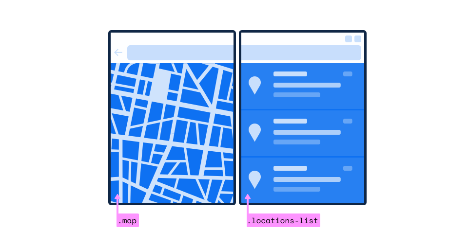

# Web Platform Primitives for Enlightened Experiences on Foldable Devices

Authors: [Bogdan Brinza](https://github.com/boggydigital), [Daniel Libby](https://github.com/dlibby-), [Zouhir Chahoud](https://github.com/Zouhir)

## Status of this Document
This document is intended as a starting point for engaging the community and standards bodies in developing collaborative solutions fit for standardization. As the solutions to problems described in this document progress along the standards-track, we will retain this document as an archive and use this section to keep the community up-to-date with the most current standards venue and content location of future work and discussions.
* This document status: **Active** (CSS primitives for dual screen layouts)
    * Expected venue: [W3C CSS Working Group](https://www.w3.org/Style/CSS/)
* This document status: **ARCHIVED** (The Window Segments Enumeration JavaScript API has been deprecated in favor of the Visual Viewport Segments Property)
    * Venue: [W3C Second Screen Community Group](https://www.w3.org/community/webscreens/) | [webscreens/window-segments](https://github.com/webscreens/window-segments) | 
    * Current version: [Visual Viewport Segments Property](https://github.com/WICG/visual-viewport/blob/gh-pages/segments-explainer/SEGMENTS-EXPLAINER.md)

### Table of content
- [Motivation](#motivation)
	* [Some of the current problems](#current-problems)
	* [Complementary existing proposals](#complementary-existing-proposals)

- [Proposal: CSS primitives for dual screen layouts](#proposal-css-primitives-for-building-dual-screen-layouts)
	* [The 'spanning' CSS media feature](#the-spanning-css-media-feature)
	* [Device fold CSS environment variables](#device-fold-css-environment-variables)
	* [Non-goals](#non-goals)

- [Proposal: Window Segments Enumeration JavaScript API](#proposal-window-segments-enumeration-javascript-api)

- [Security and Privacy](#security-and-privacy)
	* [APIs avalibility in iframe context](#apis-avalibility-in-iframe-context)

- [Examples of user experiences and solution outlines that can leverage two screens](#examples-of-user-experiences-and-solution-outlines-that-can-leverage-two-screens)

- [Additional Links](#additional-links)
	* [CSS Spanning media feature polyfill & example](https://github.com/zouhir/spanning-css-polyfill)
	* [Window Segments Enumeration API polyfill & example](https://github.com/zouhir/windowsegments-polyfill)
	* [Simple CSS spanning media feature demo in a web-based device emulator](https://foldables-emulator.netlify.com/?url=https://css-spanning.netlify.com/demo/basic/)

## Motivation:
Web developers targeting dual-screen and foldable devices want to be able to effectively lay out the content in a window that spans multiple display regions. However, the web platform does not yet provide the necessary primitives for building layouts that are optimized for dual-screen or foldable experiences.

Developers may be able to solve this by taking a hard dependency on a specific device hardware parameters - an approach that is fragile, not scalable, and requires work duplication for each new device.

### Current problems:
More specific challenges we've heard from our internal product teams that were exploring building experiences for this emerging classes of devices include:

- *Hardware differences*: Devices could be seamless (e.g. Samsung Galaxy Fold) or have a seam (e.g. [Microsoft Surface Duo](https://www.microsoft.com/en-us/surface/devices/surface-duo) or ZTE Axon M). In both cases developers might want to take it into account or intentionally ignore depending on scenario;
- *Folding capabilities, state*: the fold area could be safe or unsafe region to present content;
- *Future-proofing*: Ideally developers would want a somewhat stable way to target this class of devices without having to rely on specific device hardware parameters.

### Complementary existing proposals:
Before discussing the solution proposal - let's overview existing proposals that are relevant and applicable to the problem space. 
As matter of principle we should generally avoid creating redundant concepts if we can reuse existing platform APIs and capabilities.

- [Presentation API](https://w3c.github.io/presentation-api/) is solving the problem of a effective use of a _secondary_ screen and likely won't attempt to solve challenges outlined above that are specific to devices where a window can span separate physical displays. This would likely still be a separate problem for foldables

- [Screen Enumeration API Explainer](https://github.com/spark008/screen-enumeration/blob/master/EXPLAINER.md) provides information about the physical screen configuration. Web developers might be able to leverage that on foldables, but would need to do extra effort to correlate that information with window parameters. Some concrete examples on why a special purpose API might be useful in addition to Screen Enumeration:
	- Getting adjacency information about spanning window regions to lay out content in several areas in logical way for a device;
	- Getting inner window dimensions that account for application frame, OS UI elements, etc.
- [Window Placement API Explainer](https://github.com/spark008/window-placement/blob/master/EXPLAINER.md) is useful in multi-window scenarios on multiple screen devices, but does not target scenarios in which the hosting application (i.e. browser) has a single window which spans multiple displays. In this case, the developer may not wish to open new windows - just hints to help lay out things properly and take advantage of the physical partitioning of the available layout space.
 
Additionally, while not a solution in the same sense, a ["[css-media-queries] Foldables support and enablement"](https://github.com/w3c/csswg-drafts/issues/4141) issue discusses the problem space and outlines some details and touches upon outlined issues.

## Proposal: CSS primitives for building dual screen layouts

A summary of the concepts from the other proposals:
* Display region - The representation of a physical monitor on dual-screen devices or the logical view area separated by the hinge on foldable devices.
* Screen - the aggregate 2D space occupied by all the connected displays.

In order to enable web developers to build layouts that are optimized for dual-screen and foldable experiences declaratively using CSS, we must consider fundamental assumptions of CSS (i.e. a single contiguous rectangular space for laying out content) and introduce new primitives that -together with existing layout media queries- allow developers to create layouts that react to states where the root viewport spans across multiple display regions.

The first primitive we propose is a CSS media feature to determine whether the website is spanning across two adjacent display regions along with the configuration of those two adjacent display regions (e.g. stacked or aside). The second primitive is a set of user agent-defined environment variables that will help developers calculate the size of each screen region in CSS pixels.

### Viewport Segments CSS media features

The `viewport-segments` media feature is used to detect the number of logical segments of the viewport when the device is positioned horizontally or vertically.


#### Syntax

The `viewport-segments` media feature can be one of two media expressions followed by an integer to identify the number of viewport segments. When the viewport is split by one or more hardware features, such as a fold or hinge between separate displays, segments are the regions of the viewport that can be treated as logically distinct by the page.

- **horizontal-viewport-segments**

This describes the number of logical segments of the viewport in the horizontal direction and when the fold posture is horizontal (the displays are side by side).

- **vertical-viewport-segments**

This describes the number of logical segments of the viewport in the vertical direction and when the fold posture is vertical (the displays are stacked.)

`@media (horizontal-viewport-segments: 2) and (vertical-viewport-segments: 1) { ... }` detects a viewport that has exactly two segments that are side by side.

Both the `horizontal-viewport-segments` and `vertical-viewport-segments` media features are false in the negative range. 


### Viewport segment CSS environment variables


6 pre-defined CSS environment variables `viewport-segment-width`, `viewport-segment-height`, `viewport-segment-top`, `viewport-segment-left`, `viewport-segment-bottom`, `viewport-segment-right` will added, and web developers can utilize those variables to calculate each screen segment size at both landscape and portrait orientations, as well as place content within the viewport with these variables. While the viewport segments media query can detect if there is only a single hinge and two screen segments, developers must not take a dependency that each screen segment is 50% of the viewport height or width, as that is not always the case (see above example of `vertical-viewport-segments` where portions of the top display are consumed by browser UI).

The values of these variables are CSS pixels, and are relative to the layout viewport (i.e. are in the [client coordinates, as defined by CSSOM Views](https://drafts.csswg.org/cssom-view/#dom-mouseevent-clientx)). When evaluated when not in one of the spanning states, these values will be treated as if they don't exist, and use the fallback value as passed to the `env()` function.

The viewport segment environment variables have two dimensions, which represent the x and y position, respectively, in the two dimensional grid created by the hardware features separating the segments. Segments along the left edge have x position 0, those in the next column to the right have x position 1, etc. Similarly, segments along the top edge have y position 0, etc.

When the viewport is split into two side-by-side segments, the viewport segment on the left would have indices (0,0) and it's width would be represented as `env(viewport-segment-width 0 0)`. Additionally there is an option to provide a fallback value for an element's width or height if using either `viewport-segment-width` or `viewport-segment-height` that, for example, could be represented as `env(viewport-segment-width 0 0, 100%)`

### Non-goals:

This proposal is not meant to solve the problem for foldable devices with more than two screens, due to the unavailability of a CSS construct that allows authors to iterate over a set of values. In this case, an author would need a function that allows them to retrieve the browser's predefined `env()` variables of the `n-th` fold/hinge.

The proposed CSS constructs are not currently meant to map to spanning configurations in window managers that allow arbitrary window placement. When windows are spanned across external monitors, it is not clear that there is user intent that applications should split their view over the gap between the physical monitors. Additionally, these values would change as the user moves the window. However, if a valid use case presents itself, it's something we can certainly reconsider.

## Proposal: Window Segments Enumeration JavaScript API 

- Feb 26, 2020: 🚚📦 Window Segments Enumeration JavaScript API has now moved to the [W3C Second Screen Community Group](https://www.w3.org/community/webscreens/). For the explainer, issues, and comments please refer to the [webscreens/window-segments](https://github.com/webscreens/window-segments) GitHub repo.
- October 25, 2021: The Windows Segments Enumeration JavaScript API has been deprecated in favor of the [Visual Viewport segments property](https://github.com/WICG/visual-viewport/blob/57bc47268d2fc0042bf848d192d7e34ff9a3cafd/segments-explainer/SEGMENTS-EXPLAINER.md) 

## Security and Privacy

### APIs availability in iframe context

The CSS constructs will be available in `iframe` context but disabled by default for privacy and security considerations. An author may enable them using the `screen-spanning` policy; a new feature policy we are proposing that will enable authors to selectively enable the previously mentioned CSS constructs in iframe context. When disabled, the CSS environment variables will be treated as unset, and use the fallback values.

iframes where `screen-spanning` feature policy is enabled will receive values in the client coordinates of the top most window, and it's possible the iframe won't be able to interpret that data without other information from its embedder. As an example, for cross origin iframes, the iframe's embedder must provide information about how to transform from the root client coordinate space to the iframe's client coordinate space, as this information is not available to cross-origin iframes for security reasons. 

The `segments` property will return null when called from within an iframe context.

## Examples of user experiences and solution outlines that can leverage two screens:

Let's take a look at a few practical examples of the scenarios above and how window segments would allow to resolve them for better user experience. In each case we'll start with some existing scenario and complicate it to provide opportunity to apply the proposal.

### A map application that presents a map on one window segment and search results on another



#### CSS solution outline:

```css
@media (horizontal-viewport-segments: 2) and (vertical-viewport-segments: 1) {	
	body {
		flex-direction: row;
	}

	.map {
		flex: 1 1 env(viewport-segment-width 0 0)
	}
	
	.locations-list {
		flex: 1;
	}
}
```

#### JavaScript solution outline:

```js  
const segments = window.visualViewport.segments;

if( segments && segments.length > 1 ) {
	// now we know the device is a foldable
	// it's recommended to test whether segments[0].width === segments[1].width
	// and we can update CSS classes in our layout as appropriate 
	document.body.classList.add('is-foldable');
	document.querySelector('.map').classList.add('flex-one-half');
	document.querySelector('.locations-list').classList.add('flex-one-half');
}
```

### Reacting to map application resize/spanning state change


#### CSS solution outline:

```css

@media (max-width: 728px) {	
	body {
		flex-direction: column;
	}

	.map {
		flex: 0 0 300px;
	}
	
	.locations-list {
		flex: 1;
	}
}

```

#### JavaScript solution outline:

```js  
window.onresize = function() {
	const segments = window.visualViewport.segments;
	if ( segments != null) { console.log(segments.length) }// 1
}
```

### Colored boxes absolutely positioned


This is an illustrative example that demonstrates how to use the new environment variables to position content relative to the fold.

Box 1 `.blue` and Box 4 `.green` have a *width* and *height* of *100px*, however, the requirement for Box 2 `.yellow` and Box 3 `.pink` is to *fill the screen segment width* and have a height of *100px*

#### CSS solution outline:

```css
@media (spanning: single-fold-vertical) {	
	.blue {
		height: 100px;
		width: 100px;
		position: absolute;
		left: calc(env(viewport-segment-right 0 0) - 100px);
		top: 0;
	}

	.yellow {
		height: 100px;
		width: env(viewport-segment-width 1 0);
		position: absolute;
		left: env(viewport-segment-left 1 0);
		top: 0;
	}

	.pink {
		height: 100px;
		width: env(viewport-segment-width 0 0, 100%);
		position: absolute;
		left: 0;
		bottom: 0;
	}

	.green {
		height: 100px;
		width: 100px;
		position: absolute;
		left: env(viewport-segment-left 1 0);
		bottom: 0;
	}
}
```

#### LTR and RTL Layout Example


#### CSS solution outline:

```css
[dir="ltr"] .col {
   flex: 0 0 env(viewport-segment-width 0 0);
}

[dir="rtl"] .col {
   flex: 0 0 env(viewport-segment-width 1 0);
}
```

## Additional Links

- [CSS Spanning media feature polyfill & example](https://github.com/zouhir/spanning-css-polyfill)

- [Window Segments Enumeration API polyfill & example](https://github.com/zouhir/windowsegments-polyfill)

- [Simple CSS spanning media feature demo in a web-based device emulator](https://foldables-emulator.netlify.com/?url=https://css-spanning.netlify.com/demo/basic/)
