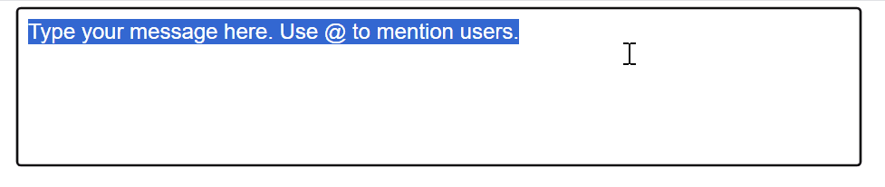
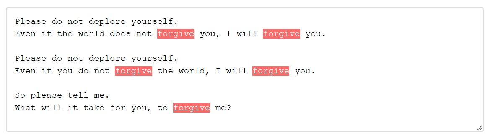
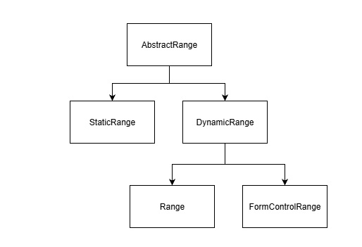

# FormControlRange

## Authors:

- [Andres Regalado Rosas](t-andresre@microsoft.com)
- [Ana Sollano Kim](https://github.com/anaskim)

## Participate

- [WHATWG tracking issue](https://github.com/whatwg/html/issues/10614)
- [CSSWG issue tracking initial discussions](https://github.com/w3c/csswg-drafts/issues/10346)
- [TPAC 2024 WHATWG meeting minutes on initial proposal](https://github.com/whatwg/meta/issues/326#issuecomment-2377500295)
- [Issue tracker](https://github.com/MicrosoftEdge/MSEdgeExplainers/labels/GetSelectionBoundingClientRect)

## Introduction

The current `Range` interface methods do not support retrieving or creating Range objects that represent the `value` (rather than the element itself) of `<textarea>` and `<input>` elements. As a result, if web developers want to use the `getBoundingClientRect()` method in a `<textarea>` or `<input>` element to position a popup beneath the user's current caret for delivering contextual autocomplete suggestions or marking syntax errors as users type using the [Custom Highlight API](https://developer.mozilla.org/en-US/docs/Web/API/CSS_Custom_Highlight_API), they must find workarounds. These workarounds often involve cloning these elements and their styles into `<div>`s, which is both difficult to maintain and may impact the web application's performance.

This proposal aims to address these issues by introducing `FormControlRange`, a new type of `Range` object that extends `AbstractRange` and serves as a way to reference spans of text within form control elements. 

## User-Facing Problem

1. Place a popup near the caret when the user presses a certain key, as shown in the following GIF.



2. Mark syntax errors using the [Custom Highlight API](https://developer.mozilla.org/en-US/docs/Web/API/CSS_Custom_Highlight_API) as shown in the following image.



Today, web developers have two options to implement these uses cases:

### Option 1: Cloning the form control element and copying styles into a `<div>`

If web authors already use a `<textarea>` and/or an `<input>` element in their applications, they might:
1. Clone the elements as `<div>`s,
2. Copy layout-affecting styles
3. Use `<div>` to get a `Range` and:
    - For use case 1: call `getBoundingClientRect()`.
    - For use case 2: create a Highlight object and use `CSS.highlights.set('syntax-highlight')`.

This is roughly the sample code from the aforementioned use cases, some functionality is omitted for brevity:

```html
<form id="messageForm" onsubmit="return handleSubmit(event)">
    <textarea id="messageArea" name="message" required placeholder="Type your message here. Use @ to mention users."></textarea>
    <div id="userList"></div>
    <div id="measuringDiv"></div>
    <button type="submit">Submit</button>
</form>
<style>
    ::highlight(syntax-highlight) {
        background-color: rgba(255, 0, 0, 0.3);
        border-radius: 2px;
    }
</style>
```

Cloning the `<textarea>` and copying relevant styles from `<textarea>` to measuring `<div>` and getting the coordinates to position the popup:

```js
// Copy relevant styles from textarea to measuring div
function copyStyles() {
    const styles = window.getComputedStyle(textarea);
    const relevantStyles = [...];
    relevantStyles.forEach(style => {
        measuringDiv.style[style] = styles[style];
    });
    ensureWordWrapMatches();
}

// Use Case 1

function getCaretCoordinates() {
    const text = textarea.value;
    const caretPos = textarea.selectionStart;
    // Create a copy of the content up to the caret
    const textBeforeCaret = text.substring(0, caretPos);
    // Copy styles before measuring
    copyStyles();
    // Set content and create a range
    measuringDiv.textContent = textBeforeCaret;
    // Add a span where the caret would be
    const caretSpan = document.createElement('span');
    caretSpan.textContent = '|';
    measuringDiv.appendChild(caretSpan);
    // Position the div over the textarea to measure
    measuringDiv.style.visibility = 'hidden';
    measuringDiv.style.position = 'fixed';
    document.body.appendChild(measuringDiv);
    // Get the position of the caret span
    const caretRect = caretSpan.getBoundingClientRect();
    const textareaRect = textarea.getBoundingClientRect();
    // Clean up
    measuringDiv.textContent = '';
    // Return coordinates relative to the viewport
    return {
        left: textareaRect.left + (caretRect.left - measuringDiv.getBoundingClientRect().left),
        top: textareaRect.top + (caretRect.top - measuringDiv.getBoundingClientRect().top),
        height: caretRect.height
    };
}

// Use Case 2

function highlightSyntax(start_index, end_index) {
    const text = textarea.value;
    // Copy styles
    copyStyles();
    // Set content
    measuringDIv.textContent = text;

    // Create range
    const range = document.createRange();
    range.setStart(measuringDiv.firstChild, start_index);
    range.setEnd(measuringDiv.firstChild, end_index);

    // Add highlight
    highlight.add(range);
    
    // Apply highlight
    CSS.highlights.set('syntax-highlight', highlight);
}

textarea.addEventListener('input', (e) => {
    const selectionStart = textarea.selectionStart;
    const text = textarea.value;
    // Check if the last character typed was @ for Use Case 1
    if (text[selectionStart - 1] === '@') {
        const coords = getCaretCoordinates();
        // Position and show the user list
        userList.style.left = `${coords.left}px`;
        userList.style.top = `${coords.top + coords.height}px`;
        userList.style.display = 'block';
        populateUserList();
    } else {
        userList.style.display = 'none';
    }
    
    // Check if the last character typed was ' ' for Use Case 2
    if (text[selectionStart - 1] === ' ' ) {
        if(!dictionary.has(previousWord)){
            highlightSyntax(selectionStart, selectionStart-previousWord.length);
            previousWord = '';
        }
    }
    else {
        previousWord += text[selectionStart - 1];
    }
});


// Initial style copy
copyStyles();
// Initial word setup for highlight
var previousWord = '';
// Dictionary for syntax check
const dictionary = Set();
// Create highlight object
const highlight = new Highlight();
// Handle window resize
window.addEventListener('resize',copyStyles);
```

### Option 2: Using `contenteditable` `<div>`

Using a `<div contenteditable>` for direct text handling can be challenging. Web authors may need to implement behaviors for form integration, cross-browser consistency, and accessibility to match `<textarea>` and `<input>` elements.

This is roughly the sample code from the example above, some functionality is omitted for brevity:

```html
<form id="messageForm" onsubmit="returnvalidateAndSubmit(event)">
    <!-- Hidden input for form validation -->
    <input type="hidden" id="hiddenContent" name="message" required>
    <div contenteditable="true" id="nameField">Type your message here. Use @ to mention users.</div>
    <div id="userList"></div>
    <button type="submit">Submit</button>
</form>
```

Event listener of `contenteditable` `<div>`:

```js
nameField.addEventListener('input', (e) => {
    const selection = document.getSelection();
    const text = nameField.textContent;
    const position = selection.getRangeAt(0).startOffset;
    // Check if the last character typed was @ for Use Case 1
    if (text[position - 1] === '@') {
        const range = selection.getRangeAt(0);
        const rect = range.getBoundingClientRect();
        // Position and show the user list
        userList.style.left = `${rect.left}px`;
        userList.style.top = `${rect.bottom + 5}px`;
        userList.style.display = 'block';
        populateUserList();
    } else {
        userList.style.display = 'none';
    }
    
    // Check if the last character typed was ' ' for Use Case 2
    if (text[position - 1] === ' ' ) {
        if(!dictionary.has(previousWord)){
            // Create Range
            const range = document.createRange()
            range.setStart(nameField.firstChild, position);
            range.setEnd(nameField.firstChild, position-previousWord.length);
            previousWord = '';
            // Add highlight
            highlight.add(range);
            // Apply highlight
            CSS.highlights.set('syntax-highlight', highlight);
        }
    }
    else {
        previousWord += text[position - 1];
    }
    // Update hidden input for form validation
    updateHiddenInput();
});
```


### Goal

Provide a way of retrieving a `FormControlRange`—a specialized type of `Range` object—that represents part or all of the `value` of `<textarea>` and `<input>` elements, enabling range-based operations such as getting bounding rects and setting custom highlights, while limiting access to the standard Range API to enforce encapsulation.

### Non-goals

- Modifying the existing Range API to accommodate the creation of ranges inside `<textarea>` and `<input>` contents.
- Modifying existing functions in the Range API and Highlight API. 
- Modify the behavior of `getSelection()` or `getRangeAt()` methods from the Selection API to allow retrieval of `<textarea>` or `<input>` ranges.

## Proposed Approach

The `FormControlRange` interface extends `AbstractRange` and provides a controlled way to create limited `Range` objects for the entirety or a part of the `value` of `<textarea>` and `<input>` elements. To protect the inner workings of these elements, `FormControlRange` instances have several limitations on the methods and attributes (from the Range API) that can be accessed through JavaScript.

**Initially available methods and properties:**
- `getBoundingClientRect()`: Returns the bounding rectangle of the range
- `getClientRects()`: Returns a list of rectangles for the range  
- `toString()`: Returns the text content of the range
- `collapsed`: Returns whether the range is collapsed (inherited from AbstractRange)

**Initially unavailable methods and properties (to prevent exposure and mutation of inner browser implementation details):**
- `setStart()` and `setEnd()`
- `startContainer`, `startOffset`, `endOffset`, and `endContainer`
- `surroundContents()`
- `extractContents()`
- `deleteContents()`
- `insertNode()`
- `cloneContents()`
- `cloneRange()`

Additional methods can be later introduced progressively based on developer needs.

Furthermore, it is important to reiterate that despite being similar to the regular `Range` interface, `FormControlRange` extends `AbstractRange` and thus can be taken as an argument in methods that allow `AbstractRange`, such as the [Custom Highlight API](https://developer.mozilla.org/en-US/docs/Web/API/CSS_Custom_Highlight_API).

The constructor for `FormControlRange` is the following:

```javascript
// Create a FormControlRange instance
const formRange = new FormControlRange();
```

The instance can be then set using the following method:

```javascript
// Set the range within a form control
formRange.setFormControlRange(formControl, startOffset, endOffset);
```

The `setFormControlRange()` method accepts three parameters:
- `element`: The `<textarea>` or `<input>` element
- `startOffset`: The start position within the element's value
- `endOffset`: The end position within the element's value

If either `startOffset` or `endOffset` are out of bounds, it will throw a `RangeError` exception. If the `value` of the `<textarea>` or `<input>` element is empty, the `FormControlRange` will represent an empty range.

The following sample code showcases how the new `FormControlRange` interface would solve the main use cases laid out in the [User-Facing Problem](#user-facing-problem) section.

```html
<form id="messageForm" onsubmit="return handleSubmit(event)">
    <textarea id="messageArea" name="message" required placeholder="Type your message here. Use @ to mention users."></textarea>
    <div id="userList"></div>
    <button type="submit">Submit</button>
</form>
```

Event listener for `<textarea>`:

```js
textarea.addEventListener('input', (e) => {
    const selectionStart = textarea.selectionStart;
    const text = textarea.value;
    // Check if the last character typed was @ for Use Case 1
    if (text[selectionStart - 1] === '@') {
        // Create FormControlRange using the proposed API
        const formRange = new FormControlRange();
        formRange.setFormControlRange(textarea, selectionStart, selectionStart);
        // Use the range to obtain the bounding client rect
        const rect = formRange.getBoundingClientRect();
        // Position and show the user list
        userList.style.left = `${rect.left}px`;
        userList.style.top = `${rect.bottom}px`;
        userList.style.display = 'block';
        populateUserList();
    } else {
        userList.style.display = 'none';
    }
    // Check if the last character typed was " " for Use Case 2
    if (text[selectionStart - 1] === ' ') {
        if(!dictionary.has(previousWord)){
            // Create FormControlRange
            const formRange = new FormControlRange();
            formRange.setFormControlRange(textarea, selectionStart-previousWord.length, selectionStart);
            // Add highlight
            highlight.add(formRange);
            // Apply highlight
            CSS.highlights.set('syntax-highlight', highlight);
            previousWord = '';
        }
    }
    else {
        previousWord += text[selectionStart - 1];
    }
});
```

This implementation simplifies obtaining the caret's position inside `<input>` and `<textarea>` elements. It also allows web developers to use the Highlight API directly on those elements. The `FormControlRange` interface eliminates the need for cloning elements and copying styles, improving performance while maintaining the benefits of using native form controls, such as accessibility, built-in form validation, and consistent behavior across browsers.

As we want the `FormControlRange` interface to be aligned with the current selection APIs for `<textarea>` and `<input>` elements, such as [`select()`](https://html.spec.whatwg.org/#the-textarea-element:dom-textarea/input-select), [`selectionStart`](https://html.spec.whatwg.org/#the-textarea-element:dom-textarea/input-selectionstart), and [`selectionEnd`](https://html.spec.whatwg.org/#the-textarea-element:dom-textarea/input-selectionend), the `<input>` types in which it will be available are listed in the [do not apply](https://html.spec.whatwg.org/multipage/input.html#do-not-apply) section:

- Text
- Search
- Telephone
- URL
- Password

Following this same alignment with selection APIs, the parameters `startOffset` and `endOffset` of the `setFormControlRange()` method will be based on caret position, rather than character index, just as [`selectionStart`](https://html.spec.whatwg.org/#the-textarea-element:dom-textarea/input-selectionstart) and [`selectionEnd`](https://html.spec.whatwg.org/#the-textarea-element:dom-textarea/input-selectionend) are.

Sample code for `<input type="text">`:

```html
<input type="text" id="messageInput" placeholder="Type a message..." />
<div id="emojiPicker"></div>
```

Event listener for `<input>`:

```js
input.addEventListener('input', (e) => {
    const selectionStart = input.selectionStart;
    const text = input.value;
    
    // Show emoji picker when user types ':' for Use Case 1
    if (text[selectionStart - 1] === ':') {
        // Create FormControlRange using the proposed API
        const formRange = new FormControlRange();
        formRange.setFormControlRange(input, selectionStart, selectionStart);
        // Use the range to obtain the bounding client rect
        const rect = formRange.getBoundingClientRect();
        // Position the emoji picker under the caret
        emojiPicker.style.position = 'fixed';
        emojiPicker.style.left = `${rect.left}px`;
        emojiPicker.style.top = `${rect.bottom}px`;
        emojiPicker.style.display = 'block';
    } else {
        emojiPicker.style.display = 'none';
    }
    // Check if the last character typed was " " for Use Case 2
    if (text[selectionStart - 1] === ' ') {
        if(!dictionary.has(previousWord)){
            // Create FormControlRange
            const formRange = new FormControlRange();
            formRange.setFormControlRange(input, selectionStart-previousWord.length, selectionStart);
            // Add highlight
            highlight.add(formRange);
            // Apply highlight
            CSS.highlights.set('syntax-highlight', highlight);
            previousWord = '';
        }
    }
    else {
        previousWord += text[selectionStart - 1];
    }
});
```

## Alternatives considered

Apart from the solutions described in the [User-Facing Problem](#user-facing-problem) section, we have also considered the following alternatives:

### getSelectionBoundingClientRect()

As one of the main use cases, the original proposal involved obtaining the bounds of a selection within a `<textarea>` or `<div>` element through a new API, `getSelectionBoundingClientRect()`. This new API would mimic the behavior of `document.getSelection().getRangeAt(0).getBoundingClientRect();`
which can be currently used to obtain a DOMRect object representing the selection bounds within a `<div>` element. A sample code for an autocomplete menu positioning using this original approach could look as follows:

```javascript
// Get current selection range in a form control
const input = document.querySelector('input[type="text"]');
const rect = input.getSelectionBoundingClientRect();
// Position autocomplete menu using rect coordinates
showAutocomplete(rect.left, rect.bottom);
```

This alternative has the following disadvantages:

1. **Redundancy**
    - `getSelectionBoundingClientRect()` overlaps with `getSelection().getRangeAt(0).getBoundingClientRect()` for every element other than `<textarea>` and `<input>`.

2. **Too specific**
    - This proposal is not compatible with the Highlight API, or any other Range API method, such as `Range.getClientRects()`.
    - It does not allow for obtaining the bounding rectangle of any text range other than the one currently selected.
    - While this proposal addresses a specific issue with the Range API's interaction with `<textarea>` and `<input>` (namely, `getBoundingClientRect()`), a more general solution—like `FormControlRange`—could resolve this and other related problems more broadly.
    
### getRangeFromValue()

The following proposal considered adding a `getRangeFromValue()` method directly to `<textarea>` and `<input>` elements that would return a regular `Range` object. However, this approach held concerns regarding how using certain Range API methods (namely, those mentioned in the [Proposed Approach](#proposed-approach) section) with text control elements would result in the exposure of inner browser implementation details through Range attributes like `startContainer` and `endContainer`, creating encapsulation concerns.

```javascript
// getRangeFromValue() sample usage
const range = textarea.getRangeFromValue(startOffset, endOffset);
// This would expose hidden <textarea> nodes
console.log(range.startContainer);
```

### Extending the Range API (1st Approach)

Another considered approach was extending the Range API by allowing `setStart()` and `setEnd()` to work when a Range's boundary points are within a form control.

```javascript
Range.setStart(formControl: HTMLInputElement | HTMLTextAreaElement, offset: number)
Range.setEnd(formControl: HTMLInputElement | HTMLTextAreaElement, offset: number)
```

Using this approach, a sample code for an autocomplete menu positioning could look as follows:

```javascript
// Get current selection range in a form control
const input = document.querySelector('input[type="text"]');
const range = document.createRange();
range.setStart(input, input.selectionStart);
range.setEnd(input, input.selectionEnd);
const rect = range.getBoundingClientRect();
// Position autocomplete menu using rect coordinates
showAutocomplete(rect.left, rect.bottom);
```

While this approach would help solve the two main use cases stated above, `FormControlRange` was chosen instead because making changes or updating the behavior of `setStart()` and `setEnd()` in the Range API could cause issues for websites that rely on the current specified behavior. Additional changes would also be required to certain accessor methods in order to avoid exposing inner implementation details, as mentioned in the [getRangeFromValue()](#getrangefromvalue).

### Extending the Range API (2nd Approach)

As previously noted, the first approach regarding the extension of the Range API posed backward compatibility risks due to changes in the behavior of `setStart()` and `setEnd()`. It also raised interoperability concerns regarding breaking the encapsulation of the implementation-defined structures of `<textarea>` and `<input>`. The second approach avoids one of these issues by **not modifying** `setStart()` and `setEnd()`. Instead, it introduces a new method specifically for setting ranges within `<textarea>` and `<input>` elements:

```javascript
// Existing behavior remains unchanged
const range = new Range();
range.setStart(startNode, startOffset);
range.setEnd(endNode, endOffset);

// New method for form controls
const formRange = new Range();
formRange.setFormControlRange(textarea, startOffset, endOffset);
```
This `setFormControlRange()` method would set a new flag `IsFormControl()` in the Range interface, that would be then used to regulate which attributes and methods the Range object can access. Continuing the previous example:

```javascript
range.startContainer        // Returns startNode
formRange.startContainer    // Flag is on: Throws exception
```

This approach addresses encapsulation concerns for ranges in form controls. It also offers better compatibility than the `FormControlRange` interface, since it would work seamlessly with APIs that involve `Range` (not only `AbstractRange`) objects, such as the Selection API:

```javascript
// Using this approach
selection.addRange(formRange)     // Works as intended.

// Using FormControlRange interface
selection.addRange(formRange2)    // Throws exception: "parameter 1 is not of type Range."
```

Ultimately, the `FormControlRange` interface was chosen instead. While the `setFormControlRange()` approach offered better API compatibility, it did not provide an explicit distinction between regular and form control ranges—both would be of type `Range`, potentially confusing web authors about why some methods may or may not be available depending on how the `Range` was set (using `setStart()` and `setEnd()` or `setFormControlRange()`).

## Other Considerations

### Privacy

- There are no anticipated privacy concerns.

### Security

- There are no anticipated security concerns.

### Consistency

- The process of creating and setting a `FormControlRange` object is similar to that of the regular Range interface, which is already familiar to web authors.

```js

const range = new Range();
range.setStart(startNode, startOffset);
range.setEnd(endNode, endOffset);

const formRange = new FormControlRange();
formRange.setFormControlRange(element, startOffset, endOffset);

```

### Compatibility

The `FormControlRange` interface is currently compatible with any API that utilizes `AbstractRange` objects, such as the [Custom Highlight API](https://developer.mozilla.org/en-US/docs/Web/API/CSS_Custom_Highlight_API). However, this means that `FormControlRange` is not compatible with methods and APIs that expect a regular `Range`.

To address this limitation, one proposed solution is to introduce a new interface called `DynamicRange`. This interface would serve as the counterpart to `StaticRange` and would also extend `AbstractRange`.

A `DynamicRange` object would not have a direct use in JavaScript beyond serving as a parent class for `Range` and `FormControlRange`. However, common methods such as `getBoundingClientRect()` and `getClientRects()`—which are implemented in both `Range` and `FormControlRange`—could be moved into `DynamicRange` to reduce redundancy.

This change would enable APIs like the Selection API to support `FormControlRange` simply by updating parameter types from `Range* new_range` to `DynamicRange* new_range`. Importantly, this would not introduce any backward compatibility issues: existing methods that expect a `Range` and are not intended to support `FormControlRange` would continue to function just as before.

The resulting `AbstractRange` inheritance structure would look like this:



## References & acknowledgements

Many thanks for valuable feedback and advice from:

- [Daniel Clark](https://github.com/dandclark)
- [Ian Sanders](https://github.com/iansan5653)
- [Keith Cirkel](https://github.com/keithamus)
- [Leo Lee](https://github.com/leotlee)
- [Mike Jackson](https://github.com/mwjacksonmsft)
- [Sanket Joshi](https://github.com/sanketj)
- [Siye Liu](https://github.com/siliu1)