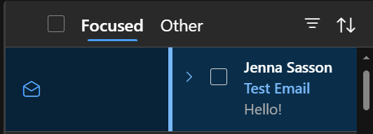
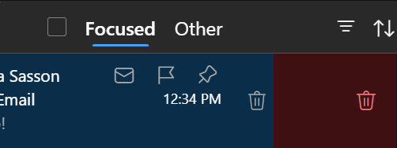
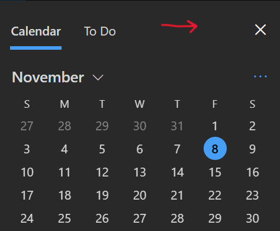

# "Native" Gesture Events for the Web

[comment]: < ** (*Same-Origin*) >

Authors: [Jenna Sasson](https://github.com/jenna-sasson)

## Status of this Document
This document is a starting point for engaging the community and standards bodies in developing collaborative solutions fit for standardization. As the solutions to problems described in this document progress along the standards-track, we will retain this document as an archive and use this section to keep the community up-to-date with the most current standards venue and content location of future work and discussions.
* This document status: **Active**
* Expected venue: [W3C Web Applications Working Group](https://www.w3.org/groups/wg/webapps/)
* **Current version: this document**

##  Introduction
Native app development allows developers to easily implement touch gestures such as swipe, pinch/zoom, pan, long press, rotate, and single/double tap. However, web app development currently lacks this capability without resorting to low-level code or large libraries, resulting in a cumbersome developer experience.

Prototyping native touch gesture functionality for the web will significantly enhance the developer experience by eliminating the need for external libraries and reducing the time spent on maintaining custom code.

## Goals
* Create an API that allows developers to implement touch gestures directly on the web without the use of libraries
* Ensure cross-platform compatibility
## Non-goals
* We will not be implementing support for all gestures at first, rather focusing on the most commonly used gestures first.

## Use Cases
### OWA
When multitasking and messaging on an instant messaging application, users may want the ability to reopen the app quickly when they receive a call or message. This allows them to respond to messages more efficiently and move between applications without having multiple windows open at once.
#### Current Uses
##### Customizable swipe gestures in the message list

* Mark as unread swipe gesture

* Trash swipe gesture

* Month to month swipe in calendar

#### Future Uses
* Swipe between messages in reading pane

### Whiteboard

## Proposed Solution

## Alternative Solutions

## Open Questions
* Which gestures are being pursued?
* How customizable will the API will be (can you define threshold/animation)?
* Will there be a way to differentiate swipe vs. touchpad vs. mouse being used when implementing drag and drop via touch in the future?

## Glossary

## Acknowledgements

