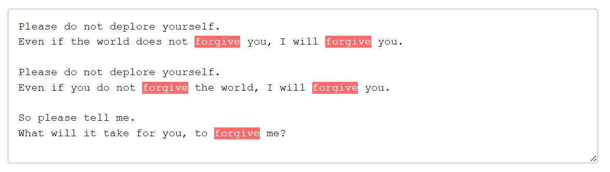

# getRangeFromValue()

## Authors:

- [Ana Sollano Kim](https://github.com/anaskim)
- [Andres Regalado Rosas](t-andresre@microsoft.com)

## Participate

- [WHATWG tracking issue](https://github.com/whatwg/html/issues/10614)
- [CSSWG issue tracking initial discussions](https://github.com/w3c/csswg-drafts/issues/10346)
- [TPAC 2024 WHATWG meeting minutes where group supports getSelectionBoundingClientRect()](https://github.com/whatwg/meta/issues/326#issuecomment-2377500295)
- [Issue tracker](https://github.com/MicrosoftEdge/MSEdgeExplainers/labels/GetSelectionBoundingClientRect)

## Introduction

The current Range interface methods do not support retrieving or creating Range objects that represent the contents of `<textarea>` and `<input>` elements. As a result, if web developers want to use the `getBoundingClientRect()` method in a `<textarea>` or `<input>` element to position a popup beneath the user's current caret to deliver contextual autocomplete suggestions or mark syntax errors as users type using the Highlight API, they have to  find workarounds, such as cloning these elements and their styles into `<div>`s. This is both difficult to maintain and may also impact the web application's performance. This proposal aims to address this issue by introducing `getRangeFromValue()` to directly obtain a Range object for the `value` of the `<textarea>` and `<input>` elements.

## User-Facing Problem

1. Place a popup near the caret when the user presses a certain key, as shown in the following GIF.


2. Mark syntax errors using the [Custom Highlight API](https://developer.mozilla.org/en-US/docs/Web/API/CSS_Custom_Highlight_API) as shown in the following image.



Today, web developers have two options to implement these uses cases:

### Option 1: Cloning the form control element and copying styles into a `<div>`

If web authors already use a `<textarea>` and/or an `<input>` element in their applications, they might:
1. Clone the elements as `<div>`s,
2. Copy layout-affecting styles
3. Use `<div>` to get a `Range` and:
    - For use case 1: call `getBoundingClientRect()`.
    - For use case 2: create a Highlight object and use `CSS.highlights.set('syntax-highlight')`.

This is roughly the sample code from the example above, some functionality is omitted for brevity:

```html
<form id="messageForm" onsubmit="return handleSubmit(event)">
    <textarea id="messageArea" name="message" required placeholder="Type your message here. Use @ to mention users."></textarea>
    <div id="userList"></div>
    <div id="measuringDiv"></div>
    <button type="submit">Submit</button>
</form>
<style>
    ::highlight(syntax-highlight) {
        background-color: rgba(255, 0, 0, 0.3);
        border-radius: 2px;
    }
</style>
```

Cloning the `<textarea>` and copying relevant styles from `<textarea>` to measuring `<div>` and getting the coordinates to position the popup:

```js
// Copy relevant styles from textarea to measuring div
function copyStyles() {
    const styles = window.getComputedStyle(textarea);
    const relevantStyles = [...];
    relevantStyles.forEach(style => {
        measuringDiv.style[style] = styles[style];
    });
    ensureWordWrapMatches();
}

// Use Case 1

function getCaretCoordinates() {
    const text = textarea.value;
    const caretPos = textarea.selectionStart;
    // Create a copy of the content up to the caret
    const textBeforeCaret = text.substring(0, caretPos);
    // Copy styles before measuring
    copyStyles();
    // Set content and create a range
    measuringDiv.textContent = textBeforeCaret;
    // Add a span where the caret would be
    const caretSpan = document.createElement('span');
    caretSpan.textContent = '|';
    measuringDiv.appendChild(caretSpan);
    // Position the div over the textarea to measure
    measuringDiv.style.visibility = 'hidden';
    measuringDiv.style.position = 'fixed';
    document.body.appendChild(measuringDiv);
    // Get the position of the caret span
    const caretRect = caretSpan.getBoundingClientRect();
    const textareaRect = textarea.getBoundingClientRect();
    // Clean up
    measuringDiv.textContent = '';
    // Return coordinates relative to the viewport
    return {
        left: textareaRect.left + (caretRect.left - measuringDiv.getBoundingClientRect().left),
        top: textareaRect.top + (caretRect.top - measuringDiv.getBoundingClientRect().top),
        height: caretRect.height
    };
}

// Use Case 2

function highlightSyntax(start_index, end_index) {
    const text = textarea.value;
    // Copy styles
    copyStyles();
    // Set content
    measuringDIv.textContent = text;

    // Create range
    const range = document.createRange();
    range.setStart(measuringDiv.firstChild, start_index);
    range.setStart(measuringDiv.firstChild, end_index);

    // Add highlight
    highlight.add(range);
    
    // Apply highlight
    CSS.highlights.set('syntax-highlight', highlight);
}

textarea.addEventListener('input', (e) => {
    const selectionStart = textarea.selectionStart;
    const text = textarea.value;
    // Check if the last character typed was @ for Use Case 1
    if (text[selectionStart - 1] === '@') {
        const coords = getCaretCoordinates();
        // Position and show the user list
        userList.style.left = `${coords.left}px`;
        userList.style.top = `${coords.top + coords.height}px`;
        userList.style.display = 'block';
        populateUserList();
    } else {
        userList.style.display = 'none';
    }
    
    // Check if the last character types was ' ' for Use Case 2
    if (text[selectionStart - 1] === ' ' ) {
        if(!dictionary.has(previousWord)){
            highlightSyntax(selectionStart, selectionStart-previousWord.length);
            previousWord = '';
        }
    }
    else {
        previousWord += text[selectionStart - 1];
    }
});


// Initial style copy
copyStyles();
// Initial word setup for highlight
var previousWord = '';
// Dictionary for syntax check
const dictionary = Set();
// Create highlight object
const highlight = new Highlight();
// Handle window resize
window.addEventListener('resize',copyStyles);
```

### Option 2: Using `contenteditable` `<div>`

Using a `<div contenteditable>` for direct text handling can be challenging. Web authors may need to implement behaviors for form integration, cross-browser consistency, and accessibility to match `<textarea>` and `<input>` elements.

This is roughly the sample code from the example above, some functionality is omitted for brevity:

```html
<form id="messageForm" onsubmit="returnvalidateAndSubmit(event)">
    <!-- Hidden input for form validation -->
    <input type="hidden" id="hiddenContent" name="message" required>
    <div contenteditable="true" id="nameField">Type your message here. Use @ to mention users.</div>
    <div id="userList"></div>
    <button type="submit">Submit</button>
</form>
```

Event listener of `contenteditable` `<div>`:

```js
nameField.addEventListener('input', (e) => {
    const selection = document.getSelection();
    const text = nameField.textContent;
    const position = selection.getRangeAt(0).startOffset;
    // Check if the last character typed was @ for Use Case 1
    if (text[position - 1] === '@') {
        const range = selection.getRangeAt(0);
        const rect = range.getBoundingClientRect();
        // Position and show the user list
        userList.style.left = `${rect.left}px`;
        userList.style.top = `${rect.bottom + 5}px`;
        userList.style.display = 'block';
        populateUserList();
    } else {
        userList.style.display = 'none';
    }
    
    // Check if the last character types was ' ' for Use Case 2
    if (text[position - 1] === ' ' ) {
        if(!dictionary.has(previousWord)){
            // Create Range
            const range = document.createRange()
            range.setStart(nameField.firstChild, position);
            range.setStart(nameField.firstChild, position-previousWord.length);
            previousWord = '';
            // Add highlight
            highlight.add(range);
            // Apply highlight
            CSS.highlights.set('syntax-highlight', highlight);
        }
    }
    else {
        previousWord += text[position - 1];
    }
    // Update hidden input for form validation
    updateHiddenInput();
});
```


### Goal

Provide a way of obtaining a Range object that represents part or all of the `value` of `<textarea>` and `<input>` elements.

### Non-goals

- Expand the Range API to accommodate the creation of ranges inside `<textarea>` and `<input>` contents.
- Modifying existing functions in the Range API and Highlight API. 
- Modify the behavior of `getSelection()` or `getRangeAt()` methods from the Selection API to allow retrieval of `<textarea>` or `<input>` ranges.

## Proposed Approach

The `getRangeFromValue()` API will create a Range representing the `value` of a `<textarea>` or `<input>` element. It accepts two parameters: `start_offset` and `end_offset`. These parameters determine the start and end nodes, and their offsets, within the Range object, considering the specific DOM structure of these elements. In an `<input>`, the range is always within a single text node holding the value. In contrast, a `<textarea>` may have multiple text nodes if line breaks are present, potentially resulting in different start and end nodes. Importantly, the element itself will never be the start or end node.

If either one of the `start_offset` and `end_offset` are out of bounds, it will throw a Range type exception. If the field is empty, it will return an empty Range object, with no start or end set.

The following sample code showcases how the new `getRangeFromValue()` API would solve the main use cases laid out in the [User-Facing Problem](#user-facing-problem) section.

```html
<form id="messageForm" onsubmit="return handleSubmit(event)">
    <textarea id="messageArea" name="message" required placeholder="Type your message here. Use @ to mention users."></textarea>
    <div id="userList"></div>
    <button type="submit">Submit</button>
</form>
```

Event listener for `<textarea>`:

```js
textarea.addEventListener('input', (e) => {
    const selectionStart = textarea.selectionStart;
    const text = textarea.value;
    // Check if the last character typed was @ for Use Case 1
    if (text[selectionStart - 1] === '@') {
        // Get the range using the proposed API
        const range = textarea.getRangeFromValue(selectionStart, selectionStart);
        // Use the range to obtain the bounding client rect
        const rect = range.getSelectionBoundingClientRect();
        // Position and show the user list
        userList.style.left = `${rect.left}px`;
        userList.style.top = `${rect.bottom}px`;
        userList.style.display = 'block';
        populateUserList();
    } else {
        userList.style.display = 'none';
    }
    // Check if the last character types was " " for Use Case 2
    if (text[selectionStart - 1] === ' ') {
        if(!dictionary.has(previousWord)){
            // Create Range
            const range = textarea.getRangeFromValue(selectionStart, selectionStart-previousWord.length);
            // Add highlight
            highlight.add(range);
            // Apply highlight
            CSS.highlights.set('syntax-highlight', highlight);
            previousWord = '';
        }
    }
    else {
        previousWord+=text[selectionStart - 1];
    }
});
```

This implementation simplifies obtaining the caret's position inside `<input>` and `<textarea>` elements. It also allows web developers to use the Highlight API on those elements. The getRangeFromValue() API eliminates the need for cloning elements and copying styles, improving performance while maintaining the benefits of using native form controls, such as accessibility, built-in form validation, and consistent behavior across browsers.

As we want the `getRangeFromValue()` API to be aligned with the current selection APIs for `<textarea>` and `<input>` elements, such as [`select()`](https://html.spec.whatwg.org/#the-textarea-element:dom-textarea/input-select), [`selectionStart`](https://html.spec.whatwg.org/#the-textarea-element:dom-textarea/input-selectionstart), and [`selectionEnd`](https://html.spec.whatwg.org/#the-textarea-element:dom-textarea/input-selectionend), the `<input>` types in which it will be available are listed in the [do not apply](https://html.spec.whatwg.org/multipage/input.html#do-not-apply) section:

- Text
- Search
- Telephone
- URL
- Password

Following this same alignment with selection APIs, the parameters `start_offset` and `end_offset` of the `getRangeFromValue()` API will be based on caret position, rather than character index, just as [`selectionStart`](https://html.spec.whatwg.org/#the-textarea-element:dom-textarea/input-selectionstart) and [`selectionEnd`](https://html.spec.whatwg.org/#the-textarea-element:dom-textarea/input-selectionend) are.

Sample code for `<input type="text">`:

```html
<input type="text" id="messageInput" placeholder="Type a message..." />
<div id="emojiPicker"></div>
```

Event listener for `<input>`:

```js
input.addEventListener('input', (e) => {
    const selectionStart = input.selectionStart;
    const text = input.value;
    
    // Show emoji picker when user types ':' for Use Case 1
    if (text[selectionStart - 1] === ':') {
        // Get the range using the proposed API
        const range = input.getRangeFromValue(selectionStart, selectionStart);
        // Use the range to obtain the bounding client rect
        const rect = range.getSelectionBoundingClientRect();
        // Position the emoji picker under the caret
        emojiPicker.style.position = 'fixed';
        emojiPicker.style.left = `${rect.left}px`;
        emojiPicker.style.top = `${rect.bottom}px`;
        emojiPicker.style.display = 'block';
    } else {
        emojiPicker.style.display = 'none';
    }
    // Check if the last character types was " " for Use Case 2
    if (text[selectionStart - 1] === ' ') {
        if(!dictionary.has(previousWord)){
            // Create Range
            const range = input.getRangeFromValue(selectionStart, selectionStart-previousWord.length);
            // Add highlight
            highlight.add(range);
            // Apply highlight
            CSS.highlights.set('syntax-highlight', highlight);
            previousWord = '';
        }
    }
    else {
        previousWord+=text[selectionStart - 1];
    }
});
```

## Alternatives considered

Apart from the solutions described in the [User-Facing Problem](#user-facing-problem) section, we have also considered the following alternatives:

### getSelectionBoundingClientRect()

As one of the main use cases, the original proposal involved obtaining the bounds of a selection within a `<textarea>` or `<div>` element through a new API, `getSelectionBoundingClientRect()`. This new API would mimic the behavior of `document.getSelection().getRangeAt(0).getBoundingClientRect();`
which can be currently used to obtain a DOMRect object representing the selection bounds within a `<div>` element. A sample code for an autocomplete menu positioning using this original approach could look as follows:

```javascript
// Get current selection range in a form control
const input = document.querySelector('input[type="text"]');
const rect = input.getSelectionBoundingClientRect();
// Position autocomplete menu using rect coordinates
showAutocomplete(rect.left, rect.bottom);
```

This alternative has the following disadvantages:

1. **Redundancy**
    - `getSelectionBoundingClientRect()` overlaps with `getSelection().getRangeAt(0).getBoundingClientRect()` for every element other than `<textarea>` and `<input>`.

2. **Too specific**
    - This proposal is not compatible with the Highlight API, or any other Range API method, such as `Range.getClientRects()`.
    - It does not allow for obtaining the bounding rectangle of any text range other than the one currently selected.
    - While this proposal addresses a specific issue with the Range API's interaction with `<textarea>` and `<input>` (namely, `getBoundingClientRect()`), a more general solution—like `getValueFromRange()`—could resolve this and other related problems more broadly.
    
### Extending the Range API

Another considered approach was extending the Range API by allowing `setStart()` and `setEnd()` to work when a Range's boundary points are within a form control.

```javascript
Range.setStart(formControl: HTMLInputElement | HTMLTextAreaElement, offset: number)
Range.setEnd(formControl: HTMLInputElement | HTMLTextAreaElement, offset: number)
```

Using this approach, a sample code for an autocomplete menu positioning could look as follows:

```javascript
// Get current selection range in a form control
const input = document.querySelector('input[type="text"]');
const range = document.createRange();
range.setStart(input, input.selectionStart);
range.setEnd(input, input.selectionEnd);
const rect = range.getBoundingClientRect();
// Position autocomplete menu using rect coordinates
showAutocomplete(rect.left, rect.bottom);
```

While this approach would help solve the two main use cases stated above, `getRangeFromValue()` was chosen instead because making changes or updating the behavior of `setStart()` and `setEnd()` in the Range API could cause issues for websites that rely on the current specified behavior.

## Other Considerations

### Accessibility

- `getRangeFromValue()` does not introduce new accessibility concerns as it only exposes information that is already visually available to users.

### Privacy

- The API only exposes information within form controls where such exposure is already available through existing selection APIs.

### Security

- It is limited in scope as it only works on specific form control types.
- Follows the same security model as existing selection APIs:
  - Respects the element's disabled state and read-only attributes.
  - Only functions when the element has focus.
  - Returns an empty Range object (without a start or end) when the field is empty.
- For password fields:
  - Selection position information is already available through existing APIs.

## References & acknowledgements

Many thanks for valuable feedback and advice from:

- [Daniel Clark](https://github.com/dandclark)
- [Ian Sanders](https://github.com/iansan5653)
- [Keith Cirkel](https://github.com/keithamus)
- [Leo Lee](https://github.com/leotlee)
- [Mike Jackson](https://github.com/mwjacksonmsft)
- [Sanket Joshi](https://github.com/sanketj)
- [Siye Liu](https://github.com/siliu1)