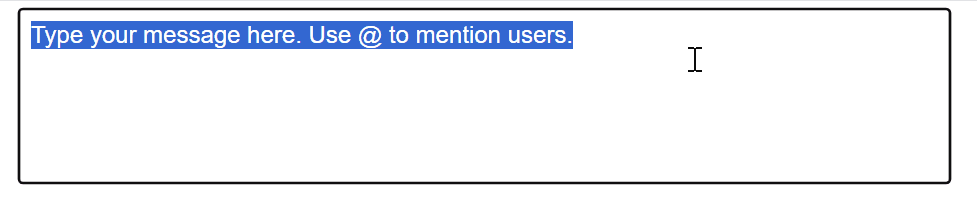

# getSelectionBoundingClientRect()

## Authors:

- [Ana Sollano Kim](https://github.com/anaskim)
- [Andres Regalado Rosas](t-andresre@microsoft.com)

## Participate
- [WHATWG tracking issue](https://github.com/whatwg/html/issues/10614)
- [CSSWG issue tracking initial discussions](https://github.com/w3c/csswg-drafts/issues/10346)
- [TPAC 2024 WHATWG meeting minutes where group supports getSelectionBoundingClientRect()](https://github.com/whatwg/meta/issues/326#issuecomment-2377500295)

## Introduction

It is common for editors to place a popup beneath the user's current caret to provide contextual auto-complete information. Currently, developers resort to cloning the element and copying its style to determine the caret's position in `<textarea>` and `<input>` elements, which is difficult to maintain and may have a performance impact on the web application. This proposal aims to solve the problem of obtaining the bounding rectangle of the current text selection or caret position for `<textarea>` and `<input>` elements by introducing a new API, `getSelectionBoundingClientRect()`.

## User-Facing Problem

This API's main use case is placing a popup near the caret when the user presses a certain key, as shown in the following GIF.



Web developers have two options to implement this today:

### Cloning the form control element and copying styles into a `<div>`

If web authors already use a `<textarea>` and/or an `<input>` element in their applications, they might:
1. Clone the elements as `<div>`s,
2. Copy layout-affecting styles
3. Use `<div>` to get a `Range` and call `getBoundingClientRect()`.

This is roughly the sample code from the example above, some functionality is omitted for brevity:

```html
<form id="messageForm" onsubmit="return handleSubmit(event)">
    <textarea id="messageArea" name="message" required placeholder="Type your message here. Use @ to mention users."></textarea>
    <div id="userList"></div>
    <div id="measuringDiv"></div>
    <button type="submit">Submit</button>
</form>
```

Cloning the `<textarea>` and copying relevant styles from `<textarea>` to measuring `<div>` and getting the coordinates to position the popup:

```js
// Copy relevant styles from textarea to measuring div
function copyStyles() {
    const styles = window.getComputedStyle(textarea);
    const relevantStyles = [...];
    relevantStyles.forEach(style => {
        measuringDiv.style[style] = styles[style];
    });
    ensureWordWrapMatches();
}

function getCaretCoordinates() {
    const text = textarea.value;
    const caretPos = textarea.selectionStart;
    // Create a copy of the content up to the caret
    const textBeforeCaret = text.substring(0, caretPos);
    // Copy styles before measuring
    copyStyles();
    // Set content and create a range
    measuringDiv.textContent = textBeforeCaret;
    // Add a span where the caret would be
    const caretSpan = document.createElement('span');
    caretSpan.textContent = '|';
    measuringDiv.appendChild(caretSpan);
    // Position the div over the textarea to measure
    measuringDiv.style.visibility = 'hidden';
    measuringDiv.style.position = 'fixed';
    document.body.appendChild(measuringDiv);
    // Get the position of the caret span
    const caretRect = caretSpan.getBoundingClientRect();
    const textareaRect = textarea.getBoundingClientRect();
    // Clean up
    measuringDiv.textContent = '';
    // Return coordinates relative to the viewport
    return {
        left: textareaRect.left + (caretRect.left - measuringDiv.getBoundingClientRect().left),
        top: textareaRect.top + (caretRect.top - measuringDiv.getBoundingClientRect().top),
        height: caretRect.height
    };
}

textarea.addEventListener('input', (e) => {
    const caretPos = textarea.selectionStart;
    const text = textarea.value;
    // Check if the last character typed was @
    if (text[caretPos - 1] === '@') {
        const coords = getCaretCoordinates();
        // Position and show the user list
        userList.style.left = `${coords.left}px`;
        userList.style.top = `${coords.top + coords.height}px`;
        userList.style.display = 'block';
        populateUserList();
    } else {
        userList.style.display = 'none';
    }
});

// Initial style copy
copyStyles();
// Handle window resize
window.addEventListener('resize',copyStyles);
```

### Using `contenteditable` `<div>`

Using a `<div contenteditable>` to handle text directly can pose challenges in some applications. Web authors may need to implement additional behaviors to match those of `<textarea>` and `<input>`, such as form integration, consistent behavior across browsers, and accessibility.

This is roughly the sample code from the example above, some functionality is omitted for brevity:

```html
<form id="messageForm" onsubmit="returnvalidateAndSubmit(event)">
    <!-- Hidden input for form validation -->
    <input type="hidden" id="hiddenContent" name="message" required>
    <div contenteditable="true" id="nameField">Type your message here. Use @ to mention users.</div>
    <div id="userList"></div>
    <button type="submit">Submit</button>
</form>
```

Event listener of `contenteditable` `<div>`:

```js
nameField.addEventListener('input', (e) => {
    const selection = document.getSelection();
    const text = nameField.textContent;
    const position = selection.getRangeAt(0).startOffset;
    // Check if the last character typed was @
    if (text[position - 1] === '@') {
        const range = selection.getRangeAt(0);
        const rect = range.getBoundingClientRect();
        // Position and show the user list
        userList.style.left = `${rect.left}px`;
        userList.style.top = `${rect.bottom + 5}px`;
        userList.style.display = 'block';
        populateUserList();
    } else {
        userList.style.display = 'none';
    }
    // Update hidden input for form validation
    updateHiddenInput();
});
```

### Goal

Provide a more direct way of getting the selection bounds inside the `<textarea>` and `<input>` elements.

### Non-goals

- Provide a more direct way of getting the selection bounds to any other elements that aren't `<textarea>` or `<input>`, as the current Selection and Range APIs can be used to get the bounding client rectangle (`getBoundingClientRect()` in `Range`).
- Expand the Range API to accommodate obtaining selection bounds inside `<textarea>` and `<input>` elements.

## Proposed Approach

The `getSelectionBoundingClientRect()` will be introduced to obtain the bounding rectangle of the current text selection inside `<textarea>` and `<input>`. The bounding rectangle
is the caret rectangle if the selection is collapsed. If there is no selection in the `<textarea>` or `<input>`, it will return an empty rectangle.

The following sample code showcases how the new `getSelectionBoundingClientRect()` API would solve the main use case laid out in the [User-Facing Problem](#user-facing-problem) section.

```html
<form id="messageForm" onsubmit="return handleSubmit(event)">
    <textarea id="messageArea" name="message" required placeholder="Type your message here. Use @ to mention users."></textarea>
    <div id="userList"></div>
    <button type="submit">Submit</button>
</form>
```

Event listener for `<textarea>`:

```js
textarea.addEventListener('input', (e) => {
    const caretPos = textarea.selectionStart;
    const text = textarea.value;
    // Check if the last character typed was @
    if (text[caretPos - 1] === '@') {
        // Get the caret position using the proposed API
        const rect = textarea.getSelectionBoundingClientRect();
        // Position and show the user list
        userList.style.left = `${rect.left}px`;
        userList.style.top = `${rect.bottom}px`;
        userList.style.display = 'block';
        populateUserList();
    } else {
        userList.style.display = 'none';
    }
});
```

This implementation simplifies obtaining the caret's position, provides better form integration, and ensures more consistent behavior across browsers. The `getSelectionBoundingClientRect()` API eliminates the need for cloning elements and copying styles (improving performance) while maintaining the benefits of using native form controls (accessibility, built-in form validation, etc.)

As we want the `getSelectionBoundingClientRect()` API to be aligned with the current selection APIs for `<textarea>` and `<input>` elements, such as [`select()`](https://html.spec.whatwg.org/#the-textarea-element:dom-textarea/input-select), [`selectionStart`](https://html.spec.whatwg.org/#the-textarea-element:dom-textarea/input-selectionstart), and [`selectionEnd`](https://html.spec.whatwg.org/#the-textarea-element:dom-textarea/input-selectionend), the `<input>` types in which it will be available are listed in the [do not apply](https://html.spec.whatwg.org/multipage/input.html#do-not-apply) section:

- Text
- Search
- Telephone
- URL
- Password

Sample code for `<input type="text">`:

```html
<input type="text" id="messageInput" placeholder="Type a message..." />
<div id="emojiPicker"></div>
```

Event listener for `<input>`:

```js
input.addEventListener('input', (e) => {
    const cursorPos = input.selectionStart;
    const text = input.value;
    
    // Show emoji picker when user types ':'
    if (text[cursorPos - 1] === ':') {
        // Get the caret position using the proposed API
        const rect = input.getSelectionBoundingClientRect();
        // Position the emoji picker under the caret
        emojiPicker.style.position = 'fixed';
        emojiPicker.style.left = `${rect.left}px`;
        emojiPicker.style.top = `${rect.bottom}px`;
        emojiPicker.style.display = 'block';
    } else {
        emojiPicker.style.display = 'none';
    }
});
```

## Alternative considered

Apart from the solutions described in the [User-Facing Problem](#user-facing-problem) section, we have also considered the following alternative:

### `currentCaretPosition()` as part of `Element`

An alternative approach considered was adding a `currentCaretPosition()` method to the `Element` interface:

```webidl
partial interface Element {
  CaretPosition? currentCaretPosition();
};
```

This method would return a `CaretPosition` object containing information about the currently visible caret of the node if it were an active element. If it didn't have a visible caret, it would return null.

While this approach could work, `getSelectionBoundingClientRect()` was chosen as the better solution for the following reasons:

1. **API Consistency and Integration**:
    - Follows the same input type restrictions as `selectionStart` and `selectionEnd` (text, search, tel, url, password).
    - Works with both collapsed (caret) and non-collapsed (range) selections.
    - Follows the same state handling rules:
        - Returns an empty `DOMRect` when there is no selection.
        - Respects the element's disabled state and read-only attributes.
        - Follows the established naming pattern of `getBoundingClientRect()`, making it familiar to web developers.
    - Returns a `DOMRect`, which is a well-understood interface used throughout the web platform.
    - Maintains consistency with how selection-related functionality is exposed on form controls:
        - Lives directly on the form control elements (`HTMLInputElement` and `HTMLTextAreaElement`) like other selection methods.
        - Does not require accessing a separate `Selection` or `Range` object unlike `contenteditable` elements.

2. **Scope and Specificity**:
    - `currentCaretPosition()` being on `Element` would imply broader functionality than necessary.
    - Would require implementing the method for all `Element` types, even those where it doesn't make sense.
    - A more general-purpose API isn't needed since selection/range APIs already work well for other elements.

## Other Considerations

### Accessibility

- `getBoundingClientRect()` does not introduce new accessibility concerns as it only exposes information that is already visually available to users.

### Privacy

- The API only exposes caret/selection position information within form controls where such exposure is already available through existing selection APIs.
- Returns coordinates relative to the viewport, consistent with existing `getBoundingClientRect()` behavior.

### Security
- It is limited in scope as it only works on specific form control types.
- Follows the same security model as existing selection APIs:
  - Respects the element's disabled state and read-only attributes.
  - Only functions when the element has focus.
  - Returns empty rectangle when there is no selection.
- For password fields:
  - Selection position information is already available through existing APIs.

## Stakeholder Feedback / Opposition

- Chromium: Positive
- WebKit: Positive based on https://github.com/whatwg/meta/issues/326#issuecomment-2377500295 (API for visible caret position in textarea/input discussion)
- Gecko: Positive based on https://github.com/whatwg/meta/issues/326#issuecomment-2377500295 (API for visible caret position in textarea/input discussion)

[Concluded that the group supports `getSelectionBoundingClientRect()` API](https://github.com/whatwg/html/issues/10614#issuecomment-2383760604)

## References & acknowledgements

Many thanks for valuable feedback and advice from:

- [Daniel Clark](https://github.com/dandclark)
- [Keith Cirkel](https://github.com/keithamus)
- [Leo Lee](https://github.com/leotlee)
- [Mike Jackson](https://github.com/mwjacksonmsft)
- [Sanket Joshi](https://github.com/sanketj)
- [Siye Liu](https://github.com/siliu1)
