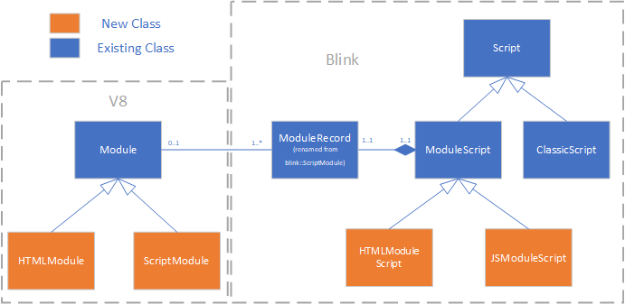

# HTML Modules Design Document

## Contact emails

daniec@microsoft.com, sasebree@microsoft.com, travil@microsoft.com, pcupp@microsoft.com

## Introduction

We are proposing an extension of the ES6 Script Modules system to include HTML Modules.  For a high-level description of HTML modules and the motivation for them see the associated [explainer doc](https://github.com/w3c/webcomponents/blob/gh-pages/proposals/html-modules-explainer.md).

This document aims to describe of how we plan to implement HTML modules in Blink and V8.

## V8 changes

Currently the [v8::internal::Module](https://cs.chromium.org/chromium/src/v8/src/objects/module.h) class is V8's representation of a [Source Text Module Record](https://tc39.github.io/ecma262/#sec-source-text-module-records), which represents information about a Script Module such as its RequestedModules, its status ("uninstantiated", "instantiating", etc), and its imports/exports.
We will introduce two subclasses, ScriptModule and HTMLModule.  ScriptModule will contain the functionality specific to Script Modules that currently resides in Module, and HTMLModule will contain the new HTML module code.  Common functionality will remain in Module, which can now be considered as roughly equivalent to the spec's [Cyclic Module Record](https://tc39.github.io/ecma262/#sec-source-text-module-records) base type.

Module will contain the following new field to distinguish whether it is a ScriptModule or HTMLModule:

``` C++
  DECL_INT_ACCESSORS(type)
  enum Type {
    kScript,
    kHTML
  };
```

HTMLModule will contain the following new fields in addition to those inherited from Module:

```C++
  // If this is an HTMLModule, this is the Document for the module.
  // For a ScriptModule, this is unused.
  DECL_ACCESSORS(document, Object)

  // Used for HTML Modules.  Each HTMLScriptElement in the module's document has
  // a corresponding script entry in this array.
  DECL_ACCESSORS(script_entries, FixedArray)
```

script_entries is an array of HTMLModuleScriptEntry, another class introduced to support HTML modules.  Each script element in an HTML module corresponds to a single HTMLModuleScriptEntry.  An HTMLModuleScriptEntry has 3 fields:

```C++
  DECL_BOOLEAN_ACCESSORS(is_inline)
  DECL_ACCESSORS(module_record, Object)
  DECL_ACCESSORS(source_name, Object)
```

Inline `<script>` elements will have an associated HTMLModuleScriptEntry with `is_inline == true` and `module_record` set to the ScriptModule associated with that `<script>` element.
External script elements will have an associated HTMLModuleScriptEntry with `is_inline == false` and `source_name` set to the value of the src attribute of the `<script>` element.  The `module_record` for this HTMLModuleScriptEntry will be filled in later during module graph instantiation.  Note that the data for these fields are provided from Blink when the HTMLModuleScriptEntries are constructed; V8 doesn't actually have any knowledge of the `<script>` elements or the structure of the HTML module's Document.

The following is an overview of the algorithms for HTMLModule instantiation, evaluation, and import/export resolution.  These will generally be implemented in HTMLModule overrides of Module functions, with their counterpart implementations remaining unchanged in ScriptModule (Module::PrepareInstantiate, Module::ResolveExport, etc).  These descriptions are adapted from this document of [proposed HTML module spec changes](https://github.com/w3c/webcomponents/blob/gh-pages/proposals/html-module-spec-changes.md).

- **Module Construction:** Construction of HTMLModules will differ from ScriptModules.  ScriptModule creation follows the algorithm specified in [ParseModule](https://tc39.github.io/ecma262/#sec-parsemodule), which describes how the module should be created based on the result parsing the module as JavaScript.  In V8, this process results in a ModuleInfo which is used in [Factory::NewModule](https://cs.chromium.org/chromium/src/v8/src/heap/factory.cc?dr=CSs&g=0&l=3195) to populate the fields of a new ScriptModule.  For HTMLModule, we'll introduce Factory::NewHTMLModule to create an HTML Module from these inputs, obtained from the result of parsing the HTMLDocument on the HTML5 side:
* The module's HTMLDocument `document`.
* 3 vectors, where the `i`th entry in each corresponds to the `i`th `<script>` element in `document`.
    * `is_inline`: `is_inline[i] == true` if the `i`th `<script>` in `document` is inline, `false` if it is external.
    * `source_urls`: `source_urls[i]` is the `i`th `<script>`'s source URL if that script is external, null otherwise.
    * `v8_modules`: `v8_modules[i]` is the `i`th `<script>`s module record if that script is inline, null otherwise.

  The contents of the above vectors will be used to initialize the HTMLModuleScriptEntries for the new HTMLModule.
- **Module Instantiation:** HTMLModules don't have a lexical environment to set up, so there will be no need for an equivalent to  [ModuleDeclarationEnvironmentSetup](https://tc39.github.io/ecma262/#sec-moduledeclarationenvironmentsetup) in PrepareInstantiate/FinishInstantiate.  Note that the _‘export * from all inline script elements’_ functionality is performed in our redefined [ResolveExport](https://tc39.github.io/ecma262/#sec-resolveexport) below.
- **Export Resolution:** HTMLModule will implement a modified version of [ResolveExport](https://tc39.github.io/ecma262/#sec-resolveexport)(*exportName*, *resolveSet*), overriding Module::ResolveExport.  This function’s purpose is to “resolve an imported binding to the actual defining module and local binding name”.  For HTMLModules, instead of looking for local exports etc. we’ll iterate through each inline script and export their contents as for an _‘export *’_.  We redefine as follows:
  - 1\.	Let *module* be this HTMLModule.
  - 2\.	For each Record { [[Module]], [[ExportName]] } *r* in resolveSet, do
    - a\.	If *module* and *r*.[[Module]] are the same Module Record and SameValue(*exportName*, *r*.[[ExportName]]) is true, then
      - i\. Assert: This is a circular import request.
      - ii\. Return null.
  - 3\. Append the Record { [[Module]]: *module*, [[ExportName]]: *exportName* } to resolveSet.
  - 4\.	If SameValue(*exportName*, "default") is true, then
    - a\.	Return the HTMLDocument associated with this HTMLModule.
    - b\.	NOTE: I assume here that we’re not trying to pass through default exports of the inline scripts.
  - 5\.	Let *starResolution* be null.
  - 6\.	For each HTMLModuleScriptEntry record *se* in *module*.[[RequestedModules]], do:
    - a\.	If *se*.[[IsInline]] == false, continue to next record.
    - b\.	Let *importedModule* be *se*.[[ModuleRecord]]).
    - c\.	Let *resolution* be ? importedModule.ResolveExport(*exportName*, *resolveSet*).
    - d\.	If *resolution* is "**ambiguous**", return "**ambiguous**".
    - e\.	If *resolution* is not null, then
      - i\.	Assert: *resolution* is a ResolvedBinding Record.
      - ii\. If *starResolution* is null, set *starResolution* to *resolution*.
      - iii\. Else,
        - a\. Assert: There is more than one inline script that exports the requested name.
        - b\.	Return "**ambiguous**".
  - 7\. Return *starResolution*.

- **Module Execution:** HTMLModule will implement a modified version of [InnerModuleEvaluation](https://html.spec.whatwg.org/#fetch-the-descendants-of-a-module-script)(*module*, *stack*, *index*).  For ScriptModules, the idea of this method is to recurse for each child module, then execute the JS of the current module.  HTMLModules don't have any code of their own to execute -- instead, they just recurse into their RequestedModules (i.e., the `<script>` elements in the module's HTMLDocument).  In spec language, the algorithm has the following changes from the ScriptModule version:
  - Change step 10 and step 10a to be the following, to account for the different structure of HTMLModule vs ScriptModule.  Steps 10b-10f remain the same:
    - 10\. For each HTMLModuleScriptEntry *se* in *module*.[[RequestedModules]]), do:
      - a\. If (*se*.[[IsInline]] == true), let *requiredModule* be *se*.[[ModuleRecord]], else let *requiredModule* be HostResolveImportedModule(*module*, *se*.[[SourceName]])
   - Omit step 11 (since the HTML module doesn’t have any JS code of its own to run; it only recurses to run the code of its requested modules per step 10).

## Blink Changes

We will introduce the new classes blink::HTMLModuleScript and blink::JSModuleScript, both deriving from the existing blink::ModuleScript.



The JavaScript-specific bits of ModuleScript will be pushed down to the derived JSModuleScript, but ModuleScript will otherwise remain the same, containing data and functionality common to both module types.  We anticipate that as other module types are introduced, further corresponding derivations of ModuleScript will be added.

Most existing code in Modulator, ModuleMap, and ModuleTreeLinker will continue to work with ModuleScript, with updates to ensure that they are properly generalized to both HTML and JS modules.

We will also rename the [ScriptModule](https://cs.chromium.org/chromium/src/third_party/blink/renderer/bindings/core/v8/script_module.h?type=cs&q=scriptmodule&g=0&l=31) class to ModuleRecord.  ModuleRecord better reflects the usage of the class as Blink's handle to the [ModuleRecord](https://tc39.github.io/ecma262/#sec-abstract-module-records) of the given module, and the old ScriptModule name was confusing when we also have a class named ModuleScript.

### ModuleScriptLoader

[ModuleScriptLoader](https://cs.chromium.org/chromium/src/third_party/blink/renderer/core/loader/modulescript/module_script_loader.h?type=cs&q=modulescriptloader&g=0&l=33) will still have the responsibility for managing the fetching and construction of a given module, now generalized to support both JS modules and HTML modules.  It will now use the HTTP response header's Content-Type to determine whether a given module is created as HTML or JavaScript, as follows:

```C++
if (mime_type == "text/html") {
  // Create HTMLModuleScript
} else if (MIMETypeRegistry::IsSupportedJavaScriptMIMEType(mime_type)) {
  // Create JSModuleScript
} else {
  // Refuse to create a module, and emit an error that 'text/html' or a JavaScript MIME-type is required.
}
```

Note: per spec discussion [here](https://github.com/w3c/webcomponents/issues/742) a new MIME type may be introduced for HTML modules instead of reusing `text/html`.

ModuleScriptLoader will continue to delegate to ModuleScriptFetcher to perform the actual fetch, and ModuleScriptFetcher will continue to deliver a ModuleScriptCreationParams back to ModuleScriptLoader upon fetch completion.  A MIME type will be added to ModuleScriptCreationParams so that it can be used by ModuleScriptLoader to determine which type of module to create.

DocumentModuleScriptFetcher will be updated so that it doesn't block a response with a `text/html` MIME type.  Other ModuleScriptFetcher derived classes will remain unchanged as we still want to block `text/html` for Workers, ServiceWorkers, etc.

### HTML Module Parsing

When a ModuleScriptLoader instance determines that the result of a fetch should be processed as an HTML module, it will instantiate a new HTMLDocument with a new DocumentClass flag marking it as an HTML module document.  A DocumentParser instance will be connected to it and fed the contents of the file fetched by the ModuleScriptLoader.  The parser will follow the standard HTML5 parsing rules, with a few differences.  Firstly, if a script without `type="module"` is encountered the parser will terminate with an error that will prevent the HTML Module Record from being created (note: or we may decide instead to coerce these to `type="module"`; see discussion [here](https://github.com/w3c/webcomponents/issues/798)).  Secondly, when  `<script>` elements (of `type="module"`) are encountered, they are logged in an HTMLModuleScriptEntry list that records the following for each `<script>`:

* is_inline: is this an inline script or an external script
* module: if this is an inline script, then this is the ModuleScript itself
* specifier: if this is an external script, then this is its URL specifier.

Specifically, parsing an HTML module document will follow these changes to the normal rules:

* When an inline module `<script>` element is encountered, instead of creating a PendingScript for it and calling FetchDescendants, we will log it as an entry in the HTMLModuleScriptEntry list noted above.
* When an external module `<script>` element is encountered, instead of calling FetchModuleScriptTree, we will log its URL in an entry in the HTMLModuleScriptEntry list noted above.
* When a non-module `<script>` element is encountered, an error will be logged.  ModuleScriptLoader will check for this error and skip creation of the module record if it is encountered (this result is analogous to a Script Module that has a parse error).

Once parsing completes, the resulting HTMLDocument and the HTMLModuleScriptEntry list will be used to instantiate a new HTMLModule.

### ModuleTreeLinker

Changes to [ModuleTreeLinker](https://cs.chromium.org/chromium/src/third_party/blink/renderer/core/loader/modulescript/module_tree_linker.h?q=ModuleTreeLinker&dr=CSs&l=21) will be minor and will mostly involve generalizing the algorithms such that they can handle the different structure of HTML modules, e.g. ensuring that ModuleTreeLinker::FetchDescendants treat an HTML module's inline child scripts correctly.  For these there is nothing to fetch (since they have no URL and already have a Module Record created for them), but we still must recurse into them such that their descendants are fetched.

### import.meta.document support

To support import.meta.document we will make the following changes:

* JSModuleScript will have a new `Member<Document> document_for_inline_module_` field.  For inline script elements in an HTML module, this will be populated with the HTML Module's Document at construction time of the ModuleScript.
* A new `Persistent<Document> document_for_inline_module_` field will be added to the [ModuleImportMeta](https://cs.chromium.org/chromium/src/third_party/blink/renderer/core/script/module_import_meta.h?dr=CSs&q=moduleimportmeta&g=0&l=15) class, populated in [ModulatorImplBase::HostGetImportMetaProperties](https://cs.chromium.org/chromium/src/third_party/blink/renderer/core/script/modulator_impl_base.cc?type=cs&q=moduleimportmeta&g=0&l=178) from the document_for_inline_module_ of the ModuleScript from which the ModuleImportMeta is being created.
* [blink::HostGetImportMetaProperties](https://cs.chromium.org/chromium/src/third_party/blink/renderer/bindings/core/v8/v8_initializer.cc?q=HostGetImportMetaProperties&dr=CSs&l=601) will be extended to define the "document" property on the passed in `v8::Local<v8::Object> meta`, using the ModuleImportMeta's document_for_inline_module_.
