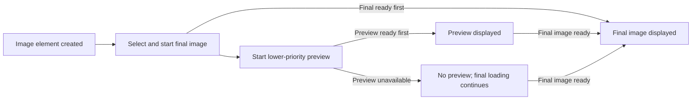

# Image Preview for HTML Images

## Status of this Document

- **Status:** Active draft
- **Draft focus:** A minimal core proposal with optional capabilities separated for independent incubation.
- **Proposed incubation venue:** [WICG](https://wicg.io/)
- **Expected standards venue:** [WHATWG HTML](https://html.spec.whatwg.org/)
- **Current version:** This draft
- **Last updated:** 2026-09-07

## Authors

- [Olga Gerchikov](mailto:gerchiko@microsoft.com)
- [Alex Russell](mailto:alexrussell@microsoft.com)

## Participate

- **Issue tracker:** [Image Preview issues](https://github.com/MicrosoftEdge/MSEdgeExplainers/labels/Image%20Preview)
- **File a new issue:** [Image Preview issue template](https://github.com/MicrosoftEdge/MSEdgeExplainers/issues/new?template=image-preview.md)

## Table of Contents

- [Status of this Document](#status-of-this-document)
- [Authors](#authors)
- [Participate](#participate)
- [Introduction](#introduction)
- [User-Facing Problem](#user-facing-problem)
  - [How authors provide previews today](#how-authors-provide-previews-today)
  - [Goals](#goals)
  - [Non-goals](#non-goals)
- [Core Proposal](#core-proposal)
  - [Scope and responsive images](#scope-and-responsive-images)
  - [A low-resolution image preview](#a-low-resolution-image-preview)
  - [Fetching, scheduling, and HTML integration](#fetching-scheduling-and-html-integration)
  - [Preview lifecycle](#preview-lifecycle)
  - [Lifecycle decisions](#lifecycle-decisions)
  - [Source updates and image generations](#source-updates-and-image-generations)
  - [Image element state and rendering](#image-element-state-and-rendering)
  - [Compatibility and fallback](#compatibility-and-fallback)
- [Optional Capabilities](#optional-capabilities)
  - [Compact encoded preview formats](#compact-encoded-preview-formats)
  - [Customizable preview transitions](#customizable-preview-transitions)
  - [Script observability](#script-observability)
- [Alternatives considered](#alternatives-considered)
  - [CSS property for the preview source](#css-property-for-the-preview-source)
  - [Imperative-only image API](#imperative-only-image-api)
  - [Reuse the `poster` attribute](#reuse-the-poster-attribute)
  - [Progressive and incrementally decoded images](#progressive-and-incrementally-decoded-images)
  - [Native compact decoding without a managed lifecycle](#native-compact-decoding-without-a-managed-lifecycle)
  - [Author-scripted scoped View Transition](#author-scripted-scoped-view-transition)
  - [Script-provided fallback decoder](#script-provided-fallback-decoder)
- [Accessibility, Internationalization, Privacy, and Security Considerations](#accessibility-internationalization-privacy-and-security-considerations)
  - [Accessibility](#accessibility)
  - [Internationalization](#internationalization)
  - [Privacy](#privacy)
  - [Security](#security)
- [Stakeholder Feedback / Opposition](#stakeholder-feedback--opposition)
- [References & acknowledgements](#references--acknowledgements)
  - [Specifications and guidance](#specifications-and-guidance)
  - [Compact preview formats](#compact-preview-formats)
  - [Implementation evidence](#implementation-evidence)
  - [Acknowledgements](#acknowledgements)
- [Appendix](#appendix)
  - [Core API definition](#core-api-definition)
    - [WebIDL](#webidl)
  - [Deferred transition extension sketch](#deferred-transition-extension-sketch)
    - [CSS](#css)
  - [Preview examples](#preview-examples)

## Introduction

**Image Preview lets a page provide a lightweight preview for an HTML image.** The browser shows the preview while the final image loads, then replaces it directly with the final image. This moves common preview decoding, lifecycle, and replacement behavior from site-specific code into the browser.

Authors set the preview with a new `previewsrc` attribute on ``. Existing `src`, `srcset`, and `sizes` behavior continues to select the final image.

The core proposal does not depend on new image formats, View Transitions, or script-visible transition state. Compact preview formats and customizable transitions are described as optional capabilities that can be specified and implemented independently.

```html

```

## User-Facing Problem

When an image is slow to load, the user can see an empty region without enough information to understand what will appear there. This is common on slow connections and image-heavy pages.

Sites can show previews today, but each site must build its own solution. Current approaches use a CSS background on the final image, replace the `src` of one image, or stack a decoded canvas with the final image. The site must also manage decoding, replacement, source changes, and any transition.

**Example scenario:** A user opens a photo gallery on a slow connection. The page knows a small preview for each photo. With Image Preview, the browser can show those previews in the image elements and replace each one as its final image becomes ready.

This feature is meant both to improve website performance and to make image previews easier to build. Users can see useful image content sooner, while authors can rely on native behavior instead of maintaining custom markup, decoding, source-change handling, and replacement logic. Authors that need an animated handoff could use the optional transition extension.

### How authors provide previews today

The table below describes the major patterns used by current implementations. Representative examples are provided in the [appendix](#preview-examples).

| Pattern | Format | How it works | Examples and evidence |
| --- | --- | --- | --- |
| Pattern 1 — CSS background preview with final image overlay | Base64 8×8 BMP; tiny JPEG embedded in SVG; BlurHash-derived WebP; ThumbHash-derived PNG | Set the preview as the CSS background of the final `` or its wrapper. The final image paints over it or becomes opaque after loading. | [Unsplash](https://unsplash.com/); [Next.js `<Image>`](https://image-component.nextjs.gallery/placeholder); [Jesus Film with Next.js](https://github.com/JesusFilm/core/blob/b2825dcb70a75b12a01f536b2f4b9c5637e8c6e8/libs/journeys/ui/src/components/Image/Image.tsx); [Tommy Chow homepage gallery preview](https://tommychow.com/) |
| Pattern 2 — Decoded compact hash canvas | BlurHash decoded to canvas pixels | Decode the hash in script and paint it into a canvas occupying the image's display area. Load the final `` independently; after it loads or decodes, reveal it and hide or remove the canvas. | [Minds](https://www.minds.com/newsfeed/1565424642032668690); [Mastodon](https://github.com/mastodon/mastodon/blob/main/app/javascript/mastodon/components/blurhash.tsx); [Misskey](https://github.com/misskey-dev/misskey/blob/b3ce198f4c55ace4daeba4cb1858b3a85bc9529b/packages/frontend/src/components/MkImgWithBlurhash.vue); [Nextcloud Talk](https://github.com/nextcloud/spreed/blob/030f4ae2bd69e30077ad7dbac428ace1e9a325d2/src/components/MessagesList/MessagesGroup/Message/MessagePart/FilePreview.vue); [Jellyfin Vue](https://github.com/jellyfin/jellyfin-vue/blob/63edc21f2787706d094a190c93bdc97edd5c233e/packages/frontend/src/components/Layout/Images/Blurhash/BlurhashImage.vue) |
| Pattern 3 — Single-image source replacement | Cloudinary-transformed raster image; Cloudinary selects the delivered format automatically | Assign the placeholder URL to one ``, preload the final resource, and replace the same element's `src`. | [Cloudinary training tool](https://cloudinary-training.github.io/cld-intro-react-sdk-training-tool/#/placeholder); [Cico Jazz hero](https://cicojazz.de/#hero); [Cloudinary plugin source](https://github.com/cloudinary/frontend-frameworks/blob/9a05f3571fec1a3d0ecc66a899db1833d326c094/packages/html/src/plugins/placeholder.ts#L10-L108) |
| Pattern 4 — Progressive stacked preview layers | BlurHash, small thumbnail, and larger preview | Stack progressively better representations and fade in each layer after it loads. | [Nextcloud Photos](https://github.com/nextcloud/photos/blob/d12a25def30bf568d5e36339bea645203f7dba62/src/components/FileComponent.vue) |

### Goals

- Show useful image content before the final image is ready.
- Use one `` for both the preview and final image.
- Support low-resolution previews using existing image formats and image-processing pipelines.
- Keep final-image selection in `src`, `srcset`, and `sizes`.
- Let the browser manage the preview lifecycle, reducing the need for custom markup and script.
- Never delay final-image discovery or request creation, and minimize network contention with the final image.
- Keep the final image and page usable when a preview format is unsupported.
- Allow separately specified image formats and transition mechanisms to build on the core lifecycle without changing the `previewsrc` API.

### Non-goals

- Generate a preview from the final image.
- Replace responsive image selection.
- Replace `loading`, `decoding`, or `fetchpriority`.
- Define skeleton or shimmer loading UI.
- Give the preview separate alternative text or separate semantics.
- Guarantee that a preview is displayed when the final image becomes ready first.
- Define compact preview image formats.
- Define an animated handoff or expose preview lifecycle state to script.

## Core Proposal

Add a URL-valued `previewsrc` attribute to ``.

The preview is temporary visual content for the image. It is painted in the same image element. The final resource continues to come from the existing image source attributes.

The proposal is divided along specification and implementation boundaries:

| Capability | Scope | Intended venue |
| --- | --- | --- |
| `previewsrc` and `previewSrc` | Core | WHATWG HTML |
| Preview fetching, decoding, display, replacement, and cancellation | Core | WHATWG HTML |
| Compact encodings such as BlurHash or ThumbHash | Independent image formats | Their respective format specifications and registrations |
| Animated and author-customizable replacement | Optional extension | CSS View Transitions |
| Script-visible preview or handoff state | Deferred pending demonstrated use cases | To be determined |

When the final image is ready, the browser directly replaces the preview. An implementation can support a separately specified customizable transition, but transition support is not required to fetch, decode, display, or replace a preview.

### Scope and responsive images

The core proposal applies only to HTML ``. It does not add attributes to `<source>`, `<input type="image">`, SVG `<image>`, `<object>`, or `<embed>`.

An `` inside `<picture>` can use `previewsrc`, but the preview belongs to the `` rather than to an individual `<source>`. The existing `<picture>`, `srcset`, and `sizes` algorithms continue selecting the final image. Version 1 deliberately provides one non-responsive preview URL and does not define `previewsrcset` or `previewsizes`.

The preview should therefore represent every final candidate that the `<picture>` or `srcset` can select. If art direction, localization, writing direction, color scheme, or another condition changes the image's subject materially, the author should use a neutral preview suitable for every candidate or omit `previewsrc`. Responsive preview selection can be considered as a later extension if implementation experience demonstrates that one preview is insufficient.

```html

```

The proposed flow is:



**Text alternative:** The browser selects and starts the final image before starting a lower-priority preview. The requests can then proceed independently for the same image element. If the preview is ready first, the browser displays it. When the final image becomes ready, the browser replaces the preview directly. If the final image is ready first, the browser displays it without waiting. Preview unavailability does not stop final-image loading.

### A low-resolution image preview

An author can use a small, low-resolution JPEG, WebP, or AVIF image as the preview:

```html

```

The browser uses `previewsrc` for the preview. It uses the existing responsive-image algorithm to select the final image from `srcset` and `sizes`.

The preview can also be an inline data URL:

```html

```

Inlining avoids a separate preview request, but increases the size of the containing document.

### Fetching, scheduling, and HTML integration

`previewsrc` is a URL-valued content attribute reflected by the `previewSrc` `USVString` property using the same URL-reflection behavior as `src`. Reading `previewSrc` returns the resolved absolute URL, while `getAttribute("previewsrc")` returns the serialized attribute value. A missing or empty `previewsrc` means that the element has no preview. Removing or emptying the attribute makes pending preview work obsolete and allows the browser to cancel it.

Preview processing is integrated into HTML's existing [update the image data](https://html.spec.whatwg.org/multipage/images.html#update-the-image-data) processing model:

1. The browser selects the final image from `src`, `srcset`, `<picture>`, and `sizes`, and creates or updates the final-image request without waiting for the preview.
2. If the element has a non-empty `previewsrc` and is eligible to load, the browser resolves it against the document base URL and may create a separate preview request.
3. Preview and final requests are associated with the same invocation of the image-data update algorithm so that a result from an older invocation cannot replace content from a newer one.

The final image's discovery, selection, and request creation must not wait for preview fetching or decoding. When both require network work, the preview uses a lower internal priority than the final image. This minimizes contention but does not guarantee that an additional request consumes no bandwidth.

The element's `fetchpriority` and `decoding` attributes continue to describe the final image. Version 1 adds no preview-specific priority control: preview decoding is asynchronous and best-effort. The browser may skip the preview when the final image is already available or is expected to become ready before the preview would be useful.

The preview is fetched with destination `image` and follows the `` element's existing URL, `crossorigin`, credentials, `referrerpolicy`, Content Security Policy `img-src`, mixed-content, cookie, HTTP cache, network-partitioning, and service-worker interception rules. A separately fetched preview produces a Resource Timing entry under the rules for image requests, with `initiatorType` equal to `"img"`. The preview URL is not exposed through `currentSrc`.

### Preview lifecycle

The proposed end-to-end flow is:

1. The browser selects and starts the final-image request using existing image rules.
2. If eligible, it resolves and starts the lower-priority preview request independently.
3. If the preview becomes ready to paint while the final image is still pending, the browser displays the preview in the ``.
4. When the final image becomes ready to paint, the browser directly replaces the preview with the final image.
5. If the final image becomes ready first, the browser displays it without waiting and makes preview work obsolete.
6. A skipped, blocked, unsupported, malformed, or failed preview does not stop or alter final-image loading.

The existing `load` and `error` events describe the final image, not the preview.

### Lifecycle decisions

- **Lazy loading:** Preview fetching follows the final image's `loading="lazy"` eligibility and must not start merely because `previewsrc` is present. Once the image becomes eligible, preview and final processing follow the scheduling rules above.
- **Final-image failure:** If the final image fails, the browser stops displaying the preview and uses the element's normal broken-image and alternative-text rendering. A preview is temporary and cannot become successful fallback content.
- **Animated previews:** If the selected preview format is animated, only its first successfully decoded frame is displayed. Preview animation does not run.
- **Data-saving and resource pressure:** The browser may omit or abandon this best-effort preview in response to reduced-data preferences, memory pressure, battery constraints, or similar resource policy. This decision is not exposed through the core author API.
- **Disconnection:** Disconnecting an element makes preview work obsolete when the corresponding final-image request is no longer relevant under the existing image-loading model. Reconnection runs the normal image-data update process; a stale preview result cannot newly appear.
- **Document lifecycle:** Freezing a document for BFCache cancels any optional animated handoff. Already-painted and decoded state may be preserved to the same extent as ordinary `` state, but only results belonging to the current image-data update can be used after restoration. Discarding the document makes preview work obsolete.

### Source updates and image generations

Script can update the reflected preview property and the final source, as in a dynamic image gallery:

```js
const image = document.querySelector("#gallery-image");

image.previewSrc = photo.previewUrl;
image.src = photo.url;
```

Changes to `previewsrc`, `src`, `srcset`, `sizes`, and relevant `<source>` elements participate in HTML's existing image-data update processing. For explanatory purposes, this document calls the preview and final-image work associated with one such update an *image generation*; it does not introduce a script-visible generation object.

Preview and final-image requests are associated with that generation. When a new generation is created, the browser cancels obsolete requests when possible and cancels any handoff supplied by an optional transition mechanism; results from older generations are otherwise ignored. Previously painted content may remain until the current generation has a preview or final image ready, but an obsolete result cannot newly replace it.

Preview decoding becomes obsolete when its result can no longer be displayed, including when a newer generation supersedes it, the final image becomes ready first, or the document is discarded. The browser must be able to stop obsolete decoding work rather than only ignore its eventual result.

### Image element state and rendering

The browser temporarily displays the preview inside the image element, but the selected final image remains the element's current image resource. Standard `HTMLImageElement` state and events, including `currentSrc`, `complete`, `naturalWidth`, `naturalHeight`, `decode()`, `load`, and `error`, continue to describe the selected final image.

The preview does not determine the image element's intrinsic dimensions, `naturalWidth`, `naturalHeight`, or layout size. Its decoded dimensions and aspect ratio are used only to fit and position its pixels within the element's content box using the existing `object-fit` and `object-position` properties. Once available, the final image remains the source of the element's intrinsic dimensions and related API state.

The preview is not exposed through `drawImage()`, `createImageBitmap()`, or other image-extraction APIs. While only the preview is displayed, those APIs behave exactly as they do when the final image has no available image data; they do not use preview pixels. Once the final image is available, they use it under their existing algorithms.

Context menus, drag operations, saving, accessibility, and other semantics continue to identify the final image and its `src`/`currentSrc`, not the preview.

The rendering outcomes are:

| Preview state | Final-image state | Rendering |
| --- | --- | --- |
| Missing, pending, skipped, or failed | Pending | Normal pending-image rendering |
| Ready | Pending | Preview |
| Any state | Ready | Final image |
| Any state | Failed | Normal broken-image and `alt` rendering |
| Obsolete | Any current state | Ignore the obsolete result |

An already-painted image from an older generation may remain temporarily while a newer generation is pending, consistent with existing image update behavior. An obsolete preview cannot newly replace painted content.

### Compatibility and fallback

In a browser that does not implement Image Preview, the unrecognized `previewsrc` attribute has no effect and the existing final-image attributes continue to work.

Script can detect support for the reflected property:

```js
const supportsImagePreview =
  "previewSrc" in HTMLImageElement.prototype;
```

Support for `previewsrc` does not imply support for every preview format. If the browser cannot decode the preview resource, the preview is treated as unavailable and the final image continues loading and rendering normally. Low-resolution previews in existing image formats remain usable independently of support for compact formats such as BlurHash or ThumbHash.

Support for Image Preview does not imply support for customizable transitions. The core behavior always remains usable with direct replacement.

Developer tools may report that a preview was skipped, blocked, unsupported, or failed, but such diagnostics are not a web-observable API and are outside the HTML feature definition.

## Optional Capabilities

The capabilities in this section are not part of the minimal `previewsrc` proposal. Each can be discussed, specified, and implemented independently without changing how an author supplies a preview or how the core preview lifecycle behaves.

An implementation of the core proposal:

- does not need to support a new image format;
- does not need to animate the replacement;
- does not need to expose preview or replacement state to script; and
- must directly replace the preview when an optional transition mechanism is unavailable or disabled.

### Compact encoded preview formats

`previewsrc` accepts any image resource that the browser can decode. It therefore benefits automatically from compact image formats if those formats are specified and implemented, but the core proposal does not define, require, or special-case them.

BlurHash and ThumbHash are examples of compact encodings that could be separately specified and registered as image formats. The media types and data URL serializations below are illustrative pending that work.

An author could provide a BlurHash value:

```html

```

An author could provide a base64-encoded ThumbHash value:

```html

```

When one of these formats is supported, the browser decodes it through the normal image-decoding infrastructure and paints the result as the preview. When it is unsupported, the preview is unavailable and the final image continues loading.

Each compact format specification is responsible for defining its media type, serialization, encoded-size and decoded-dimension limits, memory and processing bounds, and malformed-input behavior. A compact image resource must not initiate nested network requests. None of these requirements block implementation of `previewsrc` with existing formats such as JPEG, WebP, or AVIF.

### Customizable preview transitions

A separate transition extension could let the browser animate the replacement using [Element Scoped View Transitions](https://developer.mozilla.org/en-US/docs/Web/API/View_Transition_API/Using_element-scoped). Authors could customize that handoff using an `:active-image-preview-transition` pseudo-class and the scoped View Transition pseudo-elements:

```css
img:active-image-preview-transition::view-transition-old(root) {
  animation: 200ms ease-out both image-preview-fade-out;
}

img:active-image-preview-transition::view-transition-new(root) {
  animation: 200ms ease-in both image-preview-fade-in;
}

@keyframes image-preview-fade-out {
  to {
    opacity: 0;
  }
}

@keyframes image-preview-fade-in {
  from {
    opacity: 0;
  }
}
```

While the pseudo-class matches, the `old(root)` snapshot represents the displayed preview and the `new(root)` snapshot represents the final image. The state ends when the handoff finishes or is canceled and does not match during unrelated scoped transitions on the element.

This extension must fall back to the core direct replacement when transitions are unsupported, the user prefers reduced motion, or the document is hidden. Preview failure does not activate a transition and does not affect final-image loading.

Element Scoped View Transitions are not implemented across all major browser engines as of September 2026. Chromium supports `Element.startViewTransition()` in stable releases starting with Chromium 147 ([Chrome announcement](https://developer.chrome.com/blog/element-scoped-view-transitions)); Gecko and WebKit do not currently support it. Current status is tracked in the [Web Platform Features compatibility table](https://caniuse.com/wf-view-transitions-element-scoped), [Mozilla's implementation bug](https://bugzilla.mozilla.org/show_bug.cgi?id=1897323), and [WebKit's standards-position issue](https://github.com/WebKit/standards-positions/issues/611). Keeping this mechanism optional prevents that dependency from blocking the HTML feature.

The transition extension must separately define its default duration and easing, cancellation behavior, interaction with concurrent author transitions, and behavior during source changes and document lifecycle transitions.

### Script observability

The core proposal intentionally exposes no preview-specific load event, error event, promise, or transition object. Existing `load`, `error`, and `decode()` behavior continues to describe the final image.

If concrete use cases establish a need for script observability, a follow-up proposal should evaluate an event, callback, or promise together with any transition object. It must also account for the additional timing and format-support information exposed by preview success, failure, and handoff timing.

## Alternatives considered

The API names in this section are illustrative rather than proposed specification text.

### CSS property for the preview source

The preview could be supplied through CSS instead of an HTML attribute:

```html

```

```css
.gallery-image {
  image-preview-source: url("/images/forest-32.avif");
}
```

This would allow style rules and media queries to select previews. However, a preview represents the image's content rather than its presentation. Placing its URL in CSS separates it from `src`, complicates per-image updates, and provides no natural reflected `HTMLImageElement` property.

### Imperative-only image API

The browser-managed preview lifecycle could be exposed only through JavaScript:

```html

```

```js
const image = document.querySelector("#gallery-image");

image.setPreviewSource("/images/forest-32.avif");
```

This could accommodate imperative options, but it would require script for a basic loading feature, delay preview discovery until script runs, and prevent server-rendered markup from expressing it. A reflected attribute supports both declarative and dynamic use.

### Reuse the `poster` attribute

The `<video>` element uses `poster` to identify an image shown before video data is available. The same attribute could be added to ``:

```html

```

Although `poster` already identifies temporary visual content, its semantics are specific to video. Adding it to `` would still require new image-loading and handoff behavior. `previewsrc` names its relationship to the final image explicitly.

### Progressive and incrementally decoded images

Progressive JPEG, interlaced image formats, and incremental decoding can reveal an increasingly complete version of one image as its bytes arrive. They avoid an additional resource request and can be the best option when the selected final format, encoder, delivery path, and browser produce useful intermediate paints.

They do not replace every preview use case:

- Intermediate quality and paint timing depend on the format, encoding parameters, decoder, and browser.
- A site cannot provide a separately generated semantic preview, compact hash, or differently processed placeholder independently of the final resource.
- A site's final-image format or image CDN might not support predictable progressive rendering.
- Changing the final source because of responsive selection, art direction, or application state also changes the progressive stream.

Conversely, `previewsrc` can use an existing small image, be inlined, or be cached independently of the final image, and works regardless of whether the final format renders progressively. Its cost is an additional resource and possible bandwidth contention. Authors should prefer progressive delivery when it provides an adequate experience without that cost; Image Preview is complementary for cases that require an independently supplied preview.

### Native compact decoding without a managed lifecycle

The browser could natively decode compact image formats while authors provide the preview and final image as separate elements:

```html
<div class="image-frame">
  
  
</div>
```

This would remove the need for a format-specific decoder library. Authors would still need to coordinate two elements, loading, source changes, failures, accessibility, and the preview-to-final transition. The proposed approach combines native decoding with a browser-managed lifecycle on one semantic image element.

### Author-scripted scoped View Transition

The platform could provide native compact decoding and scoped View Transitions but leave the handoff to author script:

```html

```

```js
const photo = document.querySelector("#photo");
const finalImage = new Image();
finalImage.src = "/images/portrait.jpg";
await finalImage.decode();

const transition = photo.startViewTransition(async () => {
  photo.src = finalImage.src;
  await photo.decode();
});

await transition.finished;
```

This gives authors full control and reuses a general transition API. It still requires every page to preload the final image, avoid stale source updates, and handle failures and cancellation. The core proposal makes the loading and replacement lifecycle browser-managed; the optional transition extension could additionally provide CSS customization while respecting reduced-motion and hidden-document behavior.

### Script-provided fallback decoder

The browser could manage the preview lifecycle but invoke an author-registered decoder when it does not support the preview's media type:

```html

```

```js
navigator.imagePreview.registerDecoder(
  "image/blurhash",
  async (bytes, options) => decodeBlurHash(bytes, options)
);
```

This would make additional formats extensible without requiring native decoders for each one. However, previews would depend on script loading and execution, and the API would need to define decoder lifetime, cancellation, security, failure handling, output dimensions, color handling, and resource limits. Native decoding provides predictable behavior without page-supplied code.

## Accessibility, Internationalization, Privacy, and Security Considerations

### Accessibility

The proposal uses one `` for the preview and final image. The existing `alt` attribute describes that image.

The preview must not create a second accessibility node or a second announcement. The core direct replacement does not animate. Any optional transition mechanism must respect `prefers-reduced-motion`.

### Internationalization

The proposal adds no user-facing text and no language-sensitive processing.

Version 1 provides one preview for every final candidate selected through `<picture>` or `srcset`. When localization, writing direction, or another condition changes the subject materially, authors should use a neutral preview or omit `previewsrc`. A future responsive-preview extension can address demonstrated demand without expanding the core API.

### Privacy

A URL in `previewsrc` can cause an additional request, with the same general privacy implications as requesting another image through `src`. The origin serving the preview can learn that the resource was requested.

The preview request follows the same `crossorigin` credentials behavior, `referrerpolicy`, cache partitioning, service-worker interception, and Resource Timing protections as an image request through `src`. It follows the final image's lazy-loading eligibility, uses a lower internal priority than the final image, and can be omitted under reduced-data or resource-pressure policies.

The core proposal adds no API exposing preview readiness, dimensions, decode failures, or handoff timing. Existing Resource Timing entries can expose ordinary request information to the extent already allowed for images. Adding a preview-specific state surface would reveal additional content-observation or format-support information and requires a separate privacy review. The optional transition pseudo-class can reveal through applied styling that a preview was displayed and its handoff began, but it does not expose preview metadata.

### Security

`previewsrc` follows the same URL parsing, Content Security Policy `img-src`, mixed-content, and image-fetching rules as `src`, unless a specific difference is identified.

Preview decoding must enforce the limits applicable to the selected image format. Obsolete decoding work must be abortable, and repeated source changes must not create unbounded concurrent decoding work. Malformed or adversarial input must fail without affecting the final image. Separately specified compact formats require their own bounds and security analysis, including a prohibition on nested network requests.

Because the preview is not exposed through image-extraction APIs, its origin does not independently affect canvas origin cleanliness. Canvas access continues to follow the origin-clean rules for the final image.


## Stakeholder Feedback / Opposition

| Stakeholder | Signal | Source |
| --- | --- | --- |
| Chromium | No position requested | — |
| Gecko | No position requested | — |
| WebKit | No position requested | — |
| WHATWG | No review requested | — |
| Web developers | No public signal gathered | — |

## References & acknowledgements

### Specifications and guidance

- [Content Security Policy Level 3](https://www.w3.org/TR/CSP3/)
- [CSS View Transitions Module Level 2](https://www.w3.org/TR/css-view-transitions-2/)
- [HTML: Images](https://html.spec.whatwg.org/multipage/images.html)
- [Mixed Content](https://www.w3.org/TR/mixed-content/)
- [Referrer Policy](https://www.w3.org/TR/referrer-policy/)
- [Resource Timing Level 2](https://www.w3.org/TR/resource-timing/)

### Compact preview formats

- [BlurHash](https://github.com/woltapp/blurhash)
- [ThumbHash](https://github.com/evanw/thumbhash)

### Implementation evidence

- [Cloudinary placeholder plugin](https://github.com/cloudinary/frontend-frameworks/blob/9a05f3571fec1a3d0ecc66a899db1833d326c094/packages/html/src/plugins/placeholder.ts#L10-L108)
- [Mastodon BlurHash component](https://github.com/mastodon/mastodon/blob/main/app/javascript/mastodon/components/blurhash.tsx)
- [Minds BlurHash directive](https://github.com/Minds/front/blob/e51f12214cf9324c5e432362e16cf289054a2ca7/src/app/common/directives/blurhash/blurhash.directive.ts)
- [Nextcloud Photos progressive preview component](https://github.com/nextcloud/photos/blob/d12a25def30bf568d5e36339bea645203f7dba62/src/components/FileComponent.vue)
- [Next.js Image documentation](https://nextjs.org/docs/pages/api-reference/components/image) and [placeholder demo](https://image-component.nextjs.gallery/placeholder)
- [Tommy Chow Photography ThumbHash implementation](https://github.com/tommyxchow/tommychow.com/blob/a2fac8f866e608c37b711b024ab873e326287733/src/app/GalleryPreview.tsx)

### Acknowledgements

This proposal was informed by the public implementations and demonstrations cited above and throughout this explainer. In particular, the authors acknowledge the work of the BlurHash and ThumbHash projects and the application and framework developers whose preview implementations provided evidence of current practice. Their inclusion does not imply endorsement of this proposal.

## Appendix

### Core API definition

#### WebIDL

The core proposal adds one reflected property:

```webidl
partial interface HTMLImageElement {
  [CEReactions] attribute USVString previewSrc;
};
```

No preview state, events, promises, or transition objects are exposed by the core API.

### Deferred transition extension sketch

#### CSS

The optional transition extension could define an `:active-image-preview-transition` pseudo-class that matches an `` only while the browser is performing an animated handoff from the displayed preview to the final image.

While it matches, authors can style the preview and final snapshots through the Element Scoped View Transition pseudo-elements:

```css
img:active-image-preview-transition::view-transition-old(root)
img:active-image-preview-transition::view-transition-new(root)
```

The `old(root)` snapshot represents the preview and the `new(root)` snapshot represents the final image.

### Preview examples

These examples correspond to patterns 1 and 2 in [How authors provide previews today](#how-authors-provide-previews-today).

#### Pattern 1: CSS background preview with final image overlay — Next.js

The [Next.js image placeholder demo](https://image-component.nextjs.gallery/placeholder) renders a single `` whose CSS background is an inline SVG containing a tiny JPEG preview:

```html

```

After the final image loads and decoding settles, Next.js removes the background preview. See the [demo source](https://github.com/vercel/next.js/blob/canary/examples/image-component/app/placeholder/page.tsx), [background construction](https://github.com/vercel/next.js/blob/4fed8eaf197aaa60fd85371352482199a4c2107f/packages/next/src/shared/lib/get-img-props.ts), and [load handoff](https://github.com/vercel/next.js/blob/4fed8eaf197aaa60fd85371352482199a4c2107f/packages/next/src/client/image-component.tsx).

#### Pattern 2: Decoded compact hash canvas — Minds

On this [Minds post](https://www.minds.com/newsfeed/1565424642032668690), the site decodes BlurHash data into pixels and paints them into a canvas associated with the final image. When the image loads, Minds fades and removes the canvas. See the [Minds BlurHash directive](https://github.com/Minds/front/blob/e51f12214cf9324c5e432362e16cf289054a2ca7/src/app/common/directives/blurhash/blurhash.directive.ts).

The resulting structure is equivalent to:

```html
<div class="image-frame">
  <canvas class="preview" width="32" height="24"></canvas>
  
</div>
```
