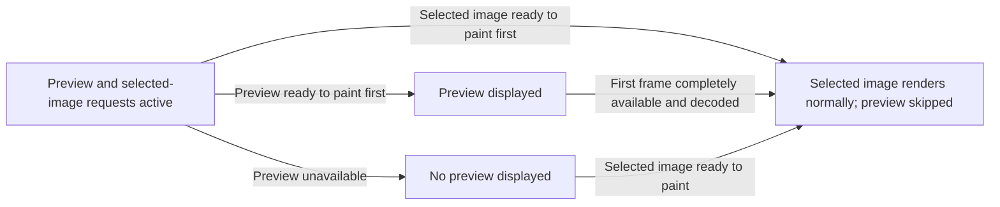

# Image Preview for HTML Images

## Status of this Document

- **Status:** Active draft
- **Draft focus:** The core proposal and its developer viability.
- **Proposed incubation venue:** [WICG](https://wicg.io/)
- **Expected standards venue:** [WHATWG HTML](https://html.spec.whatwg.org/)
- **Current version:** This draft
- **Last updated:** 2026-10-02

## Authors

- [Olga Gerchikov](mailto:gerchiko@microsoft.com)
- [Alex Russell](mailto:alexrussell@microsoft.com)

## Participate

- **Issue tracker:** [Image Preview issues](https://github.com/MicrosoftEdge/MSEdgeExplainers/labels/Image%20Preview)
- **File a new issue:** [Image Preview issue template](https://github.com/MicrosoftEdge/MSEdgeExplainers/issues/new?template=image-preview.md)

## Table of Contents

- [Status of this Document](#status-of-this-document)
- [Authors](#authors)
- [Participate](#participate)
- [Introduction](#introduction)
- [User-Facing Problem](#user-facing-problem)
  - [How authors provide previews today](#how-authors-provide-previews-today)
  - [Goals](#goals)
  - [Non-goals](#non-goals)
- [Core Proposal](#core-proposal)
  - [Scope and responsive images](#scope-and-responsive-images)
  - [A low-resolution image preview](#a-low-resolution-image-preview)
  - [Fetching, scheduling, and HTML integration](#fetching-scheduling-and-html-integration)
  - [Preview lifecycle](#preview-lifecycle)
  - [Lifecycle decisions](#lifecycle-decisions)
  - [Source updates and image generations](#source-updates-and-image-generations)
  - [Image element state and rendering](#image-element-state-and-rendering)
  - [Compatibility and fallback](#compatibility-and-fallback)
- [Optional Capabilities](#optional-capabilities)
  - [Compact encoded preview formats](#compact-encoded-preview-formats)
  - [Customizable handoff](#customizable-handoff)
  - [Script observability](#script-observability)
- [Open Questions](#open-questions)
  - [Attribute name](#attribute-name)
  - [Minimum developer-viable feature](#minimum-developer-viable-feature)
- [Alternatives considered](#alternatives-considered)
  - [Alternatives to the core proposal](#alternatives-to-the-core-proposal)
    - [Historical `lowsrc` attribute](#historical-lowsrc-attribute)
  - [Alternatives to the combined solution](#alternatives-to-the-combined-solution)
- [Accessibility, Internationalization, Privacy, and Security Considerations](#accessibility-internationalization-privacy-and-security-considerations)
  - [Accessibility](#accessibility)
  - [Internationalization](#internationalization)
  - [Privacy](#privacy)
  - [Security](#security)
- [Stakeholder Feedback / Opposition](#stakeholder-feedback--opposition)
- [References & acknowledgements](#references--acknowledgements)
  - [Specifications and guidance](#specifications-and-guidance)
  - [Historical `lowsrc` sources](#historical-lowsrc-sources)
  - [Compact preview formats](#compact-preview-formats)
  - [Implementation evidence](#implementation-evidence)
  - [Acknowledgements](#acknowledgements)
- [Appendix](#appendix)
  - [Core API definition](#core-api-definition)
    - [WebIDL](#webidl)
  - [Possible CSS View Transition integration](#possible-css-view-transition-integration)
  - [Historical `lowsrc` research](#historical-lowsrc-research)
  - [Preview examples](#preview-examples)

## Introduction

**Image Preview lets a page provide a lightweight preview for an HTML image.** The browser displays the preview while the image chosen through normal `` source selection loads. Once that image's first frame is completely available and decoded for presentation, it replaces the preview. If the image has content available for rendering before the preview does, including partially decoded content, the preview is skipped. This moves common preview decoding, lifecycle, and replacement behavior from site-specific code into the browser.

Authors set the preview with a new `previewsrc` attribute on ``. Existing `src`, `srcset`, and `sizes` behavior continues to select the image.

```html

```

## User-Facing Problem

When an image is slow to load, the user can see an empty region without enough information to understand what will appear there. This is common on slow connections and image-heavy pages.

Sites can show previews today, but each site must build its own solution. Current approaches put the preview in the CSS background of the `` element or its wrapper, replace the `src` of one image, or stack a decoded canvas with the ``. The site must also manage decoding, replacement, source changes, and any transition.

**Example scenario:** A user opens a photo gallery on a slow connection. The page knows a small preview for each photo. With Image Preview, the browser can show those previews in the image elements and replace each one after the first frame of its main image is completely available and decoded for presentation.

### How authors provide previews today

The table below describes the major patterns used by current implementations. Representative examples are provided in the [appendix](#preview-examples).

| Pattern | Format | How it works | Examples and evidence |
| --- | --- | --- | --- |
| 1. CSS background preview with main image overlay | Base64 8×8 BMP; tiny JPEG embedded in SVG; BlurHash-derived WebP; ThumbHash-derived PNG | Set the preview as the CSS background of the target `` or its wrapper. The main image paints over it or becomes opaque after loading. | [Unsplash](https://unsplash.com/); [Next.js `<Image>`](https://image-component.nextjs.gallery/placeholder); [Jesus Film with Next.js](https://github.com/JesusFilm/core/blob/b2825dcb70a75b12a01f536b2f4b9c5637e8c6e8/libs/journeys/ui/src/components/Image/Image.tsx); [Tommy Chow homepage gallery preview](https://tommychow.com/) |
| 2. Decoded compact hash canvas | BlurHash decoded to canvas pixels | Decode the hash in script and paint it into a canvas occupying the image's display area. Load the target `` independently; after it loads or decodes, reveal it and hide or remove the canvas. | [Minds](https://www.minds.com/newsfeed/1565424642032668690); [Mastodon](https://github.com/mastodon/mastodon/blob/main/app/javascript/mastodon/components/blurhash.tsx); [Misskey](https://github.com/misskey-dev/misskey/blob/b3ce198f4c55ace4daeba4cb1858b3a85bc9529b/packages/frontend/src/components/MkImgWithBlurhash.vue); [Nextcloud Talk](https://github.com/nextcloud/spreed/blob/030f4ae2bd69e30077ad7dbac428ace1e9a325d2/src/components/MessagesList/MessagesGroup/Message/MessagePart/FilePreview.vue); [Jellyfin Vue](https://github.com/jellyfin/jellyfin-vue/blob/63edc21f2787706d094a190c93bdc97edd5c233e/packages/frontend/src/components/Layout/Images/Blurhash/BlurhashImage.vue) |
| 3. Single-image source replacement | Cloudinary-transformed raster image; Cloudinary selects the delivered format automatically | Assign the placeholder URL to one ``, preload the main image resource, and replace the same element's `src`. | [Cloudinary training tool](https://cloudinary-training.github.io/cld-intro-react-sdk-training-tool/#/placeholder); [Cico Jazz hero](https://cicojazz.de/#hero); [Cloudinary plugin source](https://github.com/cloudinary/frontend-frameworks/blob/9a05f3571fec1a3d0ecc66a899db1833d326c094/packages/html/src/plugins/placeholder.ts#L10-L108) |
| 4. Progressive stacked preview layers | BlurHash, small thumbnail, and larger preview | Stack progressively better representations and fade in each layer after it loads. | [Nextcloud Photos](https://github.com/nextcloud/photos/blob/d12a25def30bf568d5e36339bea645203f7dba62/src/components/FileComponent.vue) |

### Goals

- Show useful image content before the main image is ready.
- Use one `` for both the preview and main image.
- Support low-resolution previews using existing image formats and image-processing pipelines.
- Keep image selection in `src`, `srcset`, and `sizes`.
- Let the browser manage the preview lifecycle, reducing the need for custom markup and script.
- Never delay main-image discovery or request creation, and minimize network contention with the main image.
- Keep the main image and page usable when a preview format is unsupported.
- Allow separately specified image formats and transition mechanisms to build on the core lifecycle without changing the `previewsrc` API.

### Non-goals

- Generate a preview from the main image.
- Replace responsive image selection.
- Replace `loading`, `decoding`, or `fetchpriority`.
- Accept CSS `<image>` values directly through `previewsrc`.
- Render arbitrary HTML, skeletons, spinners, or other generated loading UI inside ``.
- Give the preview separate alternative text or separate semantics.
- Expose preview pixels through canvas, WebGL, WebCodecs, or other APIs that consume or extract decoded image data.
- Guarantee that a preview is displayed when the main image has content available for rendering first.

## Core Proposal

Add a URL-valued `previewsrc` attribute to ``.

The preview is temporary visual content for the image. It is painted in the same image element. The selected resource continues to come from the existing image source attributes.

In this explainer, the **selected image** is the image resource selected from `src`, `srcset`, and `<picture>` for the current [image generation](#source-updates-and-image-generations). If those sources change, the browser may select a different image and create a new generation.

Authors should provide a preview that represents the same content as the selected image. The browser cannot verify that correspondence, but unrelated or misleading preview content can give users an incorrect understanding of the image while the selected resource loads.

The proposal is divided along specification and implementation boundaries:

| Capability | Scope | Intended venue |
| --- | --- | --- |
| `previewsrc` and `previewSrc` | Core | WHATWG HTML |
| Preview fetching, decoding, display, replacement, and cancellation | Core | WHATWG HTML |
| Compact encodings such as BlurHash or ThumbHash | Independent image formats | Their respective format specifications and registrations |
| Author-customizable handoff | Optional extension | To be determined; potentially CSS View Transitions |
| Script-visible preview or handoff state | Deferred pending demonstrated use cases | To be determined |

### Scope and responsive images

The core proposal applies only to HTML ``. It does not add attributes to `<source>`, `<input type="image">`, SVG `<image>`, `<object>`, or `<embed>`.

An `` inside `<picture>` can use `previewsrc`, but the preview belongs to the `` rather than to an individual `<source>`. The existing `<picture>`, `srcset`, and `sizes` algorithms continue selecting the image. Version 1 deliberately provides one non-responsive preview URL and does not define `previewsrcset` or `previewsizes`.

The preview should therefore represent every candidate that the `<picture>` or `srcset` can select. If art direction, localization, writing direction, color scheme, or another condition changes the image's subject materially, the author should use a neutral preview suitable for every candidate or omit `previewsrc`. Responsive preview selection can be considered as a later extension if implementation experience demonstrates that one preview is insufficient.

### A low-resolution image preview

An author can use a small, low-resolution JPEG, WebP, or AVIF image as the preview:

```html

```

The browser uses `previewsrc` for the preview. It uses the existing responsive-image algorithm to select the image from `srcset` and `sizes`.

The preview can also be an inline data URL:

```html

```

Inlining avoids a separate preview request, but increases the size of the containing document.

`previewsrc` is URL-valued and cannot directly use CSS-generated images such as gradients, `cross-fade()`, Paint Worklets, or future mesh and patch gradients. Direct support would require a separate CSS integration.

### Fetching, scheduling, and HTML integration

`previewsrc` is a URL-valued content attribute reflected by the `previewSrc` `USVString` property using the same URL-reflection behavior as `src`. Reading `previewSrc` returns the resolved absolute URL, while `getAttribute("previewsrc")` returns the serialized attribute value. A missing or empty `previewsrc` means that the element has no preview. Removing or emptying the attribute makes pending preview work obsolete and allows the browser to cancel it.

Preview processing is integrated into HTML's existing [update the image data](https://html.spec.whatwg.org/multipage/images.html#update-the-image-data) processing model:

1. The browser selects the image from `src`, `srcset`, `<picture>`, and `sizes`, and creates or updates the selected-image request without waiting for the preview.
2. When the browser begins loading the selected image, if the element has a non-empty `previewsrc`, it resolves the preview URL against the document base URL and may create a preview request.
3. The preview and selected-image requests form the [image generation](#source-updates-and-image-generations) associated with that invocation.

If an update leaves the element without a valid image candidate, the browser does not process `previewsrc`. Pending preview work becomes obsolete, and a displayed preview is removed; the element then follows its ordinary no-source or broken-image rendering behavior. A preview cannot serve as a standalone image or fallback source.

When `previewsrc` resolves to the same URL as the selected image, the browser may reuse the same fetch and decode rather than perform duplicate work. The resource is treated as the selected image and does not participate in the preview lifecycle.

Selected-image discovery, selection, and request creation must not wait for preview fetching or decoding. The browser schedules best-effort preview work so that it does not block those selected-image operations and may choose its network, decoding, or task priority accordingly. An additional request can still consume bandwidth or contend with the selected image.

The element's `fetchpriority` and `decoding` attributes continue to describe the selected image. Version 1 adds no preview-specific priority control: preview decoding is asynchronous and best-effort. The browser may skip the preview when the selected image is ready to paint or when its scheduling policy determines that the preview is unlikely to be useful before the selected image.

The preview is fetched with destination `image` and follows the same URL parsing, CORS, credentials, referrer-policy, Content Security Policy `img-src`, mixed-content, cookie, HTTP-cache, network-partitioning, and service-worker rules as other `` requests. A separately fetched preview produces a Resource Timing entry under the rules for image requests, with `initiatorType` equal to `"img"`. The preview URL is not exposed through `currentSrc`.

### Preview lifecycle

In this explainer, *ready to paint* means that an image representation is available for the browser to render. It does not mean that a rendering update has already painted the pixels, and it does not introduce a new script-visible state. A specification would express this condition using the existing HTML image-request and decoding states.

The proposed end-to-end flow is:


```mermaid
flowchart LR
  A[Preview and selected-image requests active] -->|Selected image ready to paint first| I[Selected image renders normally; preview skipped]
  A -->|Preview ready to paint first| P[Preview displayed]
  P -->|First frame completely available and decoded| I
  A -->|Preview unavailable| N[No preview displayed]
  N -->|Selected image ready to paint| I
```

The numbered steps below are the text alternative for the diagram:

1. After the requests begin under the [fetching and scheduling rules](#fetching-scheduling-and-html-integration), they proceed independently.
2. If the selected image becomes ready to paint before the preview does, the browser permanently skips the preview, even if the selected image is only partially decoded. Progressive or incremental updates then render normally.
3. If the preview becomes ready to paint first, the browser displays it in the ``.
4. Once displayed, the preview remains visible until the first frame of the selected image is completely available and decoded for presentation. For a still image, the image consists of a single frame.
5. The selected image then replaces the preview in one step. Partial or intermediate representations of the selected image are not displayed while the preview is visible.
6. A skipped, blocked, unsupported, malformed, or failed preview leaves no preview displayed and does not alter loading or rendering of the selected image.

Keeping a displayed preview until the first frame of the selected image is decoded follows the existing script pattern of preloading the selected image and awaiting `decode()` before revealing it.

### Lifecycle decisions

- **Lazy loading:** Preview fetching follows the selected image's lazy-loading behavior. If `loading="lazy"` causes the browser to defer the selected-image request, it must also defer the preview request. When the browser begins loading the selected image, it may begin best-effort preview processing according to the scheduling rules above.
- **Selected-image failure:** If the selected image fails, the browser stops displaying the preview and uses the element's normal broken-image and alternative-text rendering. A preview is temporary and cannot become successful fallback content.
- **Animated previews:** Animated preview resources follow the platform's ordinary image-animation behavior. The computed [`image-animation`](https://drafts.csswg.org/css-image-animation-1/#image-animation) value on the `` element applies to the preview as well as the selected image. Replacing the preview ends its playback. This proposal adds no preview-specific animation controls.
- **Animated selected images:** Handoff requires the first frame to be completely available and decoded for presentation. It does not require every animation frame to be available or decoded. After the handoff, animation follows the platform's ordinary image-animation behavior.
- **Data-saving and resource pressure:** The browser may omit or abandon this best-effort preview in response to reduced-data preferences, memory pressure, battery constraints, or similar resource policy. The core API exposes no dedicated reason or outcome for this decision, although existing facilities such as Resource Timing can reveal whether a separate request occurred.
- **Disconnection:** Disconnecting an element makes preview work obsolete when the corresponding selected-image request is no longer relevant under the existing image-loading model. Reconnection runs the normal image-data update process.
- **Document lifecycle:** Freezing a document for BFCache cancels any optional animated handoff. Already-painted and decoded state may be preserved to the same extent as ordinary `` state. Discarding the document makes preview work obsolete.

### Source updates and image generations

Script can update the reflected preview property and the image source, as in a dynamic image gallery:

```js
const image = document.querySelector("#gallery-image");

image.previewSrc = photo.previewUrl;
image.src = photo.url;
```

Changes to `previewsrc`, `src`, `srcset`, `sizes`, and relevant `<source>` elements participate in HTML's existing image-data update processing. For explanatory purposes, this document calls the preview and selected-image work associated with one such update an *image generation*; it does not introduce a script-visible generation object.

Results from older generations are ignored and cannot newly replace painted content. The browser cancels obsolete requests, decoding, and optional handoffs when possible, including when a newer generation supersedes them, the selected image becomes ready to paint before the preview, or the document is discarded. Previously painted content may remain until the current generation has a preview or selected image ready to paint.

### Image element state and rendering

The browser temporarily displays the preview inside the image element, but the selected image remains the element's current image resource. Standard `HTMLImageElement` state and events, including `currentSrc`, `complete`, `naturalWidth`, `naturalHeight`, `decode()`, `load`, and `error`, continue to describe the selected image.

The preview does not contribute intrinsic dimensions or otherwise determine the `` element's layout size. The browser lays out the element using the same CSS, `width`, `height`, `aspect-ratio`, and selected-image intrinsic-size rules that apply when `previewsrc` is absent.

If those rules establish a nonzero content box before the selected image becomes ready to paint, the browser scales and positions the preview within that box according to `object-fit` and `object-position`. Preview dimensions do not create or resize the box.

If the element has no nonzero content box, the browser may fetch and decode the preview but cannot visibly paint it. If a nonzero content box is later established while the selected image remains pending, a ready preview may be painted according to the normal lifecycle. When the selected image's intrinsic dimensions become available, they may affect layout under the existing `` sizing rules. Authors should provide `width` and `height`, `aspect-ratio`, or CSS sizing when they want to reserve space before the selected image loads.

The preview is not exposed through `drawImage()`, `createImageBitmap()`, or other image-extraction APIs. While only the preview is displayed, those APIs behave exactly as they do when the selected image has no available image data; they do not use preview pixels. Once the selected image is available, they use it under their existing algorithms.

Context menus, drag operations, saving, accessibility, and other semantics continue to identify the selected image and its `src`/`currentSrc`, not the preview.

The [preview lifecycle](#preview-lifecycle) and [lifecycle decisions](#lifecycle-decisions) define the rendering outcomes for pending, ready, unavailable, and failed resources.

### Compatibility and fallback

In a browser that does not implement Image Preview, the unrecognized `previewsrc` attribute has no effect and the existing image source attributes continue to work.

Script can detect support for the reflected property:

```js
const supportsImagePreview =
  "previewSrc" in HTMLImageElement.prototype;
```

Unsupported formats follow the [preview-unavailable lifecycle](#preview-lifecycle). Support for optional [compact preview formats](#compact-encoded-preview-formats) is independent of support for `previewsrc`.

Developer tools may report that a preview was skipped, blocked, unsupported, or failed, but such diagnostics are not a web-observable API and are outside the HTML feature definition.

## Optional Capabilities

The following sections expand the optional and deferred capabilities identified in the [scope table](#core-proposal). They are independently specifiable, but their priority depends on the [minimum developer-viable feature](#minimum-developer-viable-feature).

### Compact encoded preview formats

`previewsrc` accepts any image resource that the browser can decode. It therefore benefits automatically from compact image formats if those formats are specified and implemented, but the core proposal does not define, require, or special-case them.

BlurHash and ThumbHash are examples of compact encodings that could be separately specified and registered as image formats. The media type and data URL serialization below are illustrative pending that work.

An author could provide a BlurHash value:

```html

```

A separately specified ThumbHash image format could use an analogous data URL with its registered media type and serialization.

Each compact format specification must define its media type and serialization; encoded-size, decoded-dimension, memory, and processing limits; malformed-input behavior; and a prohibition on nested network requests.

### Customizable handoff

The core lifecycle directly replaces the preview with the selected image. Developer research should determine whether customizing this handoff is necessary for adoption.

A future extension could integrate the browser-managed replacement with Element Scoped View Transitions. Unlike an author-scripted transition, the browser would initiate the transition when the first frame of the selected image is completely available and decoded for presentation, while authors would customize its presentation through CSS. This explainer does not select an API for that integration. The [appendix](#possible-css-view-transition-integration) records one possible solution for further discussion.

Any extension must define how authors identify the preview and selected-image snapshots, when the transition starts, and how it interacts with cancellation, source changes, reduced-motion preferences, and document lifecycle changes. It should also determine whether Image Preview needs a specific API or can use a general mechanism for browser-managed resource transitions.

### Script observability

The [core image state and rendering model](#image-element-state-and-rendering) provides no preview lifecycle hook.

Without preview-specific events or state, sites cannot directly measure whether previews fetched, decoded, or displayed successfully. Resource Timing may indicate that a separate request occurred, but it does not report whether the preview decoded or was displayed. This limits preview-health monitoring but avoids adding new timing and format-support signals to the core API.

If concrete use cases establish a need for script observability, a follow-up proposal should evaluate an event, callback, or promise together with any transition object. It must also account for the additional timing and format-support information exposed by preview success, failure, and handoff timing.

## Open Questions

### Attribute name

Should the preview URL use a new `previewsrc` attribute, or should `` reuse the existing `poster` name? See [Reuse the `poster` attribute](#reuse-the-poster-attribute) for the tradeoff.

The `lowsrc` name is excluded for compatibility reasons; see [Historical `lowsrc` attribute](#historical-lowsrc-attribute).

### Minimum developer-viable feature

The core `previewsrc` lifecycle can be implemented independently using existing image formats and the [core handoff](#preview-lifecycle). The open question is whether that core alone provides enough value for developers, or whether a minimum developer-viable feature also requires compact preview formats, a customizable handoff, or both.

Developer research should determine whether developers would adopt each combination or continue using script-based preview components. Compact formats and handoff customization can be specified and shipped independently of the core lifecycle.

## Alternatives considered

### Alternatives to the core proposal

#### Historical `lowsrc` attribute

The historical `lowsrc` attribute is direct prior art: like `previewsrc`, it associated a temporary image with the selected image. This proposal specifies how that behavior would integrate with the modern HTML image-loading model, while retaining the costs and risks of a separate resource.

See [Historical `lowsrc` research](#historical-lowsrc-research) for its standards history, Gecko removal, and available usage evidence.

#### CSS property for the preview source

A CSS property could provide the preview instead of, or alongside, the HTML attribute:

```css
.gallery-image {
  image-preview-source:
    linear-gradient(135deg, #68788c, #bcc4cc);
}
```

Compared with `previewsrc`, this has several advantages:

- It can accept the full CSS `<image>` syntax.
- CSS rules and queries can select and reuse previews.
- Abstract placeholders remain in the presentation layer.

It also has disadvantages:

- Preview URLs may be discovered only after stylesheets are fetched and parsed, leaving less time for the preview to appear before the selected image.
- Keeping the preview separate from the image's source attributes makes it easier for the preview and selected image to become mismatched.
- Cascade or query changes may replace a preview while loading, causing requests or decoding work to be restarted or discarded.
- Without a reflected `HTMLImageElement` property, scripts must read and update the preview through styles instead of the image API.

CSS would still need to define when the preview is displayed and replaced. A CSS property could therefore be considered as an alternative or companion to `previewsrc`.

#### Imperative-only image API

The browser-managed preview lifecycle could be exposed only through JavaScript:

```html

```

```js
const image = document.querySelector("#gallery-image");

image.setPreviewSource("/images/forest-32.avif");
```

This could accommodate imperative options, but it would require script for a basic loading feature, delay preview discovery until script runs, and prevent server-rendered markup from expressing it. In contrast, the proposed reflected `previewsrc` attribute supports declarative markup while remaining dynamically updateable through `previewSrc`.

#### Preview source in `<picture>`

A special `media="poster"` value on a `<source>` element could identify that source as the preview rather than as a selected-image candidate:

```html
<picture>
  <source media="poster" srcset="/images/forest-preview.avif">
  <source
    media="(min-width: 800px)"
    srcset="/images/forest-1600.avif">
  
</picture>
```

This approach keeps preview and selected-image sources together and could support a different preview for each responsive or art-directed candidate. However, it would require `<picture>` for every image with a preview and would give `media` a new purpose: identifying a source's role rather than evaluating a media query.

The proposed `previewsrc` attribute works on any ``, including one inside `<picture>`, without changing `<source>` selection. Version 1 provides one preview for every possible selected-image candidate; responsive or source-specific preview selection can be added later if developers need it.

#### Reuse the `poster` attribute

The `<video>` element uses `poster` to identify an image shown before video data is available. The same attribute could be added to ``:

```html

```

Reusing `poster` would avoid introducing another attribute name and would build on an existing concept for temporary visual content. Related work in [whatwg/html#12585](https://github.com/whatwg/html/pull/12585) proposes responsive video posters through a child ``, although it does not add `poster` to ``.

The attribute name does not change the required implementation behavior. Adding `poster` to `` would still require the fetching, scheduling, lifecycle, rendering, cancellation, and API-state rules described by this proposal. It would also need a reflected `HTMLImageElement` property.

`previewsrc` makes the relationship to `src` explicit, while `poster` reuses a familiar platform term. The choice remains an [open naming question](#attribute-name).

#### Progressive and incrementally decoded images

Progressive JPEG, interlaced image formats, and incremental decoding can reveal an increasingly complete version of one image as its bytes arrive. They avoid an additional resource request and can be the best option when the selected format, encoder, delivery path, and browser produce useful intermediate paints.

They do not replace every preview use case:

- Intermediate quality and paint timing depend on the format, encoding parameters, decoder, and browser.
- A site cannot provide a separately generated semantic preview, compact hash, or differently processed placeholder independently of the selected resource.
- A site's selected-image format or image CDN might not support predictable progressive rendering.
- Changing the selected source because of responsive selection, art direction, or application state also changes the progressive stream.

Conversely, `previewsrc` can use an existing small image, be inlined, or be cached independently of the selected image, and works regardless of whether the selected format renders progressively. Its cost is an additional resource and possible bandwidth contention. If the preview is displayed first, it also hides intermediate representations of the selected image until its first frame is completely available and decoded for presentation. Authors should prefer progressive delivery when it provides an adequate experience without those costs; Image Preview is complementary for cases that require an independently supplied preview.

### Alternatives to the combined solution

The following alternatives consider whether native compact-format decoding, existing transition APIs, or extensible author-provided decoders could provide the intended developer experience without combining the core browser-managed lifecycle with all optional capabilities.

#### Native compact-format decoding with an author-managed lifecycle

The browser could natively decode compact image formats without adding `previewsrc` or managing preview replacement. Authors would use ordinary image or canvas sources and continue coordinating preview and selected content through script:

```html
<div class="image-frame">
  
  
</div>
```

This would remove format-specific decoder libraries and could reduce script size and decoding cost. However, authors would still need to implement loading, replacement, cancellation, source-update handling, failures, and accessibility across multiple elements. The proposed `previewsrc` API adds that managed lifecycle in addition to using any image format the browser can decode.

#### Author-scripted scoped View Transition

The platform could provide native compact decoding and scoped View Transitions but leave the handoff to author script:

```html

```

```js
const photo = document.querySelector("#photo");
const finalImage = new Image();
finalImage.src = "/images/portrait.jpg";
await finalImage.decode();

const transition = photo.startViewTransition(async () => {
  photo.src = finalImage.src;
  await photo.decode();
});

await transition.finished;
```

This gives authors full control and reuses a general transition API. It still requires every page to preload the selected image, avoid stale source updates, and handle failures and cancellation. The core proposal makes the loading and replacement lifecycle browser-managed; the optional transition extension could additionally provide CSS customization while respecting reduced-motion and hidden-document behavior.

#### Script-provided fallback decoder

The browser could manage the preview lifecycle but invoke an author-registered decoder when it does not support the preview's media type:

```html

```

```js
navigator.imagePreview.registerDecoder(
  "image/blurhash",
  async (bytes, options) => decodeBlurHash(bytes, options)
);
```

This would make additional formats extensible without requiring native decoders for each one. However, previews would depend on script loading and execution, and the API would need to define decoder lifetime, cancellation, security, failure handling, output dimensions, color handling, and resource limits. Native decoding provides predictable behavior without page-supplied code.

## Accessibility, Internationalization, Privacy, and Security Considerations

### Accessibility

The proposal uses one `` for the preview and selected image. The existing `alt` attribute describes that image.

The preview must represent the same content described by the `alt` attribute and must not create a second accessibility node or a second announcement. The [core handoff](#preview-lifecycle) does not animate. Any optional transition mechanism must respect `prefers-reduced-motion`.

### Internationalization

The proposal adds no user-facing text and no language-sensitive processing.

The guidance for localized or direction-dependent image candidates is covered by [Scope and responsive images](#scope-and-responsive-images).

### Privacy

A URL in `previewsrc` can cause an additional request, with the same general privacy implications as requesting another image through `src`. The origin serving the preview can learn that the resource was requested.

Existing image-fetch and Resource Timing protections limit what the document can observe about the additional request, as detailed in [Fetching, scheduling, and HTML integration](#fetching-scheduling-and-html-integration). The core API provides no preview-specific outcome or reason when the browser omits preview work under reduced-data or resource-pressure policies. However, existing Resource Timing information can let the document infer whether a separate preview request occurred.

The core proposal adds no dedicated API exposing preview readiness, intrinsic dimensions, decode success or failure, decode duration, display, or handoff timing. Resource Timing can expose ordinary fetch and cache information, including whether a separate request occurred, but it does not report when preview decoding begins or completes.

A site may obtain an indirect estimate of related decoding work by loading the same URL into a separate `Image` and timing `decode()`, `createImageBitmap()`, canvas drawing, or a WebGL texture upload. These operations use a separate API path, may benefit from shared caches, and do not directly measure the browser's internal preview decode or reveal whether the preview was displayed.

Adding a preview-specific event, state property, selector, or transition signal could make decode duration, readiness, display, or format support more directly observable and requires separate privacy analysis.

### Security

`previewsrc` follows the same URL parsing, Content Security Policy `img-src`, mixed-content, and image-fetching rules as `src`, unless a specific difference is identified.

Preview decoding must enforce the limits applicable to the selected image format. Obsolete decoding work must be abortable, and repeated source changes must not create unbounded concurrent decoding work. Malformed or adversarial input follows the [preview-unavailable lifecycle](#preview-lifecycle). Separately specified compact formats require their own bounds and security analysis, including a prohibition on nested network requests.

Because the preview is not exposed through image-extraction APIs, its origin does not independently affect canvas origin cleanliness. Canvas access continues to follow the origin-clean rules for the selected image.


## Stakeholder Feedback / Opposition

| Stakeholder | Signal | Source |
| --- | --- | --- |
| Chromium | No position requested | — |
| Gecko | No position requested | — |
| WebKit | No position requested | — |
| WHATWG | No review requested | — |
| Web developers | No public signal gathered | — |

## References & acknowledgements

### Specifications and guidance

- [Content Security Policy Level 3](https://www.w3.org/TR/CSP3/)
- [CSS Image Animation Module Level 1](https://drafts.csswg.org/css-image-animation-1/)
- [CSS View Transitions Module Level 2](https://www.w3.org/TR/css-view-transitions-2/)
- [HTML: Images](https://html.spec.whatwg.org/multipage/images.html)
- [Mixed Content](https://www.w3.org/TR/mixed-content/)
- [Referrer Policy](https://www.w3.org/TR/referrer-policy/)
- [Resource Timing Level 2](https://www.w3.org/TR/resource-timing/)

### Historical `lowsrc` sources

- [Netscape Client-Side JavaScript Reference: `Image`](https://docs.oracle.com/cd/E19957-01/816-6408-10/image.htm)
- [Microsoft `IHTMLImgElement::lowsrc`](https://learn.microsoft.com/en-us/previous-versions/windows/internet-explorer/ie-developer/platform-apis/aa752253(v=vs.85))
- [DOM Level 1: `HTMLImageElement`](https://www.w3.org/TR/REC-DOM-Level-1/level-one-html.html#ID-17701901)
- [DOM Level 2 HTML changes](https://www.w3.org/TR/DOM-Level-2-HTML/changes.html)
- [HTML: obsolete `lowsrc` attribute](https://html.spec.whatwg.org/multipage/obsolete.html#attr-img-lowsrc)
- [Mozilla bug 92453: remove `lowsrc` support](https://bugzilla.mozilla.org/show_bug.cgi?id=92453)
- [Mozilla bug 94219: reported `lowsrc` compatibility](https://bugzilla.mozilla.org/show_bug.cgi?id=94219)
- [WebKit bug 12305: `lowsrc` property compatibility](https://bugs.webkit.org/show_bug.cgi?id=12305)

### Compact preview formats

- [BlurHash](https://github.com/woltapp/blurhash)
- [ThumbHash](https://github.com/evanw/thumbhash)

### Implementation evidence

- [Cloudinary placeholder plugin](https://github.com/cloudinary/frontend-frameworks/blob/9a05f3571fec1a3d0ecc66a899db1833d326c094/packages/html/src/plugins/placeholder.ts#L10-L108)
- [Mastodon BlurHash component](https://github.com/mastodon/mastodon/blob/main/app/javascript/mastodon/components/blurhash.tsx)
- [Minds BlurHash directive](https://github.com/Minds/front/blob/e51f12214cf9324c5e432362e16cf289054a2ca7/src/app/common/directives/blurhash/blurhash.directive.ts)
- [Nextcloud Photos progressive preview component](https://github.com/nextcloud/photos/blob/d12a25def30bf568d5e36339bea645203f7dba62/src/components/FileComponent.vue)
- [Next.js Image documentation](https://nextjs.org/docs/pages/api-reference/components/image) and [placeholder demo](https://image-component.nextjs.gallery/placeholder)
- [Tommy Chow Photography ThumbHash implementation](https://github.com/tommyxchow/tommychow.com/blob/a2fac8f866e608c37b711b024ab873e326287733/src/app/GalleryPreview.tsx)

### Acknowledgements

This proposal was informed by the public implementations and demonstrations cited above and throughout this explainer. In particular, the authors acknowledge the work of the BlurHash and ThumbHash projects and the application and framework developers whose preview implementations provided evidence of current practice. Their inclusion does not imply endorsement of this proposal.

## Appendix

### Core API definition

#### WebIDL

The core proposal adds one reflected property:

```webidl
partial interface HTMLImageElement {
  [CEReactions] attribute USVString previewSrc;
};
```

### Possible CSS View Transition integration

One possible extension could integrate browser-managed preview replacement with [Element Scoped View Transitions](https://developer.mozilla.org/en-US/docs/Web/API/View_Transition_API/Using_element-scoped). For example, an `:active-image-preview-transition` pseudo-class could allow authors to customize the old preview and new selected-image snapshots:

```css
img:active-image-preview-transition::view-transition-old(root) {
  animation: 200ms ease-out both image-preview-fade-out;
}

img:active-image-preview-transition::view-transition-new(root) {
  animation: 200ms ease-in both image-preview-fade-in;
}

@keyframes image-preview-fade-out {
  to {
    opacity: 0;
  }
}

@keyframes image-preview-fade-in {
  from {
    opacity: 0;
  }
}
```

While the pseudo-class matches, the `old(root)` snapshot would represent the displayed preview and the `new(root)` snapshot would represent the selected image with its first frame completely available and decoded for presentation. The state would end when the handoff finishes or is canceled.

This sketch is illustrative and is not part of the core proposal or a selected extension API. Further work must compare an Image Preview-specific state with a general mechanism for browser-managed resource transitions.

### Historical `lowsrc` research

This section records the evidence used to evaluate `lowsrc` as prior art. It does not establish a single reason why the feature declined across the web.

#### Standards history

`LOWSRC` originated as a [Netscape extension](https://docs.oracle.com/cd/E19957-01/816-6408-10/image.htm) and was later [implemented by Internet Explorer](https://learn.microsoft.com/en-us/previous-versions/windows/internet-explorer/ie-developer/platform-apis/aa752253(v=vs.85)). It allowed an `` to specify a low-resolution resource that was displayed before the main `src` resource.

The attribute was never part of the HTML standard. [DOM Level 1 exposed the `lowSrc` property](https://www.w3.org/TR/REC-DOM-Level-1/level-one-html.html#ID-17701901), but [DOM Level 2 removed it](https://www.w3.org/TR/DOM-Level-2-HTML/changes.html).

[Current HTML](https://html.spec.whatwg.org/multipage/obsolete.html#attr-img-lowsrc):

- makes the `lowsrc` content attribute non-conforming;
- recommends progressive JPEG instead of two separate images; and
- retains `HTMLImageElement.lowsrc` as a URL-reflecting compatibility property.

#### Gecko removal

[Mozilla bug 92453](https://bugzilla.mozilla.org/show_bug.cgi?id=92453) documents Gecko's 2001 decision to remove its `lowsrc` loading behavior. The discussion identifies implementation problems, the feature's non-standard status, and questions about its usefulness.

#### Usage evidence

Historical browser bug reports provide some evidence of `lowsrc` markup or property usage, including [Ameritrade](https://bugzilla.mozilla.org/show_bug.cgi?id=94219#c3), [gimp.org](https://bugzilla.mozilla.org/show_bug.cgi?id=92453#c5), and [CNN](https://bugs.webkit.org/show_bug.cgi?id=12305). However, no reliable data on its past or current usage was found.

Although current HTML recommends progressive JPEG instead of `lowsrc`, no evidence was found that the availability of progressive image formats caused its decline. No evidence was found that later responsive-image features explain it either.

#### Relevance to this proposal

Clearer specification alone does not demonstrate user benefit or adoption. The same underlying risks still require evaluation:

- additional bytes and possible request contention;
- keeping preview and selected resources synchronized;
- responsive and art-directed image selection; and
- whether progressive delivery is preferable for a given use case.

The `lowsrc` name is not reused because browsers already expose `HTMLImageElement.lowsrc`. Reusing it would make property-based feature detection ambiguous and could give existing markup new loading behavior.

### Preview examples

These examples correspond to patterns 1 and 2 in [How authors provide previews today](#how-authors-provide-previews-today).

#### Pattern 1: CSS background preview with selected image overlay — Next.js

The [Next.js image placeholder demo](https://image-component.nextjs.gallery/placeholder) renders a single `` whose CSS background is an inline SVG containing a tiny JPEG preview:

```html

```

After the selected image loads and decoding settles, Next.js removes the background preview. See the [demo source](https://github.com/vercel/next.js/blob/canary/examples/image-component/app/placeholder/page.tsx), [background construction](https://github.com/vercel/next.js/blob/4fed8eaf197aaa60fd85371352482199a4c2107f/packages/next/src/shared/lib/get-img-props.ts), and [load handoff](https://github.com/vercel/next.js/blob/4fed8eaf197aaa60fd85371352482199a4c2107f/packages/next/src/client/image-component.tsx).

#### Pattern 2: Decoded compact hash canvas — Minds

On this [Minds post](https://www.minds.com/newsfeed/1565424642032668690), the site decodes BlurHash data into pixels and paints them into a canvas associated with the selected image. When the image loads, Minds fades and removes the canvas. See the [Minds BlurHash directive](https://github.com/Minds/front/blob/e51f12214cf9324c5e432362e16cf289054a2ca7/src/app/common/directives/blurhash/blurhash.directive.ts).

The resulting structure is equivalent to:

```html
<div class="image-frame">
  <canvas class="preview" width="32" height="24"></canvas>
  
</div>
```
