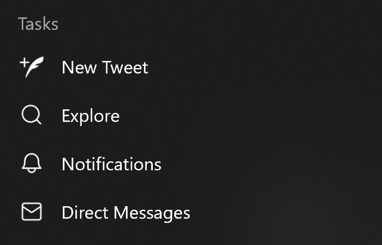
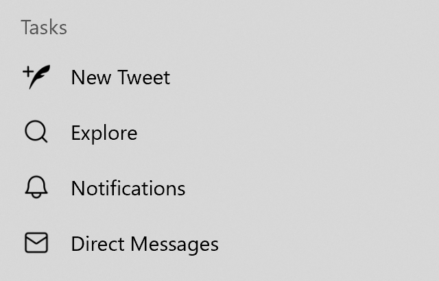

# <code>ImageResource</code> Color Scheme Explainer

Authors: [Aaron Gustafson](https://github.com/aarongustafson)

## Introduction

With operating systems beginning to offer multiple color schemes (e.g., “dark mode” and “light mode”) and with [CSS offering a media query for that user preference](https://drafts.csswg.org/mediaqueries-5/#descdef-media-prefers-color-scheme), it is important to enable web apps to offer appropriate iconography for the context. As such, we need to upgrade the [<code>ImageResource</code> dictionary](https://w3c.github.io/manifest/#dom-imageresource) to include an optional member indicating which color scheme a given image should be associated with.

## Goals

* Enable authors to (optionally) identify <code>ImageResource</code> (icons, etc.) within their Web App Manifest as being appropriate for specific color schemes
* Enable user agents and operating systems to display the appropriate <code>ImageResource</code>, given the user’s chosen color scheme

## Use Cases

Many websites are beginning to look to the operating system for queues about how the user would prefer their apps be rendered (e.g., “dark mode”). There is a media query which allows them to toggle the color-related styles applied to their website (or PWA), but their app icon (referenced in the Web App Manifest) remains unaffected. In certain cases, it may make sense for an app’s icon to adjust to match the user’s chosen color scheme for maximum legibility.

For example, consider [the VS Code Insiders logo as displayed in Windows 10](#vs-code):

<figure id="vs-code">


</figure>

In the default colors of Windows 10 (and Dark Mode), the taskbar is black and the green color of the icon has a contrast ratio of 5.84:1, which is enough to meet WCAG AA for user interface components. By contrast, in Windows 10’s Light Mode, the very same logo is set against a medium grey background and only achieves a contrast ratio of 1.56:1. This is but one example. Enabling developers to indicate different image asset options for different color schemes would help avoid this issue.

In their implementation of Windows’ Jump List feature, [the Twitter PWA implements white PNG icons](#twitter):

<figure id="twitter-dark">



</figure>

When in Light Mode, Windows 10 automatically converts the white icons to black to keep them legible:

<figure id="twitter-light">



</figure>

Such automatic conversion can be helpful when you are dealing with black-to-white inversion, but it falls apart when you are dealing with other colors (and multiple colors). It would be better to allow a developer to specifically define the icon to use in each situation.


## API Proposal

We are proposing that a new member be added to the [<code>ImageResource</code> dictionary](https://w3c.github.io/manifest/#dom-imageresource) defined in the [Web App Manifest](https://w3c.github.io/manifest/): `color_scheme`. This optional member would accept any values allowable in [the `prefers-color-scheme` media query](https://drafts.csswg.org/mediaqueries-5/#descdef-media-prefers-color-scheme):

```json
"icons": [
  {
    "src": "/icons/play-later.svg",
    "type": "image/svg+xml",
    "purpose": "any",
    "color_scheme": "no-preference"
  },
  {
    "src": "/icons/play-later-reverse.svg",
    "type": "image/svg+xml",
    "purpose": "any",
    "color_scheme": "dark"
  }
]
```

Without a defined `color_scheme`, the value of "no-preference" would be assigned.

## Open Questions

1. Would it make sense to use the existing [`purpose` member of an <code>ImageResource</code>](https://w3c.github.io/manifest/#dom-imageresource-purpose)?
2. With SVGs, might it be possible to pick up foreground and background colors directly from the OS (along the lines of `currentColor`)?
3. If an author specifies that they have "no preference" for an icon, does that indicate than an OS should feel empowered to automatically mutate the colors to try to provide the most readable image? (For example: the white shortcut icons being automagically reversed in Windows.)
