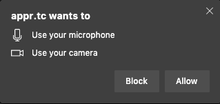
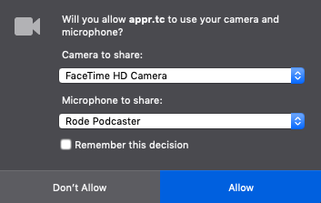
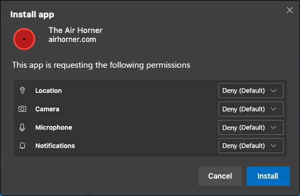

# First Run Permissions Prompt Explainer

Authors:

* [Aaron Gustafson](https://github.com/aarongustafson)
* [Melanie Richards](https://github.com/melanierichards)

**Authors’ Note: This is an early idea and we expect to experiment a bit with it before coming to a final recommendation.**

## Status of this Document
This document is intended as a starting point for engaging the community and standards bodies in developing collaborative solutions fit for standardization. As the solutions to problems described in this document progress along the standards-track, we will retain this document as an archive and use this section to keep the community up-to-date with the most current standards venue and content location of future work and discussions.
* This document status: **Active**
* Expected venue: [W3C Web Incubator Community Group](https://wicg.io/) 
* Current version: this document

## Introduction

An increasing number of sensitive APIs have been added to the web platform. To ensure user privacy is protected, these APIs are restricted to secure origins and typically require an explicit user permissions grant in order for the API to be available to a given domain. As web applications have become more advanced, these permissions request prompts have proliferated. This proliferation has led to users having "permissions request fatigue," the major symptom of which is a compulsive denial permissions prompts, especially if the prompt is non-contextual or if several requests are shown in rapid succession. This situation is problematic for many applications that rely on these sensitive APIs to function (e.g., a video conferencing app not being granted access to the camera and microphone).

As web apps are continuing to evolve, some of the capabilities they need—run on user login, for instance—only make sense when a website is installed as an app (PWA). Additionally, there is some interest in loosening storage restrictions for installed websites to enable experiences like offline media consumption.

All of these considerations point to a need for some form of bulk permission request, which should be provided as part of the installation experience.

## Goals

* Establish a mechanism by which developers can declare the sensitive APIs or enhanced permissions they would like to use in order to prompt users for these permissions during install.

## Non-goals

* Enable developers to ask for permissions <i>en masse</i> while visiting a website in a typical browsing scenario.
* Enable developers to require permission grants for installation to proceed.
* Block access to APIs if they are not declared according to the [API proposal](#api-proposal).

## Use Cases

A user browses to a new social media site and opts to install the service as a PWA to try it out. The developer has declared that they are interested in access to their users’ camera(s) and location and they want to be able to send the user push notifications. During install, the user is presented with these requests and chooses to grant push notification access, but denies access to the camera and location because they aren’t interested in using the service’s features that rely on those APIs.

A user has purchased a new device that comes with a PWA-based communication service pre-installed. When they first launch the PWA, they are asked to grant access to the device’s camera(s) and microphone, enable push notifications, and the ability to send and receive phone calls and text messages. Based on how they anticipate using the app, the user chooses to grant or deny each of these permissions.

## Prior Art

Prior to the launch of Android 6.0, app installations in Android were accompanied by a declaration of which permissions the application would be granted upon install. This model was discontinued—in favor of a more web-like runtime request model—because many apps were taking advantage of the opportunity to get access to as much sensitive user data as they could, without the user being able to deny access to any of the individual APIs. The problem with this model was that users had to accept all of the permissions in order to install the app. Their only other choice was to not install the app (which may not have been an option in some cases). The idea set forth in this explainer improves upon that approach by enabling users to approve or deny (or defer) permissions on an individual basis.

Some Implementors also currently bundle requests for camera and microphone access within a single permissions prompt when requests are made via `getUserMedia()`:

<figure id="chromium-batch">



</figure>

<figure id="firefox-batch">



</figure>

## API Proposal

As the document that governs the installation and presentation of PWAs within an operating system, the [Web App Manifest](https://w3c.github.io/manifest/) makes the most sense as a home for this feature. This proposal would add a new, optional member to the manifest dictionary: `request_on_install`. This member would accept an array of one or more [PermissionName strings](https://w3c.github.io/permissions/#enumdef-permissionname) indicating the permissions being requested. For example:

```json
"request_on_install": [
  "camera",
  "microphone",
  "notifications",
  "push",
  "runonstartup"
]
```

This example would request five permissions: [Camera access](https://w3c.github.io/permissions/#dom-permissionname-camera), [Microphone access](https://w3c.github.io/permissions/#dom-permissionname-camera), the ability to [send notifications](https://w3c.github.io/permissions/#dom-permissionname-notifications) and [push notifications](https://w3c.github.io/permissions/#dom-permissionname-push), and [the ability to run when a user is logging in to their OS](https://github.com/MicrosoftEdge/MSEdgeExplainers/blob/main/RunOnLogin/Explainer.md).

## User Interface

The user interface presented during install should enumerate each of the permissions being requested. Implementors are free to include additional information beyond the name of the permission if they so desire (e.g., what the API is used for, brief privacy information, etc.). The user interface MUST provide a means of approving and denying each permission individually. The implementor MAY provide an "Ask me later" or similar option.

The implementor MAY choose a default setting (or no default setting) for each permission. If a user has interacted with the site previously in a browsing session, the implementor SHOULD pass through any existing permission settings for each permission request (e.g. if camera access was previously denied for this origin, it should default to "Deny" in this UI).

The implementor MAY choose to include an "Accept All" or similar UI control to auto-grant all permissions requests.

Implementors MUST still provide access to audit these permissions post-install.

### Example

An implementor could choose to present these permissions within the installation prompt like this:

<figure id="hypothetical-prompt">



</figure>

## Interplay with Enterprise Policies

If the implementor supports use of some form of enterprise-level permissions policy (e.g., forbidding certain permissions for all apps or automatically granting specific permissions to individual apps), they may modify the display of the enumerated permissions shown during install. If the policy enforces a specific setting globally or for a specific app, the toggle control should be disabled and the implementor should include some language to the effect of "This permission is controlled by your organization."

## Open Questions

1. **Should the key be, simply, `permissions` instead?** This would potentially allow different implementors to enable different experiences that take into account install, first run, etc.
2. **Should implementors be allowed to limit the number of permissions that could be requested during install (perhaps with a formal minimum)?** This would force developers to prioritize critical permissions requests and would keep the UI from becoming overwhelming.
3. **Should the order of the strings in the `request_on_install` array dictate the order in which the permissions requests are displayed in the installation UI?** On one hand, consistency in display order could make it more familiar to users, but on the other, having it be different each time might cause users to pay more attention to it. Worth exploring.
4. **If a user denies a given permission, should the developer be granted one additional chance to request the permission in context?**  For example, if the user denies camera access during install, but then explicitly clicks the button that would launch their camera within the app’s UI, should the developer be able to request that permission one more time? If we grant this "second chance," should it only be offered in the installed experience or should it be granted to the site in a tab as well?
5. **As denial of certain permissions can cripple a PWA’s ability to function as intended, should we consider providing some mechanism for developers to indicate critical permissions?** This seems like it could be abused and put this feature into the same position Android ended up.
