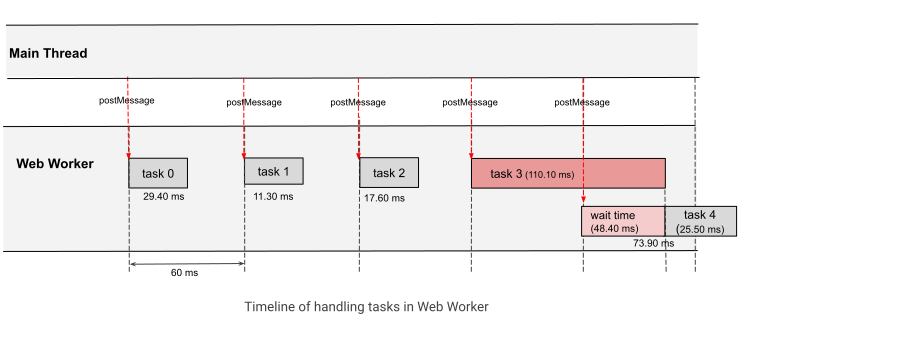

# Extending Long Tasks API to Web Workers

Author: [Joone Hur](https://github.com/joone)

# Introduction

The Long Tasks API allows web developers to monitor long-running tasks on the main thread that affect responsiveness and UI updates. To provide more detailed insights into these tasks, the Long Animation Frames (LoAF) API was introduced. However, neither API monitors long-running tasks in Web Workers, which can also negatively impact user experience. To address this, we propose extending the Long Tasks API to support Web Workers, allowing Web developers to monitor long-running tasks on worker threads.

# Goals

- Enable websites to identify and analyze worker-side tasks that are causing performance bottlenecks, including detailed information on the worker type, source URL, and worker name.
- Improve consistency in telemetry logging across documents and workers by providing a unified monitoring mechanism for main thread and worker threads.

# Non-goals

- Provide a detailed breakdown and attribution of long-task timing similar to what the LoAF API does. We anticipate it may be in-scope for future work.

# Problems

When utilizing a Web Worker, developers expect tasks to complete promptly. However, delays can occur, making it challenging to identify the root cause. These delays might be caused by synchronous executions that block other tasks from running.
To address this, developers might attempt to use the Long Tasks or LoAF API to identify long-running tasks that impact interactivity and UI updates. Unfortunately, these APIs are not designed to function within Web Workers.

[This example code](https://joone.github.io/web/explainers/postMessage_metric/) demonstrates how long tasks on a worker thread can block subsequent tasks from running in the task queue.

## Main (index.html and main.js)

```html
<!DOCTYPE html>
<html lang="en">
<head>
    <meta charset="UTF-8">
    <title>Delayed Post Messages in Web Workers Due to Task Overload</title>
</head>
<body>
    <h3>Delayed Post Messages in Web Workers Due to Task Overload</h1>
    <button onclick="runWorker()">Start</button>
    <p id="result"></p>
    <script src="main.js"></script>
</body>
</html>
```

When the user clicks the Start button, the runWorker function dispatches five tasks every 60ms with randomly generated input numbers ranging from 30 to 37. If each task is completed within 60ms, there should be no delay while running the tasks. However, if an input number exceeds 36, it may prevent subsequent tasks from being processed in the task queue.
```js
var worker;

function getRandomNumber(min, max) {
    return Math.floor(Math.random() * (max - min + 1)) + min;
}

function runWorker() {
    const worker = new Worker("worker.js", { name: "Fibonacci Worker" });

    worker.onmessage = function updateFromWorker(event) {
        // Measure the duration from when the task was sent to when the result is received
        const endMark = `end-task-${event.data.no}`;
        performance.mark(endMark);

        const startMark = `start-task-${event.data.no}`;
        const measureName = `duration-task-${event.data.no}`;
        performance.measure(measureName, startMark, endMark);

        const duration = performance.getEntriesByName(measureName)[0].duration;
        // Compute the time spent waiting in the queue
        const queueWaitTime = duration - event.data.duration;

        document.getElementById("result").innerHTML += 
            `- Result: Task ${event.data.no} returned ${event.data.res.toLocaleString()} \
            in ${duration.toFixed(2)} ms. (message queue wait time:${queueWaitTime.toFixed(2)} ms, \
            task duration: ${event.data.duration.toFixed(2)} ms) <br>`;

        performance.clearMarks(startMark);
        performance.clearMarks(endMark);
        performance.clearMeasures(measureName);
    };

    let i = 0;
    const interval = 60; // Interval in milliseconds

    // Function to send tasks to the worker at the specified interval
    function sendTask() {
        if (i < 5) {
            const startMark = `start-task-${i}`;
            performance.mark(startMark);
            const random = getRandomNumber(30, 37);
            document.getElementById("result").innerHTML += 
                `Sending task ${i} to the Fibonacci worker with input ${random}<br>`;
            worker.postMessage({ no: i, input: random });
            i++;
        } else {
            clearInterval(taskInterval);
        }
    }

    // Start sending tasks every 60ms
    const taskInterval = setInterval(sendTask, interval);
}

function stopWorker() {
    if (worker) {
        worker.terminate();
        worker = undefined;
    }
}
```

## Web Worker script(worker.js)

The Web Worker simulates long tasks using the Fibonacci function. It also measures the duration of each task using the mark and measure methods of the Performance interface and returns the duration back to the main thread.

```js
function fibonacci(n) {
    if (n <= 1) return n;
    return fibonacci(n - 1) + fibonacci(n - 2);
}

onmessage = function runLongTaskOnWorker(e) {
    // Start measuring time
    const startMark = `start-task-${e.data.no}`;
    const endMark = `end-task-${e.data.no}`;
    const measureName = `duration-task-${e.data.no}`;
    
    performance.mark(startMark);

    // Perform the Fibonacci calculation
    let fibo_num = fibonacci(e.data.input);

    // End measuring time
    performance.mark(endMark);
    performance.measure(measureName, startMark, endMark);

    // Get the measurement
    const duration = performance.getEntriesByName(measureName)[0].duration;

    // Send the result and duration back to the main thread
    postMessage({no: e.data.no, res: fibo_num , duration: duration});

    performance.clearMarks(startMark);
    performance.clearMarks(endMark);
    performance.clearMeasures(measureName);
};
```

The results can vary due to randomness, but an example output might look like the following. In this case, task 4 is delayed because task 3 took 109.60ms to complete. Consequently, task 4 experienced a total duration of 73.90ms, including time spent waiting(48.40ms) in the message queue.



```bash
* Sending task 0 to the Fibonacci worker with input 32
  * Result: Task 0 returned 2,178,309 in 29.40 ms. (message queue wait time:1.80 ms, task duration: 27.60 ms)
* Sending task 1 to the Fibonacci worker with input 30
  * Result: Task 1 returned 832,040 in 11.30 ms. (message queue wait time:0.70 ms, task duration: 10.60 ms)
* Sending task 2 to the Fibonacci worker with input 31
  * Result: Task 2 returned 1,346,269 in 17.60 ms. (message queue wait time:1.30 ms, task duration: 16.30 ms)
* Sending task 3 to the Fibonacci worker with input 35
* Sending task 4 to the Fibonacci worker with input 32
  * Result: Task 3 returned 9,227,465 in 111.10 ms. (message queue wait time:1.50 ms, task duration: 109.60 ms)
  * Result: Task 4 returned 2,178,309 in 73.90 ms. (message queue wait time:48.40 ms, task duration: 25.50 ms)
```
However, identifying whether task 3 qualifies as a "long task" is challenging without relying on the mark and measure APIs provided by the Performance interface.

# Proposal

We propose extending the Long Tasks API to support Web Workers, enabling developers to use the API within Web Workers to identify long tasks blocking the worker thread. To adapt the API for Web Workers, the `PerformanceLongTaskTiming` interface needs to be updated to account for long tasks in worker threads.

The primary change would be within the `TaskAttributionTiming` interface, where certain properties should reflect the worker context instead of the main thread.

## `TaskAttributionTiming` Interface Changes

The table below highlights the differences in the properties of the `TaskAttributionTiming` interface for long tasks on Web Workers compared to the main thread:

|**Property**|**Value(Main Thread)**|**Value(Web Worker)**|
|---|---|---|
|TaskAttributionTiming.duration|Always returns `0`|Always returns `0`|
|TaskAttributionTiming.entryType|always returns `"taskattribution"`|Always returns `"taskattribution"`|
|TaskAttributionTiming.name|always returns `"unknown"`| Return the task name given in postMessage API|
|TaskAttributionTiming.startTime|always returns `0`|Always returns `0`|
|TaskAttributionTiming.containerType|Returns the type of frame container(`iframe`, `embed`, or `object`). Defaults to `"window"` if no container is identified.| Returns the type of Web Worker (`"dedicated-worker"`, `"shared-worker"`, or `"service-worker"`).
|TaskAttributionTiming.containerSrc|Returns the container's `src` attribute.|Returns the worker script's URL|
|TaskAttributionTiming.containerId|Returns the container's `id` attribute.|Returns the worker's ID|
|TaskAttributionTiming.containerName|Returns the container's `name` attribute.|Returns the `name` property of the worker|

For workers: 
- The `containerType` should return the type of Web Worker to clearly indicate the context.
- The `containerSrc` provides the URL of the worker script, helping developers differentiate between multiple workers. 
- If a name is specified for the Web Worker, the containerName property should return the assigned name.

Example:
```js
const myWorker = new Worker("worker.js", { name: "Fibonacci" });
```
- When a name is given to postMessage in the following example, the name property of the `TaskAttributionTiming` interface provide the task name.

Example:
```js
  worker.postMessage({ no: i, inputs: random }, { name: `input_${random}`});
```
Additionally, the worker ID (`containerId`) should return a unique identifier for the Web Worker, starting from a value of 1.

If this proposal were implemented in the Long Tasks API, the performance entry for task 3 in the above results might look like this.

```json
[
    {
        "name": "unknown",
        "entryType": "longtask",
        "startTime": 217.4000000357628,
        "duration": 110,
        "attribution": [
            {
                "name": "input_35",
                "entryType": "taskattribution",
                "startTime": 0,
                "duration": 0,
                "containerType": "dedicated-worker",
                "containerSrc": "http://localhost:3000/explainers/postMessage_metric/worker.js",
                "containerId": "24",
                "containerName": "Fibonacci"
            }
        ]
    }
]
```

This enhancement would enable developers to directly identify long tasks within Web Workers and attribute them to specific contexts, such as the worker type or source file, thereby improving monitoring and debugging capabilities.

# Alternatives considered

## DevTools Tracing

DevTools tracing allows for manual inspection of long tasks; however, it is not well-suited for systematic metric collection.

## Override worker messages

Developers can implement a polyfill that intercepts every worker message, wraps callbacks with timers, and collect the necessary telemetry without native support. However, it is challenging to intercept all Web Worker messages in third-party libraries.

# Discussion

## Minimum Duration of Long Tasks in Web Workers

According to [the specification](https://www.w3.org/TR/longtasks-1/#sec-terminology), 50 ms is the minimum duration for long tasks. We should consider whether the 50 ms is appropriate for the minimum duration of long tasks in Web Workers as well, as their background operations may require a different standard. Furthermore, the minimum duration of long tasks should be configurable for both main thread and workers to accommodate various situations.

## Exposing the Source Function Name and Character Position

Since the LoAF API provides details about the invoker's source location, the Long Tasks API can extend similar support for Web Workers by exposing the function name and character position of long-running tasks.

# Chromium Issue

- [Support Long Tasks API in workers [41399667] - Chromium](https://issues.chromium.org/issues/41399667)

# Chrome Platform Status

- [Support the Long Tasks API in web workers - Chrome Platform Status (chromestatus.com)](https://chromestatus.com/feature/5072227155050496)

# Links and further Reading

- [Long Tasks API (w3c.github.io)](https://w3c.github.io/longtasks/)
- [PerformanceLongTaskTiming - Web APIs | MDN (mozilla.org)](https://developer.mozilla.org/en-US/docs/Web/API/PerformanceLongTaskTiming)
- [Long Animation Frames API | Web Platform | Chrome for Developers](https://developer.chrome.com/docs/web-platform/long-animation-frames)
