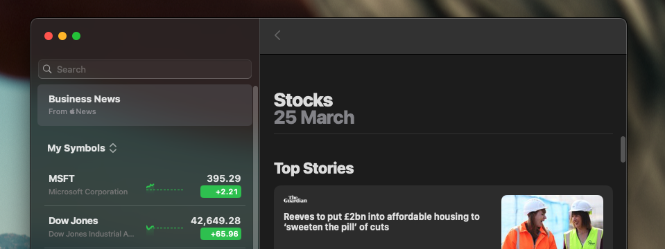
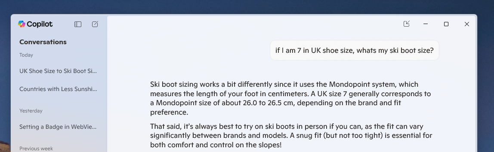

# Materials in Web Applications

Authors: [Diego Gonzalez](https://github.com/diekus), [Andy Luhrs](https://github.com/aluhrs13)

## Status of this Document

This document is a starting point for engaging the community and standards bodies in developing collaborative solutions fit for standardization. As the solutions to problems described in this document progress along the standards-track, we will retain this document as an archive and use this section to keep the community up-to-date with the most current standards venue and content location of future work and discussions.

- This document status: **Brainstorming**
- Expected venue: TBD
- **Current version: this document**

## Introduction

*Materials* are visual effects applied to UX surfaces that resemble real life artifacts. Modern applications can use *materials* to create a unified and integrated appearance with the underlying OS. Materials are a powerful way to:
- create stronger contextual relationship between the content the user is interacting an related UX (like context menus or side bars).
- indicate window (active/inactive) focus state.
- establish visual hierarchy.
- communicate separation between layers to help a user retain a sense of space.

[Apple operating systems](https://developer.apple.com/design/human-interface-guidelines/materials) have several materials, ranging from `ultraThin` to `ultraThick`.



[Windows 11](https://learn.microsoft.com/en-us/windows/apps/design/signature-experiences/materials) also has a similar concept, with `Mica`, `Mica Alt` and `Acrylic`.



This explainer addresses allowing web applications to use materials that might be available in the underlying platform. When enabled, and if the platform supports it, the frame of the installed web application will use the specified visual effect, and if the background of the page is transparent the material would be visible.

> **Note:** Web developers can already mimic some OS-specific experiences. By using images, gradients, or filters in CSS, developers can match a platform's aesthetic, such as a brushed metal background, in their app. However, with newer and more powerful hardware, platforms are starting to add transparency effects to their UI surfaces. The intention of this proposal is to allow a web application's frame to use materials with transparency effects like the ones shown in the previous screenshots.

## Goals

- Enable the frame of an installed web application to use OS materials.
- Design a solution that will scale to future design systems.

## Non-goals

- Define or override material usage for the application's UX elements like context menus and tooltips (This is handled by the platform).
- Support devices that do not have content behind a frame/window that 'bleeds' through. As an example, (non-desktop) mobile devices generally don't have regions of the UX where the user would be able to see content behind the application's frame.

## Proposed Solutions

### Manifest enabled Materials

An application manifest is a JSON document that contains startup parameters and application defaults for when a web application is launched. Both options presented below can scale by adding new values for the manifest key.

#### Option 1: Material Abstraction

We propose adding a new `base_material` member to the manifest file, which hints to the UA that the frame should be of a certain type if supported. The `base_material` key can have a value of:
-  `opaque`: the frame of the installed web app does not have any material applied to it. This is the default value.
- `translucent`: the frame of the installed web app is of a translucent material. This is a softened effect that prevents full visibility.
- `transparent`: the frame of the app has a transparent-like effect. This material allows the background to pass through with less significant scattering, providing a clearer, less distorted view than `translucent`.

> **NOTE**:
> The way a UA maps the values to the available platform materials is completely up to the implementation. Different platforms have different number of materials and this explainer aims to provide an abstraction via an offering of a limited set of materials available for web apps.

```JSON
{
  "name": "Awesome Web App",
  "short_name": "Awesome App",
  "id": "aweapp",
  ...
  "start_url": "/index.html",
  "display": "standalone",
  "base_material": "translucent"
}
```

The web developer needs to specify the background of the document as transparent (`background-color: transparent`) to remove the color from the viewport and let the web content appear as on top of the translucent frame. Any additional in-app effects, such as materials and tinting can be achieved with CSS like `backdrop-filter`.

#### Option 2: Explicit Material Platform Values

We propose adding a property to a PWA manifest that allows an app to declare a prioritized list of materials that it would like to use as its background if possible, conceptually similar to `font-family` matching the the phrasing the OS uses for the material:

```JSON
{
  "name": "Awesome Web App",
  "short_name": "Awesome App",
  "id": "aweapp",
  ...
  "start_url": "/index.html",
  "display": "standalone",
  "background_material": ["windows-mica", "macos-ultrathick", "windows-acrylic", "#87ceeb"]
}
```

The browser would attempt to use the given materials if possible, with the (optional) final color being a fallback.

### Material Detection

To allow the developer to gracefully degrade the experience if a platform does not support materials an additional media query is required. This query would allow the site to conditionally make the content on top of it transparent or give it a specific color:

```CSS
/*option 1*/

@media (base-material: 'opaque'){
  body{
    background-color: aliceblue);
  }
}

/*option 2*/

@media (background-material: 'windows-mica'), (background-material: 'macos-ultrathick') {
  body{
    background-color: rgba(0, 0, 0, 0));
  }
}
```

## Considered Alternatives

### Using a new <color> CSS data type

We considered introducing a new value to the `<color>` CSS data type, which would represent the material. This value could then be easily applied by developers to the background of the app, or to different surfaces within the app.

The limitation is that the CSS styles defined by developers apply to elements that are within the viewport, and not to the app frame itself. Using a CSS background color for different areas in the viewport would conflict with the UA's default background of the app frame provided by the underlying platform.

## Concerns/Open Questions

1. **How will performance be affected for web content on a transparent background that bleeds into the visual material effect?**
2. **How can the materials API be futureproofed?**
      
      With option 1, by having abstract values for the material (i.e. `translucent`, `transparent`) of the frame of the installed web application, if a future version of an OS comes with new naming for materials, the new platform can just render the content that would map to those values. For example, if a future version of macOS or Windows decides to change the naming for their materials, the developer wouldn't have to update a list of proprietary names.

## Glossary

## Acknowledgements
