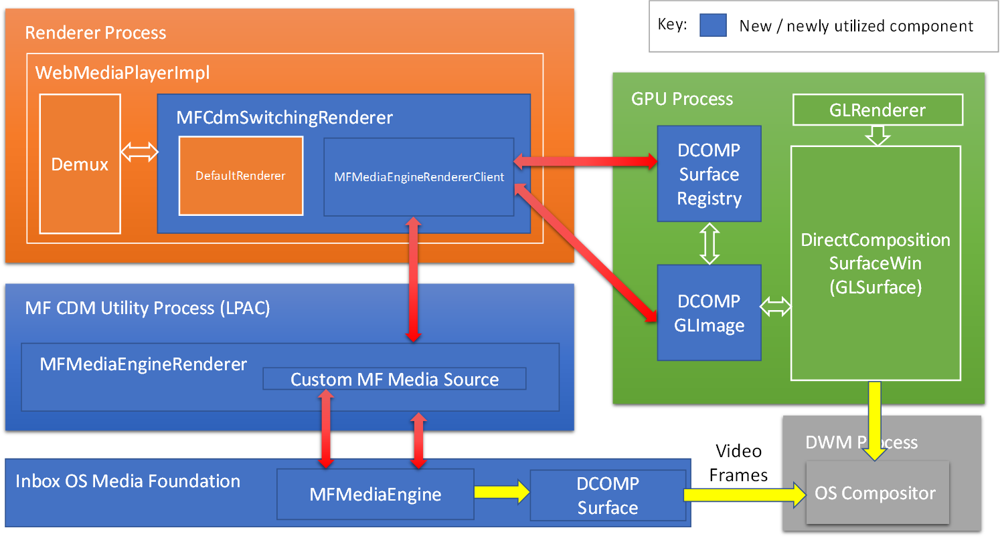
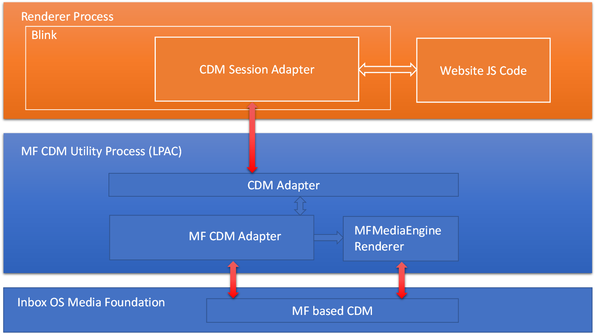
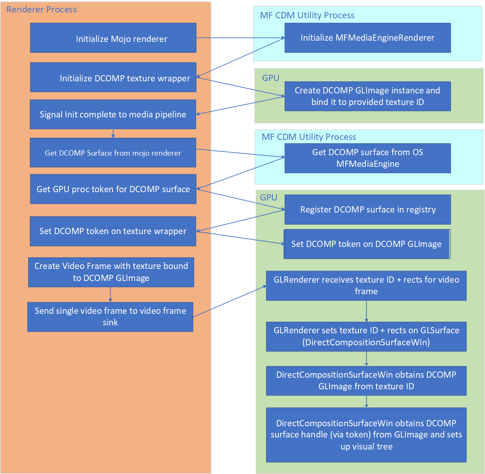

# Support for multiple Media Foundation (MF) based Content Decryption Modules (CDMs) in Windows 10

**Authors:**
* Isuru Pathirana
* Frank Li

# Summary
An MF based DRM system can provide a highly secure, trusted and
robust environment that premium media content providers expect to distribute high-value protected media. We propose additions to enable the integration of MF based DRM systems into Chromium. More details on MF based DRM systems can be found at [Protected Media Path (PMP)](https://docs.microsoft.com/en-us/windows/win32/medfound/protected-media-path).

# Goals
* Adding the support of specific MF based DRM systems into Chromium - this is done by writing an MF based CDM provider.

# Non-goals
* Supporting non-Windows platforms.

# Use Cases
Allows developers to integrate a MF based DRM system into the browser and allows users to watch a protected video of that DRM system.

# Proposal
## System Architecture
A high-level overview of the architecture that integrates with existing Chromium
components and Windows platform components is shown here.

Components as seen from the media Renderer path.

Components as seen from the media  [Encrypted Media Extensions (EME)](https://www.w3.org/TR/encrypted-media/) setup path.

### Component Interactions
In terms of functionalities, 4 major components can be identified:
1. In the Renderer process, a MFCdmSwitchingRenderer selects the Chromium DefaultRenderer by default. When the content is known to be protected media and the given key system is implemented by a MF based CDM, a MFMediaEngineRendererClient will be used as the media Renderer. The MFMediaEngineRendererClient and MFMediaEngineRenderer classes are specializations of FooRendererClient/FooRenderer pair as described in the "Specialized Out-of-Process media::Renderers" section of [media/mojo](https://chromium.googlesource.com/chromium/src/media/+/master/mojo/) document. The protected media data from the RenderClient side is pulled by the MFMediaEngineRenderer which in turn acts as a custom [IMFMediaSource](https://docs.microsoft.com/en-us/windows/win32/api/mfidl/nn-mfidl-imfmediasource) passing the media data to an [IMFMediaEngine](https://docs.microsoft.com/en-us/windows/win32/api/mfmediaengine/nn-mfmediaengine-imfmediaengine) instance.

2. Since the MF based CDM binary contains third-party code, we have added the creation of a Less Privileged AppContainer (LPAC) MF CDM Utility process to sandbox it. In this LPAC process, there are two new components. A MFMediaEngineRenderer component integrates with an instance of IMFMediaEngine rendering pipeline. A MF CDM Adapter component instantiates the MF based CDM and acts as a translation layer between this CDM and the Chromium CDM adapter.

3. The GPU process houses components which allow independently rendered video from the Windows IMFMediaEngine to integrate with the Chromium composition stack. A DirectComposition surface handle (associated with a swap chain for video rendering) from the PMP will be associated with the corresponding video element's visual content.

4. A MF based CDM provider component that interacts with a MF CDM Adapter. The MF based CDM is expected to be installed through means not described in this explainer. A MF CDM Adapter instantiates this component based on the given key system and interacts with this component using MF APIs. This component is expected to implement DRM protocol messages (request/respond) specific to its DRM technologies.

### High Level Initialization Flow
The initialization of the system can be visualized by the following sequence flow diagram. Major steps are:
* Initialize the remote MFMediaEngineRenderer in a MF CDM Utility LPAC process.
* Create a DCOMP GLImage instance in GPU process and bind it to a texture ID.
* Get the DCOMP Surface handle from remote MFMediaEngineRenderer which in turn gets it from OS MFMediaEngine.
* Register the DCOMP Surface handle into GPU process to obtain the corresponding DCOMP token for it.
* Set the DCOMP token into the created DCOMP GLImage.
* The MFMediaEngineRendererClient creates a video frame with texture bound to DCOMP GLImage and send this single video frame to video frame sink.
* In GPU process, GLRenderer receives texture ID for video frame. GLRenderer sets the texture ID into GLSurface (a DirectCompositionSurfaceWin). Given the texture ID, DirectCompositionSurfaceWin can obtain the bound DCOMP GLImage. DirectCompositionSurfaceWin then obtains DCOMP Surface handle (via the DCOMP token) from DCOMP GLImage and sets up the video visual content with the associated DCOMP Surface.

## Alternative Designs
* Instead of using the MFMediaEngine, a custom media pipeline could have been created within the MF CDM LPAC process. However, this requires Component Object Model (COM) registrations and reinvents lots of code that has been implemented by the MFMediaEngine rendering pipeline.

## Open Issues
* Might want to merge the MF CDM Adapter plugin with the CDM Adapter.
* Remove MFCdmSwitchingRenderer and move its switching logic within WebMediaPlayerImpl.
* Evaluate the possibility of leveraging SharedImage mailboxes to share DCOMP Surface handle across processes per [Chromium review](https://chromium-review.googlesource.com/c/chromium/src/+/1779403).

---
[Related issues](https://github.com/MicrosoftEdge/MSEdgeExplainers/labels/Media%20CDMs) | [Open a new issue](https://github.com/MicrosoftEdge/MSEdgeExplainers/issues/new?title=%5BMedia%20CDMs%5D)
